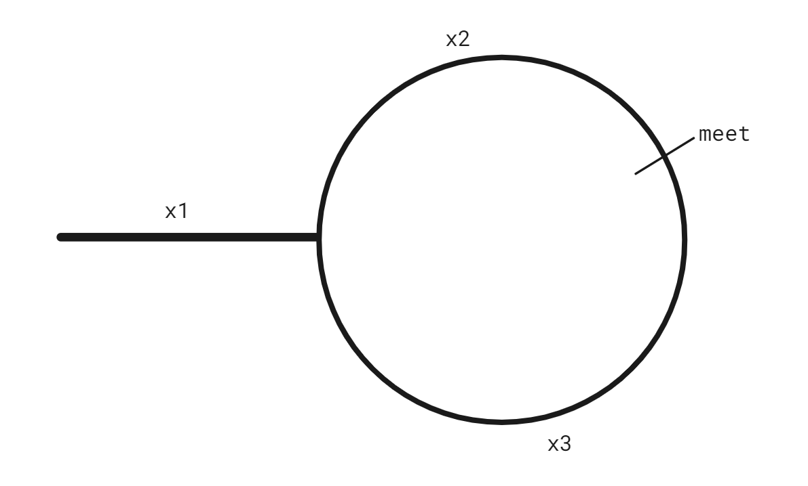

# Array

## Tricks

* Partition - 同类项分组一起看，改变顺序可能便于处理
* Forward and backward - 正看反看 + 分段看
* In-place - 合理利用废空间（无用信息位或者已处理信息位）
* Bucket - suitable when elements' values are within a range

***

## :bulb:1D Array

### Q26. [Remove Duplicates from Sorted Array](https://leetcode.com/problems/remove-duplicates-from-sorted-array/)

* ```java
  class Solution {
      public int removeDuplicates(int[] nums) {
          int k = 1, prev = nums[0];
          for (int i = 1; i < nums.length; i++) {
              if (nums[i] != prev) {
                  nums[k++] = nums[i];
                  prev = nums[i];
              } 
          }
          return k;
      }
  }
  ```

### Q27. [Remove Element](https://leetcode.com/problems/remove-element/)

* ```java
  class Solution {
      public int removeElement(int[] nums, int val) {
          if (nums.length == 0)
              return 0;
          
          int k = 0, size = nums.length, i = 0;
          while (i < size - k) {
              if (nums[i] == val) {
                  nums[i] = nums[size - 1 - k];
                  k++;
              }
              else
                  i++;
          }
          return size - k;
      }
  }
  ```

### Q80. [Remove Duplicates from Sorted Array II](https://leetcode.com/problems/remove-duplicates-from-sorted-array-ii/)

* ```java
  class Solution {
      public int removeDuplicates(int[] nums) {
          int k = 1, prev = nums[0], count = 1;
          for (int i = 1; i < nums.length; i++) {
              if (nums[i] == prev) {
                  if (count == 1) {
                      nums[k++] = nums[i];
                      count++;
                  }
              }
              else {
                  nums[k++] = nums[i];
                  prev = nums[i];
                  count = 1;
              }
          }
          return k;
      }
  }
  ```

### Q88. [Merge Sorted Array](https://leetcode.com/problems/merge-sorted-array/)

* ```java
  class Solution {
      public void merge(int[] nums1, int m, int[] nums2, int n) {
          if (n == 0)
              return;
          
          if (m == 0) {
              for (int i = 0; i < n; i++)
                  nums1[i] = nums2[i];
              return;
          }
  
          // move all prefix 0 in nums1 to suffix 0
          for (int j = m + n - 1; j >= n; j--) {
              nums1[j] = nums1[j - n];
          }
          for (int j = 0; j < n; j++)
              nums1[j] = 0;
          
          int a1 = n, a2 = 0, a = 0;
          while (a1 < m + n && a2 < n) {
              if (nums1[a1] <= nums2[a2])
                  nums1[a++] = nums1[a1++];
              else
                  nums1[a++] = nums2[a2++];
          }
          while (a2 < n) {
              nums1[a++] = nums2[a2++];
          }
  
      }
  }

### Q121. [Best Time to Buy and Sell Stock](https://leetcode.com/problems/best-time-to-buy-and-sell-stock/)

* ```java
  class Solution {
      public int maxProfit(int[] prices) {
          int profit = 0, min = prices[0];
          for (int i = 0; i < prices.length; i++) {
              int p = prices[i] - min;
              if (p < 0)
                  min = prices[i];
              else 
                  profit = Math.max(profit, p);
          }
          return profit;
      }
  }
  ```

### Q122. [Best Time to Buy and Sell Stock II](https://leetcode.com/problems/best-time-to-buy-and-sell-stock-ii/)

* ```java
  class Solution {
      public int maxProfit(int[] prices) {
          int profit = 0;
          for (int i = 1; i < prices.length; i++) {
              int p = prices[i] - prices[i - 1];
              if (p > 0)
                  profit += p;
          }
          return profit;
      }
  }
  ```

### :star:Q169. [Majority Element](https://leetcode.com/problems/majority-element/)

* ```java
  class Solution {
      public int majorityElement(int[] nums) {
          // brute-force: hashmap     time: O(n)  space: O(n)
          // sort and count           time: O(nlogn)  space: O(1)
          // aim: O(n), O(1)  				Boyer–Moore majority vote algorithm
          // start with thinking of two elements A and B, add and subtract 1 in the loop
          // then expand to majority A and others, add and subtract 1, same concept
          int majority = nums[0], count = 1;
          for (int i = 1; i < nums.length; i++) {
              if (nums[i] == majority)
                  count++;
              else {
                  if (count == 0) {
                      majority = nums[i];
                      count = 1;
                  }
                  else
                      count--;
              }
          }
          return majority;
      }
  }
  ```

* [Boyer–Moore majority vote algorithm](https://en.wikipedia.org/wiki/Boyer%E2%80%93Moore_majority_vote_algorithm)

> If a second pass is not performed and there is no majority, the algorithm will not detect that no majority exists.

### Q189. [Rotate Array](https://leetcode.com/problems/rotate-array/)

* ```java
  class Solution {
      public void rotate(int[] nums, int k) {
          int size = nums.length;
          k = k % size;
          
          reverse(nums, 0, size - 1);
          reverse(nums, 0, k - 1);
          reverse(nums, k, size - 1);
      }
  
      private void reverse(int[] nums, int start, int end) {
          while (start < end) {
              int tmp = nums[start];
              nums[start] = nums[end];
              nums[end] = tmp;
              start++;
              end--;
          }
      }
  }
  ```

### :star:Q274. [H-Index](https://leetcode.com/problems/h-index/)

* ```java
  class Solution {
      public int hIndex(int[] citations) {
          int[] buckets = new int[1001];
          for(int i: citations) {
              buckets[i]++;
          }
  
          int count = 0, i = 1000;
          while(i > 0) {
              count += buckets[i];
              if(count >= i) return i;
  
              i--;
          }
  
          return 0;
      }
  }
  ```

### :star:Q380. [Insert Delete GetRandom O(1)](https://leetcode.com/problems/insert-delete-getrandom-o1/)

* ```java
  class RandomizedSet {
      public static final int SIZE = 200_001;
      
      private Map<Integer, Integer> valToIndexMap;
      private int[] vals;
      private int size;
  
      public RandomizedSet() {
          this.valToIndexMap = new HashMap<Integer,Integer>();
          this.vals = new int[SIZE];
          this.size = 0;
      }
      
      public boolean insert(int val) {
          if (valToIndexMap.containsKey(val))
              return false;
          else {
              valToIndexMap.put(val, size);
              vals[size++] = val;
              return true;
          }
      }
      
      public boolean remove(int val) {
          if (valToIndexMap.containsKey(val)) {
              int index = valToIndexMap.get(val);
              int lastElement = vals[size - 1];
              vals[index] = lastElement;
              valToIndexMap.put(lastElement, index);
              valToIndexMap.remove(val);
              size--;
              return true;
          }
          else
              return false;
      }
      
      public int getRandom() {
          int index = randomNumber(0, size);
          return vals[index];
      }
  
      private int randomNumber(int min, int max) {
          int randomNum = min + (int)(Math.random() * (max - min));
          return randomNum;
      }
  }
  
  /**
   * Your RandomizedSet object will be instantiated and called as such:
   * RandomizedSet obj = new RandomizedSet();
   * boolean param_1 = obj.insert(val);
   * boolean param_2 = obj.remove(val);
   * int param_3 = obj.getRandom();
   */
  ```

### Q539. [Minimum Time Difference](https://leetcode.com/problems/minimum-time-difference/)

* ```java
  class Solution {
      public int findMinDifference(List<String> timePoints) {
          if (timePoints.size() > 1440) return 0; 
  
          boolean[] seen = new boolean[1440]; 
          for (String time : timePoints) {
              int minutes = convertToMinutes(time);
              if (seen[minutes]) return 0; 
              seen[minutes] = true;
          }
          
          int first = -1, prev = -1;
          int minDiff = Integer.MAX_VALUE;
          for (int i = 0; i < 1440; i++) {
              if (seen[i]) {
                  if (first < 0) {
                      first = i;
                  } 
                  else {
                      minDiff = Math.min(minDiff, i - prev);
                  }
                  prev = i;
              }
          }
          minDiff = Math.min(minDiff, 1440 - prev + first);
          
          return minDiff;
      }
      
      private int convertToMinutes(String time) {
          return ((time.charAt(0) - '0') * 10 + (time.charAt(1) - '0')) * 60 
               + (time.charAt(3) - '0') * 10 + (time.charAt(4) - '0');
      }
  }
  ```

### Q605. [Can Place Flowers](https://leetcode.com/problems/can-place-flowers/)

* ```java
  class Solution {
      public boolean canPlaceFlowers(int[] flowerbed, int n) {
          int pointer = 0;
          while(pointer < flowerbed.length && n>=0){
              if(flowerbed[pointer] == 1){
                  pointer += 2;
              } else{
                  if(pointer + 1 > flowerbed.length - 1){
                      n--;
                      pointer += 1;
                  } else if(flowerbed[pointer + 1] == 0){
                      n--;
                      pointer += 2;
                  } else{
                      pointer += 3; 
                  }
              }
          }
          return n <= 0;
      }
  }
  ```

### Q1431. [Kids With the Greatest Number of Candies](https://leetcode.com/problems/kids-with-the-greatest-number-of-candies/)

* ```java
  class Solution {
      public List<Boolean> kidsWithCandies(int[] candies, int extraCandies) {
          int max = 0;
          for (int c : candies) {
              if (max < c)
                  max = c;
          }
          List<Boolean> l = new ArrayList<>();
          for (int c : candies) {
              if (c + extraCandies >= max)
                  l.add(true);
              else
                  l.add(false);
          }
          return l;
      }
  }
  ```

### Q1894. [Find the Student that Will Replace the Chalk](https://leetcode.com/problems/find-the-student-that-will-replace-the-chalk/)

* ```java
  class Solution {
      public int chalkReplacer(int[] chalk, int k) {
          long sum = 0;
          for (int i = 0; i < chalk.length; i++)
              sum += chalk[i];
          long left = (long) k % sum;
          for (int i = 0; i < chalk.length; i++) {
              if (left < chalk[i])
                  return i;
              left -= chalk[i];
          }
          return 0;
      }
  }
  ```

### Q2022. [Convert 1D Array Into 2D Array](https://leetcode.com/problems/convert-1d-array-into-2d-array/)

* ```java
  class Solution {
      public int[][] construct2DArray(int[] original, int m, int n) {
          if (original.length != m * n)
              return new int[0][0];
          
          int k = 0;
          int[][] res = new int[m][n];
          for (int i = 0; i < m; i++)
              for (int j = 0; j < n; j++) {
                  res[i][j] = original[k];
                  k++;
              }
          return res;
      }
  }
  ```

## :bulb:2D Array

### Q48. [Rotate Image](https://leetcode.com/problems/rotate-image/)

* ```java
  class Solution {
      public void rotate(int[][] matrix) {
          int n = matrix.length;
          // swap matrix by diagonal
          for (int i = 0; i < n - 1; i++)
              for (int j = 0; j < n - i - 1; j++) {
                  int tmp = matrix[i][j];
                  matrix[i][j] = matrix[n - 1 - j][n - 1 - i];
                  matrix[n - 1 - j][n - 1 - i] = tmp;
              }
          // swap matrix by horizontal centerline
          for (int i = 0; i < n / 2; i++)
              for (int j = 0; j < n; j++) {
                  int tmp = matrix[i][j];
                  matrix[i][j] = matrix[n - 1 - i][j];
                  matrix[n - 1 - i][j] = tmp;
              }
      }
  }
  ```

### Q54. [Spiral Matrix](https://leetcode.com/problems/spiral-matrix/)

* ```java
  class Solution {
      public List<Integer> spiralOrder(int[][] matrix) {
          int r = matrix.length, c = matrix[0].length;
          return spiral(matrix, 0, 0, r - 1, c - 1);
  
      }
  
      private List<Integer> spiral(int[][] matrix, int r1, int c1, int r2, int c2) {
          List<Integer> l = new ArrayList<>();
          if (r1 > r2 || c1 > c2)
              ;
          else if (r1 == r2) {
              for (; c1 <= c2; c1++)
                  l.add(matrix[r1][c1]);
          }
          else if (c1 == c2) {
              for (; r1 <= r2; r1++)
                  l.add(matrix[r1][c1]);
          }
          else {
              for (int i = c1; i <= c2; i++)
                  l.add(matrix[r1][i]);
              for (int i = r1 + 1; i < r2; i++)
                  l.add(matrix[i][c2]);
              for (int i = c2; i >= c1; i--)
                  l.add(matrix[r2][i]);
              for (int i = r2 - 1; i > r1; i--)
                  l.add(matrix[i][c1]);
              l.addAll(spiral(matrix, r1 + 1, c1 + 1, r2 - 1, c2 - 1));
          }
          return l;
      }
  }
  ```

### Q59. [Spiral Matrix II](https://leetcode.com/problems/spiral-matrix-ii/)

* ```java
  class Solution {
      public int[][] generateMatrix(int n) {
          int[][] matrix = new int[n][n];
          spiral(matrix, 1, 0, n - 1);
          return matrix;
      }
  
      private void spiral(int[][] matrix, int n, int r1, int r2) {
          if (r1 > r2)
              ;
          else if (r1 == r2) 
              matrix[r1][r1] = n;
          else {
              for (int i = r1; i <= r2; i++)
                  matrix[r1][i] = n++;
              for (int i = r1 + 1; i < r2; i++)
                  matrix[i][r2] = n++;
              for (int i = r2; i >= r1; i--)
                  matrix[r2][i] = n++;
              for (int i = r2 - 1; i > r1; i--)
                  matrix[i][r1] = n++;
              spiral(matrix, n, r1 + 1, r2 - 1);
          }
      }
  }
  ```

### Q885. [Spiral Matrix III](https://leetcode.com/problems/spiral-matrix-iii/)

* ```java
  class Solution {
      private static int n = 0;
  
      public int[][] spiralMatrixIII(int rows, int cols, int rStart, int cStart) {
          int circles = Math.max(Math.max(Math.max(rStart + 1, cStart + 1), rows - rStart), cols - cStart);
          int[][] m = new int[rows * cols][2];
          for (int c = 0; c < circles; c++) {
              spiral(m, rStart - c, cStart - c, rStart + c, cStart + c, rows, cols);
          }
          return m;
      }
  
      private void spiral(int[][] m, int r1, int c1, int r2, int c2, int rows, int cols) {
          if (r1 == r2 && c1 == c2) {
              m[n++] = new int[] {r1, c1};
          }
          else {
              for (int i = r1 + 1; i <= r2; i++)
                  if (i >= 0 && i < rows && c2 >= 0 && c2 < cols)
                      m[n++] = new int[] {i, c2};
              for (int i = c2 - 1; i >= c1; i--)
                  if (r2 >= 0 && r2 < rows && i >= 0 && i < cols)
                      m[n++] = new int[] {r2, i};
              for (int i = r2 - 1; i >= r1; i--)
                  if (i >= 0 && i < rows && c1 >= 0 && c1 < cols)
                      m[n++] = new int[] {i, c1};
              for (int i = c1 + 1; i <= c2; i++)
                  if (r1 >= 0 && r1 < rows && i >= 0 && i < cols)
                      m[n++] = new int[] {r1, i};
          }
      }
  }
  ```

### Q2326. [Spiral Matrix IV](https://leetcode.com/problems/spiral-matrix-iv/)

* ```java
  class Solution {
      public int[][] spiralMatrix(int m, int n, ListNode head) {
          int[][] matrix = new int[m][];
          for (int i = 0; i < m; i++) {
              matrix[i] = new int [n];
              Arrays.fill(matrix[i], -1);
          }
          int a = 0, b = 0, p = m - 1, q = n - 1;
          while (head != null) {
              if (a == p) {
                  for (; head != null && b <= q; b++) {
                      matrix[a][b] = head.val;
                      head = head.next;
                  }
              }
              else if (b == q) {
                  for (; head != null && a <= p; a++) {
                      matrix[a][b] = head.val;
                      head = head.next;
                  }
              }
              else {
                  int i = a, j = b;
                  for (; head != null && b < q; b++) {
                      matrix[a][b] = head.val;
                      head = head.next;
                  }
                  for (; head != null && a < p; a++) {
                      matrix[a][b] = head.val;
                      head = head.next;
                  }
                  for (; head != null && b > j; b--) {
                      matrix[a][b] = head.val;
                      head = head.next;
                  }
                  for (; head != null && a > i; a--) {
                      matrix[a][b] = head.val;
                      head = head.next;
                  }
                  a++;
                  b++;
                  p--;
                  q--;
              }
          }
          return matrix;
      }
  }
  ```

# Linked List

* Tricks
  * Two pointers
  * Dummy node

* Corner case
  * Empty list
  * Single node
  * Two nodes
  * Operation on head node (and tail node for doubly linked list)

### Q61. [Rotate List](https://leetcode.com/problems/rotate-list/)

* ```java
  class Solution {
      public ListNode rotateRight(ListNode head, int k) {
          if (head == null)
              return null;
          
          ListNode tail = head;
          int size = 1;
          while (tail.next != null) {
              tail = tail.next;
              size++;
          }
          tail.next = head;
          for (int i = 1; i < size - k % size; i++) {
              head = head.next;
          }
          ListNode h = head.next;
          head.next = null;
          return h;
      }
  }
  ```

### Q725. [Split Linked List in Parts](https://leetcode.com/problems/split-linked-list-in-parts/)

* ```java
  class Solution {
      public ListNode[] splitListToParts(ListNode head, int k) {
          int size = 0;
          ListNode n = head;
          while (n != null) {
              n = n.next;
              size++;
          }
          int base = size / k;
          int remaining = size % k;
          ListNode[] res = new ListNode[k];
          int cnt = 0;
          n = head;
          for (int i = 0; i < remaining; i++) {
              res[cnt++] = n;
              for (int j = 0; j < base; j++) {
                  n = n.next;
              }
              ListNode tmp = n.next;
              n.next = null;
              n = tmp;
          }
          for (int i = 0; i < k - remaining; i++) {
              res[cnt++] = n;
              if (n != null) {
                  for (int j = 0; j < base - 1; j++) {
                      n = n.next;
                  }
                  ListNode tmp = n.next;
                  n.next = null;
                  n = tmp;
              }
          }
          return res;
      }
  }
  ```

# String

### Q224. [Basic Calculator](https://leetcode.com/problems/basic-calculator/)

* ```java
  
  ```

* ==Need to be done again==


### Q884. [Uncommon Words from Two Sentences](https://leetcode.com/problems/uncommon-words-from-two-sentences/)

* ```java
  class Solution {
      public String[] uncommonFromSentences(String s1, String s2) {
          String[] words1 = s1.split(" "), words2 = s2.split(" ");
          Map<String, Integer> freq = new HashMap<>();
          for (String w : words1) {
              freq.put(w, freq.getOrDefault(w, 0) + 1);
          }
          for (String w : words2) {
              freq.put(w, freq.getOrDefault(w, 0) + 1);
          }
          List<String> uncommon = new ArrayList<>();
          freq.forEach((key, value) -> {
              if (value == 1)
                  uncommon.add(key);
          });
          return uncommon.toArray(new String[0]);
      }
  }
  ```


### :star:Q1071. [Greatest Common Divisor of Strings](https://leetcode.com/problems/greatest-common-divisor-of-strings/)

* ```java
  class Solution {
      public String gcdOfStrings(String str1, String str2) {
          if(!(str1 + str2).equals(str2+str1))
              return "";
  
          int len1 = str1.length(),len2 = str2.length();
          return str1.substring(0,gcd(len1,len2));
      }
  
      // private String dOfString(String str) {
      //     StringBuilder div = new StringBuilder();
      //     char[] c = str.toCharArray();
      //     for (int i = 0; i < c.length; i++) {
      //         div.append(c[i]);
      //         StringBuilder tmp = new StringBuilder(div);
      //         StringBuilder s = new StringBuilder(str);
      //         if (tmp.append(str).compareTo(s.append(div)) == 0)
      //             break;
      //     }
      //     return div.toString();
      // }
  
      private int gcd(int m, int n) {
          int t = 1;
          while (t != 0) {
              t = m % n;
              m = n;
              n = t;
          }
          return m;
      }
  }
  ```

### Q1684. [Count the Number of Consistent Strings](https://leetcode.com/problems/count-the-number-of-consistent-strings/)

* ```java
  class Solution {
      public int countConsistentStrings(String allowed, String[] words) {
          boolean[] appeared = new boolean[26];
          int count = 0;
          for (char c : allowed.toCharArray()) {
              appeared[c - 'a'] = true;
          }
          for (String w : words) {
              int i = 0;
              for (; i < w.length(); i++) {
                  if (appeared[w.charAt(i) - 'a'] == false)
                      break;
              }
              if (i == w.length())
                  count++;
          }
          return count;
      }
  }
  ```

### Q1768. [Merge Strings Alternately](https://leetcode.com/problems/merge-strings-alternately/)

* ```java
  class Solution {
      public String mergeAlternately(String word1, String word2) {
          int len1 = word1.length(), len2 = word2.length();
          StringBuilder word = new StringBuilder();
          char[] w1 = word1.toCharArray(), w2 = word2.toCharArray();
          int i = 0, j = 0;
          for (; i < len1 && j < len2; i++, j++) {
              word.append(w1[i]).append(w2[j]);
          }
          if (len2 > len1)
              while (j < len2) 
                  word.append(w2[j++]);
          else 
              while (i < len1)
                  word.append(w1[i++]);
          return word.toString();
      }
  }
  ```

### Q1945. [Sum of Digits of String After Convert](https://leetcode.com/problems/sum-of-digits-of-string-after-convert/)

* ```java
  class Solution {
      public int getLucky(String s, int k) {
          StringBuilder sb = new StringBuilder();
          for (int i = 0; i < s.length(); i++) {
              sb.append(s.charAt(i) - 'a' + 1);
          }
          for (int i = 0; i < k; i++) {
              int sum = 0;
              for (int j = 0; j < sb.length(); j++) {
                  sum += sb.charAt(j) - '0';
              }
              sb.setLength(0);
              sb.append(sum);
          }
          return Integer.parseInt(sb.toString());
      }
  ```

# Two Pointers

* Fast and slow pointers
  * Find middle element
  * Circular list

* Left and right pointers
  * Reverse array

* Sliding window
  * Subarray, Substring problem

* Etc


## :bulb:Fast and slow

### Q141. [Linked List Cycle](https://leetcode.com/problems/linked-list-cycle/)

* ```java
  public class Solution {
      public boolean hasCycle(ListNode head) {
          ListNode fast = head, slow = head;
          while (fast != null && fast.next != null) {
              fast = fast.next.next;
              slow = slow.next;
              if (fast == slow)   return true;
          }
          return false;
      }
  }
  ```

### Q142. [Linked List Cycle II](https://leetcode.com/problems/linked-list-cycle-ii/)

* 

* Quick pointer move `xq`: `x1 + x2 + x3 + x2`, slow pointer move `xs`: `x1 + x2`, and `xq = 2xs`, so `x1 = x3`

* So, after quick and slow meet, let quick back to the head of the list and make it move one node each iteration as slow point does. When they meet again, they will be at the start node of the cycle

* ```java
  public class Solution {
      public ListNode detectCycle(ListNode head) {
          ListNode fast = head, slow = head;
          while (fast != null && fast.next != null) {
              fast = fast.next.next;
              slow = slow.next;
              if (fast == slow) {
                  fast = head;
                  while (fast != slow) {
                      slow = slow.next;
                      fast = fast.next;
                  }
                  return fast;
              }
          }
          return null;
      }
  }
  ```

### Q876. [Middle of the Linked List](https://leetcode.com/problems/middle-of-the-linked-list/)

* ```java
  class Solution {
      public ListNode middleNode(ListNode head) {
          ListNode fast = head, slow = head;
          while (fast != null && fast.next != null) {
              fast = fast.next.next;
              slow = slow.next;
          }
          return slow;
      }
  }
  ```

### Q2095. [Delete the Middle Node of a Linked List](https://leetcode.com/problems/delete-the-middle-node-of-a-linked-list/)

* ```java
  class Solution {
      public ListNode deleteMiddle(ListNode head) {
          if (head.next == null)
              return null;
          
          ListNode s = head;
          ListNode f = head.next.next;
          while (f != null && f.next != null) {
              s = s.next;
              f = f.next.next;
          }
          s.next = s.next.next;
          return head;
      }
  }
  ```

### Q2130. [Maximum Twin Sum of a Linked List](https://leetcode.com/problems/maximum-twin-sum-of-a-linked-list/)

* ```java
  class Solution {
      public int pairSum(ListNode head) {
          ListNode f = head.next.next, s = head;
          ListNode reverse = new ListNode();
          while (f != null) {
              f = f.next.next;
              ListNode tmp = s;
              s = s.next;
              tmp.next = reverse;
              reverse = tmp;
          }
          f = s.next;
          s.next = reverse;
  
          int max = 0;
          while (f != null) {
              int sum = s.val + f.val;
              max = sum > max ? sum : max;
              s = s.next;
              f = f.next;
          }
  
          return max;
      }
  }
  ```

***

## :bulb:Left and right

### :star:Q11. [Container With Most Water](https://leetcode.com/problems/container-with-most-water/)

* Better: Eliminate the possiblities

* ```java
  class Solution {
      public int maxArea(int[] height) {
          int i = 0, j = height.length - 1, max = 0;
          while (i < j) {
              int v = (j - i) * Math.min(height[i], height[j]);
              if (max < v)    max = v;
              if (height[i] <= height[j]) i++;
              else                        j--;
          }
          return max;
      }
  }
  ```

* Best: The problem is to find a greater height for smaller width during we scan the array

* ```java
  class Solution {
      public int maxArea(int[] height) {
          int i = 0, j = height.length - 1, max = 0;
          while (i < j) {
              int h = Math.min(height[i], height[j]);
              int v = (j - i) * h;
              if (max < v)    max = v;
              while (i < j && height[i] <= h)     i++;
              while (i < j && height[j] <= h)     j--;
          }
          return max;
      }
  }
  ```

### Q125. [Valid Palindrome](https://leetcode.com/problems/valid-palindrome/)

* ```java
  class Solution {
      public boolean isPalindrome(String s) {
          char[] str = s.toCharArray();
          int start = 0, end = str.length - 1;
          while (start < end) {
              while (start < str.length && !isValidChar(str[start]))
                  start++;
              while (end >= 0 && !isValidChar(str[end]))
                  end--;
              if (start > end)
                  return true;
              if (toLowerCase(str[start]) == toLowerCase(str[end])) {
                  start++;
                  end--;
              }
              else
                  return false;
          }
          return true;
      }
  
      private boolean isValidChar(char c) {
          return (c >= 'A' && c <= 'Z') || (c >= 'a' && c <= 'z') || (c >= '0' && c <= '9');
      }
  
      private char toLowerCase(char c) {
          if (c >= 'A' && c <= 'Z')
              c += 32;
          return c;
      }
  }
  ```

### Q345. [Reverse Vowels of a String](https://leetcode.com/problems/reverse-vowels-of-a-string/)

* ```java
  class Solution {
      public String reverseVowels(String s) {
          char[] c = s.toCharArray();
          int h = 0, t = c.length - 1;
          while (h < t) {
              while (h < c.length && !isVowel(c[h]))
                  h++;
              while (t >= 0 && !isVowel(c[t]))
                  t--;
              if (h < t) {
                  char tmp = c[h];
                  c[h] = c[t];
                  c[t] = tmp;
                  h++;
                  t--;
              }
          }
          return new String(c);
      }
  
      private boolean isVowel(char c) {
          return switch (c) {
              case 'a', 'e', 'i', 'o', 'u',
                   'A', 'E', 'I', 'O', 'U' -> true;
              default -> false;
          };
      }
  }
  ```

***

## :bulb:Sliding window

* Fixed-size window
* Dynamically resizable window

  * When to increase the window
  * When to shrink the window
  * How to update the result (what is the operation when window size changes)
  * Find the qualified subarray

* Framework

  * ```java
    int left = 0, right = 0;
    // Use appropriate data structures based on the problem
    Data data;
    
    while (right < nums.size()) {
        window.addLast(nums[right]);
        right++;
      	update(data);
        
        while (left < right && window needs shrink) {
            window.removeFirst(nums[left]);
            left++;
          	update(data);
        }
    }
    ```


### :star:Q3. [Longest Substring Without Repeating Characters](https://leetcode.com/problems/longest-substring-without-repeating-characters/)

* ```java
  class Solution {
      public int lengthOfLongestSubstring(String s) {
          int l = 0, r = l, maxLen = 0;
          Map<Character, Integer> cs = new HashMap<>();
          while (r < s.length()) {
              char c = s.charAt(r);
              if (cs.containsKey(c)) {
                  int p = cs.get(c);
                  l = p < l ? l : p + 1;
              }
              cs.put(c, r);
              maxLen = Math.max(maxLen, r - l + 1);
              r++;
          }
          return maxLen;
      }
  }
  ```

### :heart:Q76. [Minimum Window Substring](https://leetcode.com/problems/minimum-window-substring/)

* ```java
  class Solution {
      public String minWindow(String s, String t) {
          int[] freq = new int[128];
          for (char c : t.toCharArray()) {
              freq[c]++;
          }
  
          char[] source = s.toCharArray();
  		    int len = source.length;	
          int requiredChars = t.length();
          int left = 0, right = 0, start = -1, end = len;
  
          for (; right < len; right++) {
              if (--freq[source[right]] >= 0) {
                  requiredChars--;
              }
  
              while (requiredChars == 0) {
                  //calculate minimum window
                  if (++freq[source[left]] > 0) {
                      if (right - left < end - start) {
                          start = left;
                          end = right;
                      }
                      requiredChars++;
                  }
                  left++;
              }
          }
  
          return start == -1 ? "" : s.substring(start, end + 1);
      }
  }
  ```

### Q151. [Reverse Words in a String](https://leetcode.com/problems/reverse-words-in-a-string/)

* ```java
  class Solution {
      public String reverseWords(String s) {
          char[] c = s.trim().toCharArray();
          int len = c.length;
          // reverse string
          swap(c, 0, len - 1);
          // reverse words
          int l = 0, r = 0;
          while (r < len) {
              while (r < len && c[r] != ' ')
                  r++;
              swap(c, l, r - 1);
              while (r < len && c[r] == ' ')
                  r++;
              l = r;
          }
          // remove multiple spaces between words
          l = 0; r = 0;
          while (r < len) {
              while (r < len && c[r] != ' ') {
                  c[l] = c[r];
                  l++;
                  r++;
              }
              if (l < len)
                  c[l++] = ' ';
              else
                  l++;
              while (r < len && c[r] == ' ')
                  r++;
          }
          return new String(c, 0, l - 1);
      }
  
      private void swap(char[] c, int l, int r) {
          for (; l < r; l++, r--) {
              char tmp = c[l];
              c[l] = c[r];
              c[r] = tmp;
          }
      }
  }
  ```

### :star:Q209. [Minimum Size Subarray Sum](https://leetcode.com/problems/minimum-size-subarray-sum/)

* ```java
  class Solution {
      public int minSubArrayLen(int target, int[] nums) {
          int l = 0, r = 0, sum = 0, size = nums.length + 1;
          while (l < nums.length) {
              while (sum < target && r < nums.length)
                  sum += nums[r++];
              if (sum < target) {
                  if (size == nums.length + 1)
                      size = 0;
                  break;
              }
              else {
                  size = Math.min(size, r - l);
                  sum -= nums[l++];
              }
          }
          return size;
      }
  }
  ```

### :star:Q438. [Find All Anagrams in a String](https://leetcode.com/problems/find-all-anagrams-in-a-string/)

* ```java
  class Solution {
      public List<Integer> findAnagrams(String s, String p) {
          List<Integer> indices = new ArrayList<>();      
          if (p.length() > s.length())
              return indices;
          
          Map<Character, Integer> freq = new HashMap<>();
          for (char c : p.toCharArray()) {
              freq.put(c, freq.getOrDefault(c, 0) + 1);
          }
  
          int l = 0, r = 0;
          char[] c = s.toCharArray();
          while (r < p.length()) {
              updateMap(freq, c[r], freq.getOrDefault(c[r], 0) - 1);
              r++;
          }
          while (r < c.length) {
              if (freq.isEmpty()) 
                  indices.add(l);
              updateMap(freq, c[l], freq.getOrDefault(c[l], 0) + 1);
              l++;
              updateMap(freq, c[r], freq.getOrDefault(c[r], 0) - 1);
              r++;
          }
          if (freq.isEmpty())
              indices.add(l);
  
          return indices;
      }
  
      private void updateMap(Map<Character, Integer> freq, char c, int f) {
          if (f == 0) 
              freq.remove(c);
          else
              freq.put(c, f);
      }
  }
  ```

### Q567. [Permutation in String](https://leetcode.com/problems/permutation-in-string/)

* Variant of Q438

* ```java
  class Solution {
      public boolean checkInclusion(String p, String s) { 
          if (p.length() > s.length())
              return false;
          
          int cnt = 0;
          Map<Character, Integer> freq = new HashMap<>();
          for (char c : p.toCharArray()) {
              freq.put(c, freq.getOrDefault(c, 0) + 1);
          }
  
          int l = 0, r = 0;
          char[] c = s.toCharArray();
          while (r < p.length()) {
              updateMap(freq, c[r], freq.getOrDefault(c[r], 0) - 1);
              r++;
          }
          while (r < c.length) {
              if (freq.isEmpty()) 
                  cnt++;
              updateMap(freq, c[l], freq.getOrDefault(c[l], 0) + 1);
              l++;
              updateMap(freq, c[r], freq.getOrDefault(c[r], 0) - 1);
              r++;
          }
          if (freq.isEmpty())
              cnt++;
  
          return cnt != 0;
      }
  
      private void updateMap(Map<Character, Integer> freq, char c, int f) {
          if (f == 0) 
              freq.remove(c);
          else
              freq.put(c, f);
      }
  }
  ```

### Q643. [Maximum Average Subarray I](https://leetcode.com/problems/maximum-average-subarray-i/)

* ```java
  class Solution {
      public double findMaxAverage(int[] nums, int k) {
          int i = 0, j = k - 1, maxSum = 0;
          while (i <= j) {
              maxSum += nums[i++];
          }
          i = 1;
          j++;
          int sum = maxSum;
          while (j < nums.length) {
              sum = sum - nums[i - 1] + nums[j];
              if (sum > maxSum)  
                  maxSum = sum;
              i++;
              j++;
          }
          return maxSum * 1.0 / k;
      }
  }
  ```

### Q1004. [Max Consecutive Ones III](https://leetcode.com/problems/max-consecutive-ones-iii/)

* ```java
  class Solution {
      public int longestOnes(int[] nums, int k) {
          int l = 0, r = 0, cnt = k, len = 0;
          while (r < nums.length) {
              if (nums[r] == 0)
                  cnt--;
              if (cnt < 0) {
                  while (nums[l] != 0) {
                      l++;
                  }
                  l++;
                  cnt++;
              }
              r++;
              len = Math.max(len, r - l);
          }
          return len;
      }
  }
  ```

### Q1234. [Replace the Substring for Balanced String](https://leetcode.com/problems/replace-the-substring-for-balanced-string/)

* ```java
  // find a minimal window which contains enough character to be replaced
  class Solution {
      public int balancedString(String s) {
          int[] freq = new int[4];
          char[] c = s.toCharArray();
          for (char ch : c) {
              increaseFreq(freq, ch);
          }
          int n = c.length / 4;
          for (int i = 0; i < 4; i++) {
              freq[i] -= n;
          }
          
          int l = 0, r = 0, minLen = c.length;
          int[] f = new int[4];
          if (isReplaced(freq, f))
              return 0;
          while (r < c.length) {
              while (r < c.length && !isReplaced(freq, f)) {
                  increaseFreq(f, c[r]);
                  r++;
              }
              while (isReplaced(freq, f)) {
                  decreaseFreq(f, c[l]);
                  l++;
              }
              minLen = Math.min(minLen, r - l + 1);
          }
          return minLen;
      }
  
      private boolean isReplaced(int[] freq, int[] f) {
          for (int i = 0; i < freq.length; i++) {
              if (f[i] < freq[i])
                  return false;
          }
          return true;
      }
  
      private void increaseFreq(int[] freq, char c) {
          switch (c) {
              case 'Q' -> freq[0]++;
              case 'W' -> freq[1]++;
              case 'E' -> freq[2]++;
              case 'R' -> freq[3]++;
          }
      }
  
      private void decreaseFreq(int[] freq, char c) {
          switch (c) {
              case 'Q' -> freq[0]--;
              case 'W' -> freq[1]--;
              case 'E' -> freq[2]--;
              case 'R' -> freq[3]--;
          }
      }
  }
  ```

### Q1456. [Maximum Number of Vowels in a Substring of Given Length](https://leetcode.com/problems/maximum-number-of-vowels-in-a-substring-of-given-length/)

* ```java
  class Solution {
      public int maxVowels(String s, int k) {
          int l = 0, r = -1, num = 0, maxNum = 0;
          while (r < k - 1) {
              if (isVowel(s.charAt(++r)))
                  num++;
          }
          maxNum = num;
          while (r < s.length() - 1) {
              if (isVowel(s.charAt(l++)))
                  num--;
              if (isVowel(s.charAt(++r)))
                  num++;
              if (num > maxNum)
                  maxNum = num; 
          }
          return maxNum;
      }
  
      private boolean isVowel(char c) {
          return switch (c) {
              case 'a', 'e', 'i', 'o', 'u' -> true;
              default -> false;
          };
      }
  }
  ```

### Q1493. [Longest Subarray of 1's After Deleting One Element](https://leetcode.com/problems/longest-subarray-of-1s-after-deleting-one-element/)

* ```java
  class Solution {
      public int longestSubarray(int[] nums) {
          int l = 0, r = 0, zero = 0, len = 0;
          while (r < nums.length) {
              if (nums[r] == 0) {
                  if (zero == 0)
                      zero++;
                  else {  
                      while (nums[l] != 0)
                          l++;
                      l++;
                  }
              }
              r++;
              len = Math.max(len, r - l - 1);
          }
          return len;
      }
  }
  ```

### :star:Q2134. [Minimum Swaps to Group All 1's Together II](https://leetcode.com/problems/minimum-swaps-to-group-all-1s-together-ii/)

* The number of swaps required is the number of 0’s in the subarray 

* To eliminate the circular property of the array, we can append the original array to itself (imagination)

* ```java
  class Solution {
      public int minSwaps(int[] nums) {
          int n = nums.length;
          int totalOnes = 0;
  
          // Count total number of 1's
          for (int num : nums) {
              totalOnes += num;
          }
  
          // Edge cases
          if (totalOnes == 0 || totalOnes == n) return 0;
  
          int currentOnes = 0;
  
          // Count 1's in the first window of size totalOnes
          for (int i = 0; i < totalOnes; i++) {
              currentOnes += nums[i];
          }
  
          int maxOnes = currentOnes;
  
          // Use two pointers to slide the window
          for (int i = 0; i < n; i++) {
              currentOnes -= nums[i];
              currentOnes += nums[(i + totalOnes) % n];
              maxOnes = Math.max(maxOnes, currentOnes);
          }
  
          return totalOnes - maxOnes;
      }
  }
  ```

***

## :bulb:Two lists or One list two pointers

### Q2. [Add Two Numbers](https://leetcode.com/problems/add-two-numbers/)

* ```java
  /**
   * Definition for singly-linked list.
   * public class ListNode {
   *     int val;
   *     ListNode next;
   *     ListNode() {}
   *     ListNode(int val) { this.val = val; }
   *     ListNode(int val, ListNode next) { this.val = val; this.next = next; }
   * }
   */
  class Solution {
      public ListNode addTwoNumbers(ListNode l1, ListNode l2) {
          ListNode result = l1, prev = null;
          int[] carry = new int[1];
  
          while (l1 != null && l2 != null) {
              updateL1(l1, l2.val, carry);
              
              prev = l1;
              l1 = l1.next;
              l2 = l2.next;
          }
  
          if (l1 == null) {
              prev.next = l2;
              l1 = l2;
          }
  
          
          while (l1 != null) {
              if (carry[0] == 0)
                  break;
              updateL1(l1, 0, carry);
              prev = l1;
              l1 = l1.next;
          }
  
          if (carry[0] == 1) 
              prev.next = new ListNode(1);
          
          return result;
      }
  
      private void updateL1(ListNode l, int val, int[] carry) {
          l.val += val + carry[0];
              if (l.val >= 10) {
                  l.val -= 10;
                  carry[0] = 1;
              }
              else
                  carry[0] = 0;
      }
  }
  ```

### Q19. [Remove Nth Node From End of List](https://leetcode.com/problems/remove-nth-node-from-end-of-list/)

* ```java
  /**
   * Definition for singly-linked list.
   * public class ListNode {
   *     int val;
   *     ListNode next;
   *     ListNode() {}
   *     ListNode(int val) { this.val = val; }
   *     ListNode(int val, ListNode next) { this.val = val; this.next = next; }
   * }
   */
  class Solution {
      public ListNode removeNthFromEnd(ListNode head, int n) {
          int length = calLength(head);
  
          if (n == length)
              return head.next;
          
          ListNode h = head;
          for (int i = 1; i < length - n; i++) {
              h = h.next;
          }
          h.next = h.next.next;
  
          return head;
      }
  
      private int calLength(ListNode head) {
          int length = 0;
          while (head != null) {
              length++;
              head = head.next;
          }
          return length;
      }
  }
  ```

### Q21. [Merge Two Sorted Lists](https://leetcode.com/problems/merge-two-sorted-lists/)

* ```java
  /**
   * Definition for singly-linked list.
   * public class ListNode {
   *     int val;
   *     ListNode next;
   *     ListNode() {}
   *     ListNode(int val) { this.val = val; }
   *     ListNode(int val, ListNode next) { this.val = val; this.next = next; }
   * }
   */
  class Solution {
      public ListNode mergeTwoLists(ListNode l1, ListNode l2) {
          ListNode dummy = new ListNode(0);
          ListNode head = dummy;
          
          while (l1 != null && l2 != null) {
              if (l1.val > l2.val) {
                  head.next = l2;
                  l2 = l2.next;
              }
              else {
                  head.next = l1;
                  l1 = l1.next;
              }
              head = head.next;
          }
  
          if (l1 == null)
              head.next = l2;
          if (l2 == null)
              head.next = l1;
  
          return dummy.next;
      }
  }
  ```
  
* ```java
  public ListNode mergeTwoLists(ListNode l1, ListNode l2) {
      if(l1 == null)
          return l2;
      if(l2 == null)
          return l1;
  
      if(l1.val >= l2.val) {
          l2.next = mergeTwoLists(l1, l2.next);
          return l2;
      }
      else {
          l1.next = mergeTwoLists(l1.next, l2);
          return l1;
      }
  }
  ```

### :star:Q23. [Merge k Sorted Lists](https://leetcode.com/problems/merge-k-sorted-lists/)

* Divide and conquer + Q21.

* ```java
  class Solution {
      public ListNode mergeKLists(ListNode[] lists) {
          return merge(lists, 0, lists.length - 1);
      }
  
      public ListNode merge(ListNode[] lists, int left, int right) {
          if (left > right)
              return null;
          else if (left == right) 
              return lists[left];
          else {
              int mid = left + (right - left) / 2;
              ListNode leftList = merge(lists, left, mid), rightList = merge(lists, mid + 1, right);
              return mergeTwoLists(leftList, rightList);
          }  
      }
  
      public ListNode mergeTwoLists(ListNode l1, ListNode l2) {
          if(l1 == null)
              return l2;
          if(l2 == null)
              return l1;
  
          if(l1.val >= l2.val) {
              l2.next = mergeTwoLists(l1, l2.next);
              return l2;
          }
          else {
              l1.next = mergeTwoLists(l1.next, l2);
              return l1;
          }
      }
  }
  ```

### :star:Q25. [Reverse Nodes in k-Group](https://leetcode.com/problems/reverse-nodes-in-k-group/)

* Follow-up of [question 92](#Q92)

* ```java
  /**
   * Definition for singly-linked list.
   * public class ListNode {
   *     int val;
   *     ListNode next;
   *     ListNode() {}
   *     ListNode(int val) { this.val = val; }
   *     ListNode(int val, ListNode next) { this.val = val; this.next = next; }
   * }
   */
  class Solution {
      public ListNode reverseKGroup(ListNode head, int k) {
          int length = calLength(head);
          int left = 1, right = k;
          while (right <= length) {
              head = reverseBetween(head, left, right);
              left += k;
              right += k;
          }
  
          return head;
      }
  
      private ListNode reverseBetween(ListNode head, int left, int right) {
          if (left == right)
              return head;
          
          ListNode dummy = new ListNode(0, head), start = dummy;
          
          // (]
          int i = 1;
          for (; i < left; i++)
              start = start.next;
  
          ListNode a = start.next, b = a.next;
          i = left;
  
          for (; i < right; i++) {
              ListNode tmp = b.next;
              b.next = a;
              a = b;
              b = tmp;
          }
          start.next.next = b;
          start.next = a;
  
          return dummy.next;
      }
  
      private int calLength(ListNode head) {
          int length = 0;
          while (head != null) {
              length++;
              head = head.next;
          }
  
          return length;
      }
  }
  ```

### Q86. [Partition List](https://leetcode.com/problems/partition-list/)

* ```java
  class Solution {
      public ListNode partition(ListNode head, int x) {
          if (head == null || head.next == null)
              return head;
          
          ListNode less = new ListNode(0);
          ListNode great = new ListNode(0);
          ListNode l = less, g = great;
  
          while (head != null) {
              if (head.val < x) {
                  less.next = head;
                  less = less.next;
              }
              else {
                  great.next = head;
                  great = great.next;
              }
              head = head.next;
          }
        	// the last node may point to uncorrect node
          great.next = null;
          less.next = g.next;
          return l.next;
      }
  }
  ```

### :star:Q92. [Reverse Linked List II](https://leetcode.com/problems/reverse-linked-list-ii/)

* ```java
  /**
   * Definition for singly-linked list.
   * public class ListNode {
   *     int val;
   *     ListNode next;
   *     ListNode() {}
   *     ListNode(int val) { this.val = val; }
   *     ListNode(int val, ListNode next) { this.val = val; this.next = next; }
   * }
   */
  class Solution {
      public ListNode reverseBetween(ListNode head, int left, int right) {
          if (left == right)
              return head;
          
          ListNode dummy = new ListNode(0, head), start = dummy;
          
          // (]
          int i = 1;
          for (; i < left; i++)
              start = start.next;
  
          ListNode a = start.next, b = a.next;
          i = left;
  
          for (; i < right; i++) {
              ListNode tmp = b.next;
              b.next = a;
              a = b;
              b = tmp;
          }
          start.next.next = b;
          start.next = a;
  
          return dummy.next;
      }
  }
  ```

### :star:Q160. [Intersection of Two Linked Lists](https://leetcode.com/problems/intersection-of-two-linked-lists/)

* ```java
  public class Solution {
      public ListNode getIntersectionNode(ListNode headA, ListNode headB) {
          ListNode a = headA, b = headB;
          int lenA = 1, lenB = 1;
          while (a.next != null) {
              a = a.next;
              lenA++;
          }
          while (b.next != null) {
              b = b.next;
              lenB++;
          }
  
          if (a != b)     return null;
  
          a = headA;
          b = headB;
          if (lenA >= lenB) {
              for (int i = 0; i < lenA - lenB; i++)
                  a = a.next;
          } 
          else {
              for (int i = 0; i < lenB - lenA; i++)
                  b = b.next;
          }
          while (a != b) {
              a = a.next;
              b = b.next;
          }
          return a;
          
      }
  }
  ```

* Concat two lists: a + b = b + a 

  * No intersection means c1 is a null node

* ```java
  public ListNode getIntersectionNode(ListNode headA, ListNode headB) {
      ListNode a = headA;
      ListNode b = headB;
  
      while(a != b) {
          if(a.next == null)
              a = headB;
          else
              a = a.next;
  
          if(b.next == null)
              b = headA;
          else
              b = b.next;
      }
      return b;
  }
  ```

### Q328. [Odd Even Linked List](https://leetcode.com/problems/odd-even-linked-list/)

* ```java
  class Solution {
      public ListNode oddEvenList(ListNode head) {
          if (head == null || head.next == null || head.next.next == null)
              return head;
          
          ListNode even = new ListNode();
          ListNode eCopy = even;
          ListNode odd = new ListNode();
          ListNode cur = head;
          int i = 1;
          while (cur != null) {
              if (i % 2 != 0) {
                  odd.next = cur;
                  odd = odd.next;
              }
              else {
                  even.next = cur;
                  even = even.next;
              }
              cur = cur.next;
              i++;
          }
          odd.next = eCopy.next;
          even.next = null;
          return head;
      }
  }
  ```

### :star:Q2181. [Merge Nodes in Between Zeros](https://leetcode.com/problems/merge-nodes-in-between-zeros/)

* **Take advantage of the past irrelevant nodes memory** to avoid creation of new nodes

* ```java
  class Solution {
      public ListNode mergeNodes(ListNode head) {
          int sum = 0;
          ListNode curr = head.next;
          ListNode n = head;
          while (curr != null) {
              if (curr.val == 0) {
                  n.val = sum;
                  sum = 0;
                  if (curr.next != null)
                      n = n.next;
                  else
                      n.next = null;
              }
              else
                  sum += curr.val;
              curr = curr.next;
          }
          return head;
      }
  }
  ```

### Q283. [Move Zeroes](https://leetcode.com/problems/move-zeroes/)

* ```java
  class Solution {
      public void moveZeroes(int[] nums) {
          int first0 = 0, cur = 0;
          while (cur < nums.length) {
              if (nums[cur] != 0) {
                  if (cur > first0) {
                      nums[first0] = nums[cur];
                      nums[cur] = 0;
                  }
                  first0++;
              }
              cur++;
          }
      }
  }
  ```

### Q392. [Is Subsequence](https://leetcode.com/problems/is-subsequence/)

* ```java
  class Solution {
      public boolean isSubsequence(String s, String t) {
          if (s.length() > t.length())
              return false;
  
          char[] sub = s.toCharArray();
          int j = 0, len = sub.length;
          for (char c : t.toCharArray()) {
              if (j >= len)    return true;
              else if (sub[j] == c)    j++;
          }
          return j >= len;
      }
  }
  ```

* Follow up

  * The idea here is to use prefix sum and binary search
  * `O(K*N) -> O(K*MLogN)`

### Q443. [String Compression](https://leetcode.com/problems/string-compression/)

* ```java
  class Solution {
      public int compress(char[] c) {
          int p = 0, cur = 1, num = 1;
          while (cur < c.length) {
              if (c[cur] == c[p]) {
                  num++;
              }
              else {
                  if (num == 1)
                      c[++p] = c[cur];
                  else {
                      char[] digits = String.valueOf(num).toCharArray();
                      for (char d : digits) 
                          c[++p] = d;
                      c[++p] = c[cur];
                      num = 1;
                  }
              }
              cur++;
          }
          if (num > 1) {
              char[] digits = String.valueOf(num).toCharArray();
              for (char d : digits) 
                  c[++p] = d;
          }
          return p + 1;
      }
  }
  ```

### Q1047. [Remove All Adjacent Duplicates In String](https://leetcode.com/problems/remove-all-adjacent-duplicates-in-string/)

* ```java
  class Solution {
      public String removeDuplicates(String s) {
          char[] tokens = s.toCharArray();
          int pos = -1, i = 0;
          while (i < tokens.length) {
              if (pos < 0 || tokens[i] != tokens[pos]) {
                  tokens[++pos] = tokens[i++];
              }
              else {
                  pos--;
                  i++;
              }
          }
          return new String(tokens, 0, pos + 1);
      }
  }
  ```

* Or use a stack


### Q2807. [Insert Greatest Common Divisors in Linked List](https://leetcode.com/problems/insert-greatest-common-divisors-in-linked-list/)

* ```java
  class Solution {
      public ListNode insertGreatestCommonDivisors(ListNode head) {
          if (head.next == null)
              return head;
          ListNode a = head, b = head.next;
          while (b != null) {
              int value = gcd(a.val, b.val);
              a.next = new ListNode(value, b);
              a = b;
              b = b.next;
          }
          return head;
      }
  
      private int gcd(int a, int b) {
          if (b == 0)
              return a;
          else
              return gcd(b, a % b);
      }
  }
  ```

### Q3217. [Delete Nodes From Linked List Present in Array](https://leetcode.com/problems/delete-nodes-from-linked-list-present-in-array/)

* ```java
  class Solution {
      public ListNode modifiedList(int[] nums, ListNode head) {
          Set<Integer> s = new HashSet<>();
          for (int n : nums) {
              s.add(n);
          }
          ListNode dummy = new ListNode(0, head);
          ListNode n = dummy;
          while (head != null) {
              if (s.contains(head.val)) {
                  head = head.next;
                  n.next = head;
              }
              else {
                  head = head.next;
                  n = n.next;
              }
          }
          return dummy.next;
      }
  }
  ```


***

## :bulb:nSUM

### Q1. [Two Sum](https://leetcode.com/problems/two-sum/)

* If array is ordered, we can use two pointers to save space

* ```java
  class Solution {
      public int[] twoSum(int[] nums, int target) {
          Map<Integer, Integer> indices = new HashMap<>();
          for (int i = 0; i < nums.length; i++) {
              if (indices.containsKey(target - nums[i]))
                  return new int[] {indices.get(target - nums[i]), i};
              else
                  indices.put(nums[i], i);
          }
          return null;
      }
  }
  ```

### Q15. [3Sum](https://leetcode.com/problems/3sum/)

* ```java
  class Solution {
      public static final int TARGET = 0;
  
      public List<List<Integer>> threeSum(int[] nums) {
          List<List<Integer>> result = new ArrayList<>();
          Arrays.sort(nums);
          int k = nums.length - 1, target = TARGET - nums[k];
  
          while (k > 1 && target < nums[0] + nums[1]) {
                  k--;
                  target = TARGET - nums[k];
          }
  
          while (k > 1) {
              target = TARGET - nums[k];
              result.addAll(twoSum(nums, 0, k - 1, target));
              k--;
              while (k > 1 && nums[k] == nums[k + 1])
                  k--;
          }
  
          return result;
      }
  
      private List<List<Integer>> twoSum(int[] numbers, int i, int j, int target) {
          List<List<Integer>> result = new ArrayList<>();
          while (i < j) {
              int sum = numbers[i] + numbers[j];
              if (sum > target)
                  j--;
              else if (sum < target)
                  i++;
              else {
                  result.add(resultFactory(numbers[i], numbers[j], TARGET - target));
                  i++;
                  while (i < j && numbers[i] == numbers[i - 1])
                      i++;
              }
          }
          return result;
      }
  
      private List<Integer> resultFactory(int i, int j, int k) {
          return new ArrayList<Integer>(Arrays.asList(i, j, k));
      }
  }
  ```

### Q167. [Two Sum II - Input Array Is Sorted](https://leetcode.com/problems/two-sum-ii-input-array-is-sorted/)

* ```java
  class Solution {
      public int[] twoSum(int[] numbers, int target) {
          int[] result = new int[2];
          int i = 0, j = numbers.length - 1;
          while (i < j) {
              int sum = numbers[i] + numbers[j];
              if (sum > target)
                  j--;
              else if (sum < target)
                  i++;
              else
                  break;
          }
          result[0] = i + 1;
          result[1] = j + 1;
          return result;
      }
  }
  ```


***


# Stack

## :bulb:Basic push and pop

### :star:Q71. [Simplify Path](https://leetcode.com/problems/simplify-path/)

* ```java
  class Solution {
      public String simplifyPath(String path) {
          String[] paths = path.split("/");
          Deque<String> sp = new ArrayDeque<>();
          for (String s : paths) {
              switch (s) {
                  case "":
                  case ".":
                      break;
                  case "..":
                      if (!sp.isEmpty()) {
                          sp.pop();
                      }
                      break;
                  default:
                      sp.push(s);
              }
          }
          StringBuilder simplePath = new StringBuilder();
          while (!sp.isEmpty()) {
              simplePath.append("/").append(sp.removeLast());
          }
          if (simplePath.length() == 0)   
              simplePath.append("/");
          return simplePath.toString();
      }
  }
  ```

### Q150. [Evaluate Reverse Polish Notation](https://leetcode.com/problems/evaluate-reverse-polish-notation/)

* ```java
  class Solution {
      public int evalRPN(String[] tokens) {
          Deque<Integer> result = new ArrayDeque<>();
          int tmp1 = 0, tmp2 = 0;
          for (String t : tokens) {
              try {
                  int num = Integer.parseInt(t);
                  result.push(num);
              } catch (NumberFormatException e) {
                  tmp1 = result.pop();
                  tmp2 = result.pop();
                  switch (t) {
                      case "+":
                          result.push(tmp2 + tmp1);
                          break;
                      case "-":
                          result.push(tmp2 - tmp1);
                          break;
                      case "*":
                          result.push(tmp2 * tmp1);
                          break;
                      case "/":
                          result.push(tmp2 / tmp1);
                          break;
                      default :
                  }
              }
          }
          return result.pop();
      }
  }
  ```

### Q155. [Min Stack](https://leetcode.com/problems/min-stack/)

* Store the minimum value in each node

* ```java
  class MinStack {
  	private Node head;
          
      public void push(int x) {
          if (head == null) 
              head = new Node(x, x, null);
          else 
              head = new Node(x, Math.min(x, head.min), head);
      }
      
      public void pop() {
          head = head.next;
      }
      
      public int top() {
          return head.val;
      }
      
      public int getMin() {
          return head.min;
      }
          
      private class Node {
          int val;
          int min;
          Node next;
              
          private Node(int val, int min, Node next) {
              this.val = val;
              this.min = min;
              this.next = next;
          }
      }
  }
  ```

### Q225. [Implement Stack using Queues](https://leetcode.com/problems/implement-stack-using-queues/)

* ```java
  class MyStack {
      Deque<Integer> queue = new ArrayDeque<>();
      int top;
      int size = 0;
  
      public MyStack() {
          
      }
      
      public void push(int x) {
          queue.addLast(x);
          top = x;
          size++;
      }
      
      public int pop() {
          for (int i = 1; i < size; i++) {
              top = queue.removeFirst();
              queue.addLast(top);
          }
          size--;
          return queue.removeFirst();
      }
      
      public int top() {
          return top;
      }
      
      public boolean empty() {
          return size == 0;
      }
  
  }
  ```

### Q232. [Implement Queue using Stacks](https://leetcode.com/problems/implement-queue-using-stacks/)

* ```java
  class MyQueue {
      Deque<Integer> stack1 = new ArrayDeque<>();
      Deque<Integer> stack2 = new ArrayDeque<>();
  
  
      public MyQueue() {
          
      }
      
      public void push(int x) {
          stack1.push(x);
      }
      
      public int pop() {
          if (stack2.isEmpty()) {
              while (!stack1.isEmpty())
                  stack2.push(stack1.pop());
          }
          return stack2.pop();
      }
      
      public int peek() {
          if (stack2.isEmpty()) {
              while (!stack1.isEmpty())
                  stack2.push(stack1.pop());
          }
          return stack2.peek();
      }
      
      public boolean empty() {
          return stack1.isEmpty() && stack2.isEmpty();
      }
  }
  ```

### Q682. [Baseball Game](https://leetcode.com/problems/baseball-game/)

* ```java
  class Solution {
      public int calPoints(String[] operations) {
          ArrayList<Integer> record = new ArrayList<>();
          int sum = 0;
          for (String s : operations) {
              switch (s) {
                  case "+" -> record.add(record.get(record.size() - 1) + record.get(record.size() - 2));
                  case "D" -> record.add(record.get(record.size() - 1) * 2);
                  case "C" -> record.removeLast();
                  default  -> record.add(Integer.parseInt(s));
              }
          }
          for (int r : record) {
              sum += r;
          }
          return sum;
      }
  }
  ```

### Q735. [Asteroid Collision](https://leetcode.com/problems/asteroid-collision/)

* Simulation

* ```java
  class Solution {
      public int[] asteroidCollision(int[] asteroids) {
          Deque<Integer> stars = new ArrayDeque<>();
          for (int a : asteroids) {
              if (a > 0)
                  stars.push(a);
              // a < 0
              else {
                  if (stars.isEmpty() || stars.peek() < 0)
                      stars.push(a);
                  else {
                      int absolute = Math.abs(a);
                      if (stars.peek() < absolute) {
                          while (!stars.isEmpty() && stars.peek() > 0) {
                              int right = stars.pop();
                              if (right == absolute) {
                                  absolute = 0;
                                  break;
                              }
                              else if (right > absolute) {
                                  stars.push(right);
                                  absolute = 0;
                                  break;
                              }
                          }
                          if (absolute != 0)
                              stars.push(a);
                      }
                      else if (stars.peek() == absolute)
                          stars.pop();
                  }
              }
          }
          int[] arr = new int[stars.size()];
          for (int i = 0; i < arr.length; i++) {
              arr[i] = stars.removeLast();
          }
          return arr;
      }
  }
  ```

### :star:Q946. [Validate Stack Sequences](https://leetcode.com/problems/validate-stack-sequences/)

* ```java
  class Solution {
      public boolean validateStackSequences(int[] pushed, int[] popped) {
          ArrayList<Integer> stack = new ArrayList<>();
          int up = 0;      // pointer to the first unpushed element
          for (int pop : popped) {
              // if stack is empty, all elements remaining on the push stack are pushed
              if (stack.isEmpty()) {
                  while (pushed[up] != pop) {
                      stack.add(pushed[up++]);
                  }
                  up++;
              }
              // an element is ready to be popped
              else {
                  // check the push stack
                  int i = stack.size() - 1;
                  while (i >= 0 && stack.get(i) != pop) {
                      i--;
                  }
                  // if not found, generate the push stack
                  if (i == -1) {
                      while (pushed[up] != pop) {
                          stack.add(pushed[up++]);
                      }
                      up++;
                  }
                  // if found, it should be last element (first to be popped) on the push stack
                  else if (i == stack.size() - 1)
                      stack.removeLast();
                  
                  else
                      return false;
              }
          }
          return true;
      }
  }
  ```

* Rebuild the process

* ```java
  class Solution {
    public boolean validateStackSequences(int[] pushed, int[] popped) {
      Deque<Integer> stack = new ArrayDeque<>();
      int i = 0; // popped's index
  
      for (int x : pushed) {
        stack.push(x);
        while (!stack.isEmpty() && stack.peek() == popped[i]) {
          stack.pop();
          ++i;
        }
      }
  
      return stack.isEmpty();
    }
  }
  ```

### Q1598. [Crawler Log Folder](https://leetcode.com/problems/crawler-log-folder/)

* ```java
  class Solution {
      public int minOperations(String[] logs) {
          int count = 0;
          for (String l : logs) {
              switch (l) {
                  case "../"  -> {
                      if (count != 0)
                          count--;
                  } 
                  case "./"   -> {}
                  default     -> {
                      count++;
                  }
              }
          }
          return count;
      }
  }
  ```

### Q2390. [Removing Stars From a String](https://leetcode.com/problems/removing-stars-from-a-string/)

* ```java
  class Solution {
      public String removeStars(String s) {
          StringBuilder sb = new StringBuilder();
          for (char c : s.toCharArray()) {
              if (c == '*') {
                  if (!sb.isEmpty()) 
                      sb.deleteCharAt(sb.length() - 1);
              }
              else
                  sb.append(c);
          }
          return sb.toString();
      }
  }
  ```

***

## :bulb:Valid parentheses

### Q20. [Valid Parentheses](https://leetcode.com/problems/valid-parentheses/)

* ```java
  class Solution {
      public boolean isValid(String s) {
          // length can not be divided by 2: false
          if (s.length() % 2 != 0)
              return false;
          
          Deque<Character> stack = new ArrayDeque<>();
          for (char c : s.toCharArray()) {
              switch (c) {
                  case '(', '{', '[' -> stack.push(c);
                  case ')', '}', ']' -> {
                      if (stack.isEmpty())
                          return false;
                      else {
                          char prev = stack.pop();
                          switch (prev) {
                              case '(' -> {
                                  if (c != ')')   return false;
                              }
                              case '{' -> {
                                  if (c != '}')   return false;
                              }
                              case '[' -> {
                                  if (c != ']')   return false;
                              }
                          }
                      }
                  }
              }
          }
          return stack.isEmpty();
      }
  }
  ```

### Q921. [Minimum Add to Make Parentheses Valid](https://leetcode.com/problems/minimum-add-to-make-parentheses-valid/)

* ```java
  class Solution {
      public int minAddToMakeValid(String s) {
          int a = 0, b = 0;
          for (char c : s.toCharArray()) {
              if (c == '(')   a++;
              else {
                  if (a != 0) a--;
                  else        b++;
              }
          }
          return a + b;
      }
  }
  ```

### Q1021. [Remove Outermost Parentheses](https://leetcode.com/problems/remove-outermost-parentheses/)

* ```java
  class Solution {
      public String removeOuterParentheses(String s) {
          int count = 0, start = 0, end = 0;
          StringBuilder sb = new StringBuilder();
          char[] c = s.toCharArray();
  
          for (int i = 0; i < c.length; i++) {
              if (count == 0) {
                  if (start < end)    sb.append(s, start, end);
                  start = i + 1;
              }
              if (c[i] == '(') {
                  count++;
              }
              else {
                  count--;
                  if (count == 0)     end = i;
              }  
          }
          if (start < end)    sb.append(s, start, end);
          return sb.toString();
      }
  }
  ```

***

## :bulb:Encoding & Decoding

### :star:Q394.  [Decode String](https://leetcode.com/problems/decode-string/)

* st1 maintains a result stack that for each k[encoded_string] pair (or the beginning of the input string) there is a different StringBuilder including the partial or complete result previous to it. Whenever the loop encounter a '[', we push that sb into st1 to store that information

* ```java
  class Solution {
      public String decodeString(String s) {
          Deque<Integer> nums = new ArrayDeque<>();
          Deque<StringBuilder> results = new ArrayDeque<>();
          StringBuilder n = new StringBuilder();
          StringBuilder cur_r = new StringBuilder();
  
          for (char c : s.toCharArray()) {
              if (c >= '0' && c <= '9') {
                  n.append(c);
              }
              else if (c == '[') {              
                  nums.push(Integer.parseInt(n.toString()));
                  n.setLength(0);
                  encodeds.push(cur_r);
                  cur_r = new StringBuilder();
              }
              else if (c == ']') {
                  cur_r.repeat(cur_r, nums.pop() - 1);
                  cur_r = encodeds.pop().append(cur_r);
              }
              else
                  cur_r.append(c);
          }
  
          return cur_r.toString();
      }
  }
  ```

### Q856. [Score of Parentheses](https://leetcode.com/problems/score-of-parentheses/)

* Same idea with Q394: maintain a previous result stack

* ```java
  class Solution {
      public int scoreOfParentheses(String s) {
          Deque<Integer> score = new ArrayDeque<>();
          int cur_s = 0;
          for (char c : s.toCharArray()) {
              if (c == '(') {
                  score.push(cur_s);
                  cur_s = 0;
              }
              else {
                  if (cur_s == 0) 
                      cur_s = score.pop() + 1;
                  else
                      cur_s = cur_s * 2 + score.pop();
              }
          }
          return cur_s;
      }
  }
  ```

***

## :bulb: Monotonic Stack

* Leverage stack to maintain a monotonically increasing or decreasing list
* Next greater value or Last smaller value problem

### Q496. [Next Greater Element I](https://leetcode.com/problems/next-greater-element-i/)

* ```java
  class Solution {
      public int[] nextGreaterElement(int[] nums1, int[] nums2) {
          Deque<Integer> stack = new ArrayDeque<>();
          Map<Integer, Integer> m = new HashMap<>();
          for (int i = nums2.length - 1; i >= 0; i--) {
              while (!stack.isEmpty() && stack.peek() <= nums2[i])
                  stack.pop();
              int firstGreater = stack.isEmpty() ? -1 : stack.peek();
              m.put(nums2[i], firstGreater);
              stack.push(nums2[i]);
          }
          int[] result = new int[nums1.length];
          for (int i = 0; i < nums1.length; i++) 
              result[i] = m.get(nums1[i]);
          return result;
      }
  }
  ```

### Q503. [Next Greater Element II](https://leetcode.com/problems/next-greater-element-ii/)

* ```java
  class Solution {
      public int[] nextGreaterElements(int[] nums) {
          Deque<Integer> stack = new ArrayDeque<>();
          int len = nums.length;
          int[] result = new int[len];
          for (int i = 2 * len - 1; i >= 0; i--) {
              int num = nums[i % len];
              while (!stack.isEmpty() && stack.peek() <= num)
                  stack.pop();
              int nextGreater = stack.isEmpty() ? -1 : stack.peek();
              stack.push(num);
              result[i % len] = nextGreater;
          }
          return result;
      }
  }
  ```

### Q739. [Daily Temperatures](https://leetcode.com/problems/daily-temperatures/)

* ```java
  // save index instead of the value
  class Solution {
      public int[] dailyTemperatures(int[] temp) {
          Deque<Integer> stack = new ArrayDeque<>();
          int[] result = new int[temp.length];
          for (int i = temp.length - 1; i >= 0; i--) {
              while (!stack.isEmpty() && temp[stack.peek()] <= temp[i]) {
                  stack.pop();
              }
              result[i] = stack.isEmpty() ? 0 : stack.peek() - i;
              stack.push(i);
          }
          return result;
      }
  }
  ```

### Q901. [Online Stock Span](https://leetcode.com/problems/online-stock-span/)

* ```java
  class StockSpanner {
      private List<Integer> prices;
      private int cnt;
      private Deque<Integer> stack;
  
      public StockSpanner() {
          prices = new ArrayList<>();
          cnt = 0;
          stack = new ArrayDeque<>();
      }
      
      public int next(int price) {
          prices.add(price);
          cnt++;
          while (!stack.isEmpty() && prices.get(stack.peek() - 1) <= price)
              stack.pop();
          int span = stack.isEmpty() ? cnt : cnt - stack.peek();
          stack.push(cnt);
          return span;
      }
  }
  ```

### Q1019. [Next Greater Node In Linked List](https://leetcode.com/problems/next-greater-node-in-linked-list/)

* ```java
  class Solution {
      public int[] nextLargerNodes(ListNode head) {
          Node n = reverseList(head);
          ListNode r = n.head;
          Deque<Integer> stack = new ArrayDeque<>();
          int[] answer = new int[n.size];
          int i = n.size - 1;
          while (r != null) {
              while (!stack.isEmpty() && r.val >= stack.peek())
                  stack.pop();
              answer[i--] = stack.isEmpty() ? 0 : stack.peek();
              stack.push(r.val);
              r = r.next;
          }
          return answer;
      }
  
      private Node reverseList(ListNode head) {
          ListNode prev = null, cur = head;
          int len = 1;
          while (cur.next != null) {
              ListNode tmp = cur.next;
              cur.next = prev;
              prev = cur;
              cur = tmp;
              len++;
          }
          cur.next = prev;
          return new Node(cur, len);
      }
  
      private class Node {
          ListNode head;
          int size;
  
          public Node(ListNode head, int size) {
              this.head = head;
              this.size = size;
          }
      }
  }
  ```

### :star:Q456. [132 Pattern](https://leetcode.com/problems/132-pattern/)

* https://leetcode.com/problems/132-pattern/solutions/5605502/detailed-explanation-using-monotonic-stack-approach-java-defeat-91

* ```java
  class Solution {
      public boolean find132pattern(int[] nums) {
          if (nums.length < 3)
              return false;
  
          int max2 = Integer.MIN_VALUE;
          // increasing stack from top to bottom
          Deque<Integer> stack = new ArrayDeque<>();
          for (int i = nums.length - 1; i >= 0; i--) {
              if (nums[i] < max2)
                  return true;
              while (!stack.isEmpty() && stack.peek() < nums[i])
                  max2 = stack.pop();
              stack.push(nums[i]);
          }
          return false;
      }   
  }
  ```

### Q84. [Largest Rectangle in Histogram](https://leetcode.com/problems/largest-rectangle-in-histogram/)

* ```java
  // find first smaller height to left and to right
  class Solution {
      public int largestRectangleArea(int[] heights) {
          int len = heights.length;
          int[] prevSmall = new int[len];
          int[] prevSmallReverse = new int[len];
          Deque<Integer> stack = new ArrayDeque<>();
          for (int i = 0; i < len; i++) {
              while (!stack.isEmpty() && heights[i] <= heights[stack.peek()])
                  stack.pop();
              prevSmall[i] = stack.isEmpty() ? -1 : stack.peek();
              stack.push(i);
          }
          stack = new ArrayDeque<>();
          for (int i = len - 1; i >= 0; i--) {
              while (!stack.isEmpty() && heights[i] <= heights[stack.peek()])
                  stack.pop();
              prevSmallReverse[i] = stack.isEmpty() ? len : stack.peek();
              stack.push(i);
          }
  
          int max = 0;
          for (int i = 0; i < len; i++) {
              int height = heights[i] * (prevSmallReverse[i] - prevSmall[i] - 1);
              max = Math.max(max, height);
          }
          return max;
      }
  }
  ```

# Queue

### :heart:Q649. [Dota2 Senate](https://leetcode.com/problems/dota2-senate/)

* ```java
  class Solution {
      public String predictPartyVictory(String senate) {
          Deque<Integer> radiantIndices = new ArrayDeque<>(), direIndices = new ArrayDeque<>();
          int n = senate.length();
          for (int i = 0; i < n; i++) {
              if (senate.charAt(i) == 'R') {
                  radiantIndices.offer(i);
              } else if (senate.charAt(i) == 'D') {
                  direIndices.offer(i);
              }
          }
  
          while (!radiantIndices.isEmpty() && !direIndices.isEmpty()) {
              if (radiantIndices.poll() < direIndices.poll()) {
                  radiantIndices.offer(n++);
              } else {
                  direIndices.offer(n++);
              }
          }
  
          return radiantIndices.isEmpty() ? "Dire" : "Radiant";
      }
  }
  ```

### Q933. [Number of Recent Calls](https://leetcode.com/problems/number-of-recent-calls/)

* ```java
  class RecentCounter {
      Deque<Integer> p;
  
      public RecentCounter() {
          p = new ArrayDeque<Integer>();
      }
      
      public int ping(int t) {
          p.addLast(t);
          while (p.getFirst() < t - 3000) {
              p.removeFirst();
          }
          return p.size();
      }
  }
  ```

# HashTable

* If the values of key are limited, array instead of hash table can be used to increase the performance

### Q13. [Roman to Integer](https://leetcode.com/problems/roman-to-integer/)

* ```java
  class Solution {
      public int romanToInt(String s) {
          Map<Character, Integer> map = Map.of(
              'I', 1, 'V', 5, 'X', 10,
              'L', 50, 'C', 100, 'D', 500, 'M', 1000
          );
  
          char[] cs = s.toCharArray();
          int result = map.get(cs[0]);
          for (int i = 1; i < cs.length; i++) {
              int val = map.get(cs[i]), prev = map.get(cs[i - 1]);
              if (val > prev)
                  result = result - prev * 2 + val;
              else 
                  result += val;
          }
  
          return result;
      }
  }
  ```

### Q138. [Copy List with Random Pointer](https://leetcode.com/problems/copy-list-with-random-pointer/)

* ```java
  /*
  // Definition for a Node.
  class Node {
      int val;
      Node next;
      Node random;
  
      public Node(int val) {
          this.val = val;
          this.next = null;
          this.random = null;
      }
  }
  */
  
  class Solution {
      public Node copyRandomList(Node head) {
          if (head == null)
              return null;
          
          Node dummy = new Node(0);
          Node oldHead = head, newHead = dummy;
          Map<Node, Node> oldNodeToNewNodeMap = new HashMap<>();
  
          while (oldHead != null) {
              if (!oldNodeToNewNodeMap.containsKey(oldHead)) {
                  Node n = new Node(oldHead.val);
                  newHead.next = n;
                  oldNodeToNewNodeMap.put(oldHead, n);
              }
              else
                  newHead.next = oldNodeToNewNodeMap.get(oldHead);
              newHead = newHead.next;
  
              if (oldHead.random != null) {
                  if (!oldNodeToNewNodeMap.containsKey(oldHead.random)) {
                      Node n = new Node(oldHead.random.val);
                      newHead.random = n;
                      oldNodeToNewNodeMap.put(oldHead.random, n);
                  }
                  else
                      newHead.random = oldNodeToNewNodeMap.get(oldHead.random);
              }
              
              oldHead = oldHead.next;
          }
  
          return dummy.next;
      }
  }
  ```

### Q187. [Repeated DNA Sequences](https://leetcode.com/problems/repeated-dna-sequences/)

* ```java
  class Solution {
      public List<String> findRepeatedDnaSequences(String s) {
          HashSet<String> dnaSeq = new HashSet<String>();
          HashSet<String> visited = new HashSet<String>();
          List<String> res = new ArrayList<>();
          if (s.length() <= 10) {
              return res;
          }
          int i = 0;
          while (i < s.length() - 9) {
              String dna = s.substring(i, i + 10);
              if (!visited.add(dna)) {
                  dnaSeq.add(dna);
              }
              i++;
          }
          res.addAll(dnaSeq);
          return res;
      }
  }
  ```

### :star: Q874. [Walking Robot Simulation](https://leetcode.com/problems/walking-robot-simulation/)

* How to hash a 2D coordinate: store two integers into one long number

* ```java
  class Solution {
      public int robotSim(int[] commands, int[][] obstacles) {
          Set<Long> obs = new HashSet<>();
          for (int[] o : obstacles) {
              obs.add(hashCoordinate(o));
          }
          // d[0] = 1 : north, d[0] = -1: south, d[1] = 1: east, d[1] = -1: west
          int[] direction = new int[2];
          direction[0] = 1;
          int[] coordinate = new int[2];
          int maxDis = 0;
          for (int c : commands) {
              if (c >= 1 && c <= 9) {
                  for (int i = 1; i <= c; i++) {
                      coordinate[0] += direction[1];
                      coordinate[1] += direction[0];
                      if (obs.contains(hashCoordinate(coordinate))) {
                          coordinate[0] -= direction[1];
                          coordinate[1] -= direction[0];
                          break;
                      }
                  }
                  maxDis = Math.max(distance(coordinate), maxDis);
              }
              else {
                  changeDirection(direction, c);
              }
          }
          return maxDis; 
      }
  
      private void changeDirection(int[] direction, int signal) {
          if (signal == -2) {
              if (direction[1] == 0) {
                  direction[1] = -1 * direction[0];
                  direction[0] = 0;
              }
              else {
                  direction[0] = direction[1];
                  direction[1] = 0;
              }
          }
          else {
              if (direction[1] == 0) {
                  direction[1] = direction[0];
                  direction[0] = 0;
              }
              else {
                  direction[0] = -1 * direction[1];
                  direction[1] = 0;
              }
          }
      }
  
      private int distance(int[] coordinate) {
          return coordinate[0] * coordinate[0] + coordinate[1] * coordinate[1];
      }
  
      private long hashCoordinate(int[] c) {
          return ((long) c[1] << 32) ^ c[0];
      }
  }
  ```

### Q1207. [Unique Number of Occurrences](https://leetcode.com/problems/unique-number-of-occurrences/)

* ```java
  class Solution {
      public boolean uniqueOccurrences(int[] arr) {
          Map<Integer, Integer> o = new HashMap<>();
          for (int i : arr) {
              if (o.containsKey(i)) 
                  o.put(i, o.get(i) + 1);
              else
                  o.put(i, 1);
          }
          boolean[] ar= new boolean[1001];
          for(int i: o.values())
          {
              if(ar[i])
                  return false;
              ar[i]= true;
          }
          return true;
      }
  }
  ```

### Q1657. [Determine if Two Strings Are Close](https://leetcode.com/problems/determine-if-two-strings-are-close/)

* ```java
  class Solution {
      public boolean closeStrings(String word1, String word2) {
          int m = word1.length(), n = word2.length();
          if(m != n)  return false;
  
          int[] freq1 = new int[26];
          int[] freq2 = new int[26];
          for (char ch : word1.toCharArray()) {
              freq1[ch - 'a']++;
          }
          for (char ch : word2.toCharArray()) {
              freq2[ch - 'a']++;
          }
          
          for (int i = 0; i < 26; i++) {
              if ((freq1[i] == 0 && freq2[i] != 0) || (freq1[i] != 0 && freq2[i] == 0)) {
                  return false;
              }
          }
          Arrays.sort(freq1);
          Arrays.sort(freq2);
          for (int i = 0; i < 26; i++) {
              if (freq1[i] != freq2[i]) {
                  return false;
              }
          }
          return true;
      }
  }
  ```

### Q1679. [Max Number of K-Sum Pairs](https://leetcode.com/problems/max-number-of-k-sum-pairs/)

* ```java
  class Solution {
      public int maxOperations(int[] nums, int k) {
          Map<Integer, Integer> freq = new HashMap();
          for (int n : nums) {
              freq.put(n, freq.getOrDefault(n, 0) + 1);
          }
          int[] max = new int[1];
          freq.forEach((key, value) -> {
              if (freq.containsKey(k - key)) {
                  if (key == k - key) {
                      int a = freq.get(key);
                      int remove = a / 2;
                      max[0] += remove;
                      freq.put(key, a % 2);
                  }
                  else {
                      int a = freq.get(key), b = freq.get(k - key);
                      int remove = Math.min(a, b);
                      max[0] += remove;
                      freq.put(key, a - remove);
                      freq.put(k - key, b - remove);
                  }
              }
          });
          return max[0];
      }
  }
  ```

### Q2215. [Find the Difference of Two Arrays](https://leetcode.com/problems/find-the-difference-of-two-arrays/)

* ```java
  class Solution {
      public List<List<Integer>> findDifference(int[] nums1, int[] nums2) {
          Set<Integer> n1 = new HashSet<>();
          Set<Integer> n2 = new HashSet<>();
          List<List<Integer>> r = new ArrayList<>();
  
          for (int n : nums1)
              n1.add(n);
          for (int n : nums2)
              n2.add(n);
  
          Iterator<Integer> i = n1.iterator();
          while (i.hasNext()) {
              int n = i.next();
              if (n2.contains(n)) {
                  i.remove();
                  n2.remove(n);
              }
          }
          r.add(new ArrayList<Integer>(n1));
          r.add(new ArrayList<Integer>(n2));
  
          return r;
      }
  }
  ```

### Q2352. [Equal Row and Column Pairs](https://leetcode.com/problems/equal-row-and-column-pairs/)

* ```java
  class Solution {
      public int equalPairs(int[][] grid) {
          int len = grid.length;
          if (len == 1)   return 1;
          
          Map<String, Integer> row = new HashMap<>();
          StringBuilder sb = new StringBuilder();
          for (int i = 0; i < len; i++) {
              sb.setLength(0);
              for (int j = 0; j < len; j++) {
                  sb.append(grid[i][j]).append(',');
              }
              row.put(sb.toString(), row.getOrDefault(sb.toString(), 0) + 1);
          }
          int cnt = 0;
          sb.setLength(0);
          for (int j = 0; j < len; j++) {
              sb.setLength(0);
              for (int i = 0; i < len; i++) {
                  sb.append(grid[i][j]).append(',');
              }
              cnt += row.getOrDefault(sb.toString(), 0);
          }
          return cnt;
      }
  }
  ```

# Prefix Sum

* Used for rapidly, frequently getting the sum of a subarray
* Add a empty slot to normalise the loop

### Q303. [Range Sum Query - Immutable](https://leetcode.com/problems/range-sum-query-immutable/)

* ```java
  class NumArray {
      int[] preSum;
  
      public NumArray(int[] nums) {
          preSum = new int[nums.length + 1];
          int i = 1;
          preSum[0] = 0;
          for (int n : nums) {
              preSum[i] = preSum[i - 1] + n;
              i++;
          }
      }
      
      public int sumRange(int left, int right) {
          return preSum[right + 1] - preSum[left];
      }
  }
  ```

### :star:Q304. [Range Sum Query 2D - Immutable](https://leetcode.com/problems/range-sum-query-2d-immutable/)

* ```java
  class NumMatrix {
      // each element representing the sum of the rectangle in the matrix whose 
      // upper left corner is [0][0]
      // lower right corner is current position
      int[][] preSum;
  
      public NumMatrix(int[][] matrix) {
          int m = matrix.length;
          int n = matrix[0].length;
          preSum = new int[m + 1][n + 1];
          for (int i = 1; i <= m; i++) 
              for (int j = 1; j <= n; j++) {
                  preSum[i][j] = preSum[i - 1][j] + preSum[i][j - 1] 
                              + matrix[i - 1][j - 1] - preSum[i - 1][j - 1];
              }
      }
      
      public int sumRegion(int row1, int col1, int row2, int col2) {
          return preSum[row2 + 1][col2 + 1] - preSum[row1][col2 + 1] 
                  - preSum[row2 + 1][col1] + preSum[row1][col1];
      }
  }
  ```

### Q1314. [Matrix Block Sum](https://leetcode.com/problems/matrix-block-sum/)

* Variant of Q304

* ```java
  class Solution {
      public int[][] matrixBlockSum(int[][] matrix, int k) {
          int m = matrix.length;
          int n = matrix[0].length;
          int[][] preSum = new int[m + 1][n + 1];
          for (int i = 1; i <= m; i++) 
              for (int j = 1; j <= n; j++) {
                  preSum[i][j] = preSum[i - 1][j] + preSum[i][j - 1] 
                              + matrix[i - 1][j - 1] - preSum[i - 1][j - 1];
          }
  
          int[][] answer = new int[m][n];
          for (int i = 0; i < m; i++)
              for (int j = 0; j < n; j++) {
                  int row1 = i - k < 0 ? 0 : i - k;
                  int col1 = j - k < 0 ? 0 : j - k;
                  int row2 = i + k >= m ? m - 1 : i + k;
                  int col2 = j + k >= n ? n - 1 : j + k;
                  answer[i][j] = preSum[row2 + 1][col2 + 1] - preSum[row1][col2 + 1] 
                  - preSum[row2 + 1][col1] + preSum[row1][col1];
          }
          return answer;
      }
  }
  ```

### :star:Q238. [Product of Array Except Self](https://leetcode.com/problems/product-of-array-except-self/)

* Prefix and suffix product

* ```java
  class Solution {
      public int[] productExceptSelf(int[] nums) {
          int[] ans = new int[nums.length];
          ans[0] = nums[0];
          for (int i = 1; i < ans.length; i++) {
              ans[i] = ans[i - 1] * nums[i];
          }
          int product = 1;
          for (int i = ans.length - 1; i > 0; i--) {
              ans[i] = ans[i - 1] * product;
              product *= nums[i];
          }
          ans[0] = product;
          return ans;
      }
  }
  ```

### Q724. [Find Pivot Index](https://leetcode.com/problems/find-pivot-index/)

* ```java
  class Solution {
      public int pivotIndex(int[] nums) {
          int[] preSum = new int[nums.length + 1];
          for (int i = 1; i < preSum.length; i++) {
              preSum[i] = preSum[i - 1] + nums[i - 1];
          }
          int sum = preSum[preSum.length - 1];
          for (int i = 1; i < preSum.length; i++) {
              if (preSum[i - 1] == sum - preSum[i])
                  return i - 1;
          }
          return -1;
      }
  }
  ```

### Q1732. [Find the Highest Altitude](https://leetcode.com/problems/find-the-highest-altitude/)

* ```java
  class Solution {
      public int largestAltitude(int[] gain) {
          int[] preSum = new int[gain.length + 1];
          int high = 0;
          for (int i = 1; i < preSum.length; i++) {
              preSum[i] = preSum[i - 1] + gain[i - 1];
              high = high < preSum[i] ? preSum[i] : high;
          }
          return high;
      }
  }
  ```

***

## :bulb:With Hashtable

### :star:Q525. [Contiguous Array](https://leetcode.com/problems/contiguous-array/)

* ```java
  class Solution {
      public int findMaxLength(int[] nums) {
          Map<Integer, Integer> preSum = new HashMap<>();
          preSum.put(0, 0);
          int sum = 0, maxLen = 0;
          for (int i = 1; i <= nums.length; i++) {
              sum += (nums[i - 1] == 0 ? -1 : 1);
              if (preSum.containsKey(sum)) {
                  int len = i - preSum.get(sum);
                  maxLen = Math.max(len, maxLen);
              }
              else
                  preSum.put(sum, i);
          }
          return maxLen;
      }
  }
  ```

### Q523. [Continuous Subarray Sum](https://leetcode.com/problems/continuous-subarray-sum/)

* ```java
  class Solution {
      public boolean checkSubarraySum(int[] nums, int k) {
          Map<Integer, Integer> preSum = new HashMap<>();
          preSum.put(0, 0);
          int sum = 0;
          for (int i = 1; i <= nums.length; i++) {
              sum = (sum + nums[i - 1]) % k;
              if (preSum.containsKey(sum)) {
                  if (i - preSum.get(sum) > 1)
                      return true;
              }
              else
                  preSum.put(sum, i);
          }
          return false;
      }
  }
  
  // p[b] - p[a] = q * k
  // mk + mod1 - nk - mod2 = qk
  // mod1 - mod2 = nk = 0
  // mod1, mod2 -> [0, k)
  ```

### Q560. [Subarray Sum Equals K](https://leetcode.com/problems/subarray-sum-equals-k/)

* ```java
  class Solution {
      public int subarraySum(int[] nums, int k) {
          Map<Integer, Integer> preSum = new HashMap<>();
          int sum = 0, cnt = 0;
          preSum.put(0, 1);
          for (int i = 1; i <= nums.length; i++) {
              sum += nums[i - 1];
              if (preSum.containsKey(sum - k))
                  cnt += preSum.get(sum - k);
              preSum.put(sum, preSum.getOrDefault(sum, 0) + 1);
          }
          return cnt;
      }
  }
  
  // preSum[b] - preSum[a] = k
  // preSum[b] - k = preSum[a]
  ```

### Q974. [Subarray Sums Divisible by K](https://leetcode.com/problems/subarray-sums-divisible-by-k/)

* ```java
  class Solution {
      public int subarraysDivByK(int[] nums, int k) {
          int[] preSum = new int[k];
          preSum[0] = 1;
          int sum = 0, cnt = 0;
          for (int i = 1; i <= nums.length; i++) {
              sum = (sum + nums[i - 1]) % k;
              sum = sum < 0 ? sum + k : sum;
              if (preSum[sum] != 0) 
                  cnt += preSum[sum];
              preSum[sum]++;
          }
          return cnt;
      }
  }
  
  // (preSum[b] - preSum[a]) % k = 0
  // pk + a - qk - b = nk
  // a - b = ik
  // a, b -> (-k, k)
  // a - b -> (-2k, 2k)
  ```

### :star:Q1124. [Longest Well-Performing Interval](https://leetcode.com/problems/longest-well-performing-interval/)

* Key is how to reduce the condition `preSum[b] > preSum[a]` so that we can locate the element in the hashmap

* ```java
  class Solution {
      public int longestWPI(int[] hours) {
          Map<Integer, Integer> preSum = new HashMap<>();
          int largest = 0, sum = 0;
          for (int i = 0; i < hours.length; i++) {
              sum += (hours[i] > 8 ? 1 : -1);
            	// in hours[0:i], more 1s than -1s
              if (sum > 0)
                  largest = Math.max(largest, i + 1);
            	// get the index j where sum of hours[0:j] is sum - 1, so that sum of hours[j+1:i] is 1
              else if (preSum.containsKey(sum - 1))
                  largest = Math.max(largest, i - preSum.get(sum - 1));
              if (!preSum.containsKey(sum))
                  preSum.put(sum, i);
          }
          return largest;
      }
  }
  ```

### :heart:Q1371. [Find the Longest Substring Containing Vowels in Even Counts](https://leetcode.com/problems/find-the-longest-substring-containing-vowels-in-even-counts/)

* ```java
  class Solution {
      public int findTheLongestSubstring(String s) {
          // represent at current location is there vowels in odd count
          // with last five bit representing five different vowels
          int isOdd = 0;
          Map<Integer, Integer> m = new HashMap<>();
          m.put(0, -1);
          int maxLen = 0;
          for (int i = 0; i < s.length(); i++) {
              char c = s.charAt(i);
              switch (c) {
                  case 'a' -> isOdd ^= 1;
                  case 'e' -> isOdd ^= 2;
                  case 'i' -> isOdd ^= 4;
                  case 'o' -> isOdd ^= 8;
                  case 'u' -> isOdd ^= 16;
              }
              if (m.containsKey(isOdd)) {
                  maxLen = Math.max(maxLen, i - m.get(isOdd));
              }
              else {
                  m.put(isOdd, i);
              }
          }
          return maxLen;
      }
  }
  ```

# Binary Search

* **Locate the section on which you want to search based on the situation**
* Change the **base case or recursive case logic** of a normal binary search
* Be aware of the out of bound problem

### Q34. [Find First and Last Position of Element in Sorted Array](https://leetcode.com/problems/find-first-and-last-position-of-element-in-sorted-array/)

* ```java
  class Solution {
      public int[] searchRange(int[] nums, int target) {
          int len = nums.length;
          if (len == 0)   return new int[] {-1, -1};
  
          int first = bsFirst(nums, target, 0, len - 1);
          if (first == -1) {
              return new int[] {-1, -1};
          }
          else {
              return new int[] {first, bsLast(nums, target, 0, len - 1)};
          }
      }
  
      private int bsFirst(int[] nums, int target, int left, int right) {
          if (left > right)   return -1;
          int mid = left + (right - left) / 2;
          int tmp = mid;
          if (target > nums[mid])
              return bsFirst(nums, target, mid + 1, right);
          else if (target < nums[mid])
              return bsFirst(nums, target, left, mid - 1);
          else {
              if (mid == left || nums[mid - 1] != target)
                  return mid;
              else
                  return bsFirst(nums, target, left, mid - 1);
          }
      }
  
      private int bsLast(int[] nums, int target, int left, int right) {
          if (left > right)   return -1;
          int mid = left + (right - left) / 2;
          int tmp = mid;
          if (target > nums[mid])
              return bsLast(nums, target, mid + 1, right);
          else if (target < nums[mid])
              return bsLast(nums, target, left, mid - 1);
          else {
              if (mid == right || nums[mid + 1] != target)
                  return mid;
              else
                  return bsLast(nums, target, mid + 1, right);
          }
      }
  }
  ```

### Q35. [Search Insert Position](https://leetcode.com/problems/search-insert-position/)

* ```java
  class Solution {
      public int searchInsert(int[] nums, int target) {
          if(nums.length == 0)    return 0;
          return bs(nums, target, 0, nums.length - 1);
      }
  
      private int bs(int[] nums, int target, int left, int right) {
          if (left > right) return left;
          int mid = left + (right - left) / 2;
          if (nums[mid] > target)
              return bs(nums, target, left, mid - 1);
          else if (nums[mid] < target)
              return bs(nums, target, mid + 1, right);
          else
              return mid;
      }
  }
  ```

### Q74. [Search a 2D Matrix](https://leetcode.com/problems/search-a-2d-matrix/)

* ```java
  class Solution {
      public boolean searchMatrix(int[][] matrix, int target) {
          return bsMatrix(matrix, target, 0, matrix.length - 1);
      }
  
      private boolean bsMatrix(int[][] matrix, int target, int left, int right) {
          if (left > right)   return false;
          int mid = left + (right - left) / 2;
          if (bs(matrix[mid], target, 0, matrix[0].length - 1) == true)
              return true;
          else {
              if (target < matrix[mid][0])
                  return bsMatrix(matrix, target, left, mid - 1);
              else
                  return bsMatrix(matrix, target, mid + 1, right);
          }
      }
  
      private boolean bs(int[] nums, int target, int left, int right) {
          if (left > right)   return false;
          int mid = left + (right - left) / 2;
          if (target > nums[mid])
              return bs(nums, target, mid + 1, right);
          else if (target < nums[mid])
              return bs(nums, target, left, mid - 1);
          else 
              return true;
      }
  }
  ```

### Q33. [Search in Rotated Sorted Array](https://leetcode.com/problems/search-in-rotated-sorted-array/)

* It's about to consider all possibilities

* ```java
  class Solution {
      public int search(int[] nums, int target) {
          return bs(nums, target, 0, nums.length - 1);
      }
  
      private int bs(int[] nums, int target, int left, int right) {
          if (left > right)   return -1;
  
          int mid = left + (right - left) / 2;
          if (target == nums[mid])    return mid;
  
          // mid in large section
          if (nums[mid] > nums[right]) {
              if (target < nums[mid] && target >= nums[left])
                  return bs(nums, target, left, mid - 1);
              else
                  return bs(nums, target, mid + 1, right);
          }
          // mid in small section
          else if (nums[mid] < nums[left])
              if (target > nums[mid] && target <= nums[right])
                  return bs(nums, target, mid + 1, right);
              else
                  return bs(nums, target, left, mid - 1);
          // no rotate
          else {
              if (target > nums[mid])
                  return bs(nums, target, mid + 1, right);
              else
                  return bs(nums, target, left, mid - 1);
          }
      }
  }
  ```

### Q81. [Search in Rotated Sorted Array II](https://leetcode.com/problems/search-in-rotated-sorted-array-ii/)

* Q33 + Q154

* ```java
  class Solution {
      public boolean search(int[] nums, int target) {
          return bsDuplicate(nums, target, 0, nums.length - 1);
      }
  
      private boolean bsDuplicate(int[] nums, int target, int left, int right) {
          if (left == right)  return nums[left] == target;
          else if (left + 1 == right)
              return nums[left] == target || nums[right] == target;
          
          // at least 3 elements 
          int mid = left + (right - left) / 2;
          if (nums[mid] == target)    return true;
          if (nums[left] > nums[right]) {
              if (nums[mid] > nums[right]) {
                  if (target < nums[mid] && target >= nums[left])
                      return bsDuplicate(nums, target, left, mid - 1);
                  else 
                      return bsDuplicate(nums, target, mid + 1, right);
              }
              else {
                  if (target > nums[mid] && target <= nums[right])
                      return bsDuplicate(nums, target, mid + 1, right);
                  else
                      return bsDuplicate(nums, target, left, mid - 1);
              }
          }
          else if (nums[left] < nums[right]) {
              if (target < nums[mid])
                  return bsDuplicate(nums, target, left, mid - 1);
              else
                  return bsDuplicate(nums, target, mid + 1, right);
          }
          else 
              return bsDuplicate(nums, target, left, mid - 1) || bsDuplicate(nums, target, mid + 1, right);
      }
  }
  ```

### Q153. [Find Minimum in Rotated Sorted Array](https://leetcode.com/problems/find-minimum-in-rotated-sorted-array/)

* ```java
  class Solution {
      public int findMin(int[] nums) {
          return bsMin(nums, 0, nums.length - 1);
      }
  
      private int bsMin(int[] nums, int left, int right) {
          if (left == right)  return nums[left];
          int mid = left + (right - left) / 2;
          // mid in large part
          if (nums[mid] >= nums[left] && nums[mid] > nums[right]) 
              return bsMin(nums, mid + 1, right);
          // mid in small part
          else if (nums[mid] < nums[left]) {
              if (nums[mid] < nums[mid - 1])
                  return nums[mid];
              else
                  return bsMin(nums, left, mid - 1);
          }
          // no rotate
          else
              return nums[left];
      }
  }
  ```

### Q154. [Find Minimum in Rotated Sorted Array II](https://leetcode.com/problems/find-minimum-in-rotated-sorted-array-ii/)

* Two solutions: recursion or loop

* ```java
  class Solution {
      public int findMin(int[] nums) {
          return bsMinDuplicate(nums, 0, nums.length - 1);
      }
  
      private int bsMinDuplicate(int[] nums, int left, int right) {
          if (left == right)  return nums[left];
          else if (left + 1 == right)
              return nums[left] < nums[right] ? nums[left] : nums[right];
          
          // at least 3 elements 
          int mid = left + (right - left) / 2;
          if (nums[left] > nums[right]) {
              if (nums[mid] > nums[right])
                  return bsMinDuplicate(nums, mid + 1, right);
              else
                  return nums[mid] < nums[mid - 1] ? nums[mid] : bsMinDuplicate(nums, left, mid - 1);
          }
          else if (nums[left] < nums[right])
              return nums[left];
          else {
              if (nums[mid] < nums[mid - 1] && nums[mid] < nums[mid + 1])
                  return nums[mid];
              else {
                  int leftMin = bsMinDuplicate(nums, left, mid - 1);
                  int rightMin = bsMinDuplicate(nums, mid + 1, right);
                  return leftMin < rightMin ? leftMin : rightMin;
              }
          }
      }
  }
  ```

* ```java
  class Solution {
      public int findMin(int[] nums) {
           int l = 0;
          int h = nums.length - 1;
          
          while (l < h) {
              int m = l + (h - l) / 2;
  
              // Handle duplicates
              if (nums[l] == nums[m] && nums[m] == nums[h]) {
                  l++;
                  h--;
              } else if (nums[m] <= nums[h]) {
                  // Right part is sorted or pivot element is to the left
                  h = m;
              } else {
                  // Left part is sorted and pivot element is to the right
                  l = m + 1;
              }
          }
          
          return nums[l];
  
      }
  }
  ```

### Q278. [First Bad Version](https://leetcode.com/problems/first-bad-version/)

* ```java
  /* The isBadVersion API is defined in the parent class VersionControl.
        boolean isBadVersion(int version); */
  
  public class Solution extends VersionControl {
      public int firstBadVersion(int n) {
          return bs(0, n - 1);
      }
  
      private int bs(int left, int right) {
          if (left > right)   return -1;
          int mid = left + (right - left) / 2;
          if (isBadVersion(mid + 1)) {
              if (isBadVersion(mid))
                  return bs(left, mid - 1);
              else
                  return mid + 1;
          }
          else
              return bs(mid + 1, right);
      }
  }
  ```

### Q729. [My Calendar I](https://leetcode.com/problems/my-calendar-i/)

* ```java
  class MyCalendar {
      List<int[]> booked;
  
      public MyCalendar() {
          booked = new ArrayList();
      }
      
      public boolean book(int start, int end) {
          int[] time = {start, end};
          if (booked.isEmpty()) {
              booked.add(time);
              return true;
          }
          int index = Collections.binarySearch(booked, time, (a, b) -> a[0] - b[0]);
          if (index < 0) {
              index = -1 * index - 1;
              if (index == 0) {
                  if (end <= booked.get(index)[0]) {
                      booked.add(index, time);
                      return true;
                  }
                  else
                      return false;
              }
              else if (index == booked.size()) {
                  if (start >= booked.get(index - 1)[1]) {
                      booked.add(index, time);
                      return true;
                  }
                  else
                      return false;
              }
              else if (start >= booked.get(index - 1)[1] && end <= booked.get(index)[0]) {
                  booked.add(index, time);
                  return true;
              }
          }
          return false;
      }
  }
  ```

# Binary Tree

## :bulb:DFS

* Binary tree is all about making decision on what logic needs to be executed when to execute that logic (preorder, inorder, postorder)
* If the problem relates to the subtree, then the logic is probably located in the postorder location and the method signature probably has a return value and some other parameters except for the `TreeNode root`

### :bulb:Preorder

### Q116. [Populating Next Right Pointers in Each Node](https://leetcode.com/problems/populating-next-right-pointers-in-each-node/)

* ```java
  class Solution {
      public Node connect(Node root) {
          _connect(root, null);
          return root;
      }
  
      private void _connect(Node root, Node prev) {
          if (root == null)
              return;
          if (prev == null) {
              _connect(root.left, null);
          }
          else {
              prev.next = root;
              _connect(root.left, prev.right);
          }
          _connect(root.right, root.left);
      }
  }
  ```

### Q872. [Leaf-Similar Trees](https://leetcode.com/problems/leaf-similar-trees/)

* ```java
  class Solution {
      public boolean leafSimilar(TreeNode root1, TreeNode root2) {
          List<TreeNode> l1 = new ArrayList<>();
          List<TreeNode> l2 = new ArrayList<>();
          leaves(root1, l1);
          leaves(root2, l2);
          int s1 = l1.size(), s2 = l2.size();
          if (s1 != s2)
              return false;
          for (int i = 0; i < s1; i++) {
              if (l1.get(i).val != l2.get(i).val)
                  return false;
          }
          return true;
      }
  
      private void leaves(TreeNode root, List<TreeNode> l) {
          if (root == null)
              return;
          if (root.left == null && root.right == null)
              l.add(root);
          leaves(root.left, l);
          leaves(root.right, l);
      }
  }
  ```

### Q1448. [Count Good Nodes in Binary Tree](https://leetcode.com/problems/count-good-nodes-in-binary-tree/)

* ```java
  class Solution {
      private int num = 0;
  
      public int goodNodes(TreeNode root) {
          _goodNodes(root, null);
          return num;
      }
  
      public void _goodNodes(TreeNode n, TreeNode max) {
          if (n == null)
              return;
          if (max == null || n.val >= max.val) {
              num++;
              max = n;
          }
          _goodNodes(n.left, max);
          _goodNodes(n.right, max);
      }
  }
  ```

### :star:Q222. [Count Complete Tree Nodes](https://leetcode.com/problems/count-complete-tree-nodes/)

* A complete tree consist of a full subtree and another complete subtree
* `O(LogN * logN)`

* ```java
  class Solution {
      public int countNodes(TreeNode root) {
          if (root == null)
              return 0;
          
          TreeNode left = root.left, right = root.right;
          int hl = 0, hr = 0;
          while (left != null) {
              left = left.left;
              hl++;
          }
          while (right != null) {
              right = right.right;
              hr++;
          }
          if (hl == hr) {
              return (int) Math.pow(2, hl + 1) - 1;
          }
          else {
              return 1 + countNodes(root.left) + countNodes(root.right);
          }
      }
  }
  ```

### :bulb:Postorder

### :heart:Q104. [Maximum Depth of Binary Tree](https://leetcode.com/problems/maximum-depth-of-binary-tree/)

* ```java
  class Solution {
      private int md = 0;
  
      public int maxDepth(TreeNode root) {
          _maxDepth(root, 0);
          return md;
  
      }
  
      private void _maxDepth(TreeNode root, int depth) {
          if (root == null)
              return;
          
          depth++;
          md = Math.max(depth, md);
          _maxDepth(root.left, depth);
          _maxDepth(root.right, depth);
          depth--;
      }
  }
  ```

* ```java
  class Solution {
      public int maxDepth(TreeNode root) {
          if (root == null)
              return 0;
          return Math.max(maxDepth(root.left), maxDepth(root.right)) + 1;
      }
  }
  ```

### Q543. [Diameter of Binary Tree](https://leetcode.com/problems/diameter-of-binary-tree/)

* ```java
  class Solution {
      private int diameter = 0;
  
      public int diameterOfBinaryTree(TreeNode root) {
          maxDepth(root);
          return diameter;
      }
  
      private int maxDepth(TreeNode root) {
          if (root == null)
              return 0;
          int left = maxDepth(root.left), right = maxDepth(root.right);
          diameter = Math.max(diameter, left + right);
          return Math.max(left, right) + 1;
      }
  }
  ```

### Q226. [Invert Binary Tree](https://leetcode.com/problems/invert-binary-tree/)

* ```java
  class Solution {
      public TreeNode invertTree(TreeNode root) {
          if (root == null)
              return null;
          TreeNode left = root.left, right = root.right;
          root.left = invertTree(right);
          root.right = invertTree(left);
          return root;
      }
  }
  ```

### Q114. [Flatten Binary Tree to Linked List](https://leetcode.com/problems/flatten-binary-tree-to-linked-list/)

* ```java
  class Solution {
      public void flatten(TreeNode root) {
          _flatten(root);
      }
  
      public Sequence _flatten(TreeNode root) {
          if (root == null)
              return null;
          Sequence left = _flatten(root.left);
          Sequence right = _flatten(root.right);
          if (left == null && right == null)
              return new Sequence(root, root);
          else if (left == null)
              return new Sequence(root, right.end);
          else if (right == null) {
              root.left = null;
              root.right = left.start;
              return new Sequence(root, left.end);
          }
          else {
              root.right = left.start;
              left.end.right = right.start;
              root.left = null;
              return new Sequence(root, right.end);
          }
      } 
  
      private class Sequence {
          TreeNode start;
          TreeNode end;
  
          public Sequence() {}
          public Sequence(TreeNode start, TreeNode end) {
              this.start = start;
              this.end = end;
          }
      }
  }
  ```

### Q652. [Find Duplicate Subtrees](https://leetcode.com/problems/find-duplicate-subtrees/)

* ```java
  class Solution {
      public List<TreeNode> findDuplicateSubtrees(TreeNode root) {
          List<TreeNode> res = new ArrayList<>();
          Map<String, Integer> m = new HashMap<>();
          traverse(root, res, m);
          return res;
      }
  
      private StringBuilder traverse(TreeNode root, List<TreeNode> res, Map<String, Integer> m) {
          StringBuilder cur = new StringBuilder();
          if (root == null) {
              cur.append(" ,");
          }
          else {
              StringBuilder left = traverse(root.left, res, m);
              StringBuilder right = traverse(root.right, res, m);
              cur.append(root.val);
              cur.append(",");
              cur.append(left);
              cur.append(right);
              String mid = cur.toString();
              int freq = m.getOrDefault(mid, 0);
              if (freq == 1)
                  res.add(root);
              m.put(mid, freq + 1);
          }
          return cur;
      }
  }
  ```

### :bulb:Combination of Different Orders

### :star:Q437. [Path Sum III](https://leetcode.com/problems/path-sum-iii/)

* DFS + Prefix sum

* ```java
  class Solution {
      private int count = 0;
  
      public int pathSum(TreeNode root, int targetSum) {
          if (root == null)
              return 0;
          Map<Long, Integer> preSum = new HashMap<>();
          preSum.put(0l, 1);
          _pathSum(root, 0l, targetSum, preSum);
          return count;
      }
  
      private void _pathSum(TreeNode root, long sum, int targetSum, Map<Long, Integer> preSum) {
          if (root == null)
              return;
          long newPathSum = sum + root.val;
          if (preSum.containsKey(newPathSum - targetSum))
                  count += preSum.get(newPathSum - targetSum);
          preSum.put(newPathSum, preSum.getOrDefault(newPathSum, 0) + 1);
        
          _pathSum(root.left, newPathSum, targetSum, preSum);
          _pathSum(root.right, newPathSum, targetSum, preSum);
        
          preSum.put(newPathSum, preSum.get(newPathSum) - 1);
      }
  }
  ```

### :star:Q1372. [Longest ZigZag Path in a Binary Tree](https://leetcode.com/problems/longest-zigzag-path-in-a-binary-tree/)

* ```java
  class Solution {
      private int longestPath = 0;
  
      public int longestZigZag(TreeNode root) {
          _longestZigZag(root, true, 0);
          _longestZigZag(root, false, 0);
          return longestPath;
      }
  
      public void _longestZigZag(TreeNode root, boolean isLeft, int steps) {
          if (root == null)
              return;
          longestPath = Math.max(longestPath, steps);
          if (isLeft) {
              _longestZigZag(root.left, false, steps + 1);
              _longestZigZag(root.left, true, 0);
          }    
          else {
              _longestZigZag(root.right, true, steps + 1);
              _longestZigZag(root.right, false, 0);
          }
      }
  }
  ```

### :heart:Q236. [Lowest Common Ancestor of a Binary Tree](https://leetcode.com/problems/lowest-common-ancestor-of-a-binary-tree/)

* The basic idea is to find a node in a binary tree

* ```java
  class Solution {
      public TreeNode lowestCommonAncestor(TreeNode root, TreeNode p, TreeNode q) {
          if (root == null)
              return null;
  
          if (root == p || root == q)
              return root;
          TreeNode left = lowestCommonAncestor(root.left, p, q);
          TreeNode right = lowestCommonAncestor(root.right, p, q);
          if (left != null && right != null)
              return root;
          return left == null ? right : left;
      }
  }
  ```

### Q1644. [Lowest Common Ancestor of a Binary Tree ii](https://leetcode.com/problems/lowest-common-ancestor-of-a-binary-tree-ii/)

* ```java
  class Solution {
    	private int count = 0;
    
    	public TreeNode lowestCommonAncestor(TreeNode root, TreeNode p, TreeNode q) {
        	TreeNode lca = dfs(root, p, q);
        	return count == 2 ? lca : null;
      }  
    
    	private TreeNode dfs(TreeNode root, TreeNode p, TreeNode q) {
          if (root == null)
              return null;
  
          if (root == p || root == q) {
            	count++;
            	return root;
          }
          TreeNode left = dfs(root.left, p, q);
          TreeNode right = dfs(root.right, p, q);
          if (left != null && right != null)
              return root;
          return left == null ? right : left;
      }
  }
  ```

### Q1650. [Lowest Common Ancestor of a Binary Tree iii](https://leetcode.com/problems/lowest-common-ancestor-of-a-binary-tree-iii/)

* Same question as Q160. Intersection of two linked list

* ```java
  class Solution {
      public TreeNode lowestCommonAncestor(Node p, Node q) {
          Node a = p, b = q;
        	while (a != b) {
            	a = a == null ? q : a.parent;
            	b = b == null ? p : b.parent
          }
        	return a;
      }
  }
  ```

### Q1676. [Lowest Common Ancestor of a Binary Tree iv](https://leetcode.com/problems/lowest-common-ancestor-of-a-binary-tree-iv/)

* ```java
  class Solution {
    	public TreeNode lowestCommonAncestor(TreeNode root, TreeNode[] nodes) {
        	Set<TreeNode> s = new HashSet<>(Arrays.asList(nodes));
        	return dfs(root, s);
      }
    
      public TreeNode dfs(TreeNode root, Set<TreeNode> nodes) {
          if (root == null)
              return null;
  
          if (nodes.contains(root))
              return root;
          TreeNode left = dfs(root.left, nodes);
          TreeNode right = dfs(root.right, nodes);
          if (left != null && right != null)
              return root;
          return left == null ? right : left;
      }
  }
  ```

### :star:Q1373. [Maximum Sum BST in Binary Tree](https://leetcode.com/problems/maximum-sum-bst-in-binary-tree/)

* ```java
  class Solution {
      private int sum = 0;
  
      public int maxSumBST(TreeNode root) {
          dfs(root);
          return sum;
      }
  
      private Node dfs(TreeNode root) {
          if (root == null)
              return new Node(true, null, null, 0);
          Node leftNode = dfs(root.left);
          Node rightNode = dfs(root.right);
          Node res = null;
          if (leftNode.isBST && rightNode.isBST) {
              TreeNode leftMax = leftNode.max, rightMin = rightNode.min;
              if (leftMax == null && rightMin == null) {
                  res = new Node(true, root, root, root.val);
              }
              else if (leftMax == null) {
                  if (root.val >= rightMin.val)
                      res = new Node(false);
                  else
                      res = new Node(true, root, rightNode.max, 
                                      root.val + rightNode.sum);
              }
              else if (rightMin == null) {
                  if (root.val <= leftMax.val)
                      res = new Node(false);
                  else
                      res = new Node(true, leftNode.min, root, 
                                      root.val + leftNode.sum);
              }
              else {
                  if (root.val <= leftMax.val || root.val >= rightMin.val)
                      res = new Node(false);
                  else
                      res = new Node(true, leftNode.min, rightNode.max, 
                                      root.val + leftNode.sum + rightNode.sum);
              }
          }
          else
              res = new Node(false);
  
          if (res.isBST) {
              sum = Math.max(sum, res.sum);
          }
          return res;
      }
  
      private class Node {
          boolean isBST;
          TreeNode min;
          TreeNode max;
          int sum;
  
          public Node() {}
          public Node(boolean isBST) {
              this.isBST = isBST;
          }
          public Node(boolean isBST, TreeNode min, TreeNode max, int sum) {
              this.isBST = isBST;
              this.max = max;
              this.min = min;
              this.sum = sum;
          }
      }
  }
  ```

### :star: Q1367. [Linked List in Binary Tree](https://leetcode.com/problems/linked-list-in-binary-tree/)

* ```java
  class Solution {
      public boolean isSubPath(ListNode head, TreeNode root) {
          if (root == null)
              return false;
          if (dfs(head, root) == true)
              return true;
          else
              return isSubPath(head, root.left) || isSubPath(head, root.right);
      }
  
      private boolean dfs(ListNode head, TreeNode root) {
          if (head == null)
              return true;
          else if (root == null)
              return false;
          else
              return head.val == root.val && 
                      (dfs(head.next, root.left) || dfs(head.next, root.right));
      }
  }
  ```

### :bulb:Construction

### Q654. [Maximum Binary Tree](https://leetcode.com/problems/maximum-binary-tree/)

* ```java
  class Solution {
      public TreeNode constructMaximumBinaryTree(int[] nums) {
          return _construct(nums, 0, nums.length);
      }
  
      private TreeNode _construct(int[] nums, int left, int right) {
          if (left >= right)
              return null;
          int maxIndex = findMaxIndex(nums, left, right);
          TreeNode leftNode = _construct(nums, left, maxIndex);
          TreeNode rightNode = _construct(nums, maxIndex + 1, right);
          TreeNode parent = new TreeNode(nums[maxIndex], leftNode, rightNode);
          return parent;
      }
  
      private int findMaxIndex(int[] nums, int left, int right) {
          int max = nums[left], index = left;
          for (int i = left; i < right; i++) {
              if (nums[i] > max) {
                  max = nums[i];
                  index = i;
              }
          }
          return index;
      }
  }
  ```

### :star:Q105. [Construct Binary Tree from Preorder and Inorder Traversal](https://leetcode.com/problems/construct-binary-tree-from-preorder-and-inorder-traversal/)

* ```java 
  class Solution {
      public TreeNode buildTree(int[] preorder, int[] inorder) {
          Map<Integer, Integer> inOrder = new HashMap<>();
          int size = inorder.length;
          for (int i = 0; i < size; i++)
              inOrder.put(inorder[i], i);
          
          return _buildTree(preorder, 0, size - 1, inOrder, 0, size - 1);
      }
  
      private TreeNode _buildTree(int[] preorder, int left, int right, Map<Integer, Integer> inOrder, int inLeft, int inRight) {
          if (left > right)
              return null;
          
          int in = inOrder.get(preorder[left]);
          TreeNode leftNode = _buildTree(preorder, left + 1, left + in - inLeft,      
                                          inOrder, inLeft, in - 1);
          TreeNode rightNode = _buildTree(preorder, left + in - inLeft + 1, right, 
                                          inOrder, in + 1, inRight);
          return new TreeNode(preorder[left], leftNode, rightNode);
      }
  }
  ```

### Q106. [Construct Binary Tree from Inorder and Postorder Traversal](https://leetcode.com/problems/construct-binary-tree-from-inorder-and-postorder-traversal/)

* ```java
  class Solution {
      public TreeNode buildTree(int[] inorder, int[] postorder) {
          Map<Integer, Integer> inOrder = new HashMap<>();
          int size = inorder.length;
          for (int i = 0; i < size; i++)
              inOrder.put(inorder[i], i);
          
          return _buildTree(postorder, 0, size - 1, inOrder, 0, size - 1);
      }
  
      private TreeNode _buildTree(int[] postorder, int left, int right, Map<Integer, Integer> inOrder, int inLeft, int inRight) {
          if (left > right)
              return null;
          
          int in = inOrder.get(postorder[right]);
          TreeNode leftNode = _buildTree(postorder, left, left + in - inLeft - 1,      
                                          inOrder, inLeft, in - 1);
          TreeNode rightNode = _buildTree(postorder, left + in - inLeft, right - 1, 
                                          inOrder, in + 1, inRight);
          return new TreeNode(postorder[right], leftNode, rightNode);
      }
  }
  ```

### Q889. [Construct Binary Tree from Preorder and Postorder Traversal](https://leetcode.com/problems/construct-binary-tree-from-preorder-and-postorder-traversal/)

* Cannot ensure there is only one answer

* ```java
  class Solution {
      public TreeNode constructFromPrePost(int[] preorder, int[] postorder) {
          Map<Integer, Integer> postOrder = new HashMap<>();
          int size = postorder.length;
          for (int i = 0; i < size; i++)
              postOrder.put(postorder[i], i);
          
          return _buildTree(preorder, 0, size - 1, postOrder, 0, size - 1);
      }
  
       private TreeNode _buildTree(int[] preorder, int left, int right, Map<Integer, Integer> postOrder, int _left, int _right) {
          if (left > right)
              return null;
          if (left == right)
              return new TreeNode(preorder[left]);
          
         // Here we assume the next one is the root node of the left subtree
         // However, left subtree can be null, hence the possibility of multiple answers
         int l = postOrder.get(preorder[left + 1]);
          TreeNode leftNode = _buildTree(preorder, left + 1, left + l - _left + 1,      
                                          postOrder, _left, l);
          TreeNode rightNode = _buildTree(preorder, left + l - _left + 2, right, 
                                          postOrder, l + 1, _right - 1);
          return new TreeNode(preorder[left], leftNode, rightNode);
      }
  }
  ```

### :bulb:Serialisation

* If a binary tree has nodes of distinct value,
* 如果你的序列化结果中**不包含空指针的信息**，且你只给出**一种**遍历顺序，那么你无法还原出唯一的一棵二叉树。
* 如果你的序列化结果中**不包含空指针的信息**，且你会给出**两种**遍历顺序，分两种情况：
  * 如果你给出的是前序和中序，或者后序和中序，那么你可以还原出唯一的一棵二叉树。
  * 如果你给出前序和后序，那么你无法还原出唯一的一棵二叉树。
* 如果你的序列化结果中**包含空指针的信息**，且你只给出**一种**遍历顺序，也要分两种情况：
  * 如果你给出的是前序或者后序，那么你可以还原出唯一的一棵二叉树。
  * 如果你给出的是中序，那么你无法还原出唯一的一棵二叉树。

### :star:Q297. [Serialize and Deserialize Binary Tree](https://leetcode.com/problems/serialize-and-deserialize-binary-tree/)

* ```java
  public class Codec {
      // Encodes a tree to a single string.
      public String serialize(TreeNode root) {
          StringBuilder sb = new StringBuilder();
          _serialize(root, sb);
          System.out.println(sb.toString());
          return sb.toString();
      }
  
      // Decodes your encoded data to tree.
      public TreeNode deserialize(String data) {
          String[] arr = data.split(",");
          Deque<String> preorder = new ArrayDeque<>(Arrays.asList(arr));
          return _deserialize(preorder);
      }
  
      private void _serialize(TreeNode root, StringBuilder sb) {
          if (root == null) {
              sb.append("#,");
              return;
          }
          sb.append(root.val).append(',');
          _serialize(root.left, sb);
          _serialize(root.right, sb);
      }
  
      private TreeNode _deserialize(Deque<String> preorder) {
          String s = preorder.removeFirst();
          if (s.equals("#"))       
              return null;
          TreeNode root = new TreeNode(Integer.parseInt(s));
          root.left = _deserialize(preorder);
          root.right = _deserialize(preorder);
          return root;
      }
  }
  ```

***

## :bulb:BFS

* Framework

  * ```java
    void BFS(TreeNode root) {
        if (root == null)
            return;
      
        Deque<TreeNode> q = new ArrayDeque<>();
        q.add(root);
        int depth = 1;
        while (!q.isEmpty()) {
            int sz = q.size();
            for (int i = 0; i < sz; i++) {
                TreeNode cur = q.remove();
                System.out.println("depth = " + depth + ", val = " + cur.val);
                if (cur.left != null) 
                    q.add(cur.left);
                if (cur.right != null)
                    q.add(cur.right);
            }
            depth++;
        }
    }
    ```

### Q111. [Minimum Depth of Binary Tree](https://leetcode.com/problems/minimum-depth-of-binary-tree/)

* ```java
  class Solution {
      public int minDepth(TreeNode root) {
          if (root == null)
              return 0;
          Deque<TreeNode> q = new ArrayDeque<>();
          int depth = 1;
          q.offer(root);
          while (!q.isEmpty()) {
              int size = q.size();
              for (int i = 0; i < size; i++) {
                  TreeNode n = q.poll();
                  if (n.left == null && n.right == null)
                      return depth;
                  if (n.left != null)
                      q.offer(n.left);
                  if (n.right != null)
                      q.offer(n.right);
              }
              depth++;
          }
          return depth;
      }
  }
  ```

### Q199. [Binary Tree Right Side View](https://leetcode.com/problems/binary-tree-right-side-view/)

* ```java
  class Solution {
      public List<Integer> rightSideView(TreeNode root) {
          List<Integer> l = new ArrayList<>();
          if (root == null)
              return l;
          Deque<TreeNode> q = new ArrayDeque<>();
          q.offer(root);
          while (!q.isEmpty()) {
              int size = q.size();
              TreeNode n = null;
              for (int i = 0; i < size; i++) {
                  n = q.poll();
                  if (n.left != null)
                      q.offer(n.left);
                  if (n.right != null)
                      q.offer(n.right);
              }
              l.add(n.val);
          }
          return l;
      }
  }
  ```

* Or DFS preorder approach

* ```java
  class Solution {
      int maxlevel = 0;
      public List<Integer> rightSideView(TreeNode root) {
          List<Integer> list  = new ArrayList<>();
          right(root,1,list);
          return list ;
      }
      void right(TreeNode root,int level,List<Integer> list){
          if(root==null){
              return ;
          }
          if(maxlevel<level){
              list.add(root.val);
              maxlevel=level;
          }
          right(root.right,level+1,list);
          right(root.left,level+1,list);
          
      }
  }
  ```

### Q1161. [Maximum Level Sum of a Binary Tree](https://leetcode.com/problems/maximum-level-sum-of-a-binary-tree/)

* ```java
  class Solution {
      public int maxLevelSum(TreeNode root) {
          Deque<TreeNode> q = new ArrayDeque<>();
          int depth = 1, maxSum = Integer.MIN_VALUE, res = 1;
          q.offer(root);
          while (!q.isEmpty()) {
              int size = q.size();
              int sum = 0;
              for (int i = 0; i < size; i++) {
                  TreeNode n = q.poll();
                  sum += n.val;
                  if (n.left != null)
                      q.offer(n.left);
                  if (n.right != null)
                      q.offer(n.right);
              }
              if (maxSum < sum) {
                  maxSum = sum;
                  res = depth;
              }
              depth++;
          }
          return res;
      }
  }
  ```

***

## :bulb:Binary Search Tree

### Q700. [Search in a Binary Search Tree](https://leetcode.com/problems/search-in-a-binary-search-tree/)

* ```java
  class Solution {
      public TreeNode searchBST(TreeNode root, int val) {
          if (root == null)
              return null;
          if (root.val == val)
              return root;
          else if (root.val < val)
              return searchBST(root.right, val);
          else
              return searchBST(root.left, val);
      }
  }
  ```

### Q701. [Insert into a Binary Search Tree](https://leetcode.com/problems/insert-into-a-binary-search-tree/)

* ```java
  class Solution {
      public TreeNode insertIntoBST(TreeNode root, int val) {
          TreeNode in = new TreeNode(val);
          if (root == null)
              return in;
          TreeNode n = root, p = root;
          while (n != null) {
              p = n;
              if (val < n.val)
                  n = n.left;
              else
                  n = n.right;
          }
          if (val < p.val)
              p.left = in;
          else
              p.right = in;
          return root;
      }
  }
  ```

### Q450. [Delete Node in a BST](https://leetcode.com/problems/delete-node-in-a-bst/)

* ```java
  class Solution {
      public TreeNode deleteNode(TreeNode root, int key) {
          TreeNode deleted = searchBST(root, key);
          if (deleted == null)
              ;
          else if (deleted == root) {
              if (deleted.left != null && deleted.right != null)
                  deleteNodeFromRight(deleted);
              else 
                  root = leaf(deleted);
          }
          else {
              if (deleted.left != null && deleted.right != null)
                  deleteNodeFromRight(deleted); 
              else {
                  TreeNode n = root;
                  while (n.left != deleted && n.right != deleted) {
                      if (key > n.val)
                          n = n.right;
                      else 
                          n = n.left;
                  }
                  if (n.left == deleted)
                      n.left = leaf(deleted);
                  else
                      n.right = leaf(deleted);
              }
          }
          return root;
      }
  
      private TreeNode searchBST(TreeNode root, int val) {
          if (root == null)
              return null;
          if (root.val == val)
              return root;
          else if (root.val < val)
              return searchBST(root.right, val);
          else
              return searchBST(root.left, val);
      }
  
      private TreeNode leaf(TreeNode n) {
          if (n.left == null && n.right == null)
              return null;
          else if (n.left != null)
              return n.left;
          else
              return n.right;
      }
  
      private void deleteNodeFromRight(TreeNode n) {
          TreeNode less = n;
          less = less.right;
          if (less.left == null) {
              n.val = less.val;
              n.right = less.right;
          }
          else {
              while (less.left.left != null)
                  less = less.left;
              n.val = less.left.val;
              less.left = less.left.right;
          }
      }
  }
  ```

### :star:Q98. [Validate Binary Search Tree](https://leetcode.com/problems/validate-binary-search-tree/)

* ```java
  class Solution {
      public boolean isValidBST(TreeNode root) {
          return _isValidBST(root, null, null);
      }
  
      private boolean _isValidBST(TreeNode root, TreeNode min, TreeNode max) {
          // min, max is the left and right border nearest to the current node
          if (root == null)
              return true;
          if (min != null && root.val <= min.val)
              return false;
          if (max != null && root.val >= max.val)
              return false;
          
          return _isValidBST(root.left, min, root) && 
                  _isValidBST(root.right, root, max);
      }
  }
  ```

### Q230. [Kth Smallest Element in a BST](https://leetcode.com/problems/kth-smallest-element-in-a-bst/)

* ```java
  class Solution {
      public int kthSmallest(TreeNode root, int k) {
          int[] res = new int[2];
          res[0] = k;
          dfs(root, res);
          return res[1];
      }
  
      private void dfs(TreeNode root, int[] res) {
          if (root == null)
              return;
          dfs(root.left, res);
          if (res[0] == 0)
              return;
          res[0]--;
          res[1] = root.val;
          dfs(root.right, res);
      }
  }
  ```

* Follow up solution

  * Every `TreeNode` maintain another information `size` which store the size of current subtree whose root node is current node

### Q538. [Convert BST to Greater Tree](https://leetcode.com/problems/convert-bst-to-greater-tree/)

* ```java
  class Solution {
      public TreeNode convertBST(TreeNode root) {
          int[] sum = new int[1];
          dfs(root, sum);
          return root;
      }
  
      private void dfs(TreeNode root, int[] sum) {
          if (root == null)
              return;
          dfs(root.right, sum);
          sum[0] += root.val;
          root.val = sum[0];
          dfs(root.left, sum);
      }
  }
  ```

### :star: Q96. [Unique Binary Search Trees](https://leetcode.com/problems/unique-binary-search-trees/)

* To avoid exceeding the time limits, cache the partial results

* ```java
  class Solution {
      public int numTrees(int n) {
          Map<Integer, Integer> m = new HashMap<>();
          m.put(0, 1);
          return _numTrees(n, m);
      }
  
      private int _numTrees(int n, Map<Integer, Integer> m) {
          if (n == 0)
              return m.get(0);
          int num = 0;
          for (int i = 1; i <= n; i++) {
              int left = m.containsKey(i - 1) ? m.get(i - 1) : _numTrees(i - 1, m);
              int right = m.containsKey(n - i) ? m.get(n - i) : _numTrees(n - i, m);
              num += left * right;
          }
          m.put(n, num);
          return num;
      }
  }
  ```

### Q95. [Unique Binary Search Trees II](https://leetcode.com/problems/unique-binary-search-trees-ii/)

* ```java
  class Solution {
      public List<TreeNode> generateTrees(int n) {
          return get(1, n);
      }
  
      private List<TreeNode> get(int left, int right) {
          List<TreeNode> l = new ArrayList<>();
          if (left > right) {
              l.add(null);
              return l;
          }
          for (int i = left; i <= right; i++) {
              List<TreeNode> leftList = get(left, i - 1);
              List<TreeNode> rightList = get(i + 1, right);
              for (TreeNode leftNode : leftList) {
                  for (TreeNode rightNode : rightList) {
                      TreeNode root = new TreeNode(i);
                      root.left = leftNode;
                      root.right = rightNode;
                      l.add(root);
                  }
              }
          }
          return l;
      }
  }
  ```

# Graph

## :bulb: DFS

* Framework

  * ```java
    boolean[] visited;
    boolean[] onPath;
    
    void dfs(Graph graph, int s) {
        if (visited[s]) return;
    
        visited[s] = true;
        onPath[s] = true;
        for (int neighbor : graph.neighbors(s)) {
            dfs(graph, neighbor);
        }
        onPath[s] = false;
    }
    ```

### Q797. [All Paths From Source to Target](https://leetcode.com/problems/all-paths-from-source-to-target/)

* ```java
  class Solution {
      public List<List<Integer>> allPathsSourceTarget(int[][] graph) {
          List<List<Integer>> res = new ArrayList<>();
          List<Integer> track = new ArrayList<>();
          dfs(graph, res, track, 0);
          return res;
      }
  
      private void dfs(int[][] graph, List<List<Integer>> res, List<Integer> track, int n) {
          track.add(n);
          if (n == graph.length - 1) {
              res.add(new ArrayList(track));
              track.removeLast();
              return;
          }
          for (int i : graph[n]) {
              dfs(graph, res, track, i);
          }
          track.removeLast();
      }
  }
  ```

### Q841. [Keys and Rooms](https://leetcode.com/problems/keys-and-rooms/)

* ```java
  class Solution {
      public boolean canVisitAllRooms(List<List<Integer>> rooms) {
          boolean[] visited = new boolean[rooms.size()];
          dfs(rooms, 0, visited);
          for (boolean v : visited) {
              if (v == false)
                  return false;
          }
          return true;
      }
  
      private void dfs(List<List<Integer>> rooms, int room, boolean[] visited) {
          if (visited[room] == true)
              return;
          visited[room] = true;
          for (int r : rooms.get(room))
              dfs(rooms, r, visited);
      }
  }
  ```

### Q547. [Number of Provinces](https://leetcode.com/problems/number-of-provinces/)

* ```java
  class Solution {
      public int findCircleNum(int[][] isConnected) {
          boolean[] visited = new boolean[isConnected.length];
          int provinces = 0;
          for (int i = 0; i < isConnected.length; i++) {
              if (visited[i] == false) {
                  dfs(isConnected, i, visited);
                  provinces++;
              }
          }
          return provinces;
      }
  
      private void dfs(int[][] isConnected, int city, boolean[] visited) {
          if (visited[city] == true)
              return;
          int[] connection = isConnected[city];
          visited[city] = true;
          for (int i  = 0; i < connection.length; i++) {
              if (connection[i] == 0 || visited[i] == true)
                  continue;
              dfs(isConnected, i, visited);
          }
      }
  }
  ```

### :heart:Q1466. [Reorder Routes to Make All Paths Lead to the City Zero](https://leetcode.com/problems/reorder-routes-to-make-all-paths-lead-to-the-city-zero/)

* ```java
  class Solution {
      private static int count;
      public int minReorder(int n, int[][] connections) {
        // convert to adjacent list then dfs  
        List<List<Integer>> adj = new ArrayList<>();
          for(int i = 0; i < n; i++) adj.add(new ArrayList<>());
          for(int[] conn : connections) {
              int src = conn[0];
              int dest = conn[1];
              adj.get(src).add(dest);
              adj.get(dest).add(-src);
          }
          boolean[] visited = new boolean[n];
          count = 0;
          dfs(0, adj, visited);
          return count;
      }
  
      private void dfs(int k, List<List<Integer>> adj, boolean[] visited) {
          visited[k] = true;
          List<Integer> children = adj.get(k);
          for (int c : children) {
              int absC = Math.abs(c);
              if (visited[absC] == true)
                  continue;
              if (c >= 0)
                  count++;
              dfs(absC, adj, visited);
          }
      }
  }
  ```

* ```java
  // issues
  class Solution { 
      private static int count = 0;
      
      public int minReorder(int n, int[][] connections) {
          boolean[] visited = new boolean[n];
          visited[0] = true;
          count = 0;
  
          for(int i = 0; i < n; i++) {
              compute(i, connections, visited);
          }
          return count;
      }
      
      public void compute(int currentEdge,int[][] connections, boolean[] visited)
      {
          if (currentEdge >= connections.length)
              return;
          int u = connections[currentEdge][0];
          int v = connections[currentEdge][1];
          // three cases: visited[v], visited[u], or neither is visited
          // It's impossible that two nodes are both visited cuz no circle in the graph
          if (visited[v]) {
              visited[u] = true;
              return;
          }
          if (visited[u]) {
              count++;
              visited[v] = true;
              return;
          }
          else {
              compute(currentEdge + 1, connections, visited);
              if (visited[v]) {
                  visited[u] = true;
                  return;
              }
              if (visited[u]) {
                  count++;
                  visited[v] = true;
                  return;
              }
          }
      }
  }
  ```

### Q399. [Evaluate Division](https://leetcode.com/problems/evaluate-division/)

* ```java
  class Solution {
      public double[] calcEquation(List<List<String>> equations, double[] values, List<List<String>> queries) {
          Map<String, List<Equation>> adj = new HashMap<>();
          for (int i = 0; i < values.length; i++) {
              String A = equations.get(i).get(0);
              String B = equations.get(i).get(1);
              if (!adj.containsKey(A)) {
                  adj.put(A, new ArrayList<Equation>());
              }
                  
              if (!adj.containsKey(B)) {
                  adj.put(B, new ArrayList<Equation>());
              }
              adj.get(A).add(new Equation(B, values[i]));
              adj.get(B).add(new Equation(A, 1.0 / values[i]));
          }
          double[] answers = new double[queries.size()];
          int i = 0;
          for (List<String> q : queries) {
              answers[i++] = compute(q.get(0), q.get(1), 1.0, adj, new HashSet<String>());
          }
          return answers;
      }
  
      private double compute(String C, String D, double res, Map<String, List<Equation>> adj, Set<String> visited) {
          if (!adj.containsKey(C) || !adj.containsKey(D))
              return -1.0;
          if (C.equals(D))
              return 1.0;
          visited.add(C);
          for (Equation e : adj.get(C)) {
              String neighbor = e.divisor;
              if (visited.contains(neighbor))
                  continue;
              if (neighbor.equals(D))
                  return res * e.result;
              double r = compute(neighbor, D, res * e.result, adj, visited);
              if (r > 0.0)
                  return r;
          }
          return -1.0;
      }
  
      private class Equation {
          String divisor;
          double result;
  
          public Equation() {}
          public Equation(String divisor, double result) {
              this.divisor = divisor;
              this.result = result;
          }
      }
  }
  ```

### :star:Q386. [Lexicographical Numbers](https://leetcode.com/problems/lexicographical-numbers/)

* ```java
  class Solution {
      public List<Integer> lexicalOrder(int n) {
          List<Integer> res = new ArrayList<>();
          dfs(0, n, res);
          return res;
      }
  
      public void dfs(int val, int n, List<Integer> res) {
          for (int i = 0; i <= 9; i++) {
              int v = val * 10 + i;
              if (v == 0)
                  continue;
              if (v > n)
                  break;
              res.add(v);
              dfs(v, n, res);
          }
      }
  }
  ```

## :bulb: BFS

* Framework

  * ```java
    void BFS(Node start, Node target) {
        Queue<Node> q;
        Set<Node> visited;
        q.offer(start);
    
        while (q not empty) {
            int sz = q.size();
            for (int i = 0; i < sz; i++) {
                Node cur = q.poll();
                if (cur is target)
                    return;
              	visited.add(start);
                for (Node x : cur.adj()) {
                    if (x not in visited) {
                        q.offer(x);
                    }
                }
            }
          	level++;
        }
        // no found
    }
    ```

* Optimise BFS: double-way BFS

### :heart:Q752. [Open the Lock](https://leetcode.com/problems/open-the-lock/)

* ```java
  class Solution {
      public int openLock(String[] deadends, String target) {
          if (target.equals("0000"))
              return 0;
          
          Deque<String> q = new ArrayDeque<>();
        	// Initialise visited with deadends, more elegant
          Set<String> visited = new HashSet<>(Arrays.asList(deadends));
  
          if (visited.contains(target) || visited.contains("0000"))
              return -1;
  
          q.offer("0000");
          visited.add("0000");
          int step = 0;
  
          while (!q.isEmpty()) {
              int size = q.size();
              for (int i = 0; i < size; i++) {
                  String s = q.poll();
                  if (s.equals(target))
                      return step;
                  List<String> adj = adjacent(s);
                  for (String neighbor : adj) {
                      if (!visited.contains(neighbor)) {
                          q.offer(neighbor);
                          visited.add(neighbor);
                      }
                  }
              }
              step++;
          }
          return -1;
      }
  
      private List<String> adjacent(String s) {
          List<String> res = new ArrayList<>();
          char[] c = s.toCharArray();
          for (int i = 0; i < 4; i++) {
              if (c[i] == '0') {
                  c[i]++;
                  res.add(new String(c));
                  c[i]--;
                  c[i] = '9';
                  res.add(new String(c));
                  c[i] = '0';
              }
              else if (c[i] == '9') {
                  c[i] = '0';
                  res.add(new String(c));
                  c[i] = '9';
                  c[i]--;
                  res.add(new String(c));
                  c[i]++;
              }
              else {
                  c[i]++;
                  res.add(new String(c));
                  c[i]--;
                  c[i]--;
                  res.add(new String(c));
                  c[i]++;
              }
          }
          return res;
      }
  }
  ```

* ```java
  // Two-way BFS
  class Solution {
      public int openLock(String[] deadends, String target) {
          if (target.equals("0000"))
              return 0;
          
          Set<String> q1 = new HashSet<>();
          Set<String> q2 = new HashSet<>();
          Set<String> visited = new HashSet<>(Arrays.asList(deadends));
  
          if (visited.contains(target) || visited.contains("0000"))
              return -1;
  
          q1.add("0000");
          q2.add(target);
          int step = 0;
  
        	// Notice when to update visited set
          while (!q1.isEmpty() && !q2.isEmpty()) {
              Set<String> temp = new HashSet<>();
              for (String s : q1) {
                  if (q2.contains(s))
                      return step;
                  visited.add(s);
                  List<String> adj = adjacent(s);
                  for (String neighbor : adj) {
                      if (!visited.contains(neighbor)) {
                          temp.add(neighbor);
                      }
                  }
              }
              step++;
              q1 = q2;
              q2 = temp;
          }
          return -1;
      }
  
      private List<String> adjacent(String s) {
          List<String> res = new ArrayList<>();
          char[] c = s.toCharArray();
          for (int i = 0; i < 4; i++) {
              if (c[i] == '0') {
                  c[i]++;
                  res.add(new String(c));
                  c[i]--;
                  c[i] = '9';
                  res.add(new String(c));
                  c[i] = '0';
              }
              else if (c[i] == '9') {
                  c[i] = '0';
                  res.add(new String(c));
                  c[i] = '9';
                  c[i]--;
                  res.add(new String(c));
                  c[i]++;
              }
              else {
                  c[i]++;
                  res.add(new String(c));
                  c[i]--;
                  c[i]--;
                  res.add(new String(c));
                  c[i]++;
              }
          }
          return res;
      }
  }
  ```

### Q773. [Sliding Puzzle](https://leetcode.com/problems/sliding-puzzle/)

* ```java
  class Solution {
      public int slidingPuzzle(int[][] board) {
          int target = 1193040;
          int i = 0, j = 0;
          for (int r = 0; r < board.length; r++) 
              for(int c = 0; c < board[0].length; c++) {
                  if (board[r][c] == 0) {
                      i = r;
                      j = c;
                  }
              }
  
          Set<Integer> visited = new HashSet<>();
          Deque<Board> q = new ArrayDeque<>();
          int moves = 0;
          q.offer(new Board(board, i, j));
  
          while (!q.isEmpty()) {
              int size = q.size();
              for (int k = 0; k < size; k++) {
                  Board b = q.poll();
                  int hashValue = b.hash();
                  if (hashValue == target)
                      return moves;
                  visited.add(hashValue);
                  List<Board> nextMoves = b.nextMoves();
                  for (Board next : nextMoves) {
                      if (!visited.contains(next.hash()))
                          q.offer(next);
                  }
              }
              moves++;
          }
  
          return -1;
      }
  
      private class Board {
          int[][] board;
          int i;
          int j;
  
          public Board() {}
  
          public Board(int[][] board, int i, int j) {
              this.board = board;
              this.i = i;
              this.j = j;
          }
  
          public int hash() {
              int res = 0;
              for (int[] row : board)
                  for (int c : row) {
                      res = (res << 4) ^ c;
                  }
              return res;
          }
  
          public int[][] copyBoard() {
              int[][] copy = new int[board.length][];
              for(int i = 0; i < board.length; i++)
                  copy[i] = board[i].clone();
              return copy;
          }
  
          public List<Board> nextMoves() {
              List<Board> next = new ArrayList<>();
              // go up
              if (i - 1 >= 0) {
                  int[][] copy = copyBoard();
                  copy[i][j] = copy[i - 1][j];
                  copy[i - 1][j] = 0;
                  next.add(new Board(copy, i - 1, j));
              }
              // go down
              if (i + 1 < 2) {
                  int[][] copy = copyBoard();
                  copy[i][j] = copy[i + 1][j];
                  copy[i + 1][j] = 0;
                  next.add(new Board(copy, i + 1, j));
              }
              // go left
              if (j - 1 >= 0) {
                  int[][] copy = copyBoard();
                  copy[i][j] = copy[i][j - 1];
                  copy[i][j - 1] = 0;
                  next.add(new Board(copy, i, j - 1));
              }
              /// go right
              if (j + 1 < 3) {
                  int[][] copy = copyBoard();
                  copy[i][j] = copy[i][j + 1];
                  copy[i][j + 1] = 0;
                  next.add(new Board(copy, i, j + 1));
              }
              return next;
          }
      }
  }
  ```

### :heart:Q994. [Rotting Oranges](https://leetcode.com/problems/rotting-oranges/)

* ```java
  class Solution {
      public int orangesRotting(int[][] grid) {
          Deque<int[]> rotten = new ArrayDeque<>();
          int m = grid.length, n = grid[0].length;
          int oranges = 0;
          for (int i = 0; i < m; i++)
              for (int j= 0 ; j < n; j++) {
                  if (grid[i][j] != 0)
                      oranges++;
                  if (grid[i][j] == 2)
                      rotten.offer(new int[] {i, j});
              }
          if (oranges == 0)
              return 0;
  
          int cnt = 0, minute = -1;
          while (!rotten.isEmpty()) {
              int size = rotten.size();
              for (int i = 0; i < size; i++) {
                  int[] r = rotten.poll();
                  cnt++;
                  int up = r[0] - 1, down = r[0] + 1, left = r[1] - 1, right = r[1] + 1;
                  if (up >= 0 && grid[up][r[1]] == 1) {
                      grid[up][r[1]] = 2;
                      rotten.offer(new int[] {up, r[1]});
                  }
                  if (down < m && grid[down][r[1]] == 1) {
                      grid[down][r[1]] = 2;
                      rotten.offer(new int[] {down, r[1]});
                  }
                  if (left >= 0 && grid[r[0]][left] == 1) {
                      grid[r[0]][left] = 2;
                      rotten.offer(new int[] {r[0], left});
                  }
                  if (right < n && grid[r[0]][right] == 1) {
                      grid[r[0]][right] = 2;
                      rotten.offer(new int[] {r[0], right});
                  }
              }
              minute++;
          }
  
          return cnt == oranges ? minute : -1;
      }
  }
  ```

### Q1926. [Nearest Exit from Entrance in Maze](https://leetcode.com/problems/nearest-exit-from-entrance-in-maze/)

* ```java
  class Solution {
      public int nearestExit(char[][] maze, int[] entrance) {
          Deque<int[]> moves = new ArrayDeque<>();
          Set<Integer> visited = new HashSet<>();
          int steps = 0;
          Maze m = new Maze(maze, entrance);
          moves.offer(entrance);
          visited.add(m.hashLocation(entrance));
  
          while (!moves.isEmpty()) {
              int size = moves.size();
              for (int i = 0; i < size; i++) {
                  int[] location = moves.poll();
                  if (m.isExit(location))
                      return steps;
                  List<int[]> nextMoves = m.nextMoves(location);
                  for (int[] next : nextMoves) {
                      if (!visited.contains(m.hashLocation(next))) {
                          moves.offer(next);
                          visited.add(m.hashLocation(next));
                      }
                  }
              }
              steps++;
          }
          return -1;
      }
  
      private class Maze {
          char[][] maze;
          int[] entrance;
  
          public Maze() {}
          public Maze(char[][] maze, int[] entrance) {
              this.maze = maze;
              this.entrance = entrance;
          }
  
          public boolean isExit(int[] location) {
              if (location[0] == 0 || location[0] == maze.length - 1 ||
                  location[1] == 0 || location[1] == maze[0].length - 1) {
                      if (location[0] != entrance[0] || location[1] != entrance[1])
                          return true;
                  }
              return false;
          }
  
          public List<int[]> nextMoves(int[] location) {
              List<int[]> next = new ArrayList<>();
              int i = location[0], j = location[1];
              // go up
              if (i - 1 >= 0 && maze[i - 1][j] != '+') {
                  next.add(new int[] {i - 1, j});
              }
              // go down
              if (i + 1 < maze.length && maze[i + 1][j] != '+') {
                  next.add(new int[] {i + 1, j});
              }
              // go left
              if (j - 1 >= 0 && maze[i][j - 1] != '+') {
                  next.add(new int[] {i, j - 1});
              }
              /// go right
              if (j + 1 < maze[0].length && maze[i][j + 1] != '+') {
                  next.add(new int[] {i, j + 1});
              }
              return next;
          }
  
          public int hashLocation(int[] location) {
              return (location[0] << 16) ^ location[1];
          }
      }
  }
  ```

# Heap

# Trie


# Recursion

### :star:Q880. [Decoded String at Index](https://leetcode.com/problems/decoded-string-at-index/)

* ```java
  class Solution {
      public String decodeAtIndex(String s, int k) {
          char[] c = s.toCharArray();
          return decode(c, k);
      }
  
      private String decode(char[] c, long k) {
          long curLength = 0;
          long[] length = new long[100];
          int p = 0;
  
          for (int i = 0; i < c.length; i++) {
              if (c[i] >= 'a' && c[i] <= 'z')
                  curLength++;
              else
                  curLength *= c[i] - '0';
              length[i] = curLength;
  
              if (curLength >= k) {
                  p = i;
                  break;
              }
          }
  
          // base case
          if (c[p] >= 'a' && c[p] <= 'z')
              return String.valueOf(c[p]);
          else {
              k %= length[p - 1];
              if (k == 0)
                  k = length[p - 1];
              return decode(c, k);
          }
      }
  }
  ```


### :star:Q395. [Longest Substring with At Least K Repeating Characters](https://leetcode.com/problems/longest-substring-with-at-least-k-repeating-characters/)

* ```java
  class Solution {
      public int longestSubstring(String s, int k) {
          char[] c = s.toCharArray();
          return _longestSubstring(c, k, 0, c.length);
      }
  
      private int _longestSubstring(char[] c, int k, int l, int r) {
          if (r - l < k)
              return 0;
          int[] freq = new int[26];
          for (int i = l; i < r; i++) 
              freq[c[i] - 'a']++;
          
          boolean flag = true;
          for (int i = 0; i < 26; i++) {
              if (freq[i] > 0 && freq[i] < k) flag = false;
          }
          if (flag == true) 
              return r - l;
          
          int ans = 0, start = 0;
          for (int i = l; i < r; i++) {
              if (freq[c[i] - 'a'] < k) {
                  ans = Math.max(_longestSubstring(c, k, start, i), ans);
                  start = i + 1;
              }
          }
          ans = Math.max(_longestSubstring(c, k, start, r), ans);
          return ans;
      }
  }
  ```

# Backtracking

* Brute-force approach

* There are multiple solutions and you want all of them

* DFS a solution tree (**state space tree**), every leaf node stores a legal or illegal solution, collect all of them with the help of bounding function (examine the solution legal or not)

* For each node, considerring

  * Path: the decision already made
  * Options: the decisions that can be made at the moment
  * End: reaching the end of a solution tree, no more options that can be chosen

* Framework

  * ```java
    void backtrack(path, options):
        if bound(path):
            result.add(path)
            return
        
        for option in options:
            make decision
            backtrack(path, options)
            revoke decision
    ```

* **Backtracking combines preorder, "inorder", postorder DFS for a non-binary tree**

## :bulb: Permutation & Subset and Combination

* Three variations
  * Distinct values, only selected once
  * Dulplicate values, only selected once
  * Distince values, can be selected more than once

### :bulb: First Viriation

### Q46. [Permutations](https://leetcode.com/problems/permutations/)

* ```java
  class Solution {
      public List<List<Integer>> permute(int[] nums) {
          List<List<Integer>> res = new ArrayList<>();
          List<Integer> l = new ArrayList<>();
          boolean[] used = new boolean[nums.length];
          backtrack(res, nums, used, l);
          return res;
      }
  
      private void backtrack(List<List<Integer>> res, int[] nums, boolean[] used, List<Integer> l) {
          if (l.size() == nums.length) {
              res.add(new ArrayList<>(l));
              return;
          }
          for (int i = 0; i < nums.length; i++) {
              if (used[i] == true)
                  continue;
              l.add(nums[i]);
              used[i] = true;
              backtrack(res, nums, used, l);
              l.removeLast();
              used[i] = false;
          }
      }
  }
  ```

### Q78. [Subsets](https://leetcode.com/problems/subsets/)

* ```java
  class Solution {
      public List<List<Integer>> subsets(int[] nums) {
          List<List<Integer>> res = new ArrayList<>();
          List<Integer> track = new ArrayList<>();
          backtrack(nums, res, 0, track);
          return res;
      }
  
      private void backtrack(int[] nums, List<List<Integer>> res, int start, List<Integer> track) {
          res.add(new ArrayList<>(track));
          for (int i = start; i < nums.length; i++) {
              track.add(nums[i]);
              backtrack(nums, res, i + 1, track);
              track.removeLast();
          }
      }
  }
  ```

### Q77. [Combinations](https://leetcode.com/problems/combinations/)

* Subset problem with restricted base case

* ```java
  class Solution {
      public List<List<Integer>> combine(int n, int k) {
          List<List<Integer>> res = new ArrayList<>();
          List<Integer> track = new ArrayList<>();
          backtrack(res, track, n, k, 1);
          return res;
      }
  
      private void backtrack(List<List<Integer>> res, List<Integer> track, int n, int k, int start) {
          if (track.size() == k) {
              res.add(new ArrayList<>(track));
              return;
          }
          for (int i = start; i <= n; i++) {
              track.add(i);
              backtrack(res, track, n, k, i + 1);
              track.removeLast();
          }
      }
  }
  ```

### Q216. [Combination Sum III](https://leetcode.com/problems/combination-sum-iii/)

* ```java
  class Solution {
      public List<List<Integer>> combinationSum3(int k, int n) {
          List<List<Integer>> res = new ArrayList<>();
          List<Integer> track = new ArrayList<>();
          backtrack(res, track, k, n, 0, 1);
          return res;
      }
  
      private void backtrack(List<List<Integer>> res, List<Integer> track, int k, int n, int sum, int start) {
          if (track.size() > k || sum > n)
              return;
          if (track.size() == k && sum == n) {
              res.add(new ArrayList(track));
              return;
          }
          for (int i = start; i <= 9; i++) {
              track.add(i);
              backtrack(res, track, k, n, sum + i, i + 1);
              track.removeLast();
          }
      }
  }
  ```

### Q17. [Letter Combinations of a Phone Number](https://leetcode.com/problems/letter-combinations-of-a-phone-number/)

* ```java
  class Solution {
      public static final String[] PHONE_MAP = {"", "abc", "def", "ghi", "jkl", "mno", "pqrs", "tuv", "wxyz"};
  
  
      public List<String> letterCombinations(String digits) {
          List<String> res = new ArrayList<>();
          StringBuilder sb = new StringBuilder();
          if (digits.length() == 0)
              return res;
          backtrack(res, sb, digits, 0);
          return res;
      }
  
      private void backtrack(List<String> res, StringBuilder sb, String digits, int index) {
          if (index == digits.length()) {
              res.add(sb.toString());
              return;
          }
          char digit = digits.charAt(index);
          String letters = PHONE_MAP[digit - '1'];
          for (int i = 0; i < letters.length(); i++) {
              sb.append(letters.charAt(i));
              backtrack(res, sb, digits, index + 1);
              sb.setLength(sb.length() - 1);
          }
      }
  }
  ```

### :bulb: Second Viriation

* Need to sort the array first

### Q90. [Subsets II](https://leetcode.com/problems/subsets-ii/)

* ```java
  class Solution {
      public List<List<Integer>> subsetsWithDup(int[] nums) {
          List<List<Integer>> res = new ArrayList<>();
          List<Integer> track = new ArrayList<>();
        	Arrays.sort(nums);
          backtrack(nums, res, 0, track);
          return res;
      }
  
      private void backtrack(int[] nums, List<List<Integer>> res, int start, List<Integer> track) {
          res.add(new ArrayList<>(track));
          for (int i = start; i < nums.length; i++) {
              if (i > start && nums[i] == nums[i - 1])
                  continue;
              track.add(nums[i]);
              backtrack(nums, res, i + 1, track);
              track.removeLast();
          }
      }
  }
  ```

### Q40. [Combination Sum II](https://leetcode.com/problems/combination-sum-ii/)

* ```java
  class Solution {
      public List<List<Integer>> combinationSum2(int[] nums, int target) {
          List<List<Integer>> res = new ArrayList<>();
          List<Integer> track = new ArrayList<>();
        	Arrays.sort(nums);
          backtrack(nums, res, 0, track, 0, target);
          return res;
      }
  
      private void backtrack(int[] nums, List<List<Integer>> res, int start, List<Integer> track, int sum, int target) {
          if (sum == target) {
              res.add(new ArrayList<>(track));
              return;
          }
          if (sum > target)
              return;
          for (int i = start; i < nums.length; i++) {
              if (i > start && nums[i] == nums[i - 1])
                  continue;
              if (nums[i] > target) break;
              track.add(nums[i]);
              backtrack(nums, res, i + 1, track, sum + nums[i], target);
              track.removeLast();
          }
      }
  }
  ```

### Q47. [Permutations II](https://leetcode.com/problems/permutations-ii/)

* ```java
  class Solution {
      public List<List<Integer>> permuteUnique(int[] nums) {
          List<List<Integer>> res = new ArrayList<>();
          List<Integer> track = new ArrayList<>();
          boolean[] used = new boolean[nums.length];
          Arrays.sort(nums);
          backtrack(res, nums, used, track);
          return res;
      }
  
       private void backtrack(List<List<Integer>> res, int[] nums, boolean[] used, List<Integer> track) {
          if (track.size() == nums.length) {
              res.add(new ArrayList<>(track));
              return;
          }
          int selected = -11;
          for (int i = 0; i < nums.length; i++) {
              if (used[i] == true || nums[i] == selected)
                  continue;
              selected = nums[i];
              track.add(nums[i]);
              used[i] = true;
              backtrack(res, nums, used, track);
              track.removeLast();
              used[i] = false;
          }
      }
  }
  ```

### :bulb: Third Viriation

### Q39. [Combination Sum](https://leetcode.com/problems/combination-sum/)

* ```java
  class Solution {
      public List<List<Integer>> combinationSum(int[] nums, int target) {
          List<List<Integer>> res = new ArrayList<>();
          List<Integer> track = new ArrayList<>();
        	Arrays.sort(nums);
          backtrack(nums, res, nums.length - 1, track, 0, target);
          return res;
      }
  
      private void backtrack(int[] nums, List<List<Integer>> res, int start, List<Integer> track, int sum, int target) {
          if (sum == target) {
              res.add(new ArrayList<>(track));
              return;
          }
          if (sum > target)
              return;
          for (int i = start; i >= 0; i--) {
              if (nums[i] > target) continue;
              track.add(nums[i]);
              if (target - sum < nums[i]) {
                  backtrack(nums, res, i - 1, track, sum + nums[i], target);
              }
              else {
                  backtrack(nums, res, i, track, sum + nums[i], target);
              }
              track.removeLast();
          }
      }
  }
  ```

## :bulb: Island Problems


## :bulb: Sudoku

### Q37. [Sudoku Solver](https://leetcode.com/problems/sudoku-solver/)

* ```java
  class Solution {
      private static final int SIZE = 9;
  
      public void solveSudoku(char[][] board) {
          backtrack(board, 0, 0);
      }
  
      public boolean backtrack(char[][] board, int i, int j) {
          if (j == SIZE) {
              i++;
              j = 0;
          }
          if (i == SIZE)
              return true;
          if (board[i][j] != '.') {
              return backtrack(board, i, j + 1);
          }
          for (char c = '1'; c <= '9'; c++) {
              if (!isValid(board, i, j, c))
                  continue;
              board[i][j] = c;
              if (backtrack(board, i, j + 1) == true)
                  return true;
              board[i][j] = '.';
          }
          return false;
      }
  
      private boolean isValid(char[][] board, int i, int j, char c) {
          for (int k = 0; k < SIZE; k++) {
              if (board[i][k] == c)
                  return false;
              if (board[k][j] == c)
                  return false;
          }
          int p = ((int) i / 3) * 3, q = ((int) j / 3) * 3;
          for (int a = p; a < p + 3; a++)
              for (int b = q; b < q + 3; b++) {
                  if (board[a][b] == c)
                      return false;
              }
          return true;
      }
  }
  ```

## :bulb: Generate Parentheses

### Q22. [Generate Parentheses](https://leetcode.com/problems/generate-parentheses/)

* ```java
  class Solution {
      public List<String> generateParenthesis(int n) {
          List<String> res = new ArrayList<>();
          StringBuilder sb = new StringBuilder();
          backtrack(sb, res, n, 0, 0);
          return res;
      }
  
      private void backtrack(StringBuilder sb, List<String> res, int n, int open, int close) {
          if (close > open)
              return;
          if (open > n)
              return;
          if (close == n) {
              res.add(sb.toString());
              return;
          }
          sb.append('(');
          backtrack(sb, res, n, open + 1, close);
          sb.setLength(sb.length() - 1);
          sb.append(')');
          backtrack(sb, res, n, open, close + 1);
          sb.setLength(sb.length() - 1);
      }
  }
  ```


# Dynamic Programming

* The problem is to exhaust every solution to find a **extreme value**

* The key: find the state transfer equation (**mathematical induction**)

* Top-down: recursion; Bottom-up: iteration

* **Backtracking loops a decision tree by DFS. DP, indeed, dfs the tree too; however, it breaks down the tree to subtrees and cut off unnecessary branches**

* How does DP work?

  * Reduce to sub-problem whose answer is the answer of the original problem
  * Memoization(caching): overlapping subproblems

* Framework

  * ```java
    // Top-down
    void dp(state1, state2, ...):
        if (base case)
          	return;
    		if (memo[state1][state2][...] != null)
          	return;
    
    		for option in options:
            // the states have been changed because of the dicision made
            result = maxOrMin(result, dp(nextState1, nextState2, ...))
        return result
    
    // Bottom-up
    // initialisation
    dp[0][0][...] = base case
    // updating
    for state1 in options1：
        for state2 in options2：
            for ...
                dp[state1][state2][...] = dp[prevState1][prevState2][...] ...
    for v : dp
      	result = maxOrMin(result, v)
    ```

* Sometimes we can optimise the space complexity of DP by compressing the 2D memoization to 1D

## :bulb: Fibonacci Style

### Q70. [Climbing Stairs](https://leetcode.com/problems/climbing-stairs/)

* ```java
  class Solution {
      public int climbStairs(int n) {
          if (n == 1)
              return 1;
          if (n == 2)
              return 2;
          int a = 1, b = 2, c = 0;
          for (int i = 3; i <= n; i++) {
              c = a + b;
              a = b;
              b = c;
          }
          return c;
      }
  }
  ```

### Q509. [Fibonacci Number](https://leetcode.com/problems/fibonacci-number/)

* ```java
  class Solution {
      public int fib(int n) {
          if (n == 0 || n == 1)
              return n;
          int a = 0, b = 1;
          for (int i = 2; i <= n; i++) {
              b += a;
              a = b - a;
          }
          return b;
      }
  }
  ```

### Q746. [Min Cost Climbing Stairs](https://leetcode.com/problems/min-cost-climbing-stairs/)

* ```java
  class Solution {
      public int minCostClimbingStairs(int[] cost) {
          // minimal cost to start from a stair
          int[] dp = new int[cost.length];
          dp[0] = cost[0];
          dp[1] = cost[1];
          for (int i = 2; i < dp.length; i++) {
              dp[i] = Math.min(dp[i - 1], dp[i - 2]) + cost[i];
          }
          return Math.min(dp[dp.length - 1], dp[dp.length - 2]);
      }
  }
  ```

### Q1137. [N-th Tribonacci Number](https://leetcode.com/problems/n-th-tribonacci-number/)

* ```java
  class Solution {
      public int tribonacci(int n) {
          if (n == 0)
              return 0;
          if (n == 1)
              return 1;
          if (n == 2)
              return 1;
          int[] dp = new int[n + 1];
          dp[0] = 0;
          dp[1] = 1;
          dp[2] = 1;
          for (int i = 3; i <= n; i++) {
              dp[i] = dp[i - 1] + dp[i - 2] + dp[i - 3];
          }
          return dp[n];
      }
  }
  ```

## :bulb: House Robber

### :star:Q198. [House Robber](https://leetcode.com/problems/house-robber/)

* ```java
  class Solution {
      public int rob(int[] nums) {
          // the maxmimum money if you rob this house and stopped
          int[] dp = new int [nums.length];
          dp[0] = nums[0];
          for (int i = 1; i < dp.length; i++) {
              int prevMax = 0;
              for (int j = 0; j < i - 1; j++) {
                  prevMax = Math.max(prevMax, dp[j]);
              }
              dp[i] = prevMax + nums[i];
          }
          int max = 0;
          for (int i = 0; i < dp.length; i++) {
              max = Math.max(max, dp[i]);
          }
          return max;
      }
  }
  ```

### :heart:Q740. [Delete and Earn](https://leetcode.com/problems/delete-and-earn/)

* ```java
  class Solution {
      public int deleteAndEarn(int[] nums) {
          // Step 1: Find the maximum number in the array
          int maxVal = 0;
          for (int num : nums) {
              maxVal = Math.max(maxVal, num);
          }
  
          // Step 2: Create a points array to hold the total points for each number
          int[] points = new int[maxVal + 1];
          for (int num : nums) {
              points[num] += num;  // Accumulate points for each number
          }
  
          // Step 3: Apply DP to decide pick or not pick
          int[] dp = new int[maxVal + 1];
          
          dp[0] = points[0];
          dp[1] = points[1]; // Base case
  
          for (int i = 2; i <= maxVal; i++) {
              // Either pick this number (points[i] + dp[i-2]) or don't pick it (dp[i-1])
              dp[i] = Math.max(dp[i - 1], points[i] + dp[i - 2]);
          }
  
          // Step 4: The last element in dp[] will contain the answer
          return dp[maxVal];
      }
  }
  ```

## :bulb: Subsequence

### :star:Q115. [Distinct Subsequences](https://leetcode.com/problems/distinct-subsequences/)

* ```java 
  class Solution {
      public int numDistinct(String s, String t) {
          Integer[][] dp = new Integer[s.length()][t.length()];
          return compute(s, t, 0, 0, dp);
      }
  
      public int compute(String s, String t, int is, int it, Integer[][] dp) {
          if (s.length() - is < t.length() - it)
              return 0;
          if (it == t.length()) {
              return 1;
          }
          int res = 0;
          if (dp[is][it] != null)
              return dp[is][it];
          if (s.charAt(is) != t.charAt(it))
              res += compute(s, t, is + 1, it, dp);
          else
              res += compute(s, t, is + 1, it, dp) + compute(s, t, is + 1, it + 1, dp);
          dp[is][it] = res;
          return res;
      }
  }
  ```

### :heart:Q300. [Longest Increasing Subsequence](https://leetcode.com/problems/longest-increasing-subsequence/)

* ```java
  // O(n^2)
  // DP
  class Solution {
      public int lengthOfLIS(int[] nums) {
          int[] dp = new int[nums.length];
          Arrays.fill(dp, 1);
          int max = 1;
          for (int i = 1; i < nums.length; i++) {
              for (int j = 0; j < i; j++) {
                  if (nums[j] < nums[i])
                      dp[i] = Math.max(dp[i], dp[j] + 1);
              }
              max = Math.max(max, dp[i]);
          }
          return max;
      }
  }
  ```

* ```java
  // O(NlogN)
  // Spider Card game, binary search
  class Solution {
      public int lengthOfLIS(int[] nums) {
          List<Integer> l = new ArrayList<>();
          for (int n : nums) {
              int insert = Collections.binarySearch(l, n);
              if (insert < 0) {
                  insert = -1 * insert - 1;
                  if (insert == l.size())
                      l.add(n);
                  else
                      l.set(insert, n);
              }
          }
          return l.size();
      }
  }
  ```

### :star:Q354. [Russian Doll Envelopes](https://leetcode.com/problems/russian-doll-envelopes/)

* Variation of Q300.
* **Sort first** to reduce the problem from two-dimensional array into a one-dimensional array

* ```java
  class Solution {
      public int maxEnvelopes(int[][] envelopes) {
          Arrays.sort(envelopes, (e1, e2) -> e1[0] == e2[0] ? e2[1] - e1[1] : e1[0] - e2[0]);
          List<Integer> l = new ArrayList<>();
          for (int[] e : envelopes) {
              int insert = Collections.binarySearch(l, e[1]);
              if (insert < 0) {
                  insert = -1 * insert - 1;
                  if (insert == l.size())
                      l.add(e[1]);
                  else
                      l.set(insert, e[1]);
              }
          }
          return l.size();
      }
  }
  ```

### :heart:Q1143. [Longest Common Subsequence](https://leetcode.com/problems/longest-common-subsequence/)

* ```java
  class Solution {
      public int longestCommonSubsequence(String text1, String text2) {
          Integer[][] memo = new Integer[text1.length()][text2.length()];
          return dp(text1, text2, 0, 0, memo);
      }
  
      private int dp(String s1, String s2, int i1, int i2, Integer[][] memo) {
          if (i1 == s1.length() || i2 == s2.length())
              return 0;
          if (memo[i1][i2] != null)
              return memo[i1][i2];
          
          int res = 0;
          if (s1.charAt(i1) == s2.charAt(i2)) {
              res = 1 + dp(s1, s2, i1 + 1, i2 + 1, memo);
          }
          else {
              res = Math.max(dp(s1, s2, i1 + 1, i2, memo), dp(s1, s2, i1, i2 + 1, memo));
          }
          memo[i1][i2] = res;
          return res;
      }
  }
  ```

### :star:Q72. [Edit Distance](https://leetcode.com/problems/edit-distance/)

* ```java
  class Solution {
      public int minDistance(String word1, String word2) {
          StringBuilder sb = new StringBuilder(word1);
          Integer[][] memo = new Integer[word1.length()][word2.length()];
          return dp(word1, word2, 0, 0, memo);
      }
  
      private int dp(String word1, String word2, int i1, int i2, Integer[][] memo) {
          if (i1 == word1.length())
              return word2.length() - i2;
          if (i2 == word2.length())
              return word1.length() - i1;
          if (memo[i1][i2] != null)
              return memo[i1][i2];
          
          int res = Integer.MAX_VALUE;
          if (word1.charAt(i1) == word2.charAt(i2))
              res = Math.min(res, dp(word1, word2, i1 + 1, i2 + 1, memo));
          else {
              res = Math.min(res, 1 + dp(word1, word2, i1, i2 + 1, memo));
              res = Math.min(res, 1 + dp(word1, word2, i1 + 1, i2, memo));
              res = Math.min(res, 1 + dp(word1, word2, i1 + 1, i2 + 1, memo));
          }
          memo[i1][i2] = res;
         return res;
      }
  }
  ```

### Q583. [Delete Operation for Two Strings](https://leetcode.com/problems/delete-operation-for-two-strings/)

* Variation of Q1143. or Q72

* ```java
  // Variation of Q1143
  class Solution {
      public int minDistance(String word1, String word2) {
          Integer[][] memo = new Integer[word1.length()][word2.length()];
          int lcs = dp(word1, word2, 0, 0, memo);
          return word1.length() + word2.length() - 2 * lcs;
      }
  
      private int dp(String s1, String s2, int i1, int i2, Integer[][] memo) {
          if (i1 == s1.length() || i2 == s2.length())
              return 0;
          if (memo[i1][i2] != null)
              return memo[i1][i2];
          
          int res = 0;
          if (s1.charAt(i1) == s2.charAt(i2)) {
              res = 1 + dp(s1, s2, i1 + 1, i2 + 1, memo);
          }
          else {
              res = Math.max(dp(s1, s2, i1 + 1, i2, memo), dp(s1, s2, i1, i2 + 1, memo));
          }
          memo[i1][i2] = res;
          return res;
      }
  }
  ```

* ```java
  // Variation of Q72
  class Solution {
      public int minDistance(String word1, String word2) {
          Integer[][] memo = new Integer[word1.length()][word2.length()];
          return dp(word1, word2, 0, 0, memo);
      }
  
      private int dp(String word1, String word2, int i1, int i2, Integer[][] memo) {
          if (i1 == word1.length())
              return word2.length() - i2;
          if (i2 == word2.length())
              return word1.length() - i1;
          if (memo[i1][i2] != null)
              return memo[i1][i2];
          
          int res = Integer.MAX_VALUE;
          if (word1.charAt(i1) == word2.charAt(i2))
              res = Math.min(res, dp(word1, word2, i1 + 1, i2 + 1, memo));
          else {
              res = Math.min(res, 1 + dp(word1, word2, i1, i2 + 1, memo));
              res = Math.min(res, 1 + dp(word1, word2, i1 + 1, i2, memo));
          }
          memo[i1][i2] = res;
          return res;
      }
  }
  ```

### Q712. [Minimum ASCII Delete Sum for Two Strings](https://leetcode.com/problems/minimum-ascii-delete-sum-for-two-strings/)

* Variation of LCS

* ```java
  class Solution {
      public int minimumDeleteSum(String word1, String word2) {
          Integer[][] memo = new Integer[word1.length() + 1][word2.length() + 1];
          return dp(word1, word2, 0, 0, memo);
      }
  
      private int dp(String word1, String word2, int i1, int i2, Integer[][] memo) {
          if (memo[i1][i2] != null)
              return memo[i1][i2];
          int res = 0;
          if (i1 == word1.length()) {
              for (int i = i2; i < word2.length(); i++)
                  res += word2.charAt(i);
              memo[i1][i2] = res;
              return res;
          }
          if (i2 == word2.length()) {
              for (int i = i1; i < word1.length(); i++)
                  res += word1.charAt(i);
              memo[i1][i2] = res;
              return res;
          }
          
          if (word1.charAt(i1) == word2.charAt(i2))
              res = dp(word1, word2, i1 + 1, i2 + 1, memo);
          else {
              res = Math.min(word1.charAt(i1) + dp(word1, word2, i1 + 1, i2, memo), 
                              word2.charAt(i2) + dp(word1, word2, i1, i2 + 1, memo));
          }
          memo[i1][i2] = res;
          return res;
      }
  }
  ```

### Q516. [Longest Palindromic Subsequence](https://leetcode.com/problems/longest-palindromic-subsequence/)

* Variation of LCS

* ```java
  class Solution {
      public int longestPalindromeSubseq(String s) {
          return LCS(s, new StringBuilder(s).reverse().toString());
      }
  
      public int LCS(String text1, String text2) {
          Integer[][] memo = new Integer[text1.length()][text2.length()];
          return dp(text1, text2, 0, 0, memo);
      }
  
      private int dp(String s1, String s2, int i1, int i2, Integer[][] memo) {
          if (i1 == s1.length() || i2 == s2.length())
              return 0;
          if (memo[i1][i2] != null)
              return memo[i1][i2];
          
          int res = 0;
          if (s1.charAt(i1) == s2.charAt(i2)) {
              res = 1 + dp(s1, s2, i1 + 1, i2 + 1, memo);
          }
          else {
              res = Math.max(dp(s1, s2, i1 + 1, i2, memo), dp(s1, s2, i1, i2 + 1, memo));
          }
          memo[i1][i2] = res;
          return res;
      }
  }
  ```

***

## :bulb: Knapsack Problem

* 2D DP
* Two states
  * The volume of the backpack
  * The range of the optional items
* The definition of `memo`
  * `memo[w][i]`: for first `i` items, if the volume of the backpack is `w`, the maximum value it can hold is `memo[w][i]`
* Sometimes an item can only be picked once; sometimes it can be picked multiple times

### Q279. [Perfect Squares](https://leetcode.com/problems/perfect-squares/)

* ```java
  class Solution {
      public int numSquares(int n) {
          Integer[][] memo = new Integer[n + 1][101];
          return dp(n, 100, memo);
      }
  
      private int dp(int n, int i, Integer[][] memo) {
          if (n == 0)
              return 0;
          if (i == 0)
              return Integer.MAX_VALUE;
          if (memo[n][i] != null)
              return memo[n][i];
          
          int square = i * i, res = dp(n, i - 1, memo);
          if (n >= square)
              res = Math.min(res, 1 + dp(n - square, i, memo));
          return memo[n][i] = res;
      }
  }
  ```

### :star:Q377. [Combination Sum IV](https://leetcode.com/problems/combination-sum-iv/)

* ```java
  class Solution {
      public int combinationSum4(int[] nums, int target) {
          Integer[] memo = new Integer[target + 1];
          return dp(target, nums, memo);
      }
  
      private int dp(int target,int nums[], Integer[] memo) {
          if (target == 0)
              return 1;
          if (memo[target] != null)
              return memo[target];
  
          int res = 0;
          for (int num : nums) {
              if (target < num)
                  continue;
              res += dp(target - num, nums, memo);
          }
          
          return memo[target] = res;
      }
  }
  ```

### Q416. [Partition Equal Subset Sum](https://leetcode.com/problems/partition-equal-subset-sum/)

* ```java
  class Solution {
      public boolean canPartition(int[] nums) {
          int sum = 0;
          for (int n : nums) {
              sum += n;
          }
          if (sum % 2 == 1)
              return false;
          Boolean[][] memo = new Boolean[nums.length][sum / 2 + 1];
          return dp(0, sum / 2, nums, memo);
      }
  
      private boolean dp(int i, int sum, int[] nums, Boolean[][] memo) {
          if (sum == 0)
              return true;
          else if (i == nums.length)
              return false;
          if (memo[i][sum] != null)
              return memo[i][sum];
          
          boolean res = dp(i + 1, sum, nums, memo);
          if (nums[i] > sum)
              return memo[i][sum] = res;
          else 
              return memo[i][sum] = dp(i + 1, sum - nums[i], nums, memo) || res;
      }
  }
  ```

### :star:Q474. [Ones and Zeroes](https://leetcode.com/problems/ones-and-zeroes/)

* ```java
  class Solution {
      public int findMaxForm(String[] strs, int m, int n) {
          Integer[][][] memo = new Integer[m + 1][n + 1][strs.length + 1];
          return dp(m, n, strs.length, strs, memo);
      }
  
      private int dp(int m, int n, int range, String[] strs, Integer[][][] memo) {
          if (m < 0 || n < 0)
              return Integer.MIN_VALUE;
          if (range == 0)
              return 0;
          if (memo[m][n][range] != null)
              return memo[m][n][range];
          
          String s = strs[range - 1];
          int zero = 0, one = 0;
          for (char c : s.toCharArray()) {
              if (c == '1')
                  one++;
              else
                  zero++;
          }
          return memo[m][n][range] = Math.max(dp(m, n, range - 1, strs, memo), 1 + dp(m - zero, n - one, range - 1, strs, memo));
      }
  }
  ```

### Q494. [Target Sum](https://leetcode.com/problems/target-sum/)

* ```java
  class Solution {
      public int findTargetSumWays(int[] nums, int target) {
          Integer[][] memo = new Integer[4001][nums.length + 1];
          // target [-2000, 2000]
          return dp(target, nums.length, nums, memo);
      }
  
      private int dp(int target, int range, int[] nums, Integer[][] memo) {
          if (range == 0) 
              return target == 0 ? 1 : 0;
          if (memo[target + 2000][range] != null)
              return memo[target + 2000][range];
          
          int num = nums[range - 1];
          return memo[target + 2000][range] = dp(target + num, range - 1, nums, memo) + dp(target - num, range - 1, nums, memo);
      }
  }
  ```

### :star:Q518. [Coin Change II](https://leetcode.com/problems/coin-change-ii/)

* ```java
  class Solution {
      public int change(int amount, int[] coins) {
          Integer[][] memo = new Integer[amount + 1][coins.length + 1];
          return dp(amount, coins.length, coins, memo);
      }
  
      private int dp(int amount, int cnt, int[] coins, Integer[][] memo) {
          if (amount == 0)
              return 1;
          if (cnt == 0)
              return 0;
          if (memo[amount][cnt] != null)
              return memo[amount][cnt];
          
          int res = 0, coin = coins[cnt - 1]; 
          if (coin > amount)
              res = dp(amount, cnt - 1, coins, memo);
          else
              res = dp(amount - coin, cnt, coins, memo) + dp(amount, cnt - 1, coins, memo);
          return memo[amount][cnt] = res;
      }
  }
  ```

### :star:Q1235. [Maximum Profit in Job Scheduling](https://leetcode.com/problems/maximum-profit-in-job-scheduling/)

* ```java
  class Solution {
      public int jobScheduling(int[] startTime, int[] endTime, int[] profit) {
          // Sort by the start time
          List<int[]> st = new ArrayList();
          for (int i = 0; i < startTime.length; i++) {
              st.add(new int[] {startTime[i], i});
          }
          Collections.sort(st, (a , b) -> a[0] - b[0]);
          int size = profit.length;
          int[] sortedStart = new int[size];
          int[] sortedEnd = new int[size];
          int[] sortedProfit = new int[size];
          for (int i = 0; i < size; i++) {
              sortedStart[i] = startTime[st.get(i)[1]];
              sortedEnd[i] = endTime[st.get(i)[1]];
              sortedProfit[i] = profit[st.get(i)[1]];
          }
          // DP
          // Max profit start at and include index i job
          Integer[] memo = new Integer[profit.length];
          return dp(0, memo, sortedStart, sortedEnd, sortedProfit);
      }
  
      public int dp(int i, Integer[] memo, int[] start, int[] end, int[] profit) {
          if (i == memo.length)
              return 0;
          if (memo[i] != null)
              return memo[i];
          // find next available job
          int nextStart = Arrays.binarySearch(start, end[i]);
          if (nextStart < 0)
              nextStart = -1 * nextStart - 1;
          else {
              while (start[nextStart] == end[i])
                  nextStart--;
              nextStart++;
          }
          return memo[i] = Math.max(dp(i + 1, memo, start, end, profit), 
                          dp(nextStart, memo, start, end, profit) + profit[i]);
      }
  }
  ```

***

## :bulb: Others

### :star:Q53. [Maximum Subarray](https://leetcode.com/problems/maximum-subarray/)

* The key is to transform the current question to another question, i.e., find the correct definition of `memo`

* ```java
  class Solution {
      public int maxSubArray(int[] nums) {
          // max subarray ending at index i
          int memo = nums[0], max = nums[0];
          for (int i = 1; i < nums.length; i++) {
              if (memo < 0) 
                  memo = nums[i];
              else
                  memo += nums[i];
              max = Math.max(max, memo);
          }
          return max;
      }
  }
  ```

### Q139. [Word Break](https://leetcode.com/problems/word-break/)

* ```java
  class Solution {
      public boolean wordBreak(String s, List<String> wordDict) {
          Set<String> d = new HashSet<>(wordDict);
          Set<Integer> len = new HashSet<>();
          for (String word : d) {
              len.add(word.length());
          }
          Boolean[] memo = new Boolean[s.length()];
          return dp(s, 0, d, len, memo);
      }
  
      private boolean dp(String s, int i, Set<String> d, Set<Integer> len, Boolean[] memo) {
          if (i == s.length())
              return true;
          
          if (memo[i] != null)
              return memo[i];
          
          boolean res = false;
          for (int l : len) {
              if (l + i <= s.length() && d.contains(s.substring(i, l + i))) {
                  res = dp(s, i + l, d, len, memo);
              }
              if (res)
                  break;
          }
          memo[i] = res;
          return res;
      }
  }
  ```

### Q140. [Word Break II](https://leetcode.com/problems/word-break-ii/)

* ```java
  class Solution {
      public List<String> wordBreak(String s, List<String> wordDict) {
          Set<String> d = new HashSet<>(wordDict);
          Set<Integer> len = new HashSet<>();
          for (String word : d) {
              len.add(word.length());
          }
          List<String>[] memo = new List[s.length()];
          return dp(s, 0, d, len, memo);
      }
  
      private List<String> dp(String s, int i, Set<String> d, Set<Integer> len, List<String>[] memo) {
          List<String> res = new ArrayList<>();
          if (i == s.length()) {
              res.add("");
              return res;
          }
          
          if (memo[i] != null)
              return memo[i];
          
          for (int l : len) {
              if (l + i <= s.length()) {
                  String word = s.substring(i, l + i);
                  if (d.contains(word)) {
                      List<String> nextSentence = dp(s, i + l, d, len, memo);
                      if (!nextSentence.isEmpty()) {
                          for (String sen : nextSentence) {
                              if (sen.length() == 0)
                                  res.add(word);
                              else
                                  res.add(word + " " + sen);
                          }
                      }
                  }
              }
          }
          memo[i] = res;
          return res;
      }
  }
  ```

### :star:Q2707. [Extra Characters in a String](https://leetcode.com/problems/extra-characters-in-a-string/)

* Similiar quesiton as Q115. feel it

* ```java
  class Solution {
      public int minExtraChar(String s, String[] dictionary) {
          Set<String> d = new HashSet<>(Arrays.asList(dictionary));
          Set<Integer> len = new HashSet<>();
          for (String word : dictionary) {
              len.add(word.length());
          }
          // minimum extra chars in s[i:]
          Integer[] memo = new Integer[s.length()];
          return dp(s, 0, d, len, memo);
      }
  
      private int dp(String s, int i, Set<String> d, Set<Integer> len, Integer[] memo) {
          if (i == s.length())
              return 0;
          
          if (memo[i] != null)
              return memo[i];
          
          int res = s.length();
          for (int l : len) {
              if (l + i <= s.length() && d.contains(s.substring(i, l + i))) {
                  res = Math.min(res, dp(s, i + l, d, len, memo));
              }
          }
          res = Math.min(res, 1 + dp(s, i + 1, d, len, memo));
          memo[i] = res;
          return res;
      }
  }
  ```

### :heart:Q241. [Different Ways to Add Parentheses](https://leetcode.com/problems/different-ways-to-add-parentheses/)

* ```java
  class Solution {
      public List<Integer> diffWaysToCompute(String exp) {
          List<Integer> result = new ArrayList<>();
          if (exp.length() == 1 || exp.length() == 2) {
              result.add(Integer.parseInt(exp));
              return result;
          } 
          int i = 0;
          while (i < exp.length()) {
              if (exp.charAt(i) >= '0' && exp.charAt(i) <= '9') {
                  i++;
                  continue;
              }
              List<Integer> a = diffWaysToCompute(exp.substring(0, i));
              List<Integer> b = diffWaysToCompute(exp.substring(i + 1));
              switch (exp.charAt(i)) {
                  case '+' -> {
                      for (int p : a)
                          for (int q : b) {
                              result.add(p + q);
                          }
                  }
                  case '-' -> {
                      for (int p : a)
                          for (int q : b) {
                              result.add(p - q);
                          }
                  }
                  case '*' -> {
                      for (int p : a)
                          for (int q : b) {
                              result.add(p * q);
                          }
                  }
              }
              i++;
          }
          return result;
      }
  }
  ```

### :heart:Q322. [Coin Change](https://leetcode.com/problems/coin-change/)

* ```java
  // Bottom-up
  class Solution {
      public int coinChange(int[] coins, int amount) {
          int[] memo = new int[amount + 1];
          Arrays.fill(memo, Integer.MAX_VALUE);
          memo[0] = 0;
          for (int a = 1; a <= amount; a++) {
              for (int c : coins) {
                  if (a - c < 0 || memo[a - c] == -1)
                      continue;
                  memo[a] = Math.min(memo[a], memo[a - c] + 1);
              }
              if (memo[a] == Integer.MAX_VALUE)
                  memo[a] = -1;
          }
          return memo[amount];
      }
  }
  ```

* ```java
  // Top-down
  class Solution {
      public int coinChange(int[] coins, int amount) {
          int[] memo = new int[amount + 1];
          Arrays.fill(memo, -2);
          memo[0] = 0;
          return dp(coins, amount, memo);
      }
  
      public int dp(int[] coins, int amount, int[] memo) {
          if (amount < 0)
              return -1;
          if (memo[amount] != -2)
              return memo[amount];
          int res = Integer.MAX_VALUE;
          for (int c : coins) {
              int cnt = dp(coins, amount - c, memo);
              if (cnt == -1)
                  continue;
              res = Math.min(res, cnt + 1);
          }
          memo[amount] = res == Integer.MAX_VALUE ? -1 : res;
          return memo[amount];
      }
  }
  ```

### :star:Q790. [Domino and Tromino Tiling](https://leetcode.com/problems/domino-and-tromino-tiling/)

* ```java
  class Solution {
      static final int M = 1000000007;
  
      public int numTilings(int n) {
          if (n == 1 || n == 2) {
              return n;
          }
        
          int[] dp = new int[n+1];
          dp[1] = 1;
          dp[2] = 2;
          dp[3] = 5;
          for (int i = 4; i<=n; i++) {
              dp[i] = (2*dp[i-1] % M + dp[i-3] % M) % M;
          }
          return dp[n];
      }
  }
  ```

### Q931. [Minimum Falling Path Sum](https://leetcode.com/problems/minimum-falling-path-sum/)

* ```java
  class Solution {
      public int minFallingPathSum(int[][] matrix) {
          Integer[][] memo = new Integer[matrix.length][matrix.length];
          int shortest = Integer.MAX_VALUE;
          for (int j = 0; j < matrix.length; j++) {
              shortest = Math.min(shortest, dp(matrix, 0, j, memo));
          }
          return shortest;
      }
  
      private int dp(int[][] matrix, int i, int j, Integer[][] memo) {
          if (i == matrix.length - 1) 
              return matrix[i][j];
          if (memo[i][j] != null)
              return memo[i][j];
              
          int path = dp(matrix, i + 1, j, memo);
          if (j - 1 >= 0)
              path = Math.min(path, dp(matrix, i + 1, j - 1, memo));
          if (j + 1 < matrix.length)
              path = Math.min(path, dp(matrix, i + 1, j + 1, memo));
          memo[i][j] = matrix[i][j] + path;
          return memo[i][j];
      }
  }
  ```

### Q1823. [Find the Winner of the Circular Game](https://leetcode.com/problems/find-the-winner-of-the-circular-game/)

# Greedy Algorithm

### :star:Q134. [Gas Station](https://leetcode.com/problems/gas-station/)

* ```java
  class Solution {
      public int canCompleteCircuit(int[] gas, int[] cost) {
          int total = 0;
          int tank = 0;
          int start = 0;
          
          for (int i = 0; i < gas.length; i++) {
              int diff = gas[i] - cost[i];
              total += diff;
              tank += diff;
  
              if (tank < 0) {
                  start = i + 1;
                  tank = 0;
              }
          }
  
          return (total < 0) ? -1 : start;
  
      }
  }
  ```

* 曲线图思想，股票涨跌

### Q1717. [Maximum Score From Removing Substrings](https://leetcode.com/problems/maximum-score-from-removing-substrings/)

* ```java
  class Solution {
      public int maximumGain(String s, int x, int y) {
          char[] arr = s.toCharArray();
          int score = 0;
          if (x >= y) {
              int[] result = deleteAB(arr, arr.length);
              score += x * result[0];
              result = deleteBA(arr, result[1]);
              score += y * result[0];
          }
          else {
              int[] result = deleteBA(arr, arr.length);
              score += y * result[0];
              result = deleteAB(arr, result[1]);
              score += x * result[0];
          }
          return score;
      }
  
      private int[] deleteAB(char[] arr, int len) {
          int p = -1, cur = 0, cnt = 0;
          while (cur < len) {
              if (p >= 0 && arr[cur] == 'b' && arr[p] == 'a') {
                  p--;
                  cur++;
                  cnt++;
              }              
              else
                  arr[++p] = arr[cur++];
          }
          return new int[] {cnt, p + 1};
      }
  
      private int[] deleteBA(char[] arr, int len) {
          int p = -1, cur = 0, cnt = 0;
          while (cur < len) {
              if (p >= 0 && arr[cur] == 'a' && arr[p] == 'b') {
                  p--;
                  cur++;
                  cnt++;
              }              
              else
                  arr[++p] = arr[cur++];
          }
          return new int[] {cnt, p + 1};
      }
  }
  ```

# Sorting

### Q179. [Largest Number](https://leetcode.com/problems/largest-number/)

* ```java
  class Solution {
      public String largestNumber(int[] nums) {
          String s[] = new String[nums.length];
          for (int i=0;i<nums.length;i++) {
              s[i] = String.valueOf(nums[i]);
          }
          Arrays.sort(s, (a, b) -> (b + a).compareTo(a + b));
          StringBuilder result = new StringBuilder();
          for (int i = 0; i < nums.length; i++) {
              result.append(s[i]);
          }
          return result.charAt(0) == '0' ? "0" : result.toString();
      }
  }
  ```

# Math

### Q2028. [Find Missing Observations](https://leetcode.com/problems/find-missing-observations/)

* ```java
  class Solution {
      public int[] missingRolls(int[] rolls, int mean, int n) {
          int nSum = mean * (rolls.length + n);
          for (int i : rolls) {
              nSum -= i;
          }
          if (nSum > 6 * n || nSum < n) {
              return new int[0];
          }
          int[] res = new int[n];
          for (int i = 0; i < n; i++) {
              res[i] = nSum / n;
          }
          nSum %= n;
          for (int i = 0; i < nSum; i++) {
              res[i]++;
          }
          return res;
      }
  }
  ```

# Bit Manipulation

### Q1310. [XOR Queries of a Subarray](https://leetcode.com/problems/xor-queries-of-a-subarray/)

* ```java
  class Solution {
      public int[] xorQueries(int[] arr, int[][] queries) {
          int[] preXOR = new int[arr.length + 1];
          for (int i = 0; i < arr.length; i++) {
              preXOR[i + 1] = arr[i] ^ preXOR[i];
          }
          int[] answer = new int[queries.length];
          for (int i = 0; i < queries.length; i++) {
              answer[i] = preXOR[queries[i][1] + 1] ^ preXOR[queries[i][0]];
          }
          return answer;
      }
  }
  ```

### Q2220. [Minimum Bit Flips to Convert Number](https://leetcode.com/problems/minimum-bit-flips-to-convert-number/)

* ```java
  class Solution {
      public int minBitFlips(int start, int goal) {
          int[] x = toBinaryArray(start ^ goal);
          int flips = 0;
          for (int i = 31; i >= 0; i--) {
              if (x[i] == 1)
                  flips++;
          }
          return flips;
      }
  
      private int[] toBinaryArray(int n) {
          int[] binaryNumber = new int[32];
          int i = 31;
          while (n != 0) {
              binaryNumber[i--] = n % 2;
              n /= 2;
          }
          return binaryNumber;
      }
  }
  ```

### Q2419. [Longest Subarray With Maximum Bitwise AND](https://leetcode.com/problems/longest-subarray-with-maximum-bitwise-and/)

* ```java
  class Solution {
      public int longestSubarray(int[] nums) {
          int max = 0, len = 0, longest = 0;
          for (int n : nums) {
              max = Math.max(max, n);
          }
          for (int i = 0; i < nums.length; i++) {
              if (nums[i] == max)
                  len++;
              else {
                  longest = Math.max(longest, len);
                  len = 0;
              }
          }
          longest = Math.max(longest, len);
          return longest;
      }
  }
  ```

***

## Question 14

*Longest Common Prefix*

### Description

Write a function to find the longest common prefix string amongst an array of strings.

If there is no common prefix, return an empty string `""`.

- `1 <= strs.length <= 200`
- `0 <= strs[i].length <= 200`
- `strs[i]` consists of only lowercase English letters.

### Example

```markdown
Input: strs = ["flower","flow","flight"]
Output: "fl"
```

### Solution

```java
public String longestCommonPrefix(String[] strs) {
    String ret = strs[0];
    for(int i = 1; i < strs.length; i++) {
        int j = 0, k = 0;
        for(; j < ret.length() && k < strs[i].length(); j++, k++) {
            if(ret.charAt(j) != strs[i].charAt(k)) {
                ret = ret.substring(0, j);
                break;
            }
        }   
        // ret is not substringed and is longer than strs[i]
        if(j != ret.length())
            ret = ret.substring(0, j);
    }
    return ret;
}
```

***

## Question 24

*Swap Nodes in Pairs*

### Description

Given a linked list, swap every two adjacent nodes and return its head. You must solve the problem without modifying the values in the list's nodes (i.e., only nodes themselves may be changed.)

### Example


```markdown
Input: head = [1,2,3,4]
Output: [2,1,4,3]
```

### Solution

```java
public ListNode swapPairs(ListNode head) {
    if(head == null || head.next == null)
        return head;

    ListNode sentinel = new ListNode(0, head);
    ListNode cur = head, next = head.next, prev = sentinel;
    head = next;
    while(cur != null && cur.next != null) {
        next = cur.next;
        cur.next = next.next;
        next.next = cur;
        prev.next = next;
        prev = cur;
        cur = cur.next;
    }
    return head;
}
```

***

## Question 26

*Remove Duplicates from Sorted Array*

### Description

Given an integer array `nums` sorted in **non-decreasing order**, remove the duplicates [**in-place**](https://en.wikipedia.org/wiki/In-place_algorithm) such that each unique element appears only **once**. The **relative order** of the elements should be kept the **same**.

Return `k` *after placing the final result in the first* `k` *slots of* `nums`.

### Example

```markdown
Input: nums = [0,0,1,1,1,2,2,3,3,4]
Output: 5, nums = [0,1,2,3,4,_,_,_,_,_]
Explanation: Your function should return k = 5, with the first five elements of nums being 0, 1, 2, 3, and 4 respectively.
It does not matter what you leave beyond the returned k (hence they are underscores).
```

### Solution

* Two pointer
* Create a new array using the old array (there is actually one array)

```java
public int removeDuplicates(int[] nums) {
    int cur = 1, ret = 1;
    while(cur < nums.length) {
        if(nums[cur] != nums[cur - 1]) {
            nums[ret++] = nums[cur];
        }
        cur++;
    }
    return ret;
}
```

***

## Question 66

*Plus One*

### Description

You are given a **large integer** represented as an integer array `digits`, where each `digits[i]` is the `ith` digit of the integer. The digits are ordered from most significant to least significant in left-to-right order. The large integer does not contain any leading `0`'s.

Increment the large integer by one and return *the resulting array of digits*.

### Example

```markdown
Input: digits = [1,2,3]
Output: [1,2,4]
Input: digits = [9]
Output: [1,0]
```

### Solution

```java
public int[] plusOne(int[] digits) {
    int carry = 1;
    for(int i = digits.length - 1; i > - 1; i--) {
        if(carry == 1) {
            digits[i] = (digits[i] + carry) % 10;
            carry = digits[i] == 0 ? 1 : 0;
        }
        if(carry == 0)
            break;
    }
    if(carry == 1) {
        digits = new int[digits.length + 1];
        digits[0] = 1;
    }
    return digits;
}
```

***

## Question 75

*Sort Colors*

### Description

Given an array `nums` with `n` objects colored red, white, or blue, sort them **[in-place](https://en.wikipedia.org/wiki/In-place_algorithm)** so that objects of the same color are adjacent, with the colors in the order red, white, and blue.

We will use the integers `0`, `1`, and `2` to represent the color red, white, and blue, respectively.

You must solve this problem without using the library's sort function.

### Example

```markdown
Input: nums = [2,0,2,1,1,0]
Output: [0,0,1,1,2,2]
```

### Solution

```java
public void sortColors(int[] nums) {
    int i = 0, j = 0, k = 0;
    for(int num : nums) {
        switch(num) {
            case 0:
                i++;
                break;
            case 1:
                j++;
                break;
            case 2:
                k++;
                break;
            default:
                break;
        }
    }
    int cur = 0;
    for(int a = 0; a < i; a++) {
        nums[cur++] = 0;
    }
    for(int a = 0; a < j; a++) {
        nums[cur++] = 1;
    }
    for(int a = 0; a < k; a++) {
        nums[cur++] = 2;
    }
}
```

***

## Question 80

*Remove Duplicates from Sorted Array II*

### Description

Given an integer array `nums` sorted in **non-decreasing order**, remove some duplicates [**in-place**](https://en.wikipedia.org/wiki/In-place_algorithm) such that each unique element appears **at most twice**. The **relative order** of the elements should be kept the **same**.

### Example

```markdown
Input: nums = [1,1,1,2,2,3]
Output: 5, nums = [1,1,2,2,3,_]
Explanation: Your function should return k = 5, with the first five elements of nums being 1, 1, 2, 2 and 3 respectively.
It does not matter what you leave beyond the returned k (hence they are underscores).
```

### Solution

* Upgraded version of [question 26](#question-26)

```java
public int removeDuplicates(int[] nums) {
    int cur = 1, ret = 1, appear = 1;
    while(cur < nums.length) {
        if(nums[cur] == nums[cur - 1]) {
            if(appear == 1)
                nums[ret++] = nums[cur];
            appear++;   
        }
        else {
            nums[ret++] = nums[cur];
            appear = 1;
        }
        cur++;
    }
    return ret;
}
```

***

## Question 82

*Remove Duplicates from Sorted List II*

### Description

Given the `head` of a sorted linked list, *delete all nodes that have duplicate numbers, leaving only distinct numbers from the original list*. Return *the linked list **sorted** as well*.

- The number of nodes in the list is in the range `[0, 300]`.
- `-100 <= Node.val <= 100`
- The list is guaranteed to be **sorted** in ascending order.

### Example

```markdown
Input: head = [1,2,3,3,4,4,5]
Output: [1,2,5]
```

### Solution

```java
// Solution 1
// Use three pointers, follow the logic
public ListNode deleteDuplicates(ListNode head) {
        if(head == null || head.next == null)
            return head;
        
        ListNode sentinel = new ListNode(-101, head);
        ListNode pSen = new ListNode(-102, sentinel);
        ListNode prev = sentinel, cur = head, pPrev = pSen;
        boolean deleted = false;
        while(cur != null) {
            if(cur.val == prev.val) {
                pPrev.next = cur.next;
                deleted = true;
            }
            else {
                // if there is no node deleted before current node, move pPrev pointer
                // otherwise no need to move it
                if(!deleted)    pPrev = prev;
                prev = cur;
                deleted = false;
            }
            cur = cur.next;
        }
        
        return sentinel.next;
}

// Solution 2
// loop all next nodes of current next node which have same value with it
// current node always has different value with current next node
public ListNode deleteDuplicates(ListNode head) {
    if(head == null || head.next == null) return head;

    ListNode sentinel = new ListNode(-101, head);
    ListNode curr = sentinel;

    while(curr.next != null && curr.next.next != null){
        if(curr.next.val == curr.next.next.val){
            int val = curr.next.val;
            while(curr.next != null && curr.next.val == val){
                curr.next = curr.next.next;
            }
        }else{
            curr = curr.next;
        }
    }
    return sentinel.next;
}
```

***

## Question 83

*Remove Duplicates from Sorted List*

### Description

Given the `head` of a sorted linked list, *delete all duplicates such that each element appears only once*. Return *the linked list **sorted** as well*.

### Example

```markdown
Input: head = [1,1,2,3,3]
Output: [1,2,3]
```

### Solution

```java
public ListNode deleteDuplicates(ListNode head) {
    if(head == null || head.next == null)
        return head;

    ListNode cur = head.next, prev = head;
    while(cur != null) {
        if(cur.val == prev.val) {
            prev.next = cur.next;
        }
        else {
            prev = cur;
        }
        cur = cur.next;
    }

    return head;
}
```

***

## Question 143

*Reorder List*

### Description

You are given the head of a singly linked-list. The list can be represented as:

```
L0 → L1 → … → Ln - 1 → Ln
```

*Reorder the list to be on the following form:*

```
L0 → Ln → L1 → Ln - 1 → L2 → Ln - 2 → …
```

You may not modify the values in the list's nodes. Only nodes themselves may be changed.

### Example


### Solution

* Notice the algorithm used to find middle node in the list: **quick slow pointers with different step lengths**

```java
public void reorderList(ListNode head) {
        if(head == null || head.next == null)
            return;
        
        ListNode middle = head, tail = head;
        // find middle node
        while(tail.next != null && tail.next.next != null) {
            middle = middle.next;
            tail = tail.next.next;
        }
        
        tail = reverseList(middle.next);
        middle.next = null;
        
        ListNode cur = head, tmp = null;
        while(tail != null) {
            tmp = tail.next;
            tail.next = cur.next;
            cur.next = tail;
            cur = cur.next.next;
            tail = tmp;
        }
        
        return;
    }
    
    private ListNode reverseList(ListNode head) {
        if(head == null || head.next == null) 
            return head;

        ListNode cur = head.next, prev = head, next = null;
        while(cur != null) {
            next = cur.next;
            cur.next = prev;
            prev = cur;
            cur = next;
        }
        head.next = null;
        return prev;
    }
```

***

## Question 202

*Happy Number*

### Description

Write an algorithm to determine if a number `n` is happy.

A **happy number** is a number defined by the following process:

- Starting with any positive integer, replace the number by the sum of the squares of its digits.
- Repeat the process until the number equals 1 (where it will stay), or it **loops endlessly in a cycle** which does not include 1.
- Those numbers for which this process **ends in 1** are happy.

Return `true` *if* `n` *is a happy number, and* `false` *if not*.

- `1 <= n <= 2^31 - 1`

### Example

```markdown
Input: n = 19
Output: true
Explanation:
1^2 + 9^2 = 82
8^2 + 2^2 = 68
6^2 + 8^2 = 100
1^2 + 0^2 + 0^2 = 1
```

### Solution

* Floyd's cycle-finding algorithm: two endings: loop in `1` or loop in a cycle without `1` (cycle may not start at the input value)

```java
// Solution 1: implicit LinkedList cycle problem
public boolean isHappy(int n) {
    int slow = squares(n);
    int fast = squares(squares(n));

    while(fast != slow) {
        slow = squares(slow);
        fast = squares(squares(fast));
    }

    return fast == 1;
}

private int squares(int n) {
    int ret = 0;
    while(n != 0) {
        int tmp = n % 10;
        ret += tmp * tmp;
        n /= 10;
    }
    return ret;
}

// Solution 2: hardcoding
public boolean isHappy(int n) {
    if((n==1)||(n==7))
        return true;
    else if(n<10)
        return false;
    int m=0;
    while(n!=0) {
        int tail=n%10;
        m+=tail*tail;
        n/=10;
    }
    return isHappy(m);
}
```

***

## Question 203

*Remove Linked List Elements*

### Description

Given the `head` of a linked list and an integer `val`, remove all the nodes of the linked list that has `Node.val == val`, and return *the new head*.

### Example

```markdown
Input: head = [1,2,6,3,4,5,6], val = 6
Output: [1,2,3,4,5]
```

### Solution

```java
public ListNode removeElements(ListNode head, int val) {
    if(head == null)
        return null;

    ListNode sentinel = new ListNode(0, head);
    ListNode cur = head, prev = sentinel;
    while(cur != null) {
        if(cur.val == val)
            prev.next = cur.next;
        else
            prev = cur;
        cur = cur.next;
    }

    return sentinel.next;
}
```

***

## Question 206

*Reverse Linked List*

### Description

Given the `head` of a singly linked list, reverse the list, and return *the reversed list*.

### Example

```markdown
Input: head = [1,2,3,4,5]
Output: [5,4,3,2,1]
```

### Solution

```java
public ListNode reverseList(ListNode head) {
    if(head == null || head.next == null) 
        return head;

    ListNode cur = head.next, prev = head, next = null;
    while(cur != null) {
        next = cur.next;
        cur.next = prev;
        prev = cur;
        cur = next;
    }
    head.next = null;
    return prev;
}
```

***

## Question 234

*Palindrome Linked List*

### Description

Given the `head` of a singly linked list, return `true` if it is a palindrome.

### Example

```markdown
Input: head = [1,2,2,1]
Output: true
Input: head = [1,2]
Output: false
```

### Solution

* Same logic as [question 143](#question-143)
* Or can use array to store list information and then check, but the memory complexity will be `O(N)`

```java
public boolean isPalindrome(ListNode head) {
    if(head == null || head.next == null)
        return true;

    ListNode middle = head, tail = head;
    // find middle node
    while(tail.next != null && tail.next.next != null) {
        middle = middle.next;
        tail = tail.next.next;
    }
    tail = reverseList(middle.next);

    while(tail != null) {
        if(head.val != tail.val)
            return false;
        tail = tail.next;
        head = head.next;
    }

    return true;
}

private ListNode reverseList(ListNode head) {
    if(head == null || head.next == null) 
        return head;

    ListNode cur = head.next, prev = head, next = null;
    while(cur != null) {
        next = cur.next;
        cur.next = prev;
        prev = cur;
        cur = next;
    }
    head.next = null;
    return prev;
}
```

***

## Question 242

*Valid Anagram*

### Description

Given two strings `s` and `t`, return `true` *if* `t` *is an anagram of* `s`*, and* `false` *otherwise*.

An **Anagram** is a word or phrase formed by rearranging the letters of a different word or phrase, typically using all the original letters exactly once.

### Example

```markdown
Input: s = "anagram", t = "nagaram"
Output: true
Input: s = "ab", t = "a"
Output: false
```

### Solution

```java
public boolean isAnagram(String s, String t) {
    if(s.length() != t.length())
        return false;
    int[] a = new int[26];
    for(char c : s.toCharArray()) {
        a[c - 'a']++;
    }
    for(char c : t.toCharArray()) {
        a[c - 'a']--;
    }
    for(int i = 0; i < 26; i++) {
        if(a[i] != 0)
            return false;
    }
    return true;
}
```

***

## Question 258

*Add Digits*

### Description

Given an integer `num`, repeatedly add all its digits until the result has only one digit, and return it.

### Example

```markdown
Input: num = 38
Output: 2
Explanation: The process is
38 --> 3 + 8 --> 11
11 --> 1 + 1 --> 2 
Since 2 has only one digit, return it.
```

### Solution

```java
// Solution 1: recursion
public int addDigits(int num) {
    if(num < 10)
        return num;
    else {
        int newNum = 0;
        while(num != 0) {
            newNum += num % 10;
            num /= 10;
        }
        return addDigits(newNum);
    }
}

// Solution 2: math
public int addDigits(int num) {
    return 1 + (num - 1) % 9;
}
```

***

## :star:Question 890

*Find and Replace Pattern*

### Description

Given a list of strings `words` and a string `pattern`, return *a list of* `words[i]` *that match* `pattern`. You may return the answer in **any order**.

A word matches the pattern if there exists a permutation of letters `p` so that after replacing every letter `x` in the pattern with `p(x)`, we get the desired word.

Recall that a permutation of letters is a bijection from letters to letters: every letter maps to another letter, and no two letters map to the same letter.

- `1 <= pattern.length <= 20`
- `1 <= words.length <= 50`
- `words[i].length == pattern.length`
- `pattern` and `words[i]` are lowercase English letters.

### Example

```markdown
Input: words = ["abc","deq","mee","aqq","dkd","ccc"], pattern = "abb"
Output: ["mee","aqq"]
Explanation: "mee" matches the pattern because there is a permutation {a -> m, b -> e, ...}. 
"ccc" does not match the pattern because {a -> c, b -> c, ...} is not a permutation, since a and b map to the same letter.
```

### Solution

* For solution 2, `charArray` implicitly created a HashMap mapping distinct character to first present index

```java
// Solution 1: HashMap
public List<String> findAndReplacePattern(String[] words, String pattern) {
    List<String> ret = new ArrayList<>();
    Map<Character, Character> m = new HashMap<>();
    char[] p = pattern.toCharArray();
    for(String word : words) {
        char[] w = word.toCharArray();
        m.clear();
        int i = 0;
        for(; i < p.length; i++) {
            if(!m.containsKey(p[i])) {
                if(m.containsValue(w[i]))
                    break;
                else {
                    m.put(p[i], w[i]);
                }
            }
            else {
                if(m.get(p[i]) != w[i])
                    break;
            }
        }
        if(i == p.length)   ret.add(word);
    }
    return ret;
}

// Solution 2
public static List<String> findAndReplacePattern(String[] words, String pattern) {
    List<String> list=new LinkedList<>();

    for(int i=0;i<words.length;i++){
        if(checkPattern(words[i],pattern)){
            list.add(words[i]);
        }
    }
    return list;
}

private static boolean checkPattern(String word, String pattern){
    for(int i=0;i<word.length();i++){
        if(word.indexOf(word.charAt(i))!=pattern.indexOf(pattern.charAt(i)))
            return false;
    }
    return true;
}
```

### 
