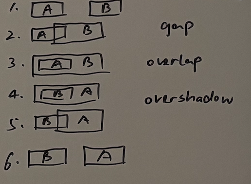
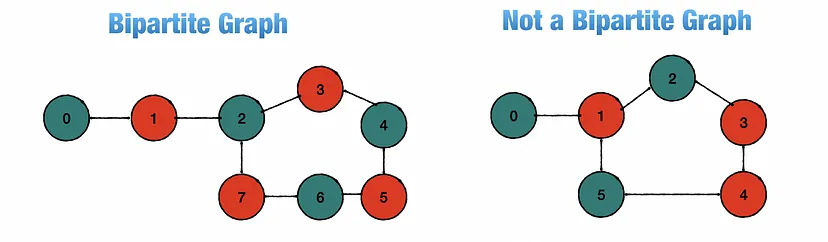
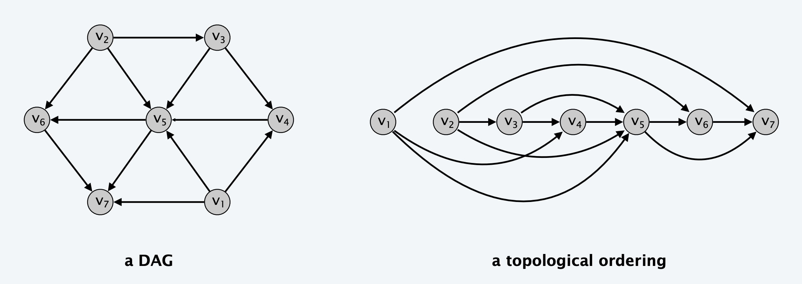

# Array

## 🛠️ Tricks

* Partition - 同类项分组一起看，改变顺序可能便于处理
* Forward and backward - 正看反看 + 分段看
* In-place - 合理利用废空间（无用信息位或者已处理信息位）
* Bucket - suitable when elements' values are within a range
* Simulation for 2D arrays
* 2D array 对角线翻转，x轴翻转，y轴翻转的组合
* 方向数组
  * `int[][] dir = new int[][]{{1, 0}, {0, 1}, {0, -1}, {-1, 0}};`

* 2D array mapping to 1D array
  * `(i, j) -> i * arr[0].length + j`

* [Boyer–Moore majority vote algorithm](https://en.wikipedia.org/wiki/Boyer%E2%80%93Moore_majority_vote_algorithm)

> If a second pass is not performed and there is no majority, the algorithm will not detect that no majority exists.

* 环形数组

## :bulb:1D Array

### Q26. [Remove Duplicates from Sorted Array](https://leetcode.com/problems/remove-duplicates-from-sorted-array/)

* ```java
  class Solution {
      public int removeDuplicates(int[] nums) {
          int k = 1, prev = nums[0];
          for (int i = 1; i < nums.length; i++) {
              if (nums[i] != prev) {
                  nums[k++] = nums[i];
                  prev = nums[i];
              } 
          }
          return k;
      }
  }
  ```

### Q27. [Remove Element](https://leetcode.com/problems/remove-element/)

* ```java
  class Solution {
      public int removeElement(int[] nums, int val) {
          if (nums.length == 0)
              return 0;
          
          int k = 0, size = nums.length, i = 0;
          while (i < size - k) {
              if (nums[i] == val) {
                  nums[i] = nums[size - 1 - k];
                  k++;
              }
              else
                  i++;
          }
          return size - k;
      }
  }
  ```

### Q80. [Remove Duplicates from Sorted Array II](https://leetcode.com/problems/remove-duplicates-from-sorted-array-ii/)

* ```java
  class Solution {
      public int removeDuplicates(int[] nums) {
          int k = 1, prev = nums[0], count = 1;
          for (int i = 1; i < nums.length; i++) {
              if (nums[i] == prev) {
                  if (count == 1) {
                      nums[k++] = nums[i];
                      count++;
                  }
              }
              else {
                  nums[k++] = nums[i];
                  prev = nums[i];
                  count = 1;
              }
          }
          return k;
      }
  }
  ```

### Q88. [Merge Sorted Array](https://leetcode.com/problems/merge-sorted-array/)

* ```java
  class Solution {
      public void merge(int[] nums1, int m, int[] nums2, int n) {
          if (n == 0)
              return;
          
          if (m == 0) {
              for (int i = 0; i < n; i++)
                  nums1[i] = nums2[i];
              return;
          }
  
          // move all prefix 0 in nums1 to suffix 0
          for (int j = m + n - 1; j >= n; j--) {
              nums1[j] = nums1[j - n];
          }
          for (int j = 0; j < n; j++)
              nums1[j] = 0;
          
          int a1 = n, a2 = 0, a = 0;
          while (a1 < m + n && a2 < n) {
              if (nums1[a1] <= nums2[a2])
                  nums1[a++] = nums1[a1++];
              else
                  nums1[a++] = nums2[a2++];
          }
          while (a2 < n) {
              nums1[a++] = nums2[a2++];
          }
  
      }
  }

### Q121. [Best Time to Buy and Sell Stock](https://leetcode.com/problems/best-time-to-buy-and-sell-stock/)

* ```java
  class Solution {
      public int maxProfit(int[] prices) {
          int profit = 0, min = prices[0];
          for (int i = 0; i < prices.length; i++) {
              int p = prices[i] - min;
              if (p < 0)
                  min = prices[i];
              else 
                  profit = Math.max(profit, p);
          }
          return profit;
      }
  }
  ```

### Q122. [Best Time to Buy and Sell Stock II](https://leetcode.com/problems/best-time-to-buy-and-sell-stock-ii/)

* ```java
  class Solution {
      public int maxProfit(int[] prices) {
          int profit = 0;
          for (int i = 1; i < prices.length; i++) {
              int p = prices[i] - prices[i - 1];
              if (p > 0)
                  profit += p;
          }
          return profit;
      }
  }
  ```

### :star:Q169. [Majority Element](https://leetcode.com/problems/majority-element/)

* ```java
  class Solution {
      public int majorityElement(int[] nums) {
          // brute-force: hashmap     time: O(n)  space: O(n)
          // sort and count           time: O(nlogn)  space: O(1)
          // aim: O(n), O(1)  				Boyer–Moore majority vote algorithm
          // start with thinking of two elements A and B, add and subtract 1 in the loop
          // then expand to majority A and others, add and subtract 1, same concept
          int majority = nums[0], count = 1;
          for (int i = 1; i < nums.length; i++) {
              if (nums[i] == majority)
                  count++;
              else {
                  if (count == 0) {
                      majority = nums[i];
                      count = 1;
                  }
                  else
                      count--;
              }
          }
          return majority;
      }
  }
  ```

* [Boyer–Moore majority vote algorithm](https://en.wikipedia.org/wiki/Boyer%E2%80%93Moore_majority_vote_algorithm)

> If a second pass is not performed and there is no majority, the algorithm will not detect that no majority exists.

### Q189. [Rotate Array](https://leetcode.com/problems/rotate-array/)

* ```java
  class Solution {
      public void rotate(int[] nums, int k) {
          int size = nums.length;
          k = k % size;
          
          reverse(nums, 0, size - 1);
          reverse(nums, 0, k - 1);
          reverse(nums, k, size - 1);
      }
  
      private void reverse(int[] nums, int start, int end) {
          while (start < end) {
              int tmp = nums[start];
              nums[start] = nums[end];
              nums[end] = tmp;
              start++;
              end--;
          }
      }
  }
  ```

### :star:Q274. [H-Index](https://leetcode.com/problems/h-index/)

* ```java
  class Solution {
      public int hIndex(int[] citations) {
          int[] buckets = new int[1001];
          for(int i: citations) {
              buckets[i]++;
          }
  
          int count = 0, i = 1000;
          while(i > 0) {
              count += buckets[i];
              if(count >= i) return i;
  
              i--;
          }
  
          return 0;
      }
  }
  ```

### :star:Q380. [Insert Delete GetRandom O(1)](https://leetcode.com/problems/insert-delete-getrandom-o1/)

* ```java
  class RandomizedSet {
      public static final int SIZE = 200_001;
      
      private Map<Integer, Integer> valToIndexMap;
      private int[] vals;
      private int size;
  
      public RandomizedSet() {
          this.valToIndexMap = new HashMap<Integer,Integer>();
          this.vals = new int[SIZE];
          this.size = 0;
      }
      
      public boolean insert(int val) {
          if (valToIndexMap.containsKey(val))
              return false;
          else {
              valToIndexMap.put(val, size);
              vals[size++] = val;
              return true;
          }
      }
      
      public boolean remove(int val) {
          if (valToIndexMap.containsKey(val)) {
              int index = valToIndexMap.get(val);
              int lastElement = vals[size - 1];
              vals[index] = lastElement;
              valToIndexMap.put(lastElement, index);
              valToIndexMap.remove(val);
              size--;
              return true;
          }
          else
              return false;
      }
      
      public int getRandom() {
          int index = randomNumber(0, size);
          return vals[index];
      }
  
      private int randomNumber(int min, int max) {
          int randomNum = min + (int)(Math.random() * (max - min));
          return randomNum;
      }
  }
  
  /**
   * Your RandomizedSet object will be instantiated and called as such:
   * RandomizedSet obj = new RandomizedSet();
   * boolean param_1 = obj.insert(val);
   * boolean param_2 = obj.remove(val);
   * int param_3 = obj.getRandom();
   */
  ```

### Q539. [Minimum Time Difference](https://leetcode.com/problems/minimum-time-difference/)

* ```java
  class Solution {
      public int findMinDifference(List<String> timePoints) {
          if (timePoints.size() > 1440) return 0; 
  
          boolean[] seen = new boolean[1440]; 
          for (String time : timePoints) {
              int minutes = convertToMinutes(time);
              if (seen[minutes]) return 0; 
              seen[minutes] = true;
          }
          
          int first = -1, prev = -1;
          int minDiff = Integer.MAX_VALUE;
          for (int i = 0; i < 1440; i++) {
              if (seen[i]) {
                  if (first < 0) {
                      first = i;
                  } 
                  else {
                      minDiff = Math.min(minDiff, i - prev);
                  }
                  prev = i;
              }
          }
          minDiff = Math.min(minDiff, 1440 - prev + first);
          
          return minDiff;
      }
      
      private int convertToMinutes(String time) {
          return ((time.charAt(0) - '0') * 10 + (time.charAt(1) - '0')) * 60 
               + (time.charAt(3) - '0') * 10 + (time.charAt(4) - '0');
      }
  }
  ```

### Q605. [Can Place Flowers](https://leetcode.com/problems/can-place-flowers/)

* ```java
  class Solution {
      public boolean canPlaceFlowers(int[] flowerbed, int n) {
          int pointer = 0;
          while(pointer < flowerbed.length && n>=0){
              if(flowerbed[pointer] == 1){
                  pointer += 2;
              } else{
                  if(pointer + 1 > flowerbed.length - 1){
                      n--;
                      pointer += 1;
                  } else if(flowerbed[pointer + 1] == 0){
                      n--;
                      pointer += 2;
                  } else{
                      pointer += 3; 
                  }
              }
          }
          return n <= 0;
      }
  }
  ```

### Q1431. [Kids With the Greatest Number of Candies](https://leetcode.com/problems/kids-with-the-greatest-number-of-candies/)

* ```java
  class Solution {
      public List<Boolean> kidsWithCandies(int[] candies, int extraCandies) {
          int max = 0;
          for (int c : candies) {
              if (max < c)
                  max = c;
          }
          List<Boolean> l = new ArrayList<>();
          for (int c : candies) {
              if (c + extraCandies >= max)
                  l.add(true);
              else
                  l.add(false);
          }
          return l;
      }
  }
  ```

### Q1894. [Find the Student that Will Replace the Chalk](https://leetcode.com/problems/find-the-student-that-will-replace-the-chalk/)

* ```java
  class Solution {
      public int chalkReplacer(int[] chalk, int k) {
          long sum = 0;
          for (int i = 0; i < chalk.length; i++)
              sum += chalk[i];
          long left = (long) k % sum;
          for (int i = 0; i < chalk.length; i++) {
              if (left < chalk[i])
                  return i;
              left -= chalk[i];
          }
          return 0;
      }
  }
  ```

### Q2022. [Convert 1D Array Into 2D Array](https://leetcode.com/problems/convert-1d-array-into-2d-array/)

* ```java
  class Solution {
      public int[][] construct2DArray(int[] original, int m, int n) {
          if (original.length != m * n)
              return new int[0][0];
          
          int k = 0;
          int[][] res = new int[m][n];
          for (int i = 0; i < m; i++)
              for (int j = 0; j < n; j++) {
                  res[i][j] = original[k];
                  k++;
              }
          return res;
      }
  }
  ```

## :bulb:2D Array

### Q36. [Valid Sudoku](https://leetcode.com/problems/valid-sudoku/)

* ```java
  class Solution {
      public boolean isValidSudoku(char[][] board) {
          return isValidRows(board) && isValidColumns(board) && isValidCells(board);
      }
  
      private boolean isValidRows(char[][] board) {
          for (int i = 0; i < board.length; i++) {
              int[] seen = new int[9];
              for (int j = 0; j < board.length; j++) {
                  char c = board[i][j];
                  if (c == '.')
                      continue;
                  if (seen[c - '1'] == 0)
                      seen[c - '1'] = 1;
                  else
                      return false;
              }
          }
  
          return true;
      }
  
      private boolean isValidColumns(char[][] board) {
          for (int j = 0; j < board.length; j++) {
              int[] seen = new int[9];
              for (int i = 0; i < board.length; i++) {
                  char c = board[i][j];
                  if (c == '.')
                      continue;
                  if (seen[c - '1'] == 0)
                      seen[c - '1'] = 1;
                  else
                      return false;
              }
          }
  
          return true;
      }
  
      private boolean isValidCells(char[][] board) {
          for (int i = 0; i < board.length; i += 3)
              for (int j = 0; j < board.length; j+= 3) {
                  if (!isValidCell(board, i, j))
                      return false;
              }
          
          return true;
      }
  
      private boolean isValidCell(char[][] board, int a, int b) {
          int[] seen = new int[9];
          for (int i = a; i < a + 3; i++)
              for (int j = b; j < b + 3; j++) {
                  char c = board[i][j];
                  if (c == '.')
                      continue;
                  if (seen[c - '1'] == 0)
                      seen[c - '1'] = 1;
                  else
                      return false;
              }
              
          return true;
      }
  }
  ```

### Q48. [Rotate Image](https://leetcode.com/problems/rotate-image/)

* ```java
  class Solution {
      public void rotate(int[][] matrix) {
          int n = matrix.length;
          // swap matrix by diagonal
          for (int i = 0; i < n - 1; i++)
              for (int j = 0; j < n - i - 1; j++) {
                  int tmp = matrix[i][j];
                  matrix[i][j] = matrix[n - 1 - j][n - 1 - i];
                  matrix[n - 1 - j][n - 1 - i] = tmp;
              }
          // swap matrix by horizontal centerline
          for (int i = 0; i < n / 2; i++)
              for (int j = 0; j < n; j++) {
                  int tmp = matrix[i][j];
                  matrix[i][j] = matrix[n - 1 - i][j];
                  matrix[n - 1 - i][j] = tmp;
              }
      }
  }
  ```

### Q54. [Spiral Matrix](https://leetcode.com/problems/spiral-matrix/)

* ```java
  class Solution {
      public List<Integer> spiralOrder(int[][] matrix) {
          List<Integer> result = new ArrayList<>();
          int a1 = 0, b1 = 0, a2 = matrix.length - 1, b2 = matrix[0].length - 1;
          while (a1 <= a2 && b1 <= b2) {
              addCircle(matrix, a1, b1, a2, b2, result);
              a1++;
              b1++;
              a2--;
              b2--;
          }
  
          return result;
      }
  
      private void addCircle(int[][] matrix, int a1, int b1, int a2, int b2,
                              List<Integer> result) {
          int i = a1, j = b1;
  
          // a horizontal line
          if (a1 == a2) {
              while (j <= b2)
                  result.add(matrix[i][j++]);
              return;
          }
              
          // a vertical line
          if (b1 == b2) {
              while (i <= a2)
                  result.add(matrix[i++][j]);
              return;
          }
              
          // a circle
          while (j < b2)
              result.add(matrix[i][j++]);
          while (i < a2)
              result.add(matrix[i++][j]);
          while (j > b1)
              result.add(matrix[i][j--]);
          while (i > a1)
              result.add(matrix[i--][j]);
          return;
      }
  }
  ```

### Q59. [Spiral Matrix II](https://leetcode.com/problems/spiral-matrix-ii/)

* ```java
  class Solution {
      public int[][] generateMatrix(int n) {
          int[][] matrix = new int[n][n];
          spiral(matrix, 1, 0, n - 1);
          return matrix;
      }
  
      private void spiral(int[][] matrix, int n, int r1, int r2) {
          if (r1 > r2)
              ;
          else if (r1 == r2) 
              matrix[r1][r1] = n;
          else {
              for (int i = r1; i <= r2; i++)
                  matrix[r1][i] = n++;
              for (int i = r1 + 1; i < r2; i++)
                  matrix[i][r2] = n++;
              for (int i = r2; i >= r1; i--)
                  matrix[r2][i] = n++;
              for (int i = r2 - 1; i > r1; i--)
                  matrix[i][r1] = n++;
              spiral(matrix, n, r1 + 1, r2 - 1);
          }
      }
  }
  ```

### Q73. [Set Matrix Zeroes](https://leetcode.com/problems/set-matrix-zeroes/)

* ```java
  class Solution {
      public void setZeroes(int[][] matrix) {
          Set<Integer> rows = new HashSet<>();
          Set<Integer> cols = new HashSet<>();
  
          for (int i = 0; i < matrix.length; i++)
              for (int j = 0;j < matrix[0].length; j++) {
                  if (matrix[i][j] == 0) {
                      rows.add(i);
                      cols.add(j);
                  }
              }
  
          for (Integer r : rows) 
              zeroRow(matrix, r);
          for (Integer c : cols)
              zeroCol(matrix, c);
      }
  
      private void zeroRow(int[][] matrix, int a) {
          for (int j = 0; j < matrix[0].length; j++)
              matrix[a][j] = 0;
      }
  
      private void zeroCol(int[][] matrix, int b) {
          for (int i = 0; i < matrix.length; i++)
              matrix[i][b] = 0;
      }
  }
  ```

### Q289. [Game of Life](https://leetcode.com/problems/game-of-life/)

* ```java
  class Solution {
      public void gameOfLife(int[][] board) {
          for (int i = 0; i < board.length; i++)
              for (int j = 0; j < board[0].length; j++)
                  updateCell(board, i, j);
          
          updateBoard(board);
      }
  
      private void updateBoard(int[][] board) {
          for (int i = 0; i < board.length; i++)
              for (int j = 0; j < board[0].length; j++) {
                  int state = board[i][j];
                  if (state == 1 || state == 2)
                      board[i][j] = 1;
                  else    
                      board[i][j] = 0;
              }
      }
  
      private void updateCell(int[][] board, int r, int c) {
          int live = 0, die = 0, state = board[r][c];
  
          int i = r - 1, j = c - 1;
          for (; j <= c; j++) {
              if (!isOutOfBound(board, i, j)) {
                  int s = board[i][j];
                  if (s == 1 || s == -2)
                      live++;
                  else
                      die++;
              }
          }
          for (; i <= r; i++) {
              if (!isOutOfBound(board, i, j)) {
                  int s = board[i][j];
                  if (s == 1 || s == -2)
                      live++;
                  else
                      die++;
              }
          }
          for (; j >= c; j--) {
              if (!isOutOfBound(board, i, j)) {
                  int s = board[i][j];
                  if (s == 1 || s == -2)
                      live++;
                  else
                      die++;
              }
          }
          for (; i >= r; i--) {
              if (!isOutOfBound(board, i, j)) {
                  int s = board[i][j];
                  if (s == 1 || s == -2)
                      live++;
                  else
                      die++;
              }
          }
  
          // -2 means 1 to 0, 2 means 0 to 1
          if (state == 1 && (live < 2 || live > 3)) 
              board[r][c] = -2;
  
          if (state == 0 && live == 3)
              board[r][c] = 2;
      }
  
      private boolean isOutOfBound(int[][] board, int i, int j) {
          return i < 0 || i >= board.length || j < 0 || j >= board[0].length;
      }
  }
  ```

### Q885. [Spiral Matrix III](https://leetcode.com/problems/spiral-matrix-iii/)

* ```java
  class Solution {
      private static int n = 0;
  
      public int[][] spiralMatrixIII(int rows, int cols, int rStart, int cStart) {
          int circles = Math.max(Math.max(Math.max(rStart + 1, cStart + 1), rows - rStart), cols - cStart);
          int[][] m = new int[rows * cols][2];
          for (int c = 0; c < circles; c++) {
              spiral(m, rStart - c, cStart - c, rStart + c, cStart + c, rows, cols);
          }
          return m;
      }
  
      private void spiral(int[][] m, int r1, int c1, int r2, int c2, int rows, int cols) {
          if (r1 == r2 && c1 == c2) {
              m[n++] = new int[] {r1, c1};
          }
          else {
              for (int i = r1 + 1; i <= r2; i++)
                  if (i >= 0 && i < rows && c2 >= 0 && c2 < cols)
                      m[n++] = new int[] {i, c2};
              for (int i = c2 - 1; i >= c1; i--)
                  if (r2 >= 0 && r2 < rows && i >= 0 && i < cols)
                      m[n++] = new int[] {r2, i};
              for (int i = r2 - 1; i >= r1; i--)
                  if (i >= 0 && i < rows && c1 >= 0 && c1 < cols)
                      m[n++] = new int[] {i, c1};
              for (int i = c1 + 1; i <= c2; i++)
                  if (r1 >= 0 && r1 < rows && i >= 0 && i < cols)
                      m[n++] = new int[] {r1, i};
          }
      }
  }
  ```

### Q2326. [Spiral Matrix IV](https://leetcode.com/problems/spiral-matrix-iv/)

* ```java
  class Solution {
      public int[][] spiralMatrix(int m, int n, ListNode head) {
          int[][] matrix = new int[m][];
          for (int i = 0; i < m; i++) {
              matrix[i] = new int [n];
              Arrays.fill(matrix[i], -1);
          }
          int a = 0, b = 0, p = m - 1, q = n - 1;
          while (head != null) {
              if (a == p) {
                  for (; head != null && b <= q; b++) {
                      matrix[a][b] = head.val;
                      head = head.next;
                  }
              }
              else if (b == q) {
                  for (; head != null && a <= p; a++) {
                      matrix[a][b] = head.val;
                      head = head.next;
                  }
              }
              else {
                  int i = a, j = b;
                  for (; head != null && b < q; b++) {
                      matrix[a][b] = head.val;
                      head = head.next;
                  }
                  for (; head != null && a < p; a++) {
                      matrix[a][b] = head.val;
                      head = head.next;
                  }
                  for (; head != null && b > j; b--) {
                      matrix[a][b] = head.val;
                      head = head.next;
                  }
                  for (; head != null && a > i; a--) {
                      matrix[a][b] = head.val;
                      head = head.next;
                  }
                  a++;
                  b++;
                  p--;
                  q--;
              }
          }
          return matrix;
      }
  }
  ```

***

# String

## 🛠️ Tricks

* Delete last char of `StringBuilder`
  * `sb.setLength(sb.length() - 1)`


### Q884. [Uncommon Words from Two Sentences](https://leetcode.com/problems/uncommon-words-from-two-sentences/)

* ```java
  class Solution {
      public String[] uncommonFromSentences(String s1, String s2) {
          String[] words1 = s1.split(" "), words2 = s2.split(" ");
          Map<String, Integer> freq = new HashMap<>();
          for (String w : words1) {
              freq.put(w, freq.getOrDefault(w, 0) + 1);
          }
          for (String w : words2) {
              freq.put(w, freq.getOrDefault(w, 0) + 1);
          }
          List<String> uncommon = new ArrayList<>();
          freq.forEach((key, value) -> {
              if (value == 1)
                  uncommon.add(key);
          });
          return uncommon.toArray(new String[0]);
      }
  }
  ```


### :star:Q1071. [Greatest Common Divisor of Strings](https://leetcode.com/problems/greatest-common-divisor-of-strings/)

* ```java
  class Solution {
      public String gcdOfStrings(String str1, String str2) {
          if(!(str1 + str2).equals(str2+str1))
              return "";
  
          int len1 = str1.length(),len2 = str2.length();
          return str1.substring(0,gcd(len1,len2));
      }
  
      // private String dOfString(String str) {
      //     StringBuilder div = new StringBuilder();
      //     char[] c = str.toCharArray();
      //     for (int i = 0; i < c.length; i++) {
      //         div.append(c[i]);
      //         StringBuilder tmp = new StringBuilder(div);
      //         StringBuilder s = new StringBuilder(str);
      //         if (tmp.append(str).compareTo(s.append(div)) == 0)
      //             break;
      //     }
      //     return div.toString();
      // }
  
      private int gcd(int m, int n) {
          int t = 1;
          while (t != 0) {
              t = m % n;
              m = n;
              n = t;
          }
          return m;
      }
  }
  ```

### Q1684. [Count the Number of Consistent Strings](https://leetcode.com/problems/count-the-number-of-consistent-strings/)

* ```java
  class Solution {
      public int countConsistentStrings(String allowed, String[] words) {
          boolean[] appeared = new boolean[26];
          int count = 0;
          for (char c : allowed.toCharArray()) {
              appeared[c - 'a'] = true;
          }
          for (String w : words) {
              int i = 0;
              for (; i < w.length(); i++) {
                  if (appeared[w.charAt(i) - 'a'] == false)
                      break;
              }
              if (i == w.length())
                  count++;
          }
          return count;
      }
  }
  ```

### Q1768. [Merge Strings Alternately](https://leetcode.com/problems/merge-strings-alternately/)

* ```java
  class Solution {
      public String mergeAlternately(String word1, String word2) {
          int len1 = word1.length(), len2 = word2.length();
          StringBuilder word = new StringBuilder();
          char[] w1 = word1.toCharArray(), w2 = word2.toCharArray();
          int i = 0, j = 0;
          for (; i < len1 && j < len2; i++, j++) {
              word.append(w1[i]).append(w2[j]);
          }
          if (len2 > len1)
              while (j < len2) 
                  word.append(w2[j++]);
          else 
              while (i < len1)
                  word.append(w1[i++]);
          return word.toString();
      }
  }
  ```

### Q1945. [Sum of Digits of String After Convert](https://leetcode.com/problems/sum-of-digits-of-string-after-convert/)

* ```java
  class Solution {
      public int getLucky(String s, int k) {
          StringBuilder sb = new StringBuilder();
          for (int i = 0; i < s.length(); i++) {
              sb.append(s.charAt(i) - 'a' + 1);
          }
          for (int i = 0; i < k; i++) {
              int sum = 0;
              for (int j = 0; j < sb.length(); j++) {
                  sum += sb.charAt(j) - '0';
              }
              sb.setLength(0);
              sb.append(sum);
          }
          return Integer.parseInt(sb.toString());
      }
  ```

# Two Pointers

## 🛠️ Tricks

* Dummy nodes
* Fast and slow pointers
  * Find **middle** element
  * **Circular** list
* Left and right pointers
  * **Reverse**
  * **Water container problem**
* Composition with other data structures
* **Skip list**


## :bulb:Fast and slow

### Q141. [Linked List Cycle](https://leetcode.com/problems/linked-list-cycle/)

* ```java
  public class Solution {
      public boolean hasCycle(ListNode head) {
          ListNode fast = head, slow = head;
          while (fast != null && fast.next != null) {
              fast = fast.next.next;
              slow = slow.next;
              if (fast == slow)   return true;
          }
          return false;
      }
  }
  ```

### Q142. [Linked List Cycle II](https://leetcode.com/problems/linked-list-cycle-ii/)

* 

* Quick pointer move `xq`: `x1 + x2 + x3 + x2`, slow pointer move `xs`: `x1 + x2`, and `xq = 2xs`, so `x1 = x3`

* So, after quick and slow meet, let quick back to the head of the list and make it move one node each iteration as slow point does. When they meet again, they will be at the start node of the cycle

* ```java
  public class Solution {
      public ListNode detectCycle(ListNode head) {
          ListNode fast = head, slow = head;
          while (fast != null && fast.next != null) {
              fast = fast.next.next;
              slow = slow.next;
              if (fast == slow) {
                  fast = head;
                  while (fast != slow) {
                      slow = slow.next;
                      fast = fast.next;
                  }
                  return fast;
              }
          }
          return null;
      }
  }
  ```

### Q876. [Middle of the Linked List](https://leetcode.com/problems/middle-of-the-linked-list/)

* ```java
  class Solution {
      public ListNode middleNode(ListNode head) {
          ListNode fast = head, slow = head;
          while (fast != null && fast.next != null) {
              fast = fast.next.next;
              slow = slow.next;
          }
          return slow;
      }
  }
  ```

### Q2095. [Delete the Middle Node of a Linked List](https://leetcode.com/problems/delete-the-middle-node-of-a-linked-list/)

* ```java
  class Solution {
      public ListNode deleteMiddle(ListNode head) {
          if (head.next == null)
              return null;
          
          ListNode s = head;
          ListNode f = head.next.next;
          while (f != null && f.next != null) {
              s = s.next;
              f = f.next.next;
          }
          s.next = s.next.next;
          return head;
      }
  }
  ```

### Q2130. [Maximum Twin Sum of a Linked List](https://leetcode.com/problems/maximum-twin-sum-of-a-linked-list/)

* ```java
  class Solution {
      public int pairSum(ListNode head) {
          ListNode f = head.next.next, s = head;
          ListNode reverse = new ListNode();
          while (f != null) {
              f = f.next.next;
              ListNode tmp = s;
              s = s.next;
              tmp.next = reverse;
              reverse = tmp;
          }
          f = s.next;
          s.next = reverse;
  
          int max = 0;
          while (f != null) {
              int sum = s.val + f.val;
              max = sum > max ? sum : max;
              s = s.next;
              f = f.next;
          }
  
          return max;
      }
  }
  ```

***

## :bulb:Left and right

### :star:Q11. [Container With Most Water](https://leetcode.com/problems/container-with-most-water/)

* The problem is to find a greater height for smaller width during we scan the array

* ```java
  class Solution {
      public int maxArea(int[] height) {
          int i = 0, j = height.length - 1, max = 0;
          while (i < j) {
              int h = Math.min(height[i], height[j]);
              int v = (j - i) * h;
              if (max < v)    max = v;
              while (i < j && height[i] <= h)     i++;
              while (i < j && height[j] <= h)     j--;
          }
          return max;
      }
  }
  ```

### Q125. [Valid Palindrome](https://leetcode.com/problems/valid-palindrome/)

* ```java
  class Solution {
      public boolean isPalindrome(String s) {
          char[] str = s.toCharArray();
          int start = 0, end = str.length - 1;
          while (start < end) {
              while (start < str.length && !isValidChar(str[start]))
                  start++;
              while (end >= 0 && !isValidChar(str[end]))
                  end--;
              if (start > end)
                  return true;
              if (toLowerCase(str[start]) == toLowerCase(str[end])) {
                  start++;
                  end--;
              }
              else
                  return false;
          }
          return true;
      }
  
      private boolean isValidChar(char c) {
          return (c >= 'A' && c <= 'Z') || (c >= 'a' && c <= 'z') || (c >= '0' && c <= '9');
      }
  
      private char toLowerCase(char c) {
          if (c >= 'A' && c <= 'Z')
              c += 32;
          return c;
      }
  }
  ```

### Q345. [Reverse Vowels of a String](https://leetcode.com/problems/reverse-vowels-of-a-string/)

* ```java
  class Solution {
      public String reverseVowels(String s) {
          char[] c = s.toCharArray();
          int h = 0, t = c.length - 1;
          while (h < t) {
              while (h < c.length && !isVowel(c[h]))
                  h++;
              while (t >= 0 && !isVowel(c[t]))
                  t--;
              if (h < t) {
                  char tmp = c[h];
                  c[h] = c[t];
                  c[t] = tmp;
                  h++;
                  t--;
              }
          }
          return new String(c);
      }
  
      private boolean isVowel(char c) {
          return switch (c) {
              case 'a', 'e', 'i', 'o', 'u',
                   'A', 'E', 'I', 'O', 'U' -> true;
              default -> false;
          };
      }
  }
  ```

***

## :bulb:Two lists or One list two pointers

### Q2. [Add Two Numbers](https://leetcode.com/problems/add-two-numbers/)

* ```java
  /**
   * Definition for singly-linked list.
   * public class ListNode {
   *     int val;
   *     ListNode next;
   *     ListNode() {}
   *     ListNode(int val) { this.val = val; }
   *     ListNode(int val, ListNode next) { this.val = val; this.next = next; }
   * }
   */
  class Solution {
      public ListNode addTwoNumbers(ListNode l1, ListNode l2) {
          ListNode result = l1, prev = null;
          int[] carry = new int[1];
  
          while (l1 != null && l2 != null) {
              updateL1(l1, l2.val, carry);
              
              prev = l1;
              l1 = l1.next;
              l2 = l2.next;
          }
  
          if (l1 == null) {
              prev.next = l2;
              l1 = l2;
          }
  
          
          while (l1 != null) {
              if (carry[0] == 0)
                  break;
              updateL1(l1, 0, carry);
              prev = l1;
              l1 = l1.next;
          }
  
          if (carry[0] == 1) 
              prev.next = new ListNode(1);
          
          return result;
      }
  
      private void updateL1(ListNode l, int val, int[] carry) {
          l.val += val + carry[0];
              if (l.val >= 10) {
                  l.val -= 10;
                  carry[0] = 1;
              }
              else
                  carry[0] = 0;
      }
  }
  ```

### Q19. [Remove Nth Node From End of List](https://leetcode.com/problems/remove-nth-node-from-end-of-list/)

* ```java
  /**
   * Definition for singly-linked list.
   * public class ListNode {
   *     int val;
   *     ListNode next;
   *     ListNode() {}
   *     ListNode(int val) { this.val = val; }
   *     ListNode(int val, ListNode next) { this.val = val; this.next = next; }
   * }
   */
  class Solution {
      public ListNode removeNthFromEnd(ListNode head, int n) {
          int length = calLength(head);
  
          if (n == length)
              return head.next;
          
          ListNode h = head;
          for (int i = 1; i < length - n; i++) {
              h = h.next;
          }
          h.next = h.next.next;
  
          return head;
      }
  
      private int calLength(ListNode head) {
          int length = 0;
          while (head != null) {
              length++;
              head = head.next;
          }
          return length;
      }
  }
  ```

### Q21. [Merge Two Sorted Lists](https://leetcode.com/problems/merge-two-sorted-lists/)

* ```java
  /**
   * Definition for singly-linked list.
   * public class ListNode {
   *     int val;
   *     ListNode next;
   *     ListNode() {}
   *     ListNode(int val) { this.val = val; }
   *     ListNode(int val, ListNode next) { this.val = val; this.next = next; }
   * }
   */
  class Solution {
      public ListNode mergeTwoLists(ListNode l1, ListNode l2) {
          ListNode dummy = new ListNode(0);
          ListNode head = dummy;
          
          while (l1 != null && l2 != null) {
              if (l1.val > l2.val) {
                  head.next = l2;
                  l2 = l2.next;
              }
              else {
                  head.next = l1;
                  l1 = l1.next;
              }
              head = head.next;
          }
  
          if (l1 == null)
              head.next = l2;
          if (l2 == null)
              head.next = l1;
  
          return dummy.next;
      }
  }
  ```
  
* ```java
  public ListNode mergeTwoLists(ListNode l1, ListNode l2) {
      if(l1 == null)
          return l2;
      if(l2 == null)
          return l1;
  
      if(l1.val >= l2.val) {
          l2.next = mergeTwoLists(l1, l2.next);
          return l2;
      }
      else {
          l1.next = mergeTwoLists(l1.next, l2);
          return l1;
      }
  }
  ```

### :star:Q23. [Merge k Sorted Lists](https://leetcode.com/problems/merge-k-sorted-lists/)

* Divide and conquer + Q21.

* ```java
  class Solution {
      public ListNode mergeKLists(ListNode[] lists) {
          return merge(lists, 0, lists.length - 1);
      }
  
      public ListNode merge(ListNode[] lists, int left, int right) {
          if (left > right)
              return null;
          else if (left == right) 
              return lists[left];
          else {
              int mid = left + (right - left) / 2;
              ListNode leftList = merge(lists, left, mid), rightList = merge(lists, mid + 1, right);
              return mergeTwoLists(leftList, rightList);
          }  
      }
  
      public ListNode mergeTwoLists(ListNode l1, ListNode l2) {
          if(l1 == null)
              return l2;
          if(l2 == null)
              return l1;
  
          if(l1.val >= l2.val) {
              l2.next = mergeTwoLists(l1, l2.next);
              return l2;
          }
          else {
              l1.next = mergeTwoLists(l1.next, l2);
              return l1;
          }
      }
  }
  ```

### :star:Q25. [Reverse Nodes in k-Group](https://leetcode.com/problems/reverse-nodes-in-k-group/)

* Follow-up of [question 92](#Q92)

* ```java
  /**
   * Definition for singly-linked list.
   * public class ListNode {
   *     int val;
   *     ListNode next;
   *     ListNode() {}
   *     ListNode(int val) { this.val = val; }
   *     ListNode(int val, ListNode next) { this.val = val; this.next = next; }
   * }
   */
  class Solution {
      public ListNode reverseKGroup(ListNode head, int k) {
          int length = calLength(head);
          int left = 1, right = k;
          while (right <= length) {
              head = reverseBetween(head, left, right);
              left += k;
              right += k;
          }
  
          return head;
      }
  
      private ListNode reverseBetween(ListNode head, int left, int right) {
          if (left == right)
              return head;
          
          ListNode dummy = new ListNode(0, head), start = dummy;
          
          // (]
          int i = 1;
          for (; i < left; i++)
              start = start.next;
  
          ListNode a = start.next, b = a.next;
          i = left;
  
          for (; i < right; i++) {
              ListNode tmp = b.next;
              b.next = a;
              a = b;
              b = tmp;
          }
          start.next.next = b;
          start.next = a;
  
          return dummy.next;
      }
  
      private int calLength(ListNode head) {
          int length = 0;
          while (head != null) {
              length++;
              head = head.next;
          }
  
          return length;
      }
  }
  ```

### Q61. [Rotate List](https://leetcode.com/problems/rotate-list/)

* ```java
  /**
   * Definition for singly-linked list.
   * public class ListNode {
   *     int val;
   *     ListNode next;
   *     ListNode() {}
   *     ListNode(int val) { this.val = val; }
   *     ListNode(int val, ListNode next) { this.val = val; this.next = next; }
   * }
   */
  class Solution {
      public ListNode rotateRight(ListNode head, int k) {
          if (head == null)
              return null;
          
          int length = calLength(head);
          k = k % length;
          if (k == 0)
              return head;
  
          ListNode newTail = getKthNode(head, length - k);
          ListNode tail = getTail(head);
          ListNode newHead = newTail.next;
          newTail.next = null;
          tail.next = head;
          
          return newHead;
      }
  
      private ListNode getKthNode(ListNode head, int k) {
          for (int i = 0; i < k - 1; i++)
              head = head.next;
          
          return head;
      }
  
      private ListNode getTail(ListNode head) {
          while (head.next != null)
              head = head.next;
          
          return head;
      }
  
      private int calLength(ListNode head) {
          int length = 0;
          while (head != null) {
              length++;
              head = head.next;
          }
  
          return length;
      }
  }
  ```

### Q82. [Remove Duplicates from Sorted List II](https://leetcode.com/problems/remove-duplicates-from-sorted-list-ii/)

* ```java
  /**
   * Definition for singly-linked list.
   * public class ListNode {
   *     int val;
   *     ListNode next;
   *     ListNode() {}
   *     ListNode(int val) { this.val = val; }
   *     ListNode(int val, ListNode next) { this.val = val; this.next = next; }
   * }
   */
  class Solution {
      public ListNode deleteDuplicates(ListNode head) {
          ListNode dummy = new ListNode(101, head);
          int number = 101;
          ListNode prev = dummy, curr = head;
  
          while (curr != null) {
              number = curr.val;
              int count = 1;
              while (curr.next != null && curr.next.val == number) {
                  curr = curr.next;
                  count++;
              }
              if (count > 1) {
                  curr = curr.next;
                  prev.next = curr;
              } 
              else {
                  prev = curr;
                  curr = curr.next;
              }  
          }
  
          return dummy.next;
      }
  }
  ```

### Q86. [Partition List](https://leetcode.com/problems/partition-list/)

* ```java
  /**
   * Definition for singly-linked list.
   * public class ListNode {
   *     int val;
   *     ListNode next;
   *     ListNode() {}
   *     ListNode(int val) { this.val = val; }
   *     ListNode(int val, ListNode next) { this.val = val; this.next = next; }
   * }
   */
  class Solution {
      public ListNode partition(ListNode head, int x) {
          if (head == null)
              return null;
  
          ListNode smallNodes = new ListNode(0), bigNodes = new ListNode(0);
          ListNode smallHead = smallNodes, bigHead = bigNodes;
          while (head != null) {
              if (head.val < x) {
                  smallHead.next = head;
                  smallHead = smallHead.next;
              }
              else {
                  bigHead.next = head;
                  bigHead = bigHead.next;
              }
              head = head.next;
          }
          bigHead.next = null;
          smallHead.next = bigNodes.next;
          
          return smallNodes.next;
      }
  }
  ```

### :star:Q92. [Reverse Linked List II](https://leetcode.com/problems/reverse-linked-list-ii/)

* ```java
  /**
   * Definition for singly-linked list.
   * public class ListNode {
   *     int val;
   *     ListNode next;
   *     ListNode() {}
   *     ListNode(int val) { this.val = val; }
   *     ListNode(int val, ListNode next) { this.val = val; this.next = next; }
   * }
   */
  class Solution {
      public ListNode reverseBetween(ListNode head, int left, int right) {
          if (left == right)
              return head;
          
          ListNode dummy = new ListNode(0, head), start = dummy;
          
          // (]
          int i = 1;
          for (; i < left; i++)
              start = start.next;
  
          ListNode a = start.next, b = a.next;
          i = left;
  
          for (; i < right; i++) {
              ListNode tmp = b.next;
              b.next = a;
              a = b;
              b = tmp;
          }
          start.next.next = b;
          start.next = a;
  
          return dummy.next;
      }
  }
  ```

### :star:Q160. [Intersection of Two Linked Lists](https://leetcode.com/problems/intersection-of-two-linked-lists/)

* Concat two lists: a + b = b + a 

* No intersection means two lists intersect at a null node

* ```java
  public class Solution {
      public ListNode getIntersectionNode(ListNode headA, ListNode headB) {
          ListNode a = headA, b = headB;
  
          while (a != b) {
              if (a == null)
                  a = headB;
              else
                  a = a.next;
  
              if (b == null)
                  b = headA;
              else
                  b = b.next;
          }
  
          return a;
      }
  }
  ```

### Q328. [Odd Even Linked List](https://leetcode.com/problems/odd-even-linked-list/)

* ```java
  class Solution {
      public ListNode oddEvenList(ListNode head) {
          if (head == null || head.next == null || head.next.next == null)
              return head;
          
          ListNode even = new ListNode();
          ListNode eCopy = even;
          ListNode odd = new ListNode();
          ListNode cur = head;
          int i = 1;
          while (cur != null) {
              if (i % 2 != 0) {
                  odd.next = cur;
                  odd = odd.next;
              }
              else {
                  even.next = cur;
                  even = even.next;
              }
              cur = cur.next;
              i++;
          }
          odd.next = eCopy.next;
          even.next = null;
          return head;
      }
  }
  ```

### Q283. [Move Zeroes](https://leetcode.com/problems/move-zeroes/)

* ```java
  class Solution {
      public void moveZeroes(int[] nums) {
          int first0 = 0, cur = 0;
          while (cur < nums.length) {
              if (nums[cur] != 0) {
                  if (cur > first0) {
                      nums[first0] = nums[cur];
                      nums[cur] = 0;
                  }
                  first0++;
              }
              cur++;
          }
      }
  }
  ```

### Q392. [Is Subsequence](https://leetcode.com/problems/is-subsequence/)

* ```java
  class Solution {
      public boolean isSubsequence(String s, String t) {
          if (s.length() > t.length())
              return false;
  
          char[] sub = s.toCharArray();
          int j = 0, len = sub.length;
          for (char c : t.toCharArray()) {
              if (j >= len)    return true;
              else if (sub[j] == c)    j++;
          }
          return j >= len;
      }
  }
  ```

* Follow up

  * The idea here is to use prefix sum and binary search
  * `O(K*N) -> O(K*MLogN)`

### Q443. [String Compression](https://leetcode.com/problems/string-compression/)

* ```java
  class Solution {
      public int compress(char[] c) {
          int p = 0, cur = 1, num = 1;
          while (cur < c.length) {
              if (c[cur] == c[p]) {
                  num++;
              }
              else {
                  if (num == 1)
                      c[++p] = c[cur];
                  else {
                      char[] digits = String.valueOf(num).toCharArray();
                      for (char d : digits) 
                          c[++p] = d;
                      c[++p] = c[cur];
                      num = 1;
                  }
              }
              cur++;
          }
          if (num > 1) {
              char[] digits = String.valueOf(num).toCharArray();
              for (char d : digits) 
                  c[++p] = d;
          }
          return p + 1;
      }
  }
  ```

### Q725. [Split Linked List in Parts](https://leetcode.com/problems/split-linked-list-in-parts/)

* ```java
  class Solution {
      public ListNode[] splitListToParts(ListNode head, int k) {
          int size = 0;
          ListNode n = head;
          while (n != null) {
              n = n.next;
              size++;
          }
          int base = size / k;
          int remaining = size % k;
          ListNode[] res = new ListNode[k];
          int cnt = 0;
          n = head;
          for (int i = 0; i < remaining; i++) {
              res[cnt++] = n;
              for (int j = 0; j < base; j++) {
                  n = n.next;
              }
              ListNode tmp = n.next;
              n.next = null;
              n = tmp;
          }
          for (int i = 0; i < k - remaining; i++) {
              res[cnt++] = n;
              if (n != null) {
                  for (int j = 0; j < base - 1; j++) {
                      n = n.next;
                  }
                  ListNode tmp = n.next;
                  n.next = null;
                  n = tmp;
              }
          }
          return res;
      }
  }
  ```

### Q1047. [Remove All Adjacent Duplicates In String](https://leetcode.com/problems/remove-all-adjacent-duplicates-in-string/)

* ```java
  class Solution {
      public String removeDuplicates(String s) {
          char[] tokens = s.toCharArray();
          int pos = -1, i = 0;
          while (i < tokens.length) {
              if (pos < 0 || tokens[i] != tokens[pos]) {
                  tokens[++pos] = tokens[i++];
              }
              else {
                  pos--;
                  i++;
              }
          }
          return new String(tokens, 0, pos + 1);
      }
  }
  ```

* Or use a stack


### Q2807. [Insert Greatest Common Divisors in Linked List](https://leetcode.com/problems/insert-greatest-common-divisors-in-linked-list/)

* ```java
  class Solution {
      public ListNode insertGreatestCommonDivisors(ListNode head) {
          if (head.next == null)
              return head;
          ListNode a = head, b = head.next;
          while (b != null) {
              int value = gcd(a.val, b.val);
              a.next = new ListNode(value, b);
              a = b;
              b = b.next;
          }
          return head;
      }
  
      private int gcd(int a, int b) {
          if (b == 0)
              return a;
          else
              return gcd(b, a % b);
      }
  }
  ```

### Q2181. [Merge Nodes in Between Zeros](https://leetcode.com/problems/merge-nodes-in-between-zeros/)

* ```java
  class Solution {
      public ListNode mergeNodes(ListNode head) {
          ListNode dummy = new ListNode(0), h = head, dh = dummy;
  
          while (h != null) {
              if (h.val == 0 && h.next != null) {
                  dh.next = h;
                  dh = dh.next;
              }
              else {
                  dh.val += h.val;
              }
              h = h.next;
          }
  
          dh.next = null;
  
          return dummy.next;
      }
  }
  ```

### Q3217. [Delete Nodes From Linked List Present in Array](https://leetcode.com/problems/delete-nodes-from-linked-list-present-in-array/)

* ```java
  class Solution {
      public ListNode modifiedList(int[] nums, ListNode head) {
          Set<Integer> s = new HashSet<>();
          for (int n : nums) {
              s.add(n);
          }
          ListNode dummy = new ListNode(0, head);
          ListNode n = dummy;
          while (head != null) {
              if (s.contains(head.val)) {
                  head = head.next;
                  n.next = head;
              }
              else {
                  head = head.next;
                  n = n.next;
              }
          }
          return dummy.next;
      }
  }
  ```


***

## :bulb:nSUM

### Q1. [Two Sum](https://leetcode.com/problems/two-sum/)

* If array is ordered, we can use two pointers to save space

* ```java
  class Solution {
      public int[] twoSum(int[] nums, int target) {
          Map<Integer, Integer> indices = new HashMap<>();
          for (int i = 0; i < nums.length; i++) {
              if (indices.containsKey(target - nums[i]))
                  return new int[] {indices.get(target - nums[i]), i};
              else
                  indices.put(nums[i], i);
          }
          return null;
      }
  }
  ```

### Q15. [3Sum](https://leetcode.com/problems/3sum/)

* ```java
  class Solution {
      public static final int TARGET = 0;
  
      public List<List<Integer>> threeSum(int[] nums) {
          List<List<Integer>> result = new ArrayList<>();
          Arrays.sort(nums);
          int k = nums.length - 1, target = TARGET - nums[k];
  
          while (k > 1 && target < nums[0] + nums[1]) {
                  k--;
                  target = TARGET - nums[k];
          }
  
          while (k > 1) {
              target = TARGET - nums[k];
              result.addAll(twoSum(nums, 0, k - 1, target));
              k--;
              while (k > 1 && nums[k] == nums[k + 1])
                  k--;
          }
  
          return result;
      }
  
      private List<List<Integer>> twoSum(int[] numbers, int i, int j, int target) {
          List<List<Integer>> result = new ArrayList<>();
          while (i < j) {
              int sum = numbers[i] + numbers[j];
              if (sum > target)
                  j--;
              else if (sum < target)
                  i++;
              else {
                  result.add(resultFactory(numbers[i], numbers[j], TARGET - target));
                  i++;
                  while (i < j && numbers[i] == numbers[i - 1])
                      i++;
              }
          }
          return result;
      }
  
      private List<Integer> resultFactory(int i, int j, int k) {
          return new ArrayList<Integer>(Arrays.asList(i, j, k));
      }
  }
  ```

### Q167. [Two Sum II - Input Array Is Sorted](https://leetcode.com/problems/two-sum-ii-input-array-is-sorted/)

* ```java
  class Solution {
      public int[] twoSum(int[] numbers, int target) {
          int[] result = new int[2];
          int i = 0, j = numbers.length - 1;
          while (i < j) {
              int sum = numbers[i] + numbers[j];
              if (sum > target)
                  j--;
              else if (sum < target)
                  i++;
              else
                  break;
          }
          result[0] = i + 1;
          result[1] = j + 1;
          return result;
      }
  }
  ```

***

# Sliding Window

## 🧠 Mindset

* **Subarray, Substring min/max** problem

* Dynamically **resizable** window

  * When to **increase the window**
  * When to **shrink the window**
  * How to update the result (what is the operation **when window size changes**)

* Choose **data structure of `window` and `result` object** wisely

* Close-open range `[)`

* Framework

  * **右滑找到一个解的终点， 左滑找到下一解的起点**

  * ```java
    int left = 0, right = 0;
    Window window;
    Result result;
    
    while (right < nums.size()) {
        window.addLast(nums[right]);
        right++;
      	if (window.isQualified())	update(result);					// 找最大
        
        while (left < right && window needs to shrink) {
            if (window.isQualified())	update(result);			// 找最小
          	window.removeFirst(nums[left]);
            left++;
        }
    }
    ```

## :bulb:Questions

### :star:Q3. [Longest Substring Without Repeating Characters](https://leetcode.com/problems/longest-substring-without-repeating-characters/)

* ```java
  class Solution {
      public int lengthOfLongestSubstring(String s) {
          int left = 0, right = 0, maxLen = 0;
          Map<Character, Integer> letters = new HashMap<>();
          while (right < s.length()) {
              char c = s.charAt(right);
              if (letters.containsKey(c)) {
                  int pos = letters.get(c);
                  left = pos < left ? left : pos + 1;
              }
              letters.put(c, right);
              right++;
              maxLen = Math.max(maxLen, right - left);
          }
          return maxLen;
      }
  }
  ```

### :heart:Q76. [Minimum Window Substring](https://leetcode.com/problems/minimum-window-substring/)

* ```java
  class Solution {
      public String minWindow(String s, String t) {
          if (t.length() > s.length())
              return "";
  
          int left = 0, right = 0;
          // window
          int len = 0;
          int[] required = new int[128];
          for (char c : t.toCharArray())
              required[c]++;
          // result
          int l = 0, r = Integer.MAX_VALUE;
  
          while (right < s.length()) {
              while (right < s.length() && !isValidSubstring(len, t)) {
                  char rc = s.charAt(right);
                  right++;
                  if (required[rc] > 0)
                      len++;
                  required[rc]--;
              }
              while (isValidSubstring(len, t)) {
                  if (right - left < r - l) {
                      l = left;
                      r = right;
                  }
  
                  char lc = s.charAt(left);
                  left++;
                  if (required[lc] == 0)
                      len--;
                  required[lc]++;
              }
          }
  
          return r == Integer.MAX_VALUE ? "" : s.substring(l, r);
      }
  
      private boolean isValidSubstring(int len, String t) {
          return len == t.length();
      }
  }
  ```

### Q151. [Reverse Words in a String](https://leetcode.com/problems/reverse-words-in-a-string/)

* ```java
  class Solution {
      public String reverseWords(String s) {
          char[] c = s.trim().toCharArray();
          int len = c.length;
          // reverse string
          swap(c, 0, len - 1);
          // reverse words
          int l = 0, r = 0;
          while (r < len) {
              while (r < len && c[r] != ' ')
                  r++;
              swap(c, l, r - 1);
              while (r < len && c[r] == ' ')
                  r++;
              l = r;
          }
          // remove multiple spaces between words
          l = 0; r = 0;
          while (r < len) {
              while (r < len && c[r] != ' ') {
                  c[l] = c[r];
                  l++;
                  r++;
              }
              if (l < len)
                  c[l++] = ' ';
              else
                  l++;
              while (r < len && c[r] == ' ')
                  r++;
          }
          return new String(c, 0, l - 1);
      }
  
      private void swap(char[] c, int l, int r) {
          for (; l < r; l++, r--) {
              char tmp = c[l];
              c[l] = c[r];
              c[r] = tmp;
          }
      }
  }
  ```

### :star:Q209. [Minimum Size Subarray Sum](https://leetcode.com/problems/minimum-size-subarray-sum/)

* ```java
  class Solution {
      public int minSubArrayLen(int target, int[] nums) {
          int left = 0, right = 0, sum = 0, minLength = nums.length + 1;
  
          while (right < nums.length) {
              sum += nums[right];
              right++;
  
              while (sum >= target) {
                  minLength = Math.min(length(left, right), minLength);
                  sum -= nums[left];
                  left++;
              }
          }
  
          return minLength == (nums.length + 1) ? 0 : minLength;
      }
  
      private int length(int left, int right) {
          return right - left;
      }
  }
  ```

### :star:Q438. [Find All Anagrams in a String](https://leetcode.com/problems/find-all-anagrams-in-a-string/)

* ```java
  class Solution {
      public List<Integer> findAnagrams(String s, String p) {
          List<Integer> indices = new ArrayList<>();      
          if (p.length() > s.length())
              return indices;
          
          Map<Character, Integer> freq = new HashMap<>();
          for (char c : p.toCharArray()) {
              freq.put(c, freq.getOrDefault(c, 0) + 1);
          }
  
          int l = 0, r = 0;
          char[] c = s.toCharArray();
          while (r < p.length()) {
              updateMap(freq, c[r], freq.getOrDefault(c[r], 0) - 1);
              r++;
          }
          while (r < c.length) {
              if (freq.isEmpty()) 
                  indices.add(l);
              updateMap(freq, c[l], freq.getOrDefault(c[l], 0) + 1);
              l++;
              updateMap(freq, c[r], freq.getOrDefault(c[r], 0) - 1);
              r++;
          }
          if (freq.isEmpty())
              indices.add(l);
  
          return indices;
      }
  
      private void updateMap(Map<Character, Integer> freq, char c, int f) {
          if (f == 0) 
              freq.remove(c);
          else
              freq.put(c, f);
      }
  }
  ```

### Q567. [Permutation in String](https://leetcode.com/problems/permutation-in-string/)

* Variant of Q438

* ```java
  class Solution {
      public boolean checkInclusion(String p, String s) { 
          if (p.length() > s.length())
              return false;
          
          int cnt = 0;
          Map<Character, Integer> freq = new HashMap<>();
          for (char c : p.toCharArray()) {
              freq.put(c, freq.getOrDefault(c, 0) + 1);
          }
  
          int l = 0, r = 0;
          char[] c = s.toCharArray();
          while (r < p.length()) {
              updateMap(freq, c[r], freq.getOrDefault(c[r], 0) - 1);
              r++;
          }
          while (r < c.length) {
              if (freq.isEmpty()) 
                  cnt++;
              updateMap(freq, c[l], freq.getOrDefault(c[l], 0) + 1);
              l++;
              updateMap(freq, c[r], freq.getOrDefault(c[r], 0) - 1);
              r++;
          }
          if (freq.isEmpty())
              cnt++;
  
          return cnt != 0;
      }
  
      private void updateMap(Map<Character, Integer> freq, char c, int f) {
          if (f == 0) 
              freq.remove(c);
          else
              freq.put(c, f);
      }
  }
  ```

### Q643. [Maximum Average Subarray I](https://leetcode.com/problems/maximum-average-subarray-i/)

* ```java
  class Solution {
      public double findMaxAverage(int[] nums, int k) {
          int i = 0, j = k - 1, maxSum = 0;
          while (i <= j) {
              maxSum += nums[i++];
          }
          i = 1;
          j++;
          int sum = maxSum;
          while (j < nums.length) {
              sum = sum - nums[i - 1] + nums[j];
              if (sum > maxSum)  
                  maxSum = sum;
              i++;
              j++;
          }
          return maxSum * 1.0 / k;
      }
  }
  ```

### Q1004. [Max Consecutive Ones III](https://leetcode.com/problems/max-consecutive-ones-iii/)

* ```java
  class Solution {
      public int longestOnes(int[] nums, int k) {
          int l = 0, r = 0, cnt = k, len = 0;
          while (r < nums.length) {
              if (nums[r] == 0)
                  cnt--;
              if (cnt < 0) {
                  while (nums[l] != 0) {
                      l++;
                  }
                  l++;
                  cnt++;
              }
              r++;
              len = Math.max(len, r - l);
          }
          return len;
      }
  }
  ```

### Q1234. [Replace the Substring for Balanced String](https://leetcode.com/problems/replace-the-substring-for-balanced-string/)

* ```java
  // find a minimal window which contains enough character to be replaced
  class Solution {
      public int balancedString(String s) {
          int[] freq = new int[4];
          char[] c = s.toCharArray();
          for (char ch : c) {
              increaseFreq(freq, ch);
          }
          int n = c.length / 4;
          for (int i = 0; i < 4; i++) {
              freq[i] -= n;
          }
          
          int l = 0, r = 0, minLen = c.length;
          int[] f = new int[4];
          if (isReplaced(freq, f))
              return 0;
          while (r < c.length) {
              while (r < c.length && !isReplaced(freq, f)) {
                  increaseFreq(f, c[r]);
                  r++;
              }
              while (isReplaced(freq, f)) {
                  decreaseFreq(f, c[l]);
                  l++;
              }
              minLen = Math.min(minLen, r - l + 1);
          }
          return minLen;
      }
  
      private boolean isReplaced(int[] freq, int[] f) {
          for (int i = 0; i < freq.length; i++) {
              if (f[i] < freq[i])
                  return false;
          }
          return true;
      }
  
      private void increaseFreq(int[] freq, char c) {
          switch (c) {
              case 'Q' -> freq[0]++;
              case 'W' -> freq[1]++;
              case 'E' -> freq[2]++;
              case 'R' -> freq[3]++;
          }
      }
  
      private void decreaseFreq(int[] freq, char c) {
          switch (c) {
              case 'Q' -> freq[0]--;
              case 'W' -> freq[1]--;
              case 'E' -> freq[2]--;
              case 'R' -> freq[3]--;
          }
      }
  }
  ```

### Q1456. [Maximum Number of Vowels in a Substring of Given Length](https://leetcode.com/problems/maximum-number-of-vowels-in-a-substring-of-given-length/)

* ```java
  class Solution {
      public int maxVowels(String s, int k) {
          int l = 0, r = -1, num = 0, maxNum = 0;
          while (r < k - 1) {
              if (isVowel(s.charAt(++r)))
                  num++;
          }
          maxNum = num;
          while (r < s.length() - 1) {
              if (isVowel(s.charAt(l++)))
                  num--;
              if (isVowel(s.charAt(++r)))
                  num++;
              if (num > maxNum)
                  maxNum = num; 
          }
          return maxNum;
      }
  
      private boolean isVowel(char c) {
          return switch (c) {
              case 'a', 'e', 'i', 'o', 'u' -> true;
              default -> false;
          };
      }
  }
  ```

### Q1493. [Longest Subarray of 1's After Deleting One Element](https://leetcode.com/problems/longest-subarray-of-1s-after-deleting-one-element/)

* ```java
  class Solution {
      public int longestSubarray(int[] nums) {
          int l = 0, r = 0, zero = 0, len = 0;
          while (r < nums.length) {
              if (nums[r] == 0) {
                  if (zero == 0)
                      zero++;
                  else {  
                      while (nums[l] != 0)
                          l++;
                      l++;
                  }
              }
              r++;
              len = Math.max(len, r - l - 1);
          }
          return len;
      }
  }
  ```

### :star:Q2134. [Minimum Swaps to Group All 1's Together II](https://leetcode.com/problems/minimum-swaps-to-group-all-1s-together-ii/)

* The number of swaps required is the number of 0’s in the subarray 

* To eliminate the circular property of the array, we can append the original array to itself (imagination)

* ```java
  class Solution {
      public int minSwaps(int[] nums) {
          int n = nums.length;
          int totalOnes = 0;
  
          // Count total number of 1's
          for (int num : nums) {
              totalOnes += num;
          }
  
          // Edge cases
          if (totalOnes == 0 || totalOnes == n) return 0;
  
          int currentOnes = 0;
  
          // Count 1's in the first window of size totalOnes
          for (int i = 0; i < totalOnes; i++) {
              currentOnes += nums[i];
          }
  
          int maxOnes = currentOnes;
  
          // Use two pointers to slide the window
          for (int i = 0; i < n; i++) {
              currentOnes -= nums[i];
              currentOnes += nums[(i + totalOnes) % n];
              maxOnes = Math.max(maxOnes, currentOnes);
          }
  
          return totalOnes - maxOnes;
      }
  }
  ```

***

# Stack

## :bulb:FIFO

### :star:Q155. [Min Stack](https://leetcode.com/problems/min-stack/)

* Consider **each node in the stack having a minimum value**

* ```java
  class MinStack {
      private class Node {
          int val;
          int min;
  
          public Node() {}
  
          public Node(int val, int min) {
              this.val = val;
              this.min = min;
          }
      }
  
      private Deque<Node> stack;
      private int min;
  
      public MinStack() {
          this.stack = new ArrayDeque<>();
          this.min = 0;
      }
      
      public void push(int val) {
          if (stack.isEmpty()) 
              min = val;  
          else 
              min = Math.min(min, val);
          stack.addFirst(new Node(val, min));
      }
      
      public void pop() {
          stack.removeFirst();
          if (!stack.isEmpty())   min = stack.getFirst().min;
      }
      
      public int top() {
          return stack.getFirst().val;
      }
      
      public int getMin() {
          return min;
      }
  }
  ```

### Q225. [Implement Stack using Queues](https://leetcode.com/problems/implement-stack-using-queues/)

* ```java
  class MyStack {
      Deque<Integer> queue = new ArrayDeque<>();
      int top;
      int size = 0;
  
      public MyStack() {
          
      }
      
      public void push(int x) {
          queue.addLast(x);
          top = x;
          size++;
      }
      
      public int pop() {
          for (int i = 1; i < size; i++) {
              top = queue.removeFirst();
              queue.addLast(top);
          }
          size--;
          return queue.removeFirst();
      }
      
      public int top() {
          return top;
      }
      
      public boolean empty() {
          return size == 0;
      }
  
  }
  ```

### Q232. [Implement Queue using Stacks](https://leetcode.com/problems/implement-queue-using-stacks/)

* ```java
  class MyQueue {
      Deque<Integer> stack1 = new ArrayDeque<>();
      Deque<Integer> stack2 = new ArrayDeque<>();
  
  
      public MyQueue() {
          
      }
      
      public void push(int x) {
          stack1.push(x);
      }
      
      public int pop() {
          if (stack2.isEmpty()) {
              while (!stack1.isEmpty())
                  stack2.push(stack1.pop());
          }
          return stack2.pop();
      }
      
      public int peek() {
          if (stack2.isEmpty()) {
              while (!stack1.isEmpty())
                  stack2.push(stack1.pop());
          }
          return stack2.peek();
      }
      
      public boolean empty() {
          return stack1.isEmpty() && stack2.isEmpty();
      }
  }
  ```

### Q682. [Baseball Game](https://leetcode.com/problems/baseball-game/)

* ```java
  class Solution {
      public int calPoints(String[] operations) {
          ArrayList<Integer> record = new ArrayList<>();
          int sum = 0;
          for (String s : operations) {
              switch (s) {
                  case "+" -> record.add(record.get(record.size() - 1) + record.get(record.size() - 2));
                  case "D" -> record.add(record.get(record.size() - 1) * 2);
                  case "C" -> record.removeLast();
                  default  -> record.add(Integer.parseInt(s));
              }
          }
          for (int r : record) {
              sum += r;
          }
          return sum;
      }
  }
  ```

### Q735. [Asteroid Collision](https://leetcode.com/problems/asteroid-collision/)

* Simulation

* ```java
  class Solution {
      public int[] asteroidCollision(int[] asteroids) {
          Deque<Integer> stars = new ArrayDeque<>();
          for (int a : asteroids) {
              if (a > 0)
                  stars.push(a);
              // a < 0
              else {
                  if (stars.isEmpty() || stars.peek() < 0)
                      stars.push(a);
                  else {
                      int absolute = Math.abs(a);
                      if (stars.peek() < absolute) {
                          while (!stars.isEmpty() && stars.peek() > 0) {
                              int right = stars.pop();
                              if (right == absolute) {
                                  absolute = 0;
                                  break;
                              }
                              else if (right > absolute) {
                                  stars.push(right);
                                  absolute = 0;
                                  break;
                              }
                          }
                          if (absolute != 0)
                              stars.push(a);
                      }
                      else if (stars.peek() == absolute)
                          stars.pop();
                  }
              }
          }
          int[] arr = new int[stars.size()];
          for (int i = 0; i < arr.length; i++) {
              arr[i] = stars.removeLast();
          }
          return arr;
      }
  }
  ```

### :star:Q946. [Validate Stack Sequences](https://leetcode.com/problems/validate-stack-sequences/)

* Rebuild the process

* ```java
  class Solution {
    public boolean validateStackSequences(int[] pushed, int[] popped) {
      Deque<Integer> stack = new ArrayDeque<>();
      int i = 0; // popped's index
  
      for (int x : pushed) {
        stack.push(x);
        while (!stack.isEmpty() && stack.peek() == popped[i]) {
          stack.pop();
          ++i;
        }
      }
  
      return stack.isEmpty();
    }
  }
  ```

### Q1598. [Crawler Log Folder](https://leetcode.com/problems/crawler-log-folder/)

* ```java
  class Solution {
      public int minOperations(String[] logs) {
          int count = 0;
          for (String l : logs) {
              switch (l) {
                  case "../"  -> {
                      if (count != 0)
                          count--;
                  } 
                  case "./"   -> {}
                  default     -> {
                      count++;
                  }
              }
          }
          return count;
      }
  }
  ```

### Q2390. [Removing Stars From a String](https://leetcode.com/problems/removing-stars-from-a-string/)

* ```java
  class Solution {
      public String removeStars(String s) {
          StringBuilder sb = new StringBuilder();
          for (char c : s.toCharArray()) {
              if (c == '*') {
                  if (!sb.isEmpty()) 
                      sb.deleteCharAt(sb.length() - 1);
              }
              else
                  sb.append(c);
          }
          return sb.toString();
      }
  }
  ```

## :bulb:Valid parentheses

### Q20. [Valid Parentheses](https://leetcode.com/problems/valid-parentheses/)

* ```java
  class Solution {
      public boolean isValid(String s) {
          // length can not be divided by 2: false
          if (s.length() % 2 != 0)
              return false;
          
          Deque<Character> stack = new ArrayDeque<>();
          for (char c : s.toCharArray()) {
              switch (c) {
                  case '(', '{', '[' -> stack.push(c);
                  case ')', '}', ']' -> {
                      if (stack.isEmpty())
                          return false;
                      else {
                          char prev = stack.pop();
                          switch (prev) {
                              case '(' -> {
                                  if (c != ')')   return false;
                              }
                              case '{' -> {
                                  if (c != '}')   return false;
                              }
                              case '[' -> {
                                  if (c != ']')   return false;
                              }
                          }
                      }
                  }
              }
          }
          return stack.isEmpty();
      }
  }
  ```

### Q921. [Minimum Add to Make Parentheses Valid](https://leetcode.com/problems/minimum-add-to-make-parentheses-valid/)

* ```java
  class Solution {
      public int minAddToMakeValid(String s) {
          int a = 0, b = 0;
          for (char c : s.toCharArray()) {
              if (c == '(')   a++;
              else {
                  if (a != 0) a--;
                  else        b++;
              }
          }
          return a + b;
      }
  }
  ```

### Q1021. [Remove Outermost Parentheses](https://leetcode.com/problems/remove-outermost-parentheses/)

* ```java
  class Solution {
      public String removeOuterParentheses(String s) {
          int count = 0, start = 0, end = 0;
          StringBuilder sb = new StringBuilder();
          char[] c = s.toCharArray();
  
          for (int i = 0; i < c.length; i++) {
              if (count == 0) {
                  if (start < end)    sb.append(s, start, end);
                  start = i + 1;
              }
              if (c[i] == '(') {
                  count++;
              }
              else {
                  count--;
                  if (count == 0)     end = i;
              }  
          }
          if (start < end)    sb.append(s, start, end);
          return sb.toString();
      }
  }
  ```

## :bulb:Encoding & Decoding

### Q71. [Simplify Path](https://leetcode.com/problems/simplify-path/)

* ```java
  class Solution {
      public String simplifyPath(String path) {
          String[] paths = path.split("/");
          Deque<String> directories = new ArrayDeque<>();
  
          for (String p : paths) {
              switch(p) {
                  case ".."   -> {
                      if (!directories.isEmpty())
                          directories.removeFirst();
                  }
                  case ".", ""-> {}
                  default     -> 
                      directories.addFirst(p);
              }
          }
  
          StringBuilder sb = new StringBuilder();
          while (!directories.isEmpty()) {
              sb.append("/").append(directories.removeLast());
          }
  
          return sb.length() == 0 ? "/" : sb.toString();
      }
  }
  ```

### Q150. [Evaluate Reverse Polish Notation](https://leetcode.com/problems/evaluate-reverse-polish-notation/)

* ```java
  class Solution {
      public int evalRPN(String[] tokens) {
          Deque<Integer> operands = new ArrayDeque<>();
  
          for (String t : tokens) {
              switch (t) {
                  case "+", "-", "*", "/" -> {
                      int o2 = operands.removeFirst();
                      int o1 = operands.removeFirst();
                      int result = cal(o1, o2, t);
                      operands.addFirst(result);
                  }
                  default -> {
                      operands.addFirst(Integer.parseInt(t));
                  }
              }
          }
  
          return operands.removeFirst();
      }
  
      private int cal(int o1, int o2, String op) {
          return switch (op) {
              case "+" -> o1 + o2;
              case "-" -> o1 - o2;
              case "*" -> o1 * o2;
              case "/" -> (int) o1 / o2;
              default  -> -1;
          };
      }
  }
  ```

### :heart:Q224. [Basic Calculator](https://leetcode.com/problems/basic-calculator/)

* ```java
  class Solution {
      public int calculate(String s) {
          Deque<Integer> operand = new ArrayDeque<>();
          Deque<Character> operator = new ArrayDeque<>();
          int num = 0;
          boolean isUnary = true;
  
          for (int i = 0; i < s.length(); i++) {
              char c = s.charAt(i);
  
              if (c == '+') {
                  operator.push('+');
              }
              else if (c == '-') {
                  if (isUnary)    operand.push(0);
                  operator.push('-');
              }
              else if (c == '(') {
                  operator.push('(');
                  isUnary = true;
              }
              else if (c == ')') {
                  calExp(operand, operator);
              }
              else if (c >= '0' && c <= '9'){
                  num = num * 10 + (c - '0');
                  if (i == s.length() - 1 || 
                      s.charAt(i + 1) < '0' || 
                      s.charAt(i + 1) > '9') {
                          operand.push(num);
                          isUnary = false;
                          num = 0;
                      }
              }
          }
          
          calExp(operand, operator);
  
          return operand.peek();
      }
  
      private void calExp(Deque<Integer> operand, Deque<Character> operator) {
          int result = 0;
  
          while (!operator.isEmpty() && operator.peek() != '(') {
              char op = operator.pop();
              int o = operand.pop();
              result = op == '+' ? result + o : result - o;
          }
          result += operand.pop();
  
          operand.push(result);
          if (!operator.isEmpty())    operator.pop();
      }
  }
  ```

### :star:Q394.  [Decode String](https://leetcode.com/problems/decode-string/)

* ```java
  class Solution {
      public String decodeString(String s) {
          Deque<Integer> times = new ArrayDeque<>();
          Deque<StringBuilder> words = new ArrayDeque<>();
          int time = 0;
  
          words.push(new StringBuilder());
  
          for (char c : s.toCharArray()) {
              if (c == '[') {
                  words.push(new StringBuilder());
                  times.push(time);
                  time = 0;
              }
              else if (c == ']') {
                  int t = times.pop();
                  StringBuilder word = words.pop();
                  word.repeat(word, t - 1);
                  words.peek().append(word);
              }
              else if (c >= 'a' && c <= 'z') {
                  words.peek().append(c);
              }
              else if (c >= '0' && c <= '9') {
                  time = time * 10 + (c - '0');
              }
          }
  
          return words.pop().toString();
      }
  }
  ```

### Q856. [Score of Parentheses](https://leetcode.com/problems/score-of-parentheses/)

* Same idea with Q394: maintain a previous result stack

* ```java
  class Solution {
      public int scoreOfParentheses(String s) {
          Deque<Integer> score = new ArrayDeque<>();
          int cur_s = 0;
          for (char c : s.toCharArray()) {
              if (c == '(') {
                  score.push(cur_s);
                  cur_s = 0;
              }
              else {
                  if (cur_s == 0) 
                      cur_s = score.pop() + 1;
                  else
                      cur_s = cur_s * 2 + score.pop();
              }
          }
          return cur_s;
      }
  }
  ```

## :bulb: Monotonic Stack

* **Next greater/smaller value** or **Last greater/smaller value** problem
* Leverage stack to maintain a monotonically **increasing or decreasing list** 
  * Pop smaller values, then push new big value
  * Pop biggers values, then push new small value

* Trick
  * **Store indices in stack** for convenience


### Q496. [Next Greater Element I](https://leetcode.com/problems/next-greater-element-i/)

* ```java
  class Solution {
      public int[] nextGreaterElement(int[] nums1, int[] nums2) {
          Map<Integer, Integer> ele2IndMap = getEle2IndMap(nums2);
          int[] nextGreater = nextGreater(nums2);
          int[] result = new int[nums1.length];
  
          for (int i = 0; i < nums1.length; i++) {
              int index = ele2IndMap.get(nums1[i]);
              result[i] = nextGreater[index];
          }
  
          return result;
      }
  
      private Map<Integer, Integer> getEle2IndMap(int[] nums2) {
          Map<Integer, Integer> ele2IndMap = new HashMap<>();
  
          for (int i = 0; i < nums2.length; i++) {
              ele2IndMap.put(nums2[i], i);
          }
  
          return ele2IndMap;
      }
  
      private int[] nextGreater(int[] nums2) {
          Deque<Integer> monoStack = new ArrayDeque<>();
          int[] result = new int[nums2.length];
  
          Arrays.fill(result, -1);
  
          for (int i = 0; i < nums2.length; i++) {
              while (!monoStack.isEmpty() && nums2[i] > nums2[monoStack.peek()]) {
                  int index = monoStack.pop();
                  result[index] = nums2[i];
              }
              monoStack.push(i);
          }
  
          return result;
      }
  }
  ```

### Q503. [Next Greater Element II](https://leetcode.com/problems/next-greater-element-ii/)

* ```java
  class Solution {
      public int[] nextGreaterElements(int[] nums) {
          Deque<Integer> monoStack = new ArrayDeque<>();
          int[] result = new int[nums.length];
  
          Arrays.fill(result, -1);
  
          for (int j = 0; j < 2; j++)
              for (int i = 0; i < nums.length; i++) {
                  while (!monoStack.isEmpty() && nums[i] > nums[monoStack.peek()]) {
                      int index = monoStack.pop();
                      result[index] = nums[i];
                  }
                  monoStack.push(i);
              }
  
          return result;
      }
  }
  ```

### :star:Q654. [Maximum Binary Tree](https://leetcode.com/problems/maximum-binary-tree/)

* ```java
  class Solution {
      public TreeNode constructMaximumBinaryTree(int[] nums) {
          Deque<TreeNode> monoStack = new ArrayDeque<>();
  
          for (int val : nums) {
              TreeNode n = new TreeNode(val);
              TreeNode smaller = null;
  
              while (!monoStack.isEmpty() && val > monoStack.peek().val) {
                  smaller = monoStack.pop();
              }
              n.left = smaller;
  
              if (!monoStack.isEmpty())
                  monoStack.peek().right = n;
              
              monoStack.push(n);
          }
  
          return monoStack.getLast();
      }
  }
  ```

### Q739. [Daily Temperatures](https://leetcode.com/problems/daily-temperatures/)

* ```java
  class Solution {
      public int[] dailyTemperatures(int[] temperatures) {
          Deque<Integer> monoStack = new ArrayDeque<>();
          int[] answer = new int[temperatures.length];
  
          Arrays.fill(answer, 0);
  
          for (int i = 0; i < temperatures.length; i++) {
              while (!monoStack.isEmpty() && 
                      temperatures[i] > temperatures[monoStack.peek()]) {
                  int index = monoStack.pop();
                  answer[index] = i - index;
              }
              monoStack.push(i);
          }
  
          return answer;
      }
  }
  ```

### Q901. [Online Stock Span](https://leetcode.com/problems/online-stock-span/)

* ```java
  class StockSpanner {
      private List<Integer> prices;
      private int cnt;
      private Deque<Integer> stack;
  
      public StockSpanner() {
          prices = new ArrayList<>();
          cnt = 0;
          stack = new ArrayDeque<>();
      }
      
      public int next(int price) {
          prices.add(price);
          cnt++;
          while (!stack.isEmpty() && prices.get(stack.peek() - 1) <= price)
              stack.pop();
          int span = stack.isEmpty() ? cnt : cnt - stack.peek();
          stack.push(cnt);
          return span;
      }
  }
  ```

### Q1019. [Next Greater Node In Linked List](https://leetcode.com/problems/next-greater-node-in-linked-list/)

* ```java
  class Solution {
      public int[] nextLargerNodes(ListNode head) {
          Node n = reverseList(head);
          ListNode r = n.head;
          Deque<Integer> stack = new ArrayDeque<>();
          int[] answer = new int[n.size];
          int i = n.size - 1;
          while (r != null) {
              while (!stack.isEmpty() && r.val >= stack.peek())
                  stack.pop();
              answer[i--] = stack.isEmpty() ? 0 : stack.peek();
              stack.push(r.val);
              r = r.next;
          }
          return answer;
      }
  
      private Node reverseList(ListNode head) {
          ListNode prev = null, cur = head;
          int len = 1;
          while (cur.next != null) {
              ListNode tmp = cur.next;
              cur.next = prev;
              prev = cur;
              cur = tmp;
              len++;
          }
          cur.next = prev;
          return new Node(cur, len);
      }
  
      private class Node {
          ListNode head;
          int size;
  
          public Node(ListNode head, int size) {
              this.head = head;
              this.size = size;
          }
      }
  }
  ```

### :heart:Q456. [132 Pattern](https://leetcode.com/problems/132-pattern/)

* https://leetcode.com/problems/132-pattern/solutions/5605502/detailed-explanation-using-monotonic-stack-approach-java-defeat-91

* ```java
  class Solution {
      public boolean find132pattern(int[] nums) {
          if (nums.length < 3)
              return false;
  
          int max2 = Integer.MIN_VALUE;
          Deque<Integer> stack = new ArrayDeque<>();
        
          for (int i = nums.length - 1; i >= 0; i--) {
              if (nums[i] < max2)
                  return true;
              while (!stack.isEmpty() && stack.peek() < nums[i])
                  max2 = stack.pop();
              stack.push(nums[i]);
          }
  
          return false;
      }   
  }
  ```

### Q84. [Largest Rectangle in Histogram](https://leetcode.com/problems/largest-rectangle-in-histogram/)

* ```java
  // find first smaller height to left and to right
  class Solution {
      public int largestRectangleArea(int[] heights) {
          int len = heights.length;
          int[] prevSmall = new int[len];
          int[] prevSmallReverse = new int[len];
          Deque<Integer> stack = new ArrayDeque<>();
          for (int i = 0; i < len; i++) {
              while (!stack.isEmpty() && heights[i] <= heights[stack.peek()])
                  stack.pop();
              prevSmall[i] = stack.isEmpty() ? -1 : stack.peek();
              stack.push(i);
          }
          stack = new ArrayDeque<>();
          for (int i = len - 1; i >= 0; i--) {
              while (!stack.isEmpty() && heights[i] <= heights[stack.peek()])
                  stack.pop();
              prevSmallReverse[i] = stack.isEmpty() ? len : stack.peek();
              stack.push(i);
          }
  
          int max = 0;
          for (int i = 0; i < len; i++) {
              int height = heights[i] * (prevSmallReverse[i] - prevSmall[i] - 1);
              max = Math.max(max, height);
          }
          return max;
      }
  }
  ```

***

# Queue

### :heart:Q649. [Dota2 Senate](https://leetcode.com/problems/dota2-senate/)

* ```java
  class Solution {
      public String predictPartyVictory(String senate) {
          int[] count = count(senate);    // 0: R, 1: D
          int vote = 0;                   // >0: R, <0: D
          Deque<Character> senators = new ArrayDeque<Character>();
  
          for (char c : senate.toCharArray())
              senators.offer(c);
  
          while (count[0] != 0 && count[1] != 0) {
              char s = senators.poll();
  
              if (s == 'R') {
                  if (vote >= 0) 
                      senators.offer(s);
                  else 
                      count[0]--;
                  vote++;
              }
              else {
                  if (vote <= 0)
                      senators.offer(s);
                  else 
                      count[1]--;
                  vote--;
              }
          }
  
          return count[0] == 0 ? "Dire" : "Radiant";
      }
  
      private int[] count(String senate) {
          int[] count = new int[2];
  
          for (char c : senate.toCharArray()) {
              if (c == 'R') 
                  count[0]++;
              else
                  count[1]++;
          }
  
          return count;
      }
  }
  ```

### Q933. [Number of Recent Calls](https://leetcode.com/problems/number-of-recent-calls/)

* ```java
  class RecentCounter {
      Deque<Integer> p;
  
      public RecentCounter() {
          p = new ArrayDeque<Integer>();
      }
      
      public int ping(int t) {
          p.addLast(t);
          while (p.getFirst() < t - 3000) {
              p.removeFirst();
          }
          return p.size();
      }
  }
  ```

## :bulb:Monotonic Queue

* Problem
  * **给你一个数组 `window`，已知其最值为 `A`，如果给 `window` 中添加一个数 `B`，那么比较一下 `A` 和 `B` 就可以立即算出新的最值；但如果要从 `window` 数组中减少一个数，就不能直接得到最值了，因为如果减少的这个数恰好是 `A`，就需要遍历 `window` 中的所有元素重新寻找新的最值**。
  * Find **max/min** of an array where exists **frequent first or last element removal**

### :star:Q239. [Sliding Window Maximum](https://leetcode.com/problems/sliding-window-maximum/)

* ```java
  class Solution {
      public int[] maxSlidingWindow(int[] nums, int k) {
          int n = nums.length;
          MonotonicQueue q = new MonotonicQueue();
          int[] res = new int[n-k+1];
          for(int i = 0; i < n; i++){
              // 每次加入新元素
              q.add(nums[i]);
              
              // 当窗口长度超过 k 时，移除最左边的元素
              if (i >= k) {
                  q.remove(nums[i - k]);
              }
              
              // 从第 k-1 个元素开始记录结果
              if (i >= k - 1) {
                  res[i - k + 1] = q.getMax();
              }
          }
          return res;
      }
  
      class MonotonicQueue{
          Deque<Integer> q = new ArrayDeque<>();
        
          public void add(int x) {
              while (!q.isEmpty() && q.getLast() < x) {
                  q.removeLast();
              }
              q.offer(x);
          }
        
          public void remove(int x) {
              if (q.peek() == x) {
                  q.poll();
              }
          }
        
          public int getMax() {
              return q.peek();
          }
      }
  }
  ```

***

# HashTable

## 🛠️ Tricks

* If the values of keys are limited, **bucket array** instead of hash table can be used to increase the performance
* **Combine hash map with other data structures** to improve time performance
* `int + int -> long`

## :bulb:Questions

### Q13. [Roman to Integer](https://leetcode.com/problems/roman-to-integer/)

* ```java
  class Solution {
      public int romanToInt(String s) {
          Map<Character, Integer> map = Map.of(
              'I', 1, 'V', 5, 'X', 10,
              'L', 50, 'C', 100, 'D', 500, 'M', 1000
          );
  
          char[] cs = s.toCharArray();
          int result = map.get(cs[0]);
          for (int i = 1; i < cs.length; i++) {
              int val = map.get(cs[i]), prev = map.get(cs[i - 1]);
              if (val > prev)
                  result = result - prev * 2 + val;
              else 
                  result += val;
          }
  
          return result;
      }
  }
  ```

### Q49. [Group Anagrams](https://leetcode.com/problems/group-anagrams/)

* ```java
  class Solution {
      public List<List<String>> groupAnagrams(String[] strs) {
          Map<String, List<String>> anagram = new HashMap<>();
  
          for (String s : strs) {
              char[] str = s.toCharArray();
              Arrays.sort(str);
              String key = new String(str);
              if(!anagram.containsKey(key)){
                  anagram.put(key, new ArrayList<>());
              }
              anagram.get(key).add(s);
          }
          
          return new ArrayList<>(anagram.values());
      }
  }
  ```

### :star:Q128. [Longest Consecutive Sequence](https://leetcode.com/problems/longest-consecutive-sequence/)

* ```java
  // O(n)
  class Solution {
      public int longestConsecutive(int[] nums) {
          // for fast check whether have next +1 number
          Set<Integer> numbers = new HashSet<>();
          for (int n : nums)
              numbers.add(n);
  
          // stores the number mapping to 
          // the length of the longest consecutive sequence starting from it
          Map<Integer, Integer> seen = new HashMap<>();
          int longest = 0;
          
          for (int i = 0; i < nums.length; i++) {
              int num = nums[i];
  
              // skips those seen elements 
              // cuz the consecutive sequence starting from them couldn't be longer
              if (!seen.containsKey(num)) {
                  int len = 0, n = num;
                  // find longest consecutive sequence
                  while (numbers.contains(n)) {
                      if (seen.containsKey(n)) {
                          len += seen.get(n);
                          break;
                      }
                      else {
                          // add elements in the sequence into seen map
                          seen.put(n, 0);
                          len++;
                          n++;
                      }
                  }
                  seen.put(num, len);
                  longest = Math.max(longest, len);
              }
          }
  
          return longest;
      }
  }
  ```

* ```java
  // O(n)
  class Solution {
      public int longestConsecutive(int[] nums) {
          Set<Integer> numSet = new HashSet<>();
          for (int num : nums) {
              numSet.add(num);
          }
  
          int longest = 0;
  
          for (int num : numSet) {
            // find the start number of a consecutive sequence
              if (!numSet.contains(num - 1)) {
                  int length = 1;
  
                  while (numSet.contains(num + length)) {
                      length++;
                  }
  
                  longest = Math.max(longest, length);
              }
          }
  
          return longest;        
      }
  }
  ```

### Q138. [Copy List with Random Pointer](https://leetcode.com/problems/copy-list-with-random-pointer/)

* ```java
  /*
  // Definition for a Node.
  class Node {
      int val;
      Node next;
      Node random;
  
      public Node(int val) {
          this.val = val;
          this.next = null;
          this.random = null;
      }
  }
  */
  
  class Solution {
      public Node copyRandomList(Node head) {
          if (head == null)
              return null;
          
          Node dummy = new Node(0);
          Node oldHead = head, newHead = dummy;
          Map<Node, Node> oldNodeToNewNodeMap = new HashMap<>();
  
          while (oldHead != null) {
              if (!oldNodeToNewNodeMap.containsKey(oldHead)) {
                  Node n = new Node(oldHead.val);
                  newHead.next = n;
                  oldNodeToNewNodeMap.put(oldHead, n);
              }
              else
                  newHead.next = oldNodeToNewNodeMap.get(oldHead);
              newHead = newHead.next;
  
              if (oldHead.random != null) {
                  if (!oldNodeToNewNodeMap.containsKey(oldHead.random)) {
                      Node n = new Node(oldHead.random.val);
                      newHead.random = n;
                      oldNodeToNewNodeMap.put(oldHead.random, n);
                  }
                  else
                      newHead.random = oldNodeToNewNodeMap.get(oldHead.random);
              }
              
              oldHead = oldHead.next;
          }
  
          return dummy.next;
      }
  }
  ```

### :star:Q146. [LRU Cache](https://leetcode.com/problems/lru-cache/)

* **Double linked list** and **Hashmap**

* ```java
  class LRUCache {
      
      private class Node {
          int key;
          int val;
          Node prev;
          Node next;
          Node() {}
          Node(int key, int val) { this.key = key; this.val = val; }
          Node(int key, int val, Node prev, Node next) { 
              this.key = key;
              this.val = val; 
              this.prev = prev;
              this.next = next;
          }
      }
  
      Map<Integer, Node> keyToNodeMap;
      Node head;
      Node tail;
      int capacity;
  
      public LRUCache(int capacity) {
          this.keyToNodeMap = new HashMap<>();
          this.head = null;
          this.tail = null;
          this.capacity = capacity;
      }
      
      public int get(int key) {
          if (keyToNodeMap.containsKey(key)) {
              prioritize(key);
              return keyToNodeMap.get(key).val;
          }
          else
              return -1;
      }
      
      public void put(int key, int value) {
          if (keyToNodeMap.containsKey(key)) {
              updateNode(key, value);
              prioritize(key);
          }
          else {
              Node node = new Node(key, value);
  
              if (size() == capacity) 
                  removeLastNode();
  
              addNode(node);
          }
      }
  
      private void prioritize(int key) {
          Node node = keyToNodeMap.get(key);
  
          if (size() == 1 || node == head)
              return; 
          
          if (node == tail) {
              tail = node.prev;
              tail.next = null;
          }
          else {
              node.prev.next = node.next;
              node.next.prev = node.prev;
          }
          node.next = head;
          head.prev = node;
          head = node;
          head.prev = null;
      }
  
      private void updateNode(int key, int value) {
          keyToNodeMap.get(key).val = value;
      } 
      
      private void removeLastNode() {
          keyToNodeMap.remove(tail.key);
          tail = tail.prev;
          if (tail != null)   
              tail.next = null;
          else
              head = null;
      }
  
      private void addNode(Node node) {
          keyToNodeMap.put(node.key, node);
          if (size() == 1) {
              head = node;
              tail = node;
          }
          else {
              head.prev = node;
              node.next = head;
              head = node;    
          }
      }
  
      private int size() {
          return keyToNodeMap.size();
      }
      
  }
  
  /**
   * Your LRUCache object will be instantiated and called as such:
   * LRUCache obj = new LRUCache(capacity);
   * int param_1 = obj.get(key);
   * obj.put(key,value);
   */
  ```

### Q187. [Repeated DNA Sequences](https://leetcode.com/problems/repeated-dna-sequences/)

* ```java
  class Solution {
      public List<String> findRepeatedDnaSequences(String s) {
          HashSet<String> dnaSeq = new HashSet<String>();
          HashSet<String> visited = new HashSet<String>();
          List<String> res = new ArrayList<>();
          if (s.length() <= 10) {
              return res;
          }
          int i = 0;
          while (i < s.length() - 9) {
              String dna = s.substring(i, i + 10);
              if (!visited.add(dna)) {
                  dnaSeq.add(dna);
              }
              i++;
          }
          res.addAll(dnaSeq);
          return res;
      }
  }
  ```

### Q202. [Happy Number](https://leetcode.com/problems/happy-number/)

* ```java
  class Solution {
      public boolean isHappy(int n) {
          Set<Integer> numbers = new HashSet<>();
          boolean isCycle = false;
  
          while (!isCycle) {
              if (n == 1)
                  break;
  
              if (numbers.contains(n)) 
                  isCycle = true;
              else {
                  numbers.add(n);
                  n = squares(n);
              }
          }
  
          return !isCycle;
      }
  
      private int squares(int n) {
          int result = 0;
          while (n != 0) {
              int digit = n % 10;
              result += digit * digit;
              n /= 10;
          }
  
          return result;
      }
  }
  ```

### Q205. [Isomorphic Strings](https://leetcode.com/problems/isomorphic-strings/)

* ```java
  class Solution {
      public boolean isIsomorphic(String s, String t) {
          Character[] s2t = new Character[128];
          Character[] t2s = new Character[128];
  
          for (int i = 0; i < s.length(); i++) {
              char sc = s.charAt(i), tc = t.charAt(i);
  
              if (s2t[sc] == null)
                  s2t[sc] = tc;
              if (t2s[tc] == null)
                  t2s[tc] = sc;
              
              if (s2t[sc] != tc || t2s[tc] != sc)
                  return false;
          }
  
          return true;
      }
  }
  ```

### Q219. [Contains Duplicate II](https://leetcode.com/problems/contains-duplicate-ii/)

* ```java
  class Solution {
      public boolean containsNearbyDuplicate(int[] nums, int k) {
          Map<Integer, Integer> lastSeen = new HashMap<>();
  
          for (int j = 0; j < nums.length; j++) {
              int n = nums[j];
  
              if (lastSeen.containsKey(n)) {
                  int i = lastSeen.get(n);
                  if (j - i <= k)
                      return true;
              }
              
              lastSeen.put(n, j);
          }
  
          return false;
      }
  }
  ```

### Q242. [Valid Anagram](https://leetcode.com/problems/valid-anagram/)

* ```java
  class Solution {
      public boolean isAnagram(String s, String t) {
          if (t.length() != s.length())
              return false;
          
          int[] frequency = new int[26];
          for (int i = 0; i < s.length(); i++) {
              char c = s.charAt(i);
              frequency[c - 'a']++;
          }
  
          for (int i = 0; i < t.length(); i++) {
              char c = t.charAt(i);
              int remain = frequency[c - 'a'];
  
              if (remain > 0)
                  frequency[c - 'a']--;
              else 
                  return false;
          }
  
          return true;
      }
  }
  ```

### Q290. [Word Pattern](https://leetcode.com/problems/word-pattern/)

* ```java
  class Solution {
      public boolean wordPattern(String pattern, String s) {
          String[] words = s.split(" ");
          String[] p2w = new String[26];
          Map<String, Character> w2p = new HashMap<>();
  
          if (pattern.length() != words.length)
              return false;
  
          for (int i = 0; i < pattern.length(); i++) {
              char c = pattern.charAt(i);
              String word = words[i];
  
              if (p2w[c - 'a'] == null)
                  p2w[c - 'a'] = word;
              if (!w2p.containsKey(word))
                  w2p.put(word, c);
              
              if (!p2w[c - 'a'].equals(word) || w2p.get(word) != c)
                  return false;
          }
  
          return true;
      }
  }
  ```

### Q383. [Ransom Note](https://leetcode.com/problems/ransom-note/)

* ```java
  class Solution {
      public boolean canConstruct(String ransomNote, String magazine) {
          if (ransomNote.length() > magazine.length())
              return false;
          
          int[] letterFrequency = new int[26];
  
          for (int i = 0; i < magazine.length(); i++) {
              char letter = magazine.charAt(i);
              letterFrequency[letter - 'a']++;
          }
  
          for (int i = 0; i < ransomNote.length(); i++) {
              char letter = ransomNote.charAt(i);
              int remain = letterFrequency[letter - 'a'];
              if (remain > 0)
                  letterFrequency[letter - 'a']--;
              else
                  return false;
          }
  
          return true;
              
      }
  }
  ```

### :heart:Q460. 

* ```java
  class LFUCache {
  
      private class LRUNode {
          LRUCache cache;
          int frequency;
          LRUNode prev;
          LRUNode next;
  
          public LRUNode() {}
          public LRUNode(LRUCache cache, int frequency) {
              this.cache = cache;
              this.frequency = frequency;
              this.prev = null;
              this.next = null;
          }
      }
  
      private Map<Integer, Integer> key2UseCount;
      private Map<Integer, LRUNode> freq2LRU;
      private LRUNode head;
      private int capacity;
      private int size;
  
  
      public LFUCache(int capacity) {
          this.key2UseCount = new HashMap<>();
          this.freq2LRU = new HashMap<>();
          this.head = null;
          this.capacity = capacity;
          this.size = 0;
      }
      
      public int get(int key) {
          if (key2UseCount.containsKey(key)) {
              int freq = key2UseCount.get(key);
              int val = freq2LRU.get(freq).cache.get(key);
              
              bubbleUp(key, val);
  
              return val;
          }
          else
              return -1;
      }
      
      public void put(int key, int value) {
          if (key2UseCount.containsKey(key)) {
              bubbleUp(key, value);
          }
          else {
              if (size < capacity) {
                  if (head == null || head.frequency != 1) {
                      LRUNode lru1 = new LRUNode(new LRUCache(), 1);
                      lru1.next = head;
                      head = lru1;
                  }
                  head.cache.put(key, value);
                  size++;
              }
              else {
                  head.cache.removeLastNode();
                  if (head.cache.isEmpty())
                      removeLRUNode(head);
                  if (head == null || head.frequency != 1) {
                      LRUNode lru1 = new LRUNode(new LRUCache(), 1);
                      lru1.next = head;
                      head = lru1;
                  }
                  head.cache.put(key, value);
              }
          }
      }
  
      private void bubbleUp(int key, int value) {
          int freq = key2UseCount.get(key);
          LRUNode lru = freq2LRU.get(freq);
  
          lru.cache.delete(key);
          freq++;
          if (!freq2LRU.containsKey(freq))    addLRUNode(freq);       // there must exists a lru of `freq - 1`
          if (lru.cache.isEmpty())  removeLRUNode(lru);
          freq2LRU.get(freq).cache.put(key, value);
          key2UseCount.put(key, freq);
      }
  
      private void addLRUNode(int freq) {
          LRUNode lru = new LRUNode(new LRUCache(), freq);
          // there must exists a lru of `freq - 1`
          LRUNode prev = freq2LRU.get(freq - 1);    
  
          lru.next = prev.next;
          lru.prev = prev;
          prev.next.prev = lru;
          prev.next = lru;
  
          freq2LRU.put(freq, lru);
      }
  
      private void removeLRUNode(LRUNode lru) {
          if (freq2LRU.size() == 1) {
              head = null;
          }
          else {
              if (lru == head) {
                  head = lru.next;
                  head.prev = null;
              }
              else {
                  lru.prev.next = lru.next;
                  if (lru.next != null) lru.next.prev = lru.prev;
              }
          }
  
          freq2LRU.remove(lru.frequency);
      }
  }
  
  
  public class LRUCache {
      
      private class Node {
          int key;
          int val;
          Node prev;
          Node next;
          Node() {}
          Node(int key, int val) { this.key = key; this.val = val; }
          Node(int key, int val, Node prev, Node next) { 
              this.key = key;
              this.val = val; 
              this.prev = prev;
              this.next = next;
          }
      }
  
      Map<Integer, Node> keyToNodeMap;
      Node head;
      Node tail;
  
      public LRUCache() {
          this.keyToNodeMap = new HashMap<>();
          this.head = null;
          this.tail = null;
      }
      
      public int get(int key) {
          if (keyToNodeMap.containsKey(key)) {
              prioritize(key);
              return keyToNodeMap.get(key).val;
          }
          else
              return -1;
      }
      
      public void put(int key, int value) {
          if (keyToNodeMap.containsKey(key)) {
              updateNode(key, value);
              prioritize(key);
          }
          else {
              Node node = new Node(key, value);
              addNode(node);
          }
      }
  
      public void delete(int key) {
          Node deleted = keyToNodeMap.get(key);
  
          if (size() == 1) {
              head = null;
              tail = null;
          }
          else {
              if (deleted == head) {
                  head = deleted.next;
                  head.prev = null;
              }
              else if (deleted == tail) {
                  tail = deleted.prev;
                  tail.next = null;
              }
              else {
                  deleted.prev.next = deleted.next;
                  deleted.next.prev = deleted.prev;
              }
          }
  
          keyToNodeMap.remove(key);
          deleted = null;
      }
  
      public void removeLastNode() {
          keyToNodeMap.remove(tail.key);
          tail = tail.prev;
          if (tail != null)   
              tail.next = null;
          else
              head = null;
      }
  
      private void prioritize(int key) {
          Node node = keyToNodeMap.get(key);
  
          if (size() == 1 || node == head)
              return; 
          
          if (node == tail) {
              tail = node.prev;
              tail.next = null;
          }
          else {
              node.prev.next = node.next;
              node.next.prev = node.prev;
          }
          node.next = head;
          head.prev = node;
          head = node;
          head.prev = null;
      }
  
      private void updateNode(int key, int value) {
          keyToNodeMap.get(key).val = value;
      } 
  
      private void addNode(Node node) {
          keyToNodeMap.put(node.key, node);
          if (size() == 1) {
              head = node;
              tail = node;
          }
          else {
              head.prev = node;
              node.next = head;
              head = node;    
          }
      }
  
      public int size() {
          return keyToNodeMap.size();
      }
  
      public boolean isEmpty() {
          return size() == 0;
      }
      
  }
  
  /**
   * Your LRUCache object will be instantiated and called as such:
   * LRUCache obj = new LRUCache(capacity);
   * int param_1 = obj.get(key);
   * obj.put(key,value);
   */
  
  /**
   * Your LFUCache object will be instantiated and called as such:
   * LFUCache obj = new LFUCache(capacity);
   * int param_1 = obj.get(key);
   * obj.put(key,value);
   */
  ```

### :star:Q710. [Random Pick with Blacklist](https://leetcode.com/problems/random-pick-with-blacklist/)

* ```java
  class Solution {
      Map<Integer, Integer> blackToWhite;
      Random rand;
      int size;
  
      // n > blacklist.length
      public Solution(int n, int[] blacklist) {
          blackToWhite = new HashMap<>();
          rand = new Random();
          size = n - blacklist.length;
  
          for (int num : blacklist)
              blackToWhite.put(num, -1);
  
          n--;
          for (int blackNum : blacklist) {
              if (blackNum < size) {
                  while (blackToWhite.containsKey(n))
                      n--;
                  blackToWhite.put(blackNum, n);
                  n--;
              }
          }
      }
      
      public int pick() {
          int num = rand.nextInt(size);
  
          return blackToWhite.containsKey(num) ? blackToWhite.get(num) : num;
      }
  }
  ```

### :star:Q874. [Walking Robot Simulation](https://leetcode.com/problems/walking-robot-simulation/)

* How to hash a 2D coordinate: store two integers into one long number

* ```java
  class Solution {
      public int robotSim(int[] commands, int[][] obstacles) {
          Set<Long> obs = new HashSet<>();
          for (int[] o : obstacles) {
              obs.add(hashCoordinate(o));
          }
          // d[0] = 1 : north, d[0] = -1: south, d[1] = 1: east, d[1] = -1: west
          int[] direction = new int[2];
          direction[0] = 1;
          int[] coordinate = new int[2];
          int maxDis = 0;
          for (int c : commands) {
              if (c >= 1 && c <= 9) {
                  for (int i = 1; i <= c; i++) {
                      coordinate[0] += direction[1];
                      coordinate[1] += direction[0];
                      if (obs.contains(hashCoordinate(coordinate))) {
                          coordinate[0] -= direction[1];
                          coordinate[1] -= direction[0];
                          break;
                      }
                  }
                  maxDis = Math.max(distance(coordinate), maxDis);
              }
              else {
                  changeDirection(direction, c);
              }
          }
          return maxDis; 
      }
  
      private void changeDirection(int[] direction, int signal) {
          if (signal == -2) {
              if (direction[1] == 0) {
                  direction[1] = -1 * direction[0];
                  direction[0] = 0;
              }
              else {
                  direction[0] = direction[1];
                  direction[1] = 0;
              }
          }
          else {
              if (direction[1] == 0) {
                  direction[1] = direction[0];
                  direction[0] = 0;
              }
              else {
                  direction[0] = -1 * direction[1];
                  direction[1] = 0;
              }
          }
      }
  
      private int distance(int[] coordinate) {
          return coordinate[0] * coordinate[0] + coordinate[1] * coordinate[1];
      }
  
      private long hashCoordinate(int[] c) {
          return ((long) c[1] << 32) ^ c[0];
      }
  }
  ```

### Q1207. [Unique Number of Occurrences](https://leetcode.com/problems/unique-number-of-occurrences/)

* ```java
  class Solution {
      public boolean uniqueOccurrences(int[] arr) {
          Map<Integer, Integer> o = new HashMap<>();
          for (int i : arr) {
              if (o.containsKey(i)) 
                  o.put(i, o.get(i) + 1);
              else
                  o.put(i, 1);
          }
          boolean[] ar= new boolean[1001];
          for(int i: o.values())
          {
              if(ar[i])
                  return false;
              ar[i]= true;
          }
          return true;
      }
  }
  ```

### Q1657. [Determine if Two Strings Are Close](https://leetcode.com/problems/determine-if-two-strings-are-close/)

* ```java
  class Solution {
      public boolean closeStrings(String word1, String word2) {
          int m = word1.length(), n = word2.length();
          if(m != n)  return false;
  
          int[] freq1 = new int[26];
          int[] freq2 = new int[26];
          for (char ch : word1.toCharArray()) {
              freq1[ch - 'a']++;
          }
          for (char ch : word2.toCharArray()) {
              freq2[ch - 'a']++;
          }
          
          for (int i = 0; i < 26; i++) {
              if ((freq1[i] == 0 && freq2[i] != 0) || (freq1[i] != 0 && freq2[i] == 0)) {
                  return false;
              }
          }
          Arrays.sort(freq1);
          Arrays.sort(freq2);
          for (int i = 0; i < 26; i++) {
              if (freq1[i] != freq2[i]) {
                  return false;
              }
          }
          return true;
      }
  }
  ```

### Q1679. [Max Number of K-Sum Pairs](https://leetcode.com/problems/max-number-of-k-sum-pairs/)

* ```java
  class Solution {
      public int maxOperations(int[] nums, int k) {
          Map<Integer, Integer> freq = new HashMap();
          for (int n : nums) {
              freq.put(n, freq.getOrDefault(n, 0) + 1);
          }
          int[] max = new int[1];
          freq.forEach((key, value) -> {
              if (freq.containsKey(k - key)) {
                  if (key == k - key) {
                      int a = freq.get(key);
                      int remove = a / 2;
                      max[0] += remove;
                      freq.put(key, a % 2);
                  }
                  else {
                      int a = freq.get(key), b = freq.get(k - key);
                      int remove = Math.min(a, b);
                      max[0] += remove;
                      freq.put(key, a - remove);
                      freq.put(k - key, b - remove);
                  }
              }
          });
          return max[0];
      }
  }
  ```

### Q2215. [Find the Difference of Two Arrays](https://leetcode.com/problems/find-the-difference-of-two-arrays/)

* ```java
  class Solution {
      public List<List<Integer>> findDifference(int[] nums1, int[] nums2) {
          Set<Integer> n1 = new HashSet<>();
          Set<Integer> n2 = new HashSet<>();
          List<List<Integer>> r = new ArrayList<>();
  
          for (int n : nums1)
              n1.add(n);
          for (int n : nums2)
              n2.add(n);
  
          Iterator<Integer> i = n1.iterator();
          while (i.hasNext()) {
              int n = i.next();
              if (n2.contains(n)) {
                  i.remove();
                  n2.remove(n);
              }
          }
          r.add(new ArrayList<Integer>(n1));
          r.add(new ArrayList<Integer>(n2));
  
          return r;
      }
  }
  ```

### Q2352. [Equal Row and Column Pairs](https://leetcode.com/problems/equal-row-and-column-pairs/)

* ```java
  class Solution {
      public int equalPairs(int[][] grid) {
          int len = grid.length;
          if (len == 1)   return 1;
          
          Map<String, Integer> row = new HashMap<>();
          StringBuilder sb = new StringBuilder();
          for (int i = 0; i < len; i++) {
              sb.setLength(0);
              for (int j = 0; j < len; j++) {
                  sb.append(grid[i][j]).append(',');
              }
              row.put(sb.toString(), row.getOrDefault(sb.toString(), 0) + 1);
          }
          int cnt = 0;
          sb.setLength(0);
          for (int j = 0; j < len; j++) {
              sb.setLength(0);
              for (int i = 0; i < len; i++) {
                  sb.append(grid[i][j]).append(',');
              }
              cnt += row.getOrDefault(sb.toString(), 0);
          }
          return cnt;
      }
  }
  ```

# Prefix Sum

## 🧠 Mindset

* **Sum of previous elements and itself** for each slot

  * Extended to **state of previous elements plus the current element (状态的叠加)**

* **Subarray/Range sum** problems

  * Compute the sum of elements between two indices **frequently**

  * **Find** or **count** the number of subarrays that add upto a specific value

* **区间查询**

## 🛠️ Tricks

* **Dummy 0**
* Help of **hash table**

## :bulb:Questions

### Q303. [Range Sum Query - Immutable](https://leetcode.com/problems/range-sum-query-immutable/)

* ```java
  class NumArray {
      private int[] prefixSum;
  
      public NumArray(int[] nums) {
          prefixSum = new int[nums.length + 1];
          prefixSum[0] = 0;
          for (int i = 0; i < nums.length; i++) {
              prefixSum[i + 1] += nums[i] + prefixSum[i];
          }
      }
      
      public int sumRange(int left, int right) {
          return prefixSum[right + 1] - prefixSum[left];
      }
  }
  ```

### :star:Q304. [Range Sum Query 2D - Immutable](https://leetcode.com/problems/range-sum-query-2d-immutable/)

* ```java
  class NumMatrix {
      // each element representing the sum of the rectangle in the matrix whose 
      // upper left corner is [0][0]
      // lower right corner is current position
      int[][] preSum;
  
      public NumMatrix(int[][] matrix) {
          int m = matrix.length;
          int n = matrix[0].length;
          preSum = new int[m + 1][n + 1];
          for (int i = 1; i <= m; i++) 
              for (int j = 1; j <= n; j++) {
                  preSum[i][j] = preSum[i - 1][j] + preSum[i][j - 1] 
                              + matrix[i - 1][j - 1] - preSum[i - 1][j - 1];
              }
      }
      
      public int sumRegion(int row1, int col1, int row2, int col2) {
          return preSum[row2 + 1][col2 + 1] - preSum[row1][col2 + 1] 
                  - preSum[row2 + 1][col1] + preSum[row1][col1];
      }
  }
  ```

### Q1314. [Matrix Block Sum](https://leetcode.com/problems/matrix-block-sum/)

* Variant of Q304

* ```java
  class Solution {
      public int[][] matrixBlockSum(int[][] matrix, int k) {
          int m = matrix.length;
          int n = matrix[0].length;
          int[][] preSum = new int[m + 1][n + 1];
          for (int i = 1; i <= m; i++) 
              for (int j = 1; j <= n; j++) {
                  preSum[i][j] = preSum[i - 1][j] + preSum[i][j - 1] 
                              + matrix[i - 1][j - 1] - preSum[i - 1][j - 1];
          }
  
          int[][] answer = new int[m][n];
          for (int i = 0; i < m; i++)
              for (int j = 0; j < n; j++) {
                  int row1 = i - k < 0 ? 0 : i - k;
                  int col1 = j - k < 0 ? 0 : j - k;
                  int row2 = i + k >= m ? m - 1 : i + k;
                  int col2 = j + k >= n ? n - 1 : j + k;
                  answer[i][j] = preSum[row2 + 1][col2 + 1] - preSum[row1][col2 + 1] 
                  - preSum[row2 + 1][col1] + preSum[row1][col1];
          }
          return answer;
      }
  }
  ```

### :star:Q238. [Product of Array Except Self](https://leetcode.com/problems/product-of-array-except-self/)

* Prefix and suffix product

* ```java
  class Solution {
      public int[] productExceptSelf(int[] nums) {
          int[] ans = new int[nums.length];
          ans[0] = nums[0];
          for (int i = 1; i < ans.length; i++) {
              ans[i] = ans[i - 1] * nums[i];
          }
          int product = 1;
          for (int i = ans.length - 1; i > 0; i--) {
              ans[i] = ans[i - 1] * product;
              product *= nums[i];
          }
          ans[0] = product;
          return ans;
      }
  }
  ```

### Q724. [Find Pivot Index](https://leetcode.com/problems/find-pivot-index/)

* ```java
  class Solution {
      public int pivotIndex(int[] nums) {
          int[] preSum = new int[nums.length + 1];
          for (int i = 1; i < preSum.length; i++) {
              preSum[i] = preSum[i - 1] + nums[i - 1];
          }
          int sum = preSum[preSum.length - 1];
          for (int i = 1; i < preSum.length; i++) {
              if (preSum[i - 1] == sum - preSum[i])
                  return i - 1;
          }
          return -1;
      }
  }
  ```

### Q1732. [Find the Highest Altitude](https://leetcode.com/problems/find-the-highest-altitude/)

* ```java
  class Solution {
      public int largestAltitude(int[] gain) {
          int[] preSum = new int[gain.length + 1];
          int high = 0;
          for (int i = 1; i < preSum.length; i++) {
              preSum[i] = preSum[i - 1] + gain[i - 1];
              high = high < preSum[i] ? preSum[i] : high;
          }
          return high;
      }
  }
  ```

## :bulb:With Hashtable

### :star:Q525. [Contiguous Array](https://leetcode.com/problems/contiguous-array/)

* ```java
  class Solution {
      public int findMaxLength(int[] nums) {
          Map<Integer, Integer> preSum = new HashMap<>();
          preSum.put(0, 0);
          int sum = 0, maxLen = 0;
          for (int i = 1; i <= nums.length; i++) {
              sum += (nums[i - 1] == 0 ? -1 : 1);
              if (preSum.containsKey(sum)) {
                  int len = i - preSum.get(sum);
                  maxLen = Math.max(len, maxLen);
              }
              else
                  preSum.put(sum, i);
          }
          return maxLen;
      }
  }
  ```

### Q523. [Continuous Subarray Sum](https://leetcode.com/problems/continuous-subarray-sum/)

* ```java
  class Solution {
      public boolean checkSubarraySum(int[] nums, int k) {
          Map<Integer, Integer> preSum = new HashMap<>();
          preSum.put(0, 0);
          int sum = 0;
          for (int i = 1; i <= nums.length; i++) {
              sum = (sum + nums[i - 1]) % k;
              if (preSum.containsKey(sum)) {
                  if (i - preSum.get(sum) > 1)
                      return true;
              }
              else
                  preSum.put(sum, i);
          }
          return false;
      }
  }
  
  // p[b] - p[a] = q * k
  // mk + mod1 - nk - mod2 = qk
  // mod1 - mod2 = nk = 0
  // mod1, mod2 -> [0, k)
  ```

### Q560. [Subarray Sum Equals K](https://leetcode.com/problems/subarray-sum-equals-k/)

* ```java
  class Solution {
      public int subarraySum(int[] nums, int k) {
          Map<Integer, Integer> prefixSumCount = new HashMap<>();
          int sum = 0, count = 0;
          
          prefixSumCount.put(0, 1);
          for (int n : nums) {
              sum += n;
  
              if (prefixSumCount.containsKey(sum - k))
                  count += prefixSumCount.get(sum - k);
              
              prefixSumCount.put(sum, prefixSumCount.getOrDefault(sum, 0) + 1);
          }
  
          return count;
      }
  }
  ```

### Q974. [Subarray Sums Divisible by K](https://leetcode.com/problems/subarray-sums-divisible-by-k/)

* ```java
  class Solution {
      public int subarraysDivByK(int[] nums, int k) {
          int[] preSum = new int[k];
          preSum[0] = 1;
          int sum = 0, cnt = 0;
          for (int i = 1; i <= nums.length; i++) {
              sum = (sum + nums[i - 1]) % k;
              sum = sum < 0 ? sum + k : sum;
              if (preSum[sum] != 0) 
                  cnt += preSum[sum];
              preSum[sum]++;
          }
          return cnt;
      }
  }
  
  // (preSum[b] - preSum[a]) % k = 0
  // pk + a - qk - b = nk
  // a - b = ik
  // a, b -> (-k, k)
  // a - b -> (-2k, 2k)
  ```

### :star:Q1124. [Longest Well-Performing Interval](https://leetcode.com/problems/longest-well-performing-interval/)

* Key is how to reduce the condition `preSum[b] > preSum[a]` so that we can locate the element in the hashmap

* ```java
  class Solution {
      public int longestWPI(int[] hours) {
          Map<Integer, Integer> preSum = new HashMap<>();
          int largest = 0, sum = 0;
          for (int i = 0; i < hours.length; i++) {
              sum += (hours[i] > 8 ? 1 : -1);
            	// in hours[0:i], more 1s than -1s
              if (sum > 0)
                  largest = Math.max(largest, i + 1);
            	// get the index j where sum of hours[0:j] is sum - 1, so that sum of hours[j+1:i] is 1
              else if (preSum.containsKey(sum - 1))
                  largest = Math.max(largest, i - preSum.get(sum - 1));
              if (!preSum.containsKey(sum))
                  preSum.put(sum, i);
          }
          return largest;
      }
  }
  ```

### :heart:Q1371. [Find the Longest Substring Containing Vowels in Even Counts](https://leetcode.com/problems/find-the-longest-substring-containing-vowels-in-even-counts/)

* ```java
  class Solution {
      public int findTheLongestSubstring(String s) {
          int isOdd = 0, maxLen = 0;
          Map<Integer, Integer> stateToIndexMap = new HashMap<>();
  
          stateToIndexMap.put(isOdd, -1);
          for (int i = 0; i < s.length(); i++) {
              char c = s.charAt(i);
  
              isOdd ^= switch (c) {
                  case 'a'    -> 1;
                  case 'e'    -> 2;
                  case 'i'    -> 4;
                  case 'o'    -> 8;
                  case 'u'    -> 16;
                  default     -> 0;
              };
  
              if (stateToIndexMap.containsKey(isOdd)) {
                  int len = i - stateToIndexMap.get(isOdd);
                  maxLen = Math.max(maxLen, len);
              }
              else
                  stateToIndexMap.put(isOdd, i);
          }
  
          return maxLen;
      }
  }
  ```

***

# Difference Array

## 🧠 Mindset

* **Difference of current element of previous element** for each slot

* **Add or subtract value to a range** of elements **frequently**

* **区间增减**

* ```java
  class Difference {
      private int[] diff;
      
      public Difference(int[] nums) {
          diff = new int[nums.length];
  
          diff[0] = nums[0];
          for (int i = 1; i < nums.length; i++) {
              diff[i] = nums[i] - nums[i - 1];
          }
      }
  
      // 给闭区间 [i, j] 增加 val（可以是负数）
      public void increment(int i, int j, int val) {
          diff[i] += val;
          if (j + 1 < diff.length) {
              diff[j + 1] -= val;
          }
      }
  
      public int[] result() {
          int[] res = new int[diff.length];
  
          res[0] = diff[0];
          for (int i = 1; i < diff.length; i++) {
              res[i] = res[i - 1] + diff[i];
          }
        
          return res;
      }
  }
  ```

## :bulb:Questions

### Q1094. [Car Pooling](https://leetcode.com/problems/car-pooling/)

* ```java
  class Solution {
      public boolean carPooling(int[][] trips, int capacity) {
          int[] diff = new int[1001];
  
          for (int[] trip : trips) {
              int passengers = trip[0], from = trip[1], to = trip[2];
  
              diff[from] += passengers;  
              diff[to] -= passengers;
          }
  
          int count = 0;
          for (int i = 0; i < diff.length; i++) {
              count += diff[i];
  
              if (count > capacity)
                  return false;
          }
  
          return true;
      }
  }
  ```

### Q1109. [Corporate Flight Bookings](https://leetcode.com/problems/corporate-flight-bookings/)

* ```java
  class Solution {
      public int[] corpFlightBookings(int[][] bookings, int n) {
          int[] diff = new int[n];
  
          for (int[] booking : bookings) {
              int first = booking[0] - 1, last = booking[1] - 1, seats = booking[2];
  
              diff[first] += seats;
              if (last + 1 < n)
                  diff[last + 1] -= seats;
          }
  
          int seats = 0;
          for (int i = 0; i < n; i++) {
              seats += diff[i];
              diff[i] = seats;
          }
  
          return diff;
      }
  }
  ```

***

# Intervals

## 🧠 Mindset

* Intervals represent **a range of values** or **a duration of time** with a defined **start** and **end**
* Common problem domain
  * Time management (**a time sequence**, find available slot, merge intervals)
  * Project management (tasks may have **dependencies**, i.e. one task must be finished before another task)
* Possible states for two intervals
  * There is a **gap** between A and B
  * A **overlaps** B
  * A **overshadows** B
  * Reverse of B to A
  * 

## :bulb:Questions

### Q56. [Merge Intervals](https://leetcode.com/problems/merge-intervals/)

* ```java
  class Solution {
      public int[][] merge(int[][] intervals) {
          List<int[]> result = new ArrayList<>();
          
          Arrays.sort(intervals, (a, b) -> a[0] - b[0]);
  
          int start = intervals[0][0], end = intervals[0][1];
          for (int i = 1; i < intervals.length; i++) {
              int s = intervals[i][0], e = intervals[i][1];
  
              if (s > end) {
                  int[] mergedInterval = {start, end};
                  result.add(mergedInterval);
                  start = s;
                  end = e;
              }
              else if (e > end) {
                  end = e;
              }
          }
          result.add(new int[] {start, end});
  
          return result.toArray(new int[0][]);
      }
  }
  ```

### :star:Q57. [Insert Interval](https://leetcode.com/problems/insert-interval/)

* ```java
  class Solution {
      public int[][] insert(int[][] intervals, int[] newInterval) {
          List<int[]> result = new ArrayList<>();
          int i = 0;
  
          for (; i < intervals.length; i++) {
              int istart = intervals[i][0], iend = intervals[i][1];
              int start = newInterval[0], end = newInterval[1];
  
              if (end < istart) 
                  break;
              else if (start > iend) 
                  result.add(new int[] {istart, iend});
              else {
                  // merge intervals
                  newInterval[0] = Math.min(start, istart);
                  newInterval[1] = Math.max(end, iend);
              }
          }
  
          result.add(newInterval);
  
          for (; i < intervals.length; i++) {
              int istart = intervals[i][0], iend = intervals[i][1];
              result.add(new int[] {istart, iend});
          }
  
          return result.toArray(new int[0][]);
      }
  }
  ```

### Q228. [Summary Ranges](https://leetcode.com/problems/summary-ranges/)

* ```java
  class Solution {
      public List<String> summaryRanges(int[] nums) {
          List<String> result = new ArrayList<>();
          
          if (nums.length == 0)
              return result;
  
          StringBuilder sb = new StringBuilder();
          int start = 0;
  
          sb.append(nums[start]);
          for (int i = 1; i < nums.length; i++) {
              int prev = nums[i - 1];
              if (nums[i] != prev + 1) {
                  if (start != i - 1)
                      result.add(sb.append("->").append(prev).toString());
                  else
                      result.add(sb.toString());
                  start = i;
                  sb = new StringBuilder();
                  sb.append(nums[start]);
              }
          }
          
          int lastVal = nums[nums.length - 1];
          if (start == nums.length - 1)
              result.add(sb.toString());
          else
              result.add(sb.append("->").append(lastVal).toString());
  
          return result;
      }
  }
  ```

### Q452. [Minimum Number of Arrows to Burst Balloons](https://leetcode.com/problems/minimum-number-of-arrows-to-burst-balloons/)

* ```java
  class Solution {
      public int findMinArrowShots(int[][] points) {
          Arrays.sort(points, (a, b) -> Integer.compare(a[1],b[1]));
  
          int arrow = 1, end = points[0][1];
  
          for (int i = 1; i < points.length; i++) {
              int istart = points[i][0], iend = points[i][1];
  
              if (istart > end) {
                  end = iend;
                  arrow++;
              }
          }
  
          return arrow;
      }
  }
  ```

***

# Binary Search

* **Locate the section on which you want to search based on the situation**
* Change the **base case or recursive case logic** of a normal binary search
* Be aware of the out of bound problem

### Q34. [Find First and Last Position of Element in Sorted Array](https://leetcode.com/problems/find-first-and-last-position-of-element-in-sorted-array/)

* ```java
  class Solution {
      public int[] searchRange(int[] nums, int target) {
          int len = nums.length;
          if (len == 0)   return new int[] {-1, -1};
  
          int first = bsFirst(nums, target, 0, len - 1);
          if (first == -1) {
              return new int[] {-1, -1};
          }
          else {
              return new int[] {first, bsLast(nums, target, 0, len - 1)};
          }
      }
  
      private int bsFirst(int[] nums, int target, int left, int right) {
          if (left > right)   return -1;
          int mid = left + (right - left) / 2;
          int tmp = mid;
          if (target > nums[mid])
              return bsFirst(nums, target, mid + 1, right);
          else if (target < nums[mid])
              return bsFirst(nums, target, left, mid - 1);
          else {
              if (mid == left || nums[mid - 1] != target)
                  return mid;
              else
                  return bsFirst(nums, target, left, mid - 1);
          }
      }
  
      private int bsLast(int[] nums, int target, int left, int right) {
          if (left > right)   return -1;
          int mid = left + (right - left) / 2;
          int tmp = mid;
          if (target > nums[mid])
              return bsLast(nums, target, mid + 1, right);
          else if (target < nums[mid])
              return bsLast(nums, target, left, mid - 1);
          else {
              if (mid == right || nums[mid + 1] != target)
                  return mid;
              else
                  return bsLast(nums, target, mid + 1, right);
          }
      }
  }
  ```

### Q35. [Search Insert Position](https://leetcode.com/problems/search-insert-position/)

* ```java
  class Solution {
      public int searchInsert(int[] nums, int target) {
          if(nums.length == 0)    return 0;
          return bs(nums, target, 0, nums.length - 1);
      }
  
      private int bs(int[] nums, int target, int left, int right) {
          if (left > right) return left;
          int mid = left + (right - left) / 2;
          if (nums[mid] > target)
              return bs(nums, target, left, mid - 1);
          else if (nums[mid] < target)
              return bs(nums, target, mid + 1, right);
          else
              return mid;
      }
  }
  ```

### Q74. [Search a 2D Matrix](https://leetcode.com/problems/search-a-2d-matrix/)

* ```java
  class Solution {
      public boolean searchMatrix(int[][] matrix, int target) {
          return bsMatrix(matrix, target, 0, matrix.length - 1);
      }
  
      private boolean bsMatrix(int[][] matrix, int target, int left, int right) {
          if (left > right)   return false;
          int mid = left + (right - left) / 2;
          if (bs(matrix[mid], target, 0, matrix[0].length - 1) == true)
              return true;
          else {
              if (target < matrix[mid][0])
                  return bsMatrix(matrix, target, left, mid - 1);
              else
                  return bsMatrix(matrix, target, mid + 1, right);
          }
      }
  
      private boolean bs(int[] nums, int target, int left, int right) {
          if (left > right)   return false;
          int mid = left + (right - left) / 2;
          if (target > nums[mid])
              return bs(nums, target, mid + 1, right);
          else if (target < nums[mid])
              return bs(nums, target, left, mid - 1);
          else 
              return true;
      }
  }
  ```

### Q33. [Search in Rotated Sorted Array](https://leetcode.com/problems/search-in-rotated-sorted-array/)

* It's about to consider all possibilities

* ```java
  class Solution {
      public int search(int[] nums, int target) {
          return bs(nums, target, 0, nums.length - 1);
      }
  
      private int bs(int[] nums, int target, int left, int right) {
          if (left > right)   return -1;
  
          int mid = left + (right - left) / 2;
          if (target == nums[mid])    return mid;
  
          // mid in large section
          if (nums[mid] > nums[right]) {
              if (target < nums[mid] && target >= nums[left])
                  return bs(nums, target, left, mid - 1);
              else
                  return bs(nums, target, mid + 1, right);
          }
          // mid in small section
          else if (nums[mid] < nums[left])
              if (target > nums[mid] && target <= nums[right])
                  return bs(nums, target, mid + 1, right);
              else
                  return bs(nums, target, left, mid - 1);
          // no rotate
          else {
              if (target > nums[mid])
                  return bs(nums, target, mid + 1, right);
              else
                  return bs(nums, target, left, mid - 1);
          }
      }
  }
  ```

### Q81. [Search in Rotated Sorted Array II](https://leetcode.com/problems/search-in-rotated-sorted-array-ii/)

* Q33 + Q154

* ```java
  class Solution {
      public boolean search(int[] nums, int target) {
          return bsDuplicate(nums, target, 0, nums.length - 1);
      }
  
      private boolean bsDuplicate(int[] nums, int target, int left, int right) {
          if (left == right)  return nums[left] == target;
          else if (left + 1 == right)
              return nums[left] == target || nums[right] == target;
          
          // at least 3 elements 
          int mid = left + (right - left) / 2;
          if (nums[mid] == target)    return true;
          if (nums[left] > nums[right]) {
              if (nums[mid] > nums[right]) {
                  if (target < nums[mid] && target >= nums[left])
                      return bsDuplicate(nums, target, left, mid - 1);
                  else 
                      return bsDuplicate(nums, target, mid + 1, right);
              }
              else {
                  if (target > nums[mid] && target <= nums[right])
                      return bsDuplicate(nums, target, mid + 1, right);
                  else
                      return bsDuplicate(nums, target, left, mid - 1);
              }
          }
          else if (nums[left] < nums[right]) {
              if (target < nums[mid])
                  return bsDuplicate(nums, target, left, mid - 1);
              else
                  return bsDuplicate(nums, target, mid + 1, right);
          }
          else 
              return bsDuplicate(nums, target, left, mid - 1) || bsDuplicate(nums, target, mid + 1, right);
      }
  }
  ```

### Q153. [Find Minimum in Rotated Sorted Array](https://leetcode.com/problems/find-minimum-in-rotated-sorted-array/)

* ```java
  class Solution {
      public int findMin(int[] nums) {
          return bsMin(nums, 0, nums.length - 1);
      }
  
      private int bsMin(int[] nums, int left, int right) {
          if (left == right)  return nums[left];
          int mid = left + (right - left) / 2;
          // mid in large part
          if (nums[mid] >= nums[left] && nums[mid] > nums[right]) 
              return bsMin(nums, mid + 1, right);
          // mid in small part
          else if (nums[mid] < nums[left]) {
              if (nums[mid] < nums[mid - 1])
                  return nums[mid];
              else
                  return bsMin(nums, left, mid - 1);
          }
          // no rotate
          else
              return nums[left];
      }
  }
  ```

### Q154. [Find Minimum in Rotated Sorted Array II](https://leetcode.com/problems/find-minimum-in-rotated-sorted-array-ii/)

* Two solutions: recursion or loop

* ```java
  class Solution {
      public int findMin(int[] nums) {
          return bsMinDuplicate(nums, 0, nums.length - 1);
      }
  
      private int bsMinDuplicate(int[] nums, int left, int right) {
          if (left == right)  return nums[left];
          else if (left + 1 == right)
              return nums[left] < nums[right] ? nums[left] : nums[right];
          
          // at least 3 elements 
          int mid = left + (right - left) / 2;
          if (nums[left] > nums[right]) {
              if (nums[mid] > nums[right])
                  return bsMinDuplicate(nums, mid + 1, right);
              else
                  return nums[mid] < nums[mid - 1] ? nums[mid] : bsMinDuplicate(nums, left, mid - 1);
          }
          else if (nums[left] < nums[right])
              return nums[left];
          else {
              if (nums[mid] < nums[mid - 1] && nums[mid] < nums[mid + 1])
                  return nums[mid];
              else {
                  int leftMin = bsMinDuplicate(nums, left, mid - 1);
                  int rightMin = bsMinDuplicate(nums, mid + 1, right);
                  return leftMin < rightMin ? leftMin : rightMin;
              }
          }
      }
  }
  ```

* ```java
  class Solution {
      public int findMin(int[] nums) {
           int l = 0;
          int h = nums.length - 1;
          
          while (l < h) {
              int m = l + (h - l) / 2;
  
              // Handle duplicates
              if (nums[l] == nums[m] && nums[m] == nums[h]) {
                  l++;
                  h--;
              } else if (nums[m] <= nums[h]) {
                  // Right part is sorted or pivot element is to the left
                  h = m;
              } else {
                  // Left part is sorted and pivot element is to the right
                  l = m + 1;
              }
          }
          
          return nums[l];
  
      }
  }
  ```

### Q278. [First Bad Version](https://leetcode.com/problems/first-bad-version/)

* ```java
  /* The isBadVersion API is defined in the parent class VersionControl.
        boolean isBadVersion(int version); */
  
  public class Solution extends VersionControl {
      public int firstBadVersion(int n) {
          return bs(0, n - 1);
      }
  
      private int bs(int left, int right) {
          if (left > right)   return -1;
          int mid = left + (right - left) / 2;
          if (isBadVersion(mid + 1)) {
              if (isBadVersion(mid))
                  return bs(left, mid - 1);
              else
                  return mid + 1;
          }
          else
              return bs(mid + 1, right);
      }
  }
  ```

### Q729. [My Calendar I](https://leetcode.com/problems/my-calendar-i/)

* ```java
  class MyCalendar {
      List<int[]> booked;
  
      public MyCalendar() {
          booked = new ArrayList();
      }
      
      public boolean book(int start, int end) {
          int[] time = {start, end};
          if (booked.isEmpty()) {
              booked.add(time);
              return true;
          }
          int index = Collections.binarySearch(booked, time, (a, b) -> a[0] - b[0]);
          if (index < 0) {
              index = -1 * index - 1;
              if (index == 0) {
                  if (end <= booked.get(index)[0]) {
                      booked.add(index, time);
                      return true;
                  }
                  else
                      return false;
              }
              else if (index == booked.size()) {
                  if (start >= booked.get(index - 1)[1]) {
                      booked.add(index, time);
                      return true;
                  }
                  else
                      return false;
              }
              else if (start >= booked.get(index - 1)[1] && end <= booked.get(index)[0]) {
                  booked.add(index, time);
                  return true;
              }
          }
          return false;
      }
  }
  ```

# Binary Tree

## 🧠​ Mindset

* **遍历**
  * 递归：DFS
  * 层序：BFS
* **分解子问题（子树）**
  * 递归DFS
* **==只需要思考一个节点上需要做什么，其他交给递归==**
* **递归算法的时间复杂度 = 递归树的节点个数 x 每个节点的时间复杂度**
* **递归算法的空间复杂度 = 递归树的高度 + 算法申请的存储空间**

## 🛠️ Tricks

* **Morris traversal** for inorder

* **栈模拟递归**

  * ```java
    class Solution {
        private Stack<TreeNode> stk = new Stack<>();
    
        public List<Integer> postorderTraversal(TreeNode root) {
            // 记录后序遍历的结果
            List<Integer> postorder = new ArrayList<>();
            TreeNode visited = new TreeNode(-1);
    
            pushLeftBranch(root);
            while (!stk.isEmpty()) {
                TreeNode p = stk.peek();
    
                if ((p.left == null || p.left == visited) 
                && p.right != visited) {
                    pushLeftBranch(p.right);
                }
    
                if (p.right == null || p.right == visited) {
                    // 后序遍历代码位置
                    postorder.add(p.val);
                    visited = stk.pop();
                }
            }
    
            return postorder;
        }
    
        private void pushLeftBranch(TreeNode p) {
            while (p != null) {
                stk.push(p);
                p = p.left;
            }
        }
    }
    ```


## :bulb:DFS

* Binary tree is all about making decision on **what logic needs to be executed and when to execute that logic** (preorder, inorder, postorder)

### :bulb:Pre-order

#### Q112. [Path Sum](https://leetcode.com/problems/path-sum/)

* ```java
  class Solution {
      private int count = 0;
  
      public boolean hasPathSum(TreeNode root, int targetSum) {
          traverse(root, 0, targetSum);
  
          return count > 0;
      }
  
      private void traverse(TreeNode root, int sum, int targetSum) {
          if (root == null)
              return;
  
          sum += root.val;
          if (sum == targetSum && isLeaf(root))
              count++;
          
          traverse(root.left, sum, targetSum);
          traverse(root.right, sum, targetSum);
      }
  
      private boolean isLeaf(TreeNode root) {
          return root.left == null && root.right == null;
      }
  }
  ```

#### Q116. [Populating Next Right Pointers in Each Node](https://leetcode.com/problems/populating-next-right-pointers-in-each-node/)

* ```java
  class Solution {
      public Node connect(Node root) {
          traverse(root, null, false);
  
          return root;
      }
  
      public void traverse(Node root, Node father, boolean isLeft) {
          if (root == null)
              return;
          
          if (father == null)
              root.next = null;
          else {
              if (isLeft)
                  root.next = father.right;
              else {
                  if (father.next != null)
                      root.next = father.next.left;
                  else
                      root.next = null;
              }
          }
  
          traverse(root.left, root, true);
          traverse(root.right, root, false);
      }
  }
  ```

* **二叉树抽象出三叉树**

  ```java
  class Solution {
      // 主函数
      public Node connect(Node root) {
          if (root == null) return null;
          // 遍历「三叉树」，连接相邻节点
          traverse(root.left, root.right);
          return root;
      }
  
      // 三叉树遍历框架
      void traverse(Node node1, Node node2) {
          if (node1 == null || node2 == null) {
              return;
          }
          // *** 前序位置 ***
          // 将传入的两个节点穿起来
          node1.next = node2;
          
          // 连接相同父节点的两个子节点
          traverse(node1.left, node1.right);
          traverse(node2.left, node2.right);
          // 连接跨越父节点的两个子节点
          traverse(node1.right, node2.left);
      }
  }
  ```

#### :star:Q117. [Populating Next Right Pointers in Each Node II](https://leetcode.com/problems/populating-next-right-pointers-in-each-node-ii/)

* **Solve right subtree first**

* ```java
  class Solution {
      public Node connect(Node root) {
          traverse(root, null, false);
  
          return root;
      }
  
      public void traverse(Node root, Node father, boolean isLeft) {
          if (root == null)
              return;
          
          if (father == null)
              root.next = null;
          else {
              if (isLeft && father.right != null) {
                  root.next = father.right;
              }
              else {
                  Node next = father.next;
                  while (next != null) {
                      if (next.left == null && next.right == null)
                          next = next.next;
                      else
                          break;
                  }
  
                  if (next != null) {
                      if (next.left != null)
                          root.next = next.left;
                      else
                          root.next = next.right;
                  }
                  else
                      root.next = null;
              }
          }
  
        	// solve right subtree first
          traverse(root.right, root, false);
          traverse(root.left, root, true);
      }
  }
  ```

#### Q144. [Binary Tree Preorder Traversal](https://leetcode.com/problems/binary-tree-preorder-traversal/)

* ```java
  class Solution {
      public List<Integer> preorderTraversal(TreeNode root) {
          List<Integer> result = new ArrayList<>();
  
          traverse(root, result);
  
          return result;
      }
  
      private void traverse(TreeNode root, List<Integer> result) {
          if (root == null)
              return;
  
          result.add(root.val);
          traverse(root.left, result);
          traverse(root.right, result);
      }
  }
  ```

#### Q872. [Leaf-Similar Trees](https://leetcode.com/problems/leaf-similar-trees/)

* ```java
  class Solution {
      public boolean leafSimilar(TreeNode root1, TreeNode root2) {
          List<TreeNode> l1 = new ArrayList<>();
          List<TreeNode> l2 = new ArrayList<>();
          leaves(root1, l1);
          leaves(root2, l2);
          int s1 = l1.size(), s2 = l2.size();
          if (s1 != s2)
              return false;
          for (int i = 0; i < s1; i++) {
              if (l1.get(i).val != l2.get(i).val)
                  return false;
          }
          return true;
      }
  
      private void leaves(TreeNode root, List<TreeNode> l) {
          if (root == null)
              return;
          if (root.left == null && root.right == null)
              l.add(root);
          leaves(root.left, l);
          leaves(root.right, l);
      }
  }
  ```

#### :star:Q1372. [Longest ZigZag Path in a Binary Tree](https://leetcode.com/problems/longest-zigzag-path-in-a-binary-tree/)

* ```java
  class Solution {
      private int longest = 0;
  
      public int longestZigZag(TreeNode root) {
          traverse(root, true, -1);
  
          return longest;
      }
  
      private void traverse(TreeNode root, boolean fromLeft, int length) {
          if (root == null)
              return;
  
          longest = Math.max(length + 1, longest);
          if (fromLeft) {
              traverse(root.left, true, 0);
              traverse(root.right, false, length + 1);
          }
          else {
              traverse(root.left, true, length + 1);
              traverse(root.right, false, 0);
          }
      }
  }
  ```

#### Q1448. [Count Good Nodes in Binary Tree](https://leetcode.com/problems/count-good-nodes-in-binary-tree/)

* ```java
  class Solution {
      private int num = 0;
  
      public int goodNodes(TreeNode root) {
          _goodNodes(root, null);
          return num;
      }
  
      public void _goodNodes(TreeNode n, TreeNode max) {
          if (n == null)
              return;
          if (max == null || n.val >= max.val) {
              num++;
              max = n;
          }
          _goodNodes(n.left, max);
          _goodNodes(n.right, max);
      }
  }
  ```

#​###​ :star:Q222. [Count Complete Tree Nodes](https://leetcode.com/problems/count-complete-tree-nodes/)

* A complete tree consist of a full subtree and another complete subtree
* `O(LogN * logN)`

* ```java
  class Solution {
      public int countNodes(TreeNode root) {
          if (root == null)
              return 0;
          
          TreeNode left = root.left, right = root.right;
          int hl = 0, hr = 0;
          while (left != null) {
              left = left.left;
              hl++;
          }
          while (right != null) {
              right = right.right;
              hr++;
          }
          if (hl == hr) {
              return (int) Math.pow(2, hl + 1) - 1;
          }
          else {
              return 1 + countNodes(root.left) + countNodes(root.right);
          }
      }
  }
  ```

### :bulb:In-order

#### Q94. [Binary Tree Inorder Traversal](https://leetcode.com/problems/binary-tree-inorder-traversal/)

* ```java
  class Solution {
      public List<Integer> inorderTraversal(TreeNode root) {
          List<Integer> result = new ArrayList<>();
  
          traverse(root, result);
  
          return result;
      }
  
      private void traverse(TreeNode root, List<Integer> result) {
          if (root == null)
              return;
  
          traverse(root.left, result);
          result.add(root.val);
          traverse(root.right, result);
      }
  }
  ```

### :bulb:Post-order

#### Q124. [Binary Tree Maximum Path Sum](https://leetcode.com/problems/binary-tree-maximum-path-sum/)

* ```java
  class Solution {
      private int max = Integer.MIN_VALUE;
  
      public int maxPathSum(TreeNode root) {
          traverse(root);
  
          return max;
      }
  
      private int traverse(TreeNode root) {
          if (root == null)
              return -1;
          
          int left = Math.max(traverse(root.left), 0);
          int right = Math.max(traverse(root.right), 0);
  
          max = Math.max(root.val + left + right, max);
  
          return Math.max(root.val + left, root.val + right);
      }
  }
  ```

#### Q145. [Binary Tree Postorder Traversal](https://leetcode.com/problems/binary-tree-postorder-traversal/)

* ```java
  class Solution {
      public List<Integer> postorderTraversal(TreeNode root) {
          List<Integer> result = new ArrayList<>();
  
          traverse(root, result);
  
          return result;
      }
  
      private void traverse(TreeNode root, List<Integer> result) {
          if (root == null)
              return;
  
          traverse(root.left, result);
          traverse(root.right, result);
          result.add(root.val);
      }
  }
  ```

#### :star:Q236. [Lowest Common Ancestor of a Binary Tree](https://leetcode.com/problems/lowest-common-ancestor-of-a-binary-tree/)

* **遍历**

  ```java
  class Solution {
      private TreeNode lca;
  
      public TreeNode lowestCommonAncestor(TreeNode root, TreeNode p, TreeNode q) {
          traverse(root, p, q);
          
          return lca;
      }
  
      private boolean[] traverse(TreeNode root, TreeNode p, TreeNode q) {
          boolean[] hasPQ = new boolean[2];
  
          if (root == null)
              return hasPQ;
  
          boolean[] left = traverse(root.left, p, q);
          boolean[] right = traverse(root.right, p, q);
  
          hasPQ[0] = left[0] || right[0] || root == p;
          hasPQ[1] = left[1] || right[1] || root == q;
          if (hasPQ[0] && hasPQ[1] && lca == null)
              lca = root;
  
          return hasPQ;
      }
  }
  ```

* **分解**

```java
class Solution {
    public TreeNode lowestCommonAncestor(TreeNode root, TreeNode p, TreeNode q) {
        if (root == null)
            return null;

        if (root == p || root == q)
            return root;
      
        TreeNode left = lowestCommonAncestor(root.left, p, q);
        TreeNode right = lowestCommonAncestor(root.right, p, q);
        if (left != null && right != null)
            return root;
      
        return left == null ? right : left;
    }
}
```

#### Q543. [Diameter of Binary Tree](https://leetcode.com/problems/diameter-of-binary-tree/)

* ```java
  class Solution {
      private int diameter = 0;
  
      public int diameterOfBinaryTree(TreeNode root) {
          maxDepth(root);
          return diameter;
      }
  
      private int maxDepth(TreeNode root) {
          if (root == null)
              return 0;
          int left = maxDepth(root.left), right = maxDepth(root.right);
          diameter = Math.max(diameter, left + right);
          return Math.max(left, right) + 1;
      }
  }
  ```

#### Q652. [Find Duplicate Subtrees](https://leetcode.com/problems/find-duplicate-subtrees/)

* ```java
  class Solution {
      List<TreeNode> result = new ArrayList<>();
      Map<String, Integer> subTree = new HashMap<>();
  
      public List<TreeNode> findDuplicateSubtrees(TreeNode root) {
          traverse(root);
          return result;
      }
  
      private StringBuilder traverse(TreeNode root) {
          StringBuilder sb = new StringBuilder();
          
          if (root == null) {
              sb.append("n");
          }
          else {
              StringBuilder left = traverse(root.left);
              StringBuilder right = traverse(root.right);
  
              sb.append(left).append("-")
              .append(right).append("-")
              .append(root.val);
  
              String s = sb.toString();
              int freq = subTree.getOrDefault(s, 0);
              if (freq == 1)
                  result.add(root);
              subTree.put(s, freq + 1);
          }
  
          return sb;
      }
  }
  ```

### :bulb:Mix of Orders

#### :heart:Q104. [Maximum Depth of Binary Tree](https://leetcode.com/problems/maximum-depth-of-binary-tree/)

* 经典例题

* **遍历思想**

  ```java
  class Solution {
      int depth = 0;
      int max = 0;
  
      public int maxDepth(TreeNode root) {
          traverse(root);
          return max;
      }
  
      private void traverse(TreeNode root) {
          if (root == null)
              return;
          
          depth++;
          max = Math.max(depth, max);
          traverse(root.left);
          traverse(root.right);
          depth--;
      }
  }
  ```

* **分解思想**

  ```java
  class Solution {
      public int maxDepth(TreeNode root) {
          return root == null ? 0 : 
              1 + Math.max(maxDepth(root.left), maxDepth(root.right));
      }
  }
  ```

#### :star:Q437. [Path Sum III](https://leetcode.com/problems/path-sum-iii/)

* **DFS + Prefix sum**

* ```java
  class Solution {
      private int count = 0;
  
      public int pathSum(TreeNode root, int targetSum) {
          Map<Long, Integer> prefixSum = new HashMap<>();
          prefixSum.put(0l, 1);
  
          traverse(root, prefixSum, 0l, targetSum);
  
          return count;
      }
  
      private void traverse(TreeNode root, Map<Long, Integer> prefixSum,
                              long sum, int targetSum) {
          if (root == null)
              return;
          
          sum = sum + root.val;
          count += countValidPath(prefixSum, sum, targetSum);
          prefixSum.put(sum, prefixSum.getOrDefault(sum, 0) + 1);
  
          traverse(root.left, prefixSum, sum, targetSum);
          traverse(root.right, prefixSum, sum, targetSum);
  
          prefixSum.put(sum, prefixSum.get(sum) - 1);
      }
  
      private int countValidPath(Map<Long, Integer> prefixSum, 
                                  long sum, int targetSum) {
          return prefixSum.getOrDefault(sum - targetSum, 0);
      }
  }
  ```

#### Q1644. [Lowest Common Ancestor of a Binary Tree ii](https://leetcode.com/problems/lowest-common-ancestor-of-a-binary-tree-ii/)

* ```java
  class Solution {
    	private int count = 0;
    
    	public TreeNode lowestCommonAncestor(TreeNode root, TreeNode p, TreeNode q) {
        	TreeNode lca = dfs(root, p, q);
        	return count == 2 ? lca : null;
      }  
    
    	private TreeNode dfs(TreeNode root, TreeNode p, TreeNode q) {
          if (root == null)
              return null;
  
          if (root == p || root == q) {
            	count++;
            	return root;
          }
          TreeNode left = dfs(root.left, p, q);
          TreeNode right = dfs(root.right, p, q);
          if (left != null && right != null)
              return root;
          return left == null ? right : left;
      }
  }
  ```

#### Q1650. [Lowest Common Ancestor of a Binary Tree iii](https://leetcode.com/problems/lowest-common-ancestor-of-a-binary-tree-iii/)

* Same question as Q160. Intersection of two linked list

* ```java
  class Solution {
      public TreeNode lowestCommonAncestor(Node p, Node q) {
          Node a = p, b = q;
        	while (a != b) {
            	a = a == null ? q : a.parent;
            	b = b == null ? p : b.parent
          }
        	return a;
      }
  }
  ```

#### Q1676. [Lowest Common Ancestor of a Binary Tree iv](https://leetcode.com/problems/lowest-common-ancestor-of-a-binary-tree-iv/)

* ```java
  class Solution {
    	public TreeNode lowestCommonAncestor(TreeNode root, TreeNode[] nodes) {
        	Set<TreeNode> s = new HashSet<>(Arrays.asList(nodes));
        	return dfs(root, s);
      }
    
      public TreeNode dfs(TreeNode root, Set<TreeNode> nodes) {
          if (root == null)
              return null;
  
          if (nodes.contains(root))
              return root;
          TreeNode left = dfs(root.left, nodes);
          TreeNode right = dfs(root.right, nodes);
          if (left != null && right != null)
              return root;
          return left == null ? right : left;
      }
  }
  ```

#### :star:Q1373. [Maximum Sum BST in Binary Tree](https://leetcode.com/problems/maximum-sum-bst-in-binary-tree/)

* ```java
  class Solution {
      private int sum = 0;
  
      public int maxSumBST(TreeNode root) {
          dfs(root);
          return sum;
      }
  
      private Node dfs(TreeNode root) {
          if (root == null)
              return new Node(true, null, null, 0);
          Node leftNode = dfs(root.left);
          Node rightNode = dfs(root.right);
          Node res = null;
          if (leftNode.isBST && rightNode.isBST) {
              TreeNode leftMax = leftNode.max, rightMin = rightNode.min;
              if (leftMax == null && rightMin == null) {
                  res = new Node(true, root, root, root.val);
              }
              else if (leftMax == null) {
                  if (root.val >= rightMin.val)
                      res = new Node(false);
                  else
                      res = new Node(true, root, rightNode.max, 
                                      root.val + rightNode.sum);
              }
              else if (rightMin == null) {
                  if (root.val <= leftMax.val)
                      res = new Node(false);
                  else
                      res = new Node(true, leftNode.min, root, 
                                      root.val + leftNode.sum);
              }
              else {
                  if (root.val <= leftMax.val || root.val >= rightMin.val)
                      res = new Node(false);
                  else
                      res = new Node(true, leftNode.min, rightNode.max, 
                                      root.val + leftNode.sum + rightNode.sum);
              }
          }
          else
              res = new Node(false);
  
          if (res.isBST) {
              sum = Math.max(sum, res.sum);
          }
          return res;
      }
  
      private class Node {
          boolean isBST;
          TreeNode min;
          TreeNode max;
          int sum;
  
          public Node() {}
          public Node(boolean isBST) {
              this.isBST = isBST;
          }
          public Node(boolean isBST, TreeNode min, TreeNode max, int sum) {
              this.isBST = isBST;
              this.max = max;
              this.min = min;
              this.sum = sum;
          }
      }
  }
  ```

#### :star:Q1367. [Linked List in Binary Tree](https://leetcode.com/problems/linked-list-in-binary-tree/)

* ```java
  class Solution {
      public boolean isSubPath(ListNode head, TreeNode root) {
          if (root == null)
              return false;
          if (dfs(head, root) == true)
              return true;
          else
              return isSubPath(head, root.left) || isSubPath(head, root.right);
      }
  
      private boolean dfs(ListNode head, TreeNode root) {
          if (head == null)
              return true;
          else if (root == null)
              return false;
          else
              return head.val == root.val && 
                      (dfs(head.next, root.left) || dfs(head.next, root.right));
      }
  }
  ```

### :bulb:Deserialisation

#### :star:Q105. [Construct Binary Tree from Preorder and Inorder Traversal](https://leetcode.com/problems/construct-binary-tree-from-preorder-and-inorder-traversal/)

* ```java 
  class Solution {
      public TreeNode buildTree(int[] preorder, int[] inorder) {
          Map<Integer, Integer> inorderVal2IndMap = getInorderVal2IndMap(inorder);
          int length = preorder.length;
  
          return builder(preorder, 0, length - 1, inorderVal2IndMap, 0, length - 1);
      }
  
      // []
      private TreeNode builder(int[] preorder, int preL, int preR, 
              Map<Integer, Integer> inorder, int inL, int inR) {
          if (preR < preL)
              return null;
          
          int inRoot = inorder.get(preorder[preL]);
          int leftSize = inRoot - inL;
  
          TreeNode left = builder(preorder, preL + 1, preL + leftSize,
                                  inorder, inL, inRoot - 1);
          TreeNode right = builder(preorder, preL + leftSize + 1, preR,
                                  inorder, inRoot + 1, inR);
          
          return new TreeNode(preorder[preL], left, right);
      }
  
      private Map<Integer, Integer> getInorderVal2IndMap(int[] inorder) {
          Map<Integer, Integer> val2IndMap = new HashMap<>();
  
          for (int i = 0; i < inorder.length; i++) {
              val2IndMap.put(inorder[i], i);
          }
  
          return val2IndMap;
      }
  }
  ```

#### Q106. [Construct Binary Tree from Inorder and Postorder Traversal](https://leetcode.com/problems/construct-binary-tree-from-inorder-and-postorder-traversal/)

* ```java
  class Solution {
      public TreeNode buildTree(int[] inorder, int[] postorder) {
          Map<Integer, Integer> inorderVal2Ind = getInorderVal2IndMap(inorder);
          int length = inorder.length;
  
          return build(postorder, 0, length - 1, 
                      inorderVal2Ind, 0, length - 1);
      }
  
      private TreeNode build(int[] postorder, int postL, int postR,
                              Map<Integer, Integer> inorder, int inL, int inR) {
          if (postR < postL)
              return null;
  
          int inRoot = inorder.get(postorder[postR]);
          int leftSize = inRoot - inL;
  
          TreeNode left = build(postorder, postL, postL + leftSize - 1,
                                  inorder, inL, inRoot - 1);
          TreeNode right = build(postorder, postL + leftSize, postR - 1,
                                  inorder, inRoot + 1, inR);
          
          return new TreeNode(postorder[postR], left, right);
      }
  
      private Map<Integer, Integer> getInorderVal2IndMap(int[] inorder) {
          Map<Integer, Integer> val2Ind = new HashMap<>();
  
          for (int i = 0; i < inorder.length; i++) {
              val2Ind.put(inorder[i], i);
          }
  
          return val2Ind;
      }
  }
  ```

#### Q654. [Maximum Binary Tree](https://leetcode.com/problems/maximum-binary-tree/)

* ```java
  class Solution {
      public TreeNode constructMaximumBinaryTree(int[] nums) {
          return _construct(nums, 0, nums.length);
      }
  
      private TreeNode _construct(int[] nums, int left, int right) {
          if (left >= right)
              return null;
          int maxIndex = findMaxIndex(nums, left, right);
          TreeNode leftNode = _construct(nums, left, maxIndex);
          TreeNode rightNode = _construct(nums, maxIndex + 1, right);
          TreeNode parent = new TreeNode(nums[maxIndex], leftNode, rightNode);
          return parent;
      }
  
      private int findMaxIndex(int[] nums, int left, int right) {
          int max = nums[left], index = left;
          for (int i = left; i < right; i++) {
              if (nums[i] > max) {
                  max = nums[i];
                  index = i;
              }
          }
          return index;
      }
  }
  ```

#### Q889. [Construct Binary Tree from Preorder and Postorder Traversal](https://leetcode.com/problems/construct-binary-tree-from-preorder-and-postorder-traversal/)

* Cannot ensure there is only one answer

* ```java
  class Solution {
      public TreeNode constructFromPrePost(int[] preorder, int[] postorder) {
          Map<Integer, Integer> postOrder = new HashMap<>();
          int size = postorder.length;
          for (int i = 0; i < size; i++)
              postOrder.put(postorder[i], i);
          
          return _buildTree(preorder, 0, size - 1, postOrder, 0, size - 1);
      }
  
       private TreeNode _buildTree(int[] preorder, int left, int right, Map<Integer, Integer> postOrder, int _left, int _right) {
          if (left > right)
              return null;
          if (left == right)
              return new TreeNode(preorder[left]);
          
         // Here we assume the next one is the root node of the left subtree
         // However, left subtree can be null, hence the possibility of multiple answers
         int l = postOrder.get(preorder[left + 1]);
          TreeNode leftNode = _buildTree(preorder, left + 1, left + l - _left + 1,      
                                          postOrder, _left, l);
          TreeNode rightNode = _buildTree(preorder, left + l - _left + 2, right, 
                                          postOrder, l + 1, _right - 1);
          return new TreeNode(preorder[left], leftNode, rightNode);
      }
  }
  ```

### :bulb:Serialisation

* 如果你的序列化结果中**不包含空指针的信息**，且你只给出**一种**遍历顺序，那么你无法还原出唯一的一棵二叉树。
* 如果你的序列化结果中**不包含空指针的信息**，且你会给出**两种**遍历顺序，分两种情况：
  * 如果你给出的是**前序和中序**，或者**后序和中序**，那么你可以还原出唯一的一棵二叉树。
  * 如果你给出前序和后序，那么你无法还原出唯一的一棵二叉树。
* 如果你的序列化结果中**包含空指针的信息**，且你只给出**一种**遍历顺序，也要分两种情况：
  * 如果你给出的是**前序**或者**后序**，那么你可以还原出唯一的一棵二叉树。
  * 如果你给出的是中序，那么你无法还原出唯一的一棵二叉树。

#### :star:Q297. [Serialize and Deserialize Binary Tree](https://leetcode.com/problems/serialize-and-deserialize-binary-tree/)

* ```java
  public class Codec {
      // Encodes a tree to a single string.
      public String serialize(TreeNode root) {
          StringBuilder sb = new StringBuilder();
          _serialize(root, sb);
          System.out.println(sb.toString());
          return sb.toString();
      }
  
      // Decodes your encoded data to tree.
      public TreeNode deserialize(String data) {
          String[] arr = data.split(",");
          Deque<String> preorder = new ArrayDeque<>(Arrays.asList(arr));
          return _deserialize(preorder);
      }
  
      private void _serialize(TreeNode root, StringBuilder sb) {
          if (root == null) {
              sb.append("#,");
              return;
          }
          sb.append(root.val).append(',');
          _serialize(root.left, sb);
          _serialize(root.right, sb);
      }
  
      private TreeNode _deserialize(Deque<String> preorder) {
          String s = preorder.removeFirst();
          if (s.equals("#"))       
              return null;
          TreeNode root = new TreeNode(Integer.parseInt(s));
          root.left = _deserialize(preorder);
          root.right = _deserialize(preorder);
          return root;
      }
  }
  ```

## :bulb:Divide & Conquer

### Q100. [Same Tree](https://leetcode.com/problems/same-tree/)

* ```java
  class Solution {
      public boolean isSameTree(TreeNode p, TreeNode q) {
          if (p == null && q == null)
              return true;
          else if (p != null && q!= null)
              return p.val == q.val && 
                      isSameTree(p.left, q.left) && isSameTree(p.right, q.right);
          else
              return false;
      }
  }
  ```

### :heart:Q101. [Symmetric Tree](https://leetcode.com/problems/symmetric-tree/)

* ```java
  class Solution {
      public boolean isSymmetric(TreeNode root) {
          return isSym(root.left, root.right);
      }
  
      public boolean isSym(TreeNode left, TreeNode right) {
          if (left == null && right == null)
              return true;
          else if (left != null && right != null) {
              if (left.val != right.val)
                  return false;
              else
                  return isSym(left.left, right.right) && 
                          isSym(right.left, left.right);
          }
          else
              return false;
      }
  }
  ```

### Q114. [Flatten Binary Tree to Linked List](https://leetcode.com/problems/flatten-binary-tree-to-linked-list/)

* ```java
  class Solution {
      public void flatten(TreeNode root) {
          _flatten(root);
      }
  
      private TreeNode _flatten(TreeNode root) {
          if (root == null)
              return null;
          
          TreeNode left = root.left, right = root.right;
          TreeNode leftTail = _flatten(left), rightTail = _flatten(right);
          
          if (leftTail == null && rightTail == null)
              return root;
          else if (leftTail == null) {
              return rightTail;
          }
          else if (rightTail == null) {
              root.left = null;
              root.right = left;
              return leftTail;
          }
          else {
              root.left = null;
              root.right = left;
              leftTail.right = right;
              return rightTail;
          }
      }
  }
  ```

### Q129. [Sum Root to Leaf Numbers](https://leetcode.com/problems/sum-root-to-leaf-numbers/)

* ```java
  class Solution {
      public int sumNumbers(TreeNode root) {
          return sumPath(root, 0);
      }
  
      public int sumPath(TreeNode root, int sum) {
          if (root == null)
              return 0;
          
          sum = sum * 10 + root.val;
  
          if (root.left == null && root.right == null)
              return sum;
  
          return sumPath(root.left, sum) + sumPath(root.right, sum);
      }
  }
  ```

### Q222. [Count Complete Tree Nodes](https://leetcode.com/problems/count-complete-tree-nodes/)

* https://leetcode.com/problems/count-complete-tree-nodes/solutions/7330148/detailed-recursion-solution-ologn2-compl-dbhx

* ```java
  class Solution {
      // O(logN * logN)
      public int countNodes(TreeNode root) {
          int depth = depth(root);
  
          return count(root, depth);
      }
  
      private int count(TreeNode root, int depth) {
          if (root == null)
              return 0;
  
          boolean isLeftPerfect = isPerfect(root.left, depth - 1);
  
          if (isLeftPerfect)
              return 1 + nodesInPerfectTree(depth - 1) + count(root.right, depth - 1);
          else
              return 1 + count(root.left, depth - 1) + nodesInPerfectTree(depth - 2);
  
      }
  
      private int nodesInPerfectTree(int depth) {
          return (int) Math.pow(2, depth) - 1;
      }
  
      // O(logN)
      private boolean isPerfect(TreeNode root, int depth) {
          while (root != null) {
              root = root.right;
              depth--;
          }
  
          return depth == 0;
      }
  
      // O(logN)
      private int depth(TreeNode root) {
          int count = 0;
  
          while (root != null) {
              count++;
              root = root.left;
          }
  
          return count;
      }
  }
  ```

### Q226. [Invert Binary Tree](https://leetcode.com/problems/invert-binary-tree/)

* ```java
  class Solution {
      public TreeNode invertTree(TreeNode root) {
          if (root == null)
              return root;
  
          TreeNode left = root.left,right = root.right;
          root.left = invertTree(right);
          root.right = invertTree(left);
  
          return root;
      }
  }
  ```

### :star:Q1361. [Validate Binary Tree Nodes](https://leetcode.com/problems/validate-binary-tree-nodes/)

* ```java
  class Solution {
      public boolean validateBinaryTreeNodes(int n, int[] leftChild, int[] rightChild) {
          // only one root node doesn't have in edge, others have only one
          // all nodes connected to root node
  
          boolean isBinaryTree = true;
          int[] parent = new int[n];
          Arrays.fill(parent, -1);
  
          for (int p = 0; p < n; p++) {
              if (!isBinaryTree)      break;
              int left = leftChild[p], right = rightChild[p];
  
              if (left != -1) {
                  if (parent[left] != -1 && parent[left] != p)
                      isBinaryTree = false;
                  else
                      parent[left] = p;
              }
  
              if (right != -1) {
                  if (parent[right] != -1 && parent[right] != p)
                      isBinaryTree = false;
                  else
                      parent[right] = p;
              }
          }
  
          int count = 0, root = -1;
          for (int p = 0; p < n; p++) {
              if (parent[p] == -1) {
                  count++;
                  root = p;
              } 
          }
          if (count != 1 || treeSize(root, leftChild, rightChild) != n)
              isBinaryTree = false;
  
          return isBinaryTree;
      }
  
      private int treeSize(int root, int[] leftChild, int[] rightChild) {
          if (root == -1)
              return 0;
          
          return treeSize(leftChild[root], leftChild, rightChild) + 
                  treeSize(rightChild[root], leftChild, rightChild) + 
                  1;
      }
  }
  ```


## :bulb:BFS

* Framework

  * ```java
    void BFS(TreeNode root) {
        if (root == null)
            return;
      
        Deque<TreeNode> q = new ArrayDeque<>();
      	int depth = 1;
      
        q.offer(root);
    
        while (!q.isEmpty()) {
            int size = q.size();
          
            for (int i = 0; i < size; i++) {
                TreeNode cur = q.poll();
                System.out.println("depth = " + depth + ", val = " + cur.val);
                if (cur.left != null) 
                    q.offer(cur.left);
                if (cur.right != null)
                    q.offer(cur.right);
            }
          
            depth++;
        }
    }
    ```

### Q101. [Symmetric Tree](https://leetcode.com/problems/symmetric-tree/)

* **`ArrayDeque` doesn't accpet null element**

* ```java
  class Solution {
      public boolean isSymmetric(TreeNode root) {
          Deque<TreeNode> queue = new LinkedList<>();
          // int depth = 1;
  
          queue.offer(root);
          while (!queue.isEmpty()) {
              int size = queue.size();
              int[] level = new int[size];
              
              for (int i = 0; i < size; i++) {
                  TreeNode n = queue.poll();
  
                  if (n == null)
                      level[i] = Integer.MAX_VALUE;
                  else {
                      level[i] = n.val;
                      queue.offer(n.left);
                      queue.offer(n.right);
                  }
              }
  
              for (int i = 0; i < size / 2; i++) {
                  if (level[i] != level[size - 1 - i])
                      return false;
              }
          }
  
          return true;
      }
  }
  ```

### Q102. [Binary Tree Level Order Traversal](https://leetcode.com/problems/binary-tree-level-order-traversal/)

* ```java
  class Solution {
      public List<List<Integer>> levelOrder(TreeNode root) {
          List<List<Integer>> result = new ArrayList<>();
  
          if (root == null)
              return result;
          
          Deque<TreeNode> queue = new ArrayDeque<>();
          // int depth = 1;
  
          queue.offer(root);
          while (!queue.isEmpty()) {
              List<Integer> l = new ArrayList<>();
              int size = queue.size();
  
              for (int i = 0; i < size; i++) {
                  TreeNode n = queue.poll();
                  l.add(n.val);
                  if (n.left != null)     queue.offer(n.left);
                  if (n.right != null)    queue.offer(n.right);
              }
  
              result.add(l);
  
              // depth++;
          }
  
          return result;
      }
  }
  ```

### Q103. [Binary Tree Zigzag Level Order Traversal](https://leetcode.com/problems/binary-tree-zigzag-level-order-traversal/)

* ```java
  class Solution {
      public List<List<Integer>> zigzagLevelOrder(TreeNode root) {
          List<List<Integer>> result = new ArrayList<>();
          Deque<TreeNode> queue = new ArrayDeque<>();
          boolean toRight = false;
  
          if (root == null)
              return result;
          
          queue.offer(root);
          while (!queue.isEmpty()) {
              int size = queue.size();
              List<Integer> level = new ArrayList<>();
  
              for (int i = 0; i < size; i++) {
                  TreeNode n = queue.poll();
  
                  if (n.left != null)     queue.offer(n.left); 
                  if (n.right != null)    queue.offer(n.right);
  
                  level.add(n.val);
              }
  
              if (toRight)
                  Collections.reverse(level);
  
              toRight = !toRight;
              result.add(level);
          }
  
          return result;
      }
  }
  ```

### Q111. [Minimum Depth of Binary Tree](https://leetcode.com/problems/minimum-depth-of-binary-tree/)

* ```java
  class Solution {
      public int minDepth(TreeNode root) {
          if (root == null)
              return 0;
          Deque<TreeNode> q = new ArrayDeque<>();
          int depth = 1;
          q.offer(root);
          while (!q.isEmpty()) {
              int size = q.size();
              for (int i = 0; i < size; i++) {
                  TreeNode n = q.poll();
                  if (n.left == null && n.right == null)
                      return depth;
                  if (n.left != null)
                      q.offer(n.left);
                  if (n.right != null)
                      q.offer(n.right);
              }
              depth++;
          }
          return depth;
      }
  }
  ```

### Q199. [Binary Tree Right Side View](https://leetcode.com/problems/binary-tree-right-side-view/)

* ```java
  class Solution {
      public List<Integer> rightSideView(TreeNode root) {
          List<Integer> result = new ArrayList<>();
          Deque<TreeNode> queue = new ArrayDeque<>();
  
          if (root == null)
              return result;
  
          queue.offer(root);
          while(!queue.isEmpty()) {
              int size = queue.size();
              TreeNode rightMost = null;
  
              for (int i = 0; i < size; i++) {
                  rightMost = queue.poll();
  
                  if (rightMost.left != null)     queue.offer(rightMost.left);
                  if (rightMost.right != null)    queue.offer(rightMost.right);
              }
  
              result.add(rightMost.val);
          }
  
          return result;
      }
  }
  ```
  
* Or DFS preorder approach

* ```java
  class Solution {
      int maxlevel = 0;
      public List<Integer> rightSideView(TreeNode root) {
          List<Integer> list  = new ArrayList<>();
          right(root,1,list);
          return list ;
      }
      void right(TreeNode root,int level,List<Integer> list){
          if(root==null){
              return ;
          }
          if(maxlevel<level){
              list.add(root.val);
              maxlevel=level;
          }
          right(root.right,level+1,list);
          right(root.left,level+1,list);
          
      }
  }
  ```

### Q637. [Average of Levels in Binary Tree](https://leetcode.com/problems/average-of-levels-in-binary-tree/)

* ```java
  import java.math.BigDecimal;
  
  class Solution {
      public List<Double> averageOfLevels(TreeNode root) {
          Deque<TreeNode> queue = new ArrayDeque<>();
          List<Double> result = new ArrayList<>();
  
          queue.offer(root);
          while (!queue.isEmpty()) {
              int size = queue.size();
              BigDecimal sum = new BigDecimal("0");
  
              for (int i = 0; i < size; i++) {
                  TreeNode node = queue.poll();
                  sum = sum.add(BigDecimal.valueOf(node.val));
  
                  if (node.left != null)  queue.offer(node.left);
                  if (node.right != null) queue.offer(node.right);
              }
  
              result.add(sum.divide(BigDecimal.valueOf(size), 5, BigDecimal.ROUND_FLOOR).doubleValue());
          }
  
          return result;
      }
  }
  ```

### Q1161. [Maximum Level Sum of a Binary Tree](https://leetcode.com/problems/maximum-level-sum-of-a-binary-tree/)

* ```java
  class Solution {
      public int maxLevelSum(TreeNode root) {
          Deque<TreeNode> q = new ArrayDeque<>();
          int depth = 1, maxSum = Integer.MIN_VALUE, res = 1;
          q.offer(root);
          while (!q.isEmpty()) {
              int size = q.size();
              int sum = 0;
              for (int i = 0; i < size; i++) {
                  TreeNode n = q.poll();
                  sum += n.val;
                  if (n.left != null)
                      q.offer(n.left);
                  if (n.right != null)
                      q.offer(n.right);
              }
              if (maxSum < sum) {
                  maxSum = sum;
                  res = depth;
              }
              depth++;
          }
          return res;
      }
  }
  ```

***

# Binary Search Tree

## 🧠 Mindset

* First of all, **BST is a binary tree**

* **`left.val < root.val < right.val`**

* For each node in a BST, **its left subtree and right subtree are BST**


## 🛠️ Tricks

* **Inorder traversal returns an ascending list**

* 利用 BST **左小右大**的特性提升算法效率 -> $O(logN)$


## :bulb:Questions

### Q95. [Unique Binary Search Trees II](https://leetcode.com/problems/unique-binary-search-trees-ii/)

* ```java
  class Solution {
      public List<TreeNode> generateTrees(int n) {
          return get(1, n);
      }
  
      private List<TreeNode> get(int left, int right) {
          List<TreeNode> l = new ArrayList<>();
          if (left > right) {
              l.add(null);
              return l;
          }
          for (int i = left; i <= right; i++) {
              List<TreeNode> leftList = get(left, i - 1);
              List<TreeNode> rightList = get(i + 1, right);
              for (TreeNode leftNode : leftList) {
                  for (TreeNode rightNode : rightList) {
                      TreeNode root = new TreeNode(i);
                      root.left = leftNode;
                      root.right = rightNode;
                      l.add(root);
                  }
              }
          }
          return l;
      }
  }
  ```

### :star: Q96. [Unique Binary Search Trees](https://leetcode.com/problems/unique-binary-search-trees/)

* ```java
  class Solution {
      private Map<Integer, Integer> result = new HashMap<>();
  
      public int numTrees(int n) {
          if (result.containsKey(n))
              return result.get(n);
  
          if (n == 0 || n == 1)
              return 1;
          
          int sum = 0;
          for (int i = 1; i <= n; i++) {
              sum += numTrees(i - 1) * numTrees(n - i);
          }
  
          result.put(n, sum);
          return sum;
      }
  }
  ```

### :star:Q98. [Validate Binary Search Tree](https://leetcode.com/problems/validate-binary-search-tree/)

* 遍历

  ```java
  class Solution {
      private boolean isBST = true;
      private Integer prev = null;
  
      public boolean isValidBST(TreeNode root) {
          traverse(root);
  
          return isBST;
      }
  
      private void traverse(TreeNode root) {
          if (root == null || !isBST)
              return;
           
          traverse(root.left);
          if (prev == null || root.val > prev)   
              prev = root.val;
          else
              isBST = false;
          traverse(root.right);
      }
  }
  ```

* 分解

  ```java
  class Solution {
      public boolean isValidBST(TreeNode root) {
          return _isValidBST(root, null, null);
      }
  
      private boolean _isValidBST(TreeNode root, TreeNode min, TreeNode max) {
          // min, max is the left and right border nearest to the current node
          if (root == null)
              return true;
          if (min != null && root.val <= min.val)
              return false;
          if (max != null && root.val >= max.val)
              return false;
          
          return _isValidBST(root.left, min, root) && 
                  _isValidBST(root.right, root, max);
      }
  }
  ```

### :star:Q173. [Binary Search Tree Iterator](https://leetcode.com/problems/binary-search-tree-iterator/)

* ```java
  class BSTIterator {
      private Deque<TreeNode> stack;
  
      public BSTIterator(TreeNode root) {
          stack = new ArrayDeque<>();
          while (root != null) {
              stack.push(root);
              root = root.left;
          }
      }
      
      // Time: amortized O(1)   Space: O(logN)
      public int next() {
          TreeNode n = stack.pop();
          int next = n.val;
  
          n = n.right;
          while (n != null) {
              stack.push(n);
              n = n.left;
          }
  
          return next;
      }
      
      public boolean hasNext() {
          return !stack.isEmpty();
      }
  
  }
  /**
   * Your BSTIterator object will be instantiated and called as such:
   * BSTIterator obj = new BSTIterator(root);
   * int param_1 = obj.next();
   * boolean param_2 = obj.hasNext();
   */
  ```

### Q230. [Kth Smallest Element in a BST](https://leetcode.com/problems/kth-smallest-element-in-a-bst/)

* ```java
  class Solution {
      private int count;
      private int result;
  
      public int kthSmallest(TreeNode root, int k) {
          count = k;
          traverse(root);
  
          return result;
      }
  
      private void traverse(TreeNode root) {
          if (root == null || count == 0)
              return;
          
          traverse(root.left);
          if (count == 1)     result = root.val;
          count--;
          traverse(root.right);
      }
  }
  ```

* Follow up solution

  * Every `TreeNode` maintain another information `size` which store the size of current subtree whose root node is current node

### :star:Q450. [Delete Node in a BST](https://leetcode.com/problems/delete-node-in-a-bst/)

* ```java
  class Solution {
      public TreeNode deleteNode(TreeNode root, int key) {
          if (root == null)
              return null;
          
          if (root.val > key)
              root.left = deleteNode(root.left, key);
          else if (root.val < key)
              root.right = deleteNode(root.right, key);
          else {
              if (isLeaf(root))
                  root = null;
              else if (root.left == null)
                  root = root.right;
              else if (root.right == null)
                  root = root.left;
              else {
                  TreeNode leftMax = getMax(root.left);
                  leftMax.left = deleteNode(root.left, leftMax.val);
                  leftMax.right = root.right;
  
                  root = leftMax;
              }
          }
  
          return root;
      }
  
      private TreeNode getMax(TreeNode root) {
          while (root.right != null)
              root = root.right;
          
          return root;
      }
  
      private boolean isLeaf(TreeNode root) {
          return root.left == null && root.right == null;
      }
  }
  ```

### Q530. [Minimum Absolute Difference in BST](https://leetcode.com/problems/minimum-absolute-difference-in-bst/)

* ```java
  class Solution {
      private int prev = -100000;
      private int minDiff = Integer.MAX_VALUE;
      public int getMinimumDifference(TreeNode root) {
          traverse(root);
  
          return minDiff;
      }
  
      private void traverse(TreeNode root) {
          if (root == null)
              return;
          
          traverse(root.left);
          minDiff = Math.min(minDiff, root.val - prev);
          prev = root.val;
          traverse(root.right);
      }
  }
  ```

### Q538. [Convert BST to Greater Tree](https://leetcode.com/problems/convert-bst-to-greater-tree/)

* ```java
  class Solution {
      private int sum = 0;
  
      public TreeNode convertBST(TreeNode root) {
          traverse(root);
  
          return root;
      }
  
      public void traverse(TreeNode root) {
          if (root == null)
              return;
  
          traverse(root.right);
          sum += root.val;
          root.val = sum;
          traverse(root.left);
      }
  }
  ```

### Q700. [Search in a Binary Search Tree](https://leetcode.com/problems/search-in-a-binary-search-tree/)

* ```java
  class Solution {
      public TreeNode searchBST(TreeNode root, int val) {
          if (root == null)
              return null;
          if (root.val == val)
              return root;
          else if (root.val < val)
              return searchBST(root.right, val);
          else
              return searchBST(root.left, val);
      }
  }
  ```

### Q701. [Insert into a Binary Search Tree](https://leetcode.com/problems/insert-into-a-binary-search-tree/)

* ```java
  class Solution {
      public TreeNode insertIntoBST(TreeNode root, int val) {
          if (root == null)
              return new TreeNode(val);
          
          if (val > root.val)
              root.right = insertIntoBST(root.right, val);
          else
              root.left = insertIntoBST(root.left, val);
  
          return root;
      }
  }
  ```

***

# Graph

## 🧠 Mindset

* **Just like tree, think what to do and when to do on a vertex**

* Traversal

  * Graph may be **unconnected**, which means **no root node**, therefore we do:

    * ```java
      for (int i = 0; i < graph.length; i++) 
        if (!visited[i])	traverse(graph, i, visited);
      ```

  * **DFS**

    * ```java
      // 遍历所有节点
      // O(E + V)
      
      // in case there is a cycle in the graph that causes dead loop
      void traverse(Graph graph, int s, boolean[] visited) {
          // base case
          if (s < 0 || s >= graph.size()) {
              return;
          }
          if (visited[s]) {
              // 防止死循环
              return;
          }
          // 前序位置
          visited[s] = true;
          System.out.println("visit " + s);
          for (Edge e : graph.neighbors(s)) {
              traverse(graph, e.to, visited);
          }
          // 后序位置
      }
      ```

    * ```java
      // 遍历所有边
      // O(E + V^2)
      
      void traverseEdges(Graph graph, int s, boolean[][] visited) {
          // base case
          if (s < 0 || s >= graph.size()) {
              return;
          }
          for (Edge e : graph.neighbors(s)) {
            // 如果边已经被遍历过，则跳过
            if (visited[s][e.to]) {
              continue;
            }
            // 标记并访问边
            visited[s][e.to] = true;
            System.out.println("visit edge: " + s + " -> " + e.to);
            traverseEdges(graph, e.to, visited);
          }
      }
      ```

    * ```java
      // 遍历图的所有路径，寻找从 src 到 dest 的所有路径
      
      // onPath 和 path 记录当前递归路径上的节点
      boolean[] onPath = new boolean[graph.size()];
      List<Integer> path = new LinkedList<>();
      
      void traverse(Graph graph, int src, int dest) {
          // base case
          if (src < 0 || src >= graph.size()) {
              return;
          }
          if (onPath[src]) {
              // 防止死循环（成环）
              return;
          }
          if (src == dest) {
              // 找到目标节点
              System.out.println("find path: " + String.join("->", path) + "->" + dest);
              return;
          }
      
          // 前序位置
          onPath[src] = true;
          path.add(src);
          for (Edge e : graph.neighbors(src)) {
              traverse(graph, e.to, dest);
          }
          // 后序位置
          path.remove(path.size() - 1);
          onPath[src] = false;
      }
      
      // 因为前文遍历节点的代码中，visited 数组的职责是保证每个节点只会被访问一次。而对于图结构来说，要想遍历所有路径，可能会多次访问同一个节点，这是关键的区别。
      ```

    * **同时使用`visited` and `onPath`**

      * 遍历所有路径的算法复杂度较高，大部分情况下我们可能**并不需要穷举完所有路径，而是仅需要找到某一条符合条件的路径**。这种场景下，我们可能会**借助 `visited` 数组进行剪枝**，提前排除一些不符合条件的路径，从而降低复杂度。

    * **不使用`visited` and `onPath`**

      * Acyclic graph

  > 对于树来说，遍历所有点就是遍历所有边，因为树的每个节点只有一条来自父节点的边（除了root）。遍历路径思想一样。

  * **BFS**

    * ```java
      // 从 s 开始 BFS 遍历图的所有节点，且记录遍历的步数
      void bfs(Graph graph, int s) {
          boolean[] visited = new boolean[graph.size()]; 
          Queue<Integer> q = new LinkedList<>();
          q.offer(s);
          visited[s] = true; 
          // 记录从 s 开始走到当前节点的步数
          int step = 0;
          while (!q.isEmpty()) {
              int sz = q.size();
              for (int i = 0; i < sz; i++) {
                  int cur = q.poll();
                  System.out.println("visit " + cur + " at step " + step);
                  for (Edge e : graph.neighbors(cur)) {
                      if (visited[e.to]) { 
                          continue;
                      }
                      q.offer(e.to);
                      visited[e.to] = true;
                  }
              }
              step++;
          }
      }
      ```

* **DFS finds all paths, BFS finds the shortest path**

## 🛠️ Tricks

* Optimised BFS: **double-way BFS**

## :bulb: Is Bipartite Graph?

* Undirected graph
* **Two-color problem**
* 
* Real life scenario
  * **Movies to actors**
  * **生活中不少实体的关系都能自然地形成二分图结构，所以在某些场景下图结构也可以作为存储键值对的数据结构**

### :star:Q785. [Is Graph Bipartite?](https://leetcode.com/problems/is-graph-bipartite/)

* ```java
  class Solution {
      private boolean isBipartite = true;
  
      public boolean isBipartite(int[][] graph) {
          // 0: not visited, 1: red, -1:green
          int[] visited = new int[graph.length];
  
          // graph may not be connected
          for (int v = 0; v < graph.length; v++) {
              if (visited[v] == 0)    traverse(graph, v, 1, visited);
          }
  
          return isBipartite;
      }
  
      private void traverse(int[][] graph, int vertex, int fromColor, int[] visited) {
          if (!isBipartite)
              return;
  
          if (vertex < 0 || vertex > graph.length)
              return;
  
          if (visited[vertex] != 0) {
              isBipartite = visited[vertex] != fromColor;
              return;
          }
  
          visited[vertex] = -fromColor;
          for (int v : graph[vertex]) {
              traverse(graph, v, visited[vertex], visited);
          }
      }
  }
  ```

### Q886. [Possible Bipartition](https://leetcode.com/problems/possible-bipartition/)

* ```java
  class Solution {
      private boolean isBipartite = true;
  
      public boolean possibleBipartition(int n, int[][] dislikes) {
          List<Integer>[] graph = buildGraph(n, dislikes);
  
          return isBipartite(graph);
      }
  
      private List<Integer>[] buildGraph(int n, int[][] dislikes) {
          List<Integer>[] graph = new List[n + 1];
  
          for (int i = 1; i <= n; i++)
              graph[i] = new ArrayList<>();
  
          for (int[] edge : dislikes) {
              int p1 = edge[0], p2 = edge[1];
  
              graph[p1].add(p2);
              graph[p2].add(p1);
          }
  
          return graph;
      }
  
      private boolean isBipartite(List<Integer>[] graph) {
          // 0: not visited, 1: red, -1:green
          int[] visited = new int[graph.length];
  
          // graph may not be connected
          for (int v = 1; v < graph.length; v++) {
              if (visited[v] == 0)    traverse(graph, v, 1, visited);
          }
  
          return isBipartite;
      }
  
      private void traverse(List<Integer>[] graph, int vertex, int fromColor, int[] visited) {
          if (!isBipartite)
              return;
  
          if (vertex < 1 || vertex > graph.length)
              return;
  
          if (visited[vertex] != 0) {
              isBipartite = visited[vertex] != fromColor;
              return;
          }
  
          visited[vertex] = -fromColor;
          for (int v : graph[vertex]) {
              traverse(graph, v, visited[vertex], visited);
          }
      }
  }
  ```

## :bulb: Is Cyclic​ Graph?

* **Dependency problem**
  * **依赖问题，首先想到的就是把问题转化成「有向图」这种数据结构，只要图中存在环，那就说明存在循环依赖**
  * **`onPath` 看每个节点出发是否存在环，`visited` 剪枝加速**

### :star:Q207. [Course Schedule](https://leetcode.com/problems/course-schedule/)

* ```java
  class Solution {
      private boolean isCyclic = false;
  
      public boolean canFinish(int numCourses, int[][] prerequisites) {
          List<Integer>[] graph = buildGraph(numCourses, prerequisites);
          boolean[] visited = new boolean[numCourses];
          boolean[] onPath = new boolean[numCourses];
  
          for (int i = 0; i < numCourses; i++)
              if (!visited[i])    traverse(graph, i, visited, onPath);
  
          return !isCyclic;
      }
  
      private void traverse(List<Integer>[] graph, int vertex, boolean[] visited, boolean[] onPath) {
          if (vertex < 0 || vertex >= graph.length)
              return;
  
          if (isCyclic)
              return;
  
          if (onPath[vertex]) {
              isCyclic = true;
              return;
          }
  
          if (visited[vertex])
              return;
  
          visited[vertex] = true;
          onPath[vertex] = true;
          for (int to : graph[vertex]) {
              traverse(graph, to, visited, onPath);
          }
          onPath[vertex] = false;
      }
  
      private List<Integer>[] buildGraph(int numCourses, int[][] prerequisites) {
          List<Integer>[] graph = new List[numCourses];
          for (int i = 0; i < numCourses; i++)
              graph[i] = new ArrayList<>();
  
          for (int[] p : prerequisites) {
              int from = p[1], to = p[0];
              graph[from].add(to);
          }
  
          return graph;
      }
  }
  ```

## :bulb: Topological Sort

* **DAG** - Directed Acyclic Graph

* Definition

  * A topological order of a directed graph G = (V, E) is an ordering of its nodes as v1, v2, …, vn so that for every edge (vi , vj ) we have i < j
  * 

* Properties

  * If G is a **DAG**, then G has **a node with no entering edges (sink vertex)**
  * If G is a **DAG**, then **G has a topological ordering**

* **Dependecy Problem**

* Algorithm

  1. isAcyclic
  2. **把图结构后序遍历的结果进行反转，就是拓扑排序的结果** (可以和第一步同步进行)

  > 不前序的原因是一开始进去遍历的点不一定是sink vertex

### :star:Q210. [Course Schedule II](https://leetcode.com/problems/course-schedule-ii/)

* ```java
  class Solution {
      private boolean isCyclic = false;
  
      public int[] findOrder(int numCourses, int[][] prerequisites) {
          List<Integer>[] graph = buildGraph(numCourses, prerequisites);
          boolean[] visited = new boolean[numCourses];
          boolean[] onPath = new boolean[numCourses];
          List<Integer> result = new ArrayList<>();
  
          for (int i = 0; i < numCourses; i++)
              if (!visited[i])    traverse(graph, i, visited, onPath, result);
  
          if (isCyclic)
              return new int[] {};
          else {
              Collections.reverse(result);
              return result.stream().mapToInt(Integer::intValue).toArray();
          }
      }
  
      private void traverse(List<Integer>[] graph, int vertex, boolean[] visited, boolean[] onPath, List<Integer> result) {
          if (vertex < 0 || vertex >= graph.length)
              return;
  
          if (isCyclic)
              return;
  
          if (onPath[vertex]) {
              isCyclic = true;
              return;
          }
  
          if (visited[vertex])
              return;
  
          visited[vertex] = true;
          onPath[vertex] = true;
          for (int to : graph[vertex]) {
              traverse(graph, to, visited, onPath, result);
          }
          onPath[vertex] = false;
          result.add(vertex);
      }
  
      private List<Integer>[] buildGraph(int numCourses, int[][] prerequisites) {
          List<Integer>[] graph = new List[numCourses];
          for (int i = 0; i < numCourses; i++)
              graph[i] = new ArrayList<>();
  
          for (int[] p : prerequisites) {
              int from = p[1], to = p[0];
              graph[from].add(to);
          }
  
          return graph;
      }
  }
  ```

## :bulb: Union Find

* ==**Undirected Graph Connectivity Problem**==

  * 动态连通性问题就是说，给你输入一个图结构，然后进行若干次「连接操作」，同时可能会查询任意两个节点是否「连通」，或者查询当前图中有多少个「连通分量」。我们的目标是设计一种数据结构，在尽可能小的时间复杂度下完成连接操作和查询操作。

* Properties of Connectivity

  * **Reflexivity**: Nodes p and p are themselves connected.
  * **Symmetry**: If nodes p and q are connected, then q and p are also connected.

  * **Transitivity**: If nodes p and q are connected, and q and r are connected, then p and r are also connected.

* Union find class is **a forest (multiple trees)** under the hood, **every tree represents a connected component**

  * If no optimisation, **tree may degrade to a linked list**, resulting to **$O(N)$**
  * Optimisation: **Union by Rank**
    * Introduce a **rank** into every tree, i.e. **the number of the nodes in the tree**. Always **append tree with lower rank to tree with higher rank**, so that tree is as balanced as possible
    * Eventually, **$O(logN)$**
  * Optimisation: **Path Compression**
    * **Compress the tree to a tree of height 2** when `find` is operated
    * Amortized complexity **$O(1)$** for all operations

* Framework

  > Try to reuse the following class and build solution around it instead of modifying it

  * ```java
    class UF {
        // 连通分量个数
        private int count;
        // 存储每个节点的父节点
        private int[] parent;
    
        // n 为图中节点的个数
        public UF(int n) {
            this.count = n;
            parent = new int[n];
            for (int i = 0; i < n; i++) {
                parent[i] = i;
            }
        }
        
        // 将节点 p 和节点 q 连通
        public void union(int p, int q) {
            int rootP = find(p);
            int rootQ = find(q);
            
            if (rootP == rootQ)
                return;
            
            parent[rootQ] = rootP;
            // 两个连通分量合并成一个连通分量
            count--;
        }
    
        // 判断节点 p 和节点 q 是否连通
        public boolean isConnected(int p, int q) {
            int rootP = find(p);
            int rootQ = find(q);
            return rootP == rootQ;
        }
    
        public int find(int x) {
          	// 本质上是后序DFS
            if (parent[x] != x) {
                parent[x] = find(parent[x]);
            }
            return parent[x];
        }
    
        // 返回图中的连通分量个数
        public int count() {
            return count;
        }
    }
    ```

### Q130. [Surrounded Regions](https://leetcode.com/problems/surrounded-regions/)

* ```java
  class Solution {
      public void solve(char[][] board) {
          int m = board.length, n = board[0].length;
          UF uf = new UF(board);
  
          for (int i = 0; i < m; i++)
              for (int j = 0; j < n; j++) {
                  uf.union(i, j, i, j - 1);
                  uf.union(i, j, i, j + 1);
                  uf.union(i, j, i - 1, j);
                  uf.union(i, j, i + 1, j);
              }
  
          for (int i = 0; i < m; i++)
              for (int j = 0; j < n; j++) {
                  if (uf.isColorable(i, j))
                      board[i][j] = 'X';
              }
      }
  
      class UF {
          char[][] board;
          int m;
          int n;
          int[] parent;
  
          public UF(char[][] board) {
              this.board = board;
              m = board.length;
              n = board[0].length;
              parent = new int[m * n + 1];    // parent[0] is the parent of all border nodes
  
              // initialisation
              for (int i = 0; i < m; i++)
                  for (int j = 0; j < n; j++) {
                      int v = hash(i, j);
                      if (i == 0 || i == m - 1 || j == 0 || j == n - 1)
                          parent[v] = 0;
                      else
                          parent[v] = v;
                  }
          }
  
          public void union(int i, int j, int p, int q) {
              // border
              if (p == -1 || p == m || q == -1 || q == n)
                  return;
  
              if (board[i][j] != board[p][q])
                  return;
  
              int rootP = find(hash(i, j));
              int rootQ = find(hash(p, q));
  
              if (rootP == rootQ)
                  return;
              else if (rootP == 0)
                  parent[rootQ] = 0;
              else if (rootQ == 0)
                  parent[rootP] = 0;
              else
                  parent[rootQ] = rootP;
  
          }
  
          public int find(int v) {
              if (parent[v] != v) {
                  parent[v] = find(parent[v]);
              }
  
              return parent[v];
          }
  
          public boolean isColorable(int i, int j) {
              return board[i][j] == 'O' && find(hash(i, j)) != 0;
          }
  
          // [0, 200)
          private int hash(int i, int j) {
              return i * n + j + 1;
          }
  
      }
  }
  ```

### Q547. [Number of Provinces](https://leetcode.com/problems/number-of-provinces/)

* ```java
  class Solution {
      public int findCircleNum(int[][] isConnected) {
          int cityAmount = isConnected.length;
          UF uf = new UF(cityAmount);
  
          for (int i = 0; i < cityAmount; i++)
              for (int j = i; j < cityAmount; j++) {
                  if (isConnected[i][j] == 0)     continue;
  
                  uf.union(i, j);
              }
  
          return uf.count();
      }
  
      class UF {
          int[] parent;
          int count;
  
          public UF(int size) {
              count = size;
              parent = new int[size];
              for (int i = 0; i < size; i++)
                  parent[i] = i;
          }
  
          public void union(int p, int q) {
              int rootP = find(p);
              int rootQ = find(q);
  
              if (rootP == rootQ)     return;
  
              parent[rootQ] = rootP;
              count--;
          }
  
          public boolean isConnected(int p, int q) {
              return find(p) == find(q);
          }
  
          public int find(int p) {
              if (parent[p] != p)
                  parent[p] = find(parent[p]);
  
              return parent[p];
          }
  
          public int count() {
              return count;
          }
      }
  }
  ```

### Q947. [Most Stones Removed with Same Row or Column](https://leetcode.com/problems/most-stones-removed-with-same-row-or-column/)

* ```java
  class Solution {
      public int removeStones(int[][] stones) {
          int n = stones.length;
          Map<Integer, List<Integer>> col = new HashMap<>();
          Map<Integer, List<Integer>> row = new HashMap<>();
          UF uf = new UF(n);
  
          for (int i = 0; i < n; i++) {
              int[] stone = stones[i];
  
              col.computeIfAbsent(stone[1], k -> new ArrayList<>()).add(i);
              row.computeIfAbsent(stone[0], k -> new ArrayList<>()).add(i);
          }
  
          for (Map.Entry<Integer, List<Integer>> e : col.entrySet()) {
              List<Integer> stonesInSameCol = e.getValue();
              int first = stonesInSameCol.get(0);
  
              for (int i : stonesInSameCol) 
                  uf.union(i, first);
          }
          for (Map.Entry<Integer, List<Integer>> e : row.entrySet()) {
              List<Integer> stonesInSameRow = e.getValue();
              int first = stonesInSameRow.get(0);
  
              for (int i : stonesInSameRow) 
                  uf.union(i, first);
          }
  
          return n - uf.count();
      }
  
      class UF {
          int[] parent;
          int count;
  
          public UF(int size) {
              count = size;
              parent = new int[size];
              for (int i = 0; i < size; i++)
                  parent[i] = i;
          }
  
          public void union(int p, int q) {
              int rootP = find(p);
              int rootQ = find(q);
  
              if (rootP == rootQ)     return;
  
              parent[rootQ] = rootP;
              count--;
          }
  
          public boolean isConnected(int p, int q) {
              return find(p) == find(q);
          }
  
          public int find(int p) {
              if (parent[p] != p)
                  parent[p] = find(parent[p]);
  
              return parent[p];
          }
  
          public int count() {
              return count;
          }
      }
  }
  ```

### Q990. [Satisfiability of Equality Equations](https://leetcode.com/problems/satisfiability-of-equality-equations/)

* ```java
  class Solution {
      public boolean equationsPossible(String[] equations) {
          UF uf = new UF(26);
          boolean isValid = true;
  
          for (String eq : equations) {
              if (!isEqual(eq))   continue;
  
              uf.union(eq.charAt(0) - 'a', eq.charAt(3) - 'a');
          }
  
          for (String eq : equations) {
              if (!isValid)       break;
              if (isEqual(eq))   continue;
  
              isValid = !uf.isConnected(eq.charAt(0) - 'a', eq.charAt(3) - 'a');
          }
  
          return isValid;
      }
  
      private boolean isEqual(String equation) {
          return equation.charAt(1) == '=';
      }
  
      class UF {
          int[] parent;
  
          public UF(int size) {
              parent = new int[size];
              for (int i = 0; i < size; i++)
                  parent[i] = i;
          }
  
          public void union(int p, int q) {
              int rootP = find(p);
              int rootQ = find(q);
  
              if (rootP == rootQ)     return;
  
              parent[rootQ] = rootP;
          }
  
          public boolean isConnected(int p, int q) {
              return find(p) == find(q);
          }
  
          public int find(int p) {
              if (parent[p] != p)
                  parent[p] = find(parent[p]);
  
              return parent[p];
          }
      }
  }
  ```


## :bulb: Eulerian Graph

* 欧拉路径相关的算法在力扣上都是 Hard 级别的题目，其难点主要在于**如何把题目转化为求解欧拉路径的场景**

  ```java
  // Time complexity: O(E + V), because we delete the accessed edge, instead of using boolean[][] visited
  // visited is limited when there exists multiple edges
  
  class HierholzerAlgorithm {
  
      // 计算欧拉路径/回路，不存在则返回 null
      public static List<Integer> findEulerianPath(Graph graph) {
          // 1. 根据度数确定起点
          int start = findStartNode(graph);
          if (start == -1) {
              // 不存在欧拉路径/回路
              return null;
          }
          
          // 2. 从起点开始执行 DFS 算法，记录后序遍历结果
          List<Integer> postOrder = new ArrayList<>();
          traverse(graph, start, postOrder);
          
          // 3. 反转后序遍历结果，即可得到欧拉路径/回路
          Collections.reverse(postOrder);
          return postOrder;
      }
  
      // 图结构的 DFS 遍历函数
      private static void traverse(Graph graph, int u, List<Integer> postOrder) {
          // base case
          if (u < 0 || u >= graph.size()) {
              return;
          }
  
          while (!graph.neighbors(u).isEmpty()) {
              Edge edge = graph.neighbors(u).get(0);
              int v = edge.to;
              // 直接删掉边，避免重复遍历
              graph.removeEdge(u, v);
              traverse(graph, v, postOrder);
          }
  
          // 后序位置，记录后序遍历结果
          postOrder.add(u);
      }
  
      // 根据度数确定起点，如果不存在欧拉路径，返回 -1
      // 有向图和无向图的代码实现不同
      private static int findStartNode(Graph graph) {
          // ...
      }
  }
  ```

* ```java
  // 无向图的 findStartNode 函数实现
  private static int findStartNode(Graph graph) {
      int start = 0;
      // 记录奇数度节点的数量
      int oddDegreeCount = 0;
      for (int i = 0; i < graph.size(); i++) {
          if (graph.neighbors(i).size() % 2 == 1) {
              oddDegreeCount++;
              start = i;
          }
      }
      // 如果奇数度节点的数量不是 0 或 2，则不存在欧拉路径
      if (oddDegreeCount != 0 && oddDegreeCount != 2) {
          return -1;
      }
      // 如果奇数度节点的数量是 0，则任意节点都可以作为起点，此时 start=0
      // 如果奇数度节点的数量是 2，任意一个奇数度节点作为起点，此时 start 就是奇数度节点
      return start;
  }
  ```

  ```java
  // 有向图的 findStartNode 函数实现
  private static int findStartNode(Graph graph) {
      // 记录每个节点的入度和出度
      int[] inDegree = new int[graph.size()];
      int[] outDegree = new int[graph.size()];
      for (int i = 0; i < graph.size(); i++) {
          for (Edge edge : graph.neighbors(i)) {
              inDegree[edge.to]++;
              outDegree[i]++;
          }
      }
      // 如果每个节点的入度出度都相同，则存在欧拉回路，任意节点都可以作为起点
      boolean allSame = true;
      for (int i = 0; i < graph.size(); i++) {
          if (inDegree[i] != outDegree[i]) {
              allSame = false;
              break;
          }
      }
      if (allSame) {
          // 任意节点都可以作为起点，就让我们以 0 作为起点吧
          return 0;
      }
  
      // 现在寻找是否存在节点 x 和 y 满足：
      // inDegree[x] - outDegree[x] = 1 && inDegree[y] - outDegree[y] = -1
      // 且其他节点的入度和出度都相等
      // 如果存在，则 x 是起点，y 是终点
      int x = -1, y = -1;
      for (int i = 0; i < graph.size(); i++) {
          int delta = inDegree[i] - outDegree[i];
          if (delta == 0) {
              continue;
          }
          if (delta != 1 && delta != -1) {
              // 不存在欧拉路径
              return -1;
          }
          if (delta == 1 && x == -1) {
              x = i;
          } else if (delta == -1 && y == -1) {
              y = i;
          } else {
              // 不存在欧拉路径
              return -1;
          }
      }
  
      if (x != -1 && y != -1) {
          // 存在欧拉路径，x 是起点
          return x;
      }
  
      return -1;
  }
  ```

### :star:Q332. [Reconstruct Itinerary](https://leetcode.com/problems/reconstruct-itinerary/)

* ```java
  class Solution {
      public List<String> findItinerary(List<List<String>> tickets) {
          Map<String, Queue<String>> depart2Arrives = buildGraph(tickets);
  
          return findEulerianPath(depart2Arrives);
      }
  
      private List<String> findEulerianPath(Map<String, Queue<String>> graph) {
          String start = "JFK";
  
          List<String> result = new ArrayList<>();
          postTraverse(graph, start, result);
  
          Collections.reverse(result);
          return result;
      }
  
      private void postTraverse(Map<String, Queue<String>> graph, String vertex, List<String> result) {
          if (!graph.containsKey(vertex)) 
              return;
          
          Queue<String> to = graph.get(vertex);
          while (!to.isEmpty()) {
              postTraverse(graph, to.poll(), result);
          }
  
          result.add(vertex);
      }
  
      private Map<String, Queue<String>> buildGraph(List<List<String>> tickets) {
          Map<String, Queue<String>> graph = new HashMap<>();
  
          for (List<String> ticket : tickets) {
              String depart = ticket.get(0), arrive = ticket.get(1);
  
              graph.computeIfAbsent(depart, k -> new PriorityQueue<>()).add(arrive);
              graph.computeIfAbsent(arrive, k -> new PriorityQueue<>());
          }
  
          return graph;
      }
  }
  ```

### Q2097. [Valid Arrangement of Pairs](https://leetcode.com/problems/valid-arrangement-of-pairs/)

* ```java
  class Solution {
  
      class Node {
          int degree;
          List<Integer> out;
  
          public Node() {
              degree = 0;
              out = new ArrayList<>();
          }
      }
  
      public int[][] validArrangement(int[][] pairs) {
          Map<Integer, Node> graph = buildGraph(pairs);
  
          int start = findStart(graph);
  
          List<int[]> result = new ArrayList<>();
          traverse(graph, start, -1, result);
          result.removeLast();
  
          Collections.reverse(result);
          return result.toArray(new int[0][]);
      }
  
      private Map<Integer, Node> buildGraph(int[][] pairs) {
          Map<Integer, Node> graph = new HashMap<>();
  
          for (int[] pair : pairs) {
              int from = pair[0], to = pair[1];
              Node fromNode = graph.computeIfAbsent(from, k -> new Node());
              Node toNode = graph.computeIfAbsent(to, k -> new Node());
  
              fromNode.degree++;
              toNode.degree--;
              fromNode.out.add(to);
          }
  
          return graph;
      }
  
      private int findStart(Map<Integer, Node> graph) {
          int start = 0;
  
          for (Map.Entry<Integer, Node> entry : graph.entrySet()) {
              start = entry.getKey();
              if (entry.getValue().degree == 1)
                  break;
          }
  
          return start;
      }
  
      private void traverse(Map<Integer, Node> graph, int start, int from, List<int[]> result) {
          if (!graph.containsKey(start))
              return;
  
          List<Integer> out = graph.get(start).out;
          while (!out.isEmpty()) {
              traverse(graph, out.removeLast(), start, result);
          }
  
          result.add(new int[] {from, start});
      }
  }
  ```

##  :bulb: Shortest Path

### :bulb: Dijkstra Algorithm

* ```java
  class State {
      // 当前节点 ID
      int node;
      // 从起点 s 到当前 node 节点的最小路径权重和
      int distFromStart;
  
      public State(int node, int distFromStart) {
          this.node = node;
          this.distFromStart = distFromStart;
      }
  }
  
  // 输入不包含负权重边的加权图 graph 和起点 src
  // 返回从起点 src 到其他节点的最小路径权重和
  int[] dijkstra(Graph graph, int src) {
      // 记录从起点 src 到其他节点的最小路径权重和
      // distTo[i] 表示从起点 src 到节点 i 的最小路径权重和
      int[] distTo = new int[graph.size()];
      // 都初始化为正无穷，表示未计算
      Arrays.fill(distTo, Integer.MAX_VALUE);
  
      // 优先级队列，distFromStart 较小的节点排在前面
      Queue<State> pq = new PriorityQueue<>((a, b) -> {
          return a.distFromStart - b.distFromStart;
      });
  
      // 从起点 src 开始进行 BFS
      pq.offer(new State(src, 0));
      distTo[src] = 0;
  
      while (!pq.isEmpty()) {
          State state = pq.poll();
          int curNode = state.node;
          int curDistFromStart = state.distFromStart;
  
          // 在 Dijkstra 算法中，队列中可能存在重复的节点 state
          // 所以要在元素出队时进行判断，去除较差的重复节点
        	// 不是 <= 的原因是会直接忽略起点 src
        	if (distTo[curNode] < curDistFromStart) { 
              continue;
          }
  
          for (Edge e : graph.neighbors(curNode)) {
              int nextNode = e.to;
              int nextDistFromStart = curDistFromStart + e.weight;
  
              if (distTo[nextNode] <= nextDistFromStart) {
                  continue;
              }
  
              pq.offer(new State(nextNode, nextDistFromStart));
              distTo[nextNode] = nextDistFromStart;
          }
      }
  
      return distTo;
  }
  ```

#### Q743. [Network Delay Time](https://leetcode.com/problems/network-delay-time/)

* ```java
  class Solution {
      class State {
          int node;
          int distFromStart;
  
          public State() {}
          public State(int node, int distFromStart) {
              this.node = node;
              this.distFromStart = distFromStart;
          }
      }
  
      public int networkDelayTime(int[][] times, int n, int k) {
          List<int[]>[] graph = buildGraph(times, n);
          int[] distTo = dijkstra(graph, k, n);
          int min = -1;
  
          for (int dist : distTo) {
              min = Math.max(min, dist);
          }
  
          return min == Integer.MAX_VALUE ? -1 : min;
      }
  
      private int[] dijkstra(List<int[]>[] graph, int src, int size) {
          int[] distTo = new int[size];
          Arrays.fill(distTo, Integer.MAX_VALUE);
  
          Queue<State> pq = new PriorityQueue<>((a, b) -> a.distFromStart - b.distFromStart);
  
          pq.offer(new State(src - 1, 0));
          distTo[src - 1] = 0;
  
          while (!pq.isEmpty()) {
              State state = pq.poll();
              int curNode = state.node;
              int curDistFromStart = state.distFromStart;
              List<int[]> edges = graph[curNode];
  
              if (distTo[curNode] < curDistFromStart)
                  continue;
  
              for (int[] edge : edges) {
                  int nextNode = edge[0];
                  int nextDistFromStart = curDistFromStart + edge[1];
  
                  if (distTo[nextNode] <= nextDistFromStart)
                      continue;
  
                  pq.offer(new State(nextNode, nextDistFromStart));
                  distTo[nextNode] = nextDistFromStart;
              }
          }
  
          return distTo;
      }
  
      private List<int[]>[] buildGraph(int[][] times, int size) {
          List<int[]>[] graph = new List[size];
  
          for (int i = 0; i < size; i++) {
              graph[i] = new ArrayList<>();
          }
  
          for (int[] edge : times) {
              int src = edge[0] - 1, dist = edge[1] - 1, weight = edge[2];
  
              graph[src].add(new int[] {dist, weight});
          }
  
          return graph;
      }
  }
  ```

#### :star:Q787. [Cheapest Flights Within K Stops](https://leetcode.com/problems/cheapest-flights-within-k-stops/)

* ```java
  class Solution {
  
      class State {
          int node;
          int distFromStart;
          int edgesFromStart;
  
          public State() {}
          public State(int node, int distFromStart, int edgesFromStart) {
              this.node = node;
              this.distFromStart = distFromStart;
              this.edgesFromStart = edgesFromStart;
          }
      }
  
      public int findCheapestPrice(int n, int[][] flights, int src, int dst, int k) {
          List<int[]>[] graph = buildGraph(flights, n);
  
          return dijkstra(graph, src, dst, k + 1);
      }
  
      private int dijkstra(List<int[]>[] graph, int src, int dst, int k) {
          // distTo[i][j]: the shortest path from src to i that goes through j edges, at most k edges
          int[][] distTo = new int[graph.length][k + 1];
          for (int i = 0; i < distTo.length; i++)
              Arrays.fill(distTo[i], Integer.MAX_VALUE);
  
          Queue<State> pq = new PriorityQueue<>((a, b) -> a.distFromStart - b.distFromStart);
  
          pq.offer(new State(src, 0, 0));
          distTo[src][0] = 0;
  
          while (!pq.isEmpty()) {
              State state = pq.poll();
              int curNode = state.node;
              int curDistFromStart = state.distFromStart;
              int curEdgesFromStart = state.edgesFromStart;
              List<int[]> edges = graph[curNode];
  
              if (distTo[curNode][curEdgesFromStart] < curDistFromStart)
                  continue;
  
              if (curNode == dst)
                  return curDistFromStart;
  
              for (int[] edge : edges) {
                  int nextNode = edge[0];
                  int nextDistFromStart = curDistFromStart + edge[1];
                  int nextEdgesFromStart = curEdgesFromStart + 1;
  
                  if (nextEdgesFromStart > k || nextDistFromStart >= distTo[nextNode][nextEdgesFromStart])
                      continue;
                  pq.offer(new State(nextNode, nextDistFromStart, nextEdgesFromStart));
                  distTo[nextNode][nextEdgesFromStart] = nextDistFromStart;
              }
          }
  
          return -1;
      }
  
      private List<int[]>[] buildGraph(int[][] flights, int n) {
          List<int[]>[] graph = new List[n];
  
          for (int i = 0; i < n; i++) {
              graph[i] = new ArrayList<>();
          }
  
          for (int[] edge : flights) {
              int src = edge[0], dist = edge[1], price = edge[2];
  
              graph[src].add(new int[] {dist, price});
          }
  
          return graph;
      }
  }
  ```

#### :star:Q1368. [Minimum Cost to Make at Least One Valid Path in a Grid](https://leetcode.com/problems/minimum-cost-to-make-at-least-one-valid-path-in-a-grid/)

* The most important point is to **translate the quesiton**

* `ArrayDeque` can replace `PriorityQueue` for this question

  * Because weight is either 1 or 0. If it's 1, push the state to the tail of the queue; otherwise, push it to the head
  * Optimise time complexity from $O(ElogE)$ to $O(E)$

* ```java
  class Solution {
  
      class State {
          int node;
          int distFromStart;
  
          public State() {}
          public State(int node, int distFromStart) {
              this.node = node;
              this.distFromStart = distFromStart;
          }
      }
  
      public int minCost(int[][] grid) {
          List<int[]>[] graph = buildGraph(grid);
  
          return dijkstra(graph, 0, graph.length - 1);
      }
  
      private int dijkstra(List<int[]>[] graph, int src, int dst) {
          int[] distTo = new int[graph.length];
          Arrays.fill(distTo, Integer.MAX_VALUE);
  
          Deque<State> pq = new ArrayDeque<>();
  
          pq.addFirst(new State(src, 0));
          distTo[src] = 0;
  
          while (!pq.isEmpty()) {
              State state = pq.removeFirst();
              int curNode = state.node;
              int curDistFromStart = state.distFromStart;
              List<int[]> edges = graph[curNode];
  
              if (distTo[curNode] < curDistFromStart)
                  continue;
  
              if (curNode == dst)
                  return curDistFromStart;
  
              for (int[] edge : edges) {
                  int nextNode = edge[0];
                  int nextDistFromStart = curDistFromStart + edge[1];
  
                  if (distTo[nextNode] <= nextDistFromStart)
                      continue;
  
                  if (edge[1] == 0) 
                      pq.addFirst(new State(nextNode, nextDistFromStart));
                  else
                      pq.addLast(new State(nextNode, nextDistFromStart));
                  distTo[nextNode] = nextDistFromStart;
              }
          }
  
          return -1;
      }
  
      private List<int[]>[] buildGraph(int[][] grid) {
          int row = grid.length, col = grid[0].length;
          // right, left, low, up
          int[][] dir = new int[][] {{0, 1}, {0, -1}, {1, 0}, {-1, 0}};
          List<int[]>[] graph = new List[row * col];
          
          for (int i = 0; i < graph.length; i++) {
              graph[i] = new ArrayList<>();
          }
  
          for (int i = 0; i < row; i++)
              for (int j = 0; j < col; j++) {
                  List<int[]> edges = graph[i * col + j];
                  int direction = grid[i][j] - 1;
  
                  for (int p = 0; p < dir.length; p++) {
                      int[] d = dir[p];
                      int x = i + d[0], y = j + d[1];
                      int cost = p == direction ? 0 : 1;
  
                      if (x < 0 || y < 0 || x == row || y == col)     continue;
                      edges.add(new int[] {x * col + y, cost});
                  }
              }
  
          return graph;
      } 
  }
  ```

#### :star:Q1514. [Path with Maximum Probability](https://leetcode.com/problems/path-with-maximum-probability/)

* Dijkstra viriation find longest path

* ```java
  class Solution {
      class State {
          int node;
          double distFromStart;
  
          public State() {}
          public State(int node, double distFromStart) {
              this.node = node;
              this.distFromStart = distFromStart;
          }
      }
  
      public double maxProbability(int n, int[][] edges, double[] succProb, int start_node, int end_node) {
          List<double[]>[] graph = buildGraph(n, edges, succProb);
  
          return dijkstra(graph, start_node, end_node);
      }
  
      private double dijkstra(List<double[]>[] graph, int src, int dst) {
          double[] distTo = new double[graph.length];
          Arrays.fill(distTo, 0);
  
          Queue<State> pq = new PriorityQueue<>((a, b) -> {
              if (b.distFromStart > a.distFromStart)
                  return 1;
              else if (b.distFromStart < a.distFromStart)
                  return -1;
              else
                  return 0;
          });
  
          pq.offer(new State(src, 1));
          distTo[src] = 1;
  
          while (!pq.isEmpty()) {
              State state = pq.poll();
              int curNode = state.node;
              double curDistFromStart = state.distFromStart;
              List<double[]> edges = graph[curNode];
  
              if (distTo[curNode] > curDistFromStart)
                  continue;
  
              if (curNode == dst) {
                  return curDistFromStart;
              }
  
              for (double[] edge : edges) {
                  int nextNode = (int) edge[0];
                  double nextDistFromStart = curDistFromStart * edge[1];
  
                  if (distTo[nextNode] >= nextDistFromStart)
                      continue;
  
                  pq.offer(new State(nextNode, nextDistFromStart));
                  distTo[nextNode] = nextDistFromStart;
              }
          }
  
          return 0;
      }
  
      private List<double[]>[] buildGraph(int n, int[][] edges, double[] succProb) {
          List<double[]>[] graph = new List[n];
  
          for (int i = 0; i < graph.length; i++) {
              graph[i] = new ArrayList<>();
          }
  
          for (int i = 0; i < succProb.length; i++) {
              int a = edges[i][0], b = edges[i][1];
              double prob = succProb[i];
  
              graph[a].add(new double[] {b, prob});
              graph[b].add(new double[] {a, prob});
          }
  
          return graph;
      }
  }
  ```

#### Q1631. [Path With Minimum Effort](https://leetcode.com/problems/path-with-minimum-effort/)

* ```java
  class Solution {
  
      class State {
          int node;
          int distFromStart;
  
          public State() {}
          public State(int node, int distFromStart) {
              this.node = node;
              this.distFromStart = distFromStart;
          }
      }
  
      public int minimumEffortPath(int[][] heights) {
          List<int[]>[] graph = buildGraph(heights);
          int row = heights.length, col = heights[0].length;
  
          return dijkstra(graph, 0, row * col - 1);
      }
  
      private int dijkstra(List<int[]>[] graph, int src, int dst) {
          int[] distTo = new int[graph.length];
          Arrays.fill(distTo, Integer.MAX_VALUE);
  
          Queue<State> pq = new PriorityQueue<>((a, b) -> a.distFromStart - b.distFromStart);
  
          pq.offer(new State(src, 0));
          distTo[src] = 0;
  
          while (!pq.isEmpty()) {
              State state = pq.poll();
              int curNode = state.node;
              int curDistFromStart = state.distFromStart;
              List<int[]> edges = graph[curNode];
  
              if (distTo[curNode] < curDistFromStart)
                  continue;
  
              if (curNode == dst) {
                  return curDistFromStart;
              }
  
              for (int[] edge : edges) {
                  int nextNode = edge[0];
                  int nextDistFromStart = Math.max(curDistFromStart, edge[1]);
  
                  if (distTo[nextNode] <= nextDistFromStart)
                      continue;
  
                  pq.offer(new State(nextNode, nextDistFromStart));
                  distTo[nextNode] = nextDistFromStart;
              }
          }
  
          return -1;
      }
  
      private List<int[]>[] buildGraph(int[][] heights) {
          int row = heights.length, col = heights[0].length;
          List<int[]>[] graph = new List[row * col];
          int[][] dir = new int[][] {{1, 0}, {0, 1}, {0, -1}, {-1, 0}};
  
          for (int i = 0; i < graph.length; i++) {
              graph[i] = new ArrayList<>();
          }
  
          for (int i = 0; i < row; i++)
              for (int j = 0; j < col; j++) {
                  List<int[]> edges = graph[i * col + j];
                  for (int[] d : dir) {
                      int x = i + d[0], y = j + d[1];
  
                      if (x < 0 || y < 0 || x == row || y == col)
                          continue;
  
                      edges.add(new int[] {x * col + y, Math.abs(heights[i][j] - heights[x][y])});
                  }
              }
  
          return graph;
      }
  }
  ```

## :bulb: Minimum Spanning Tree

* Spanning tree properties
  * It includes **all the vertices** from the original graph
  * The number of edges is one less than the number of vertices ($V-1$ edges)
  * It is **connected** and has **no cycles**
* Minimum Spanning Tree
  * If the graph is a **undirected connected weighted graph**, the **minimum spanning tree** is the spanning tree with the smallest total edge weights

### :bulb:Kruskal's Algorithm

* **Union Find** + **Greedy Algorithm**

* Algorithm steps

  1. **Sort all edges by the order of its weight ascendingly**;

  2. Create MST set;

  3. Loop from the edge of smallest weight. If this edge **won't construct a cycle** with other edges in the MST set, **it is definitely a part of MST**, then add it into MST; otherwise it's not;
  4. After 3, if there is **only one connected component**, there exists a minimal spanning tree; otherwise no spanning tree.

#### Q1584. [Min Cost to Connect All Points](https://leetcode.com/problems/min-cost-to-connect-all-points/)

* ```java
  class Solution {
      class UF {
          int[] parent;
          int count;
  
          public UF(int size) {
              count = size;
              parent = new int[size];
              for (int i = 0; i < size; i++)
                  parent[i] = i;
          }
  
          public void union(int p, int q) {
              int rootP = find(p);
              int rootQ = find(q);
  
              if (rootP == rootQ)     return;
  
              parent[rootQ] = rootP;
              count--;
          }
  
          public boolean isConnected(int p, int q) {
              return find(p) == find(q);
          }
  
          public int find(int p) {
              if (parent[p] != p)
                  parent[p] = find(parent[p]);
  
              return parent[p];
          }
  
          public int count() {
              return count;
          }
      }
  
      public int minCostConnectPoints(int[][] points) {
          List<int[]> graph = buildGraph(points);
          int mst = 0;
          UF uf = new UF(points.length);
  
          Collections.sort(graph, (a, b) -> a[2] - b[2]);
  
          for (int[] edge : graph) {
              int x = edge[0], y = edge[1], dist = edge[2];
  
              if (uf.isConnected(x, y))
                  continue;
              
              uf.union(x, y);
              mst += dist;
          }
  
          return uf.count == 1 ? mst : -1;
      }
  
      private List<int[]> buildGraph(int[][] points) {
          List<int[]> graph = new ArrayList<>();
  
          for (int i = 0; i < points.length; i++)
              for (int j = i + 1; j < points.length; j++) {
                  graph.add(new int[] {i, j, manhattanDistance(points[i][0], points[i][1], points[j][0], points[j][1])});
              }
  
          return graph;
      }
  
      private int manhattanDistance(int x1, int y1, int x2, int y2) {
          return Math.abs(x1 - x2) + Math.abs(y1 - y2);
      }
  }
  
  ```

### :bulb: Prim's Algorithm

* **BFS** + **Greedy Algorithm**

* ```java
  class State {
      // 当前节点 ID
      int node;
      // 进入该节点的边的权重
      int weight;
  
      public State(int node, int weight) {
          this.node = node;
          this.weight = weight;
      }
  }
  
  // 输入加权无环图 graph（可包含负权重边）
  // 返回最小生成树的权重和
  int prim(Graph graph) {
      // 记录最小生成树的权重和
      int weightSum = 0;
  
      // 记录每个节点是否被访问过，默认初始化为 false
      boolean[] visited = new boolean[graph.length];
  
      // 优先级队列，weight 较小的节点排在前面
      Queue<State> pq = new PriorityQueue<>((a, b) -> {
          return a.weight - b.weight;
      });
  
      // 可以从任意一个节点开始构建最小生成树
      pq.offer(new State(0, 0)); 
  
      while (!pq.isEmpty()) {
          State state = pq.poll();
          int curNode = state.node;
          int curWeight = state.weight;
  
          if (visited[curNode]) {
              continue;
          }
  
          // curNode 节点第一次出队时，就找到了一条最小生成树的边
          // 更新最小生成树的权重和
          weightSum += curWeight; 
          visited[curNode] = true;
  
          for (Edge e : graph.neighbors(curNode)) {
              int nextNode = e.to;
              int nextWeight = e.weight; 
  
              if (!visited[nextNode]) {
                  // state.weight 为 curNode->nextNode 的边的权重
                  pq.offer(new State(nextNode, nextWeight)); 
              }
          }
      }
  
      // 最后检查是否所有节点都被访问过
      // 如果存在未被访问的节点，说明图不是连通的，返回 -1
      for (int i = 0; i < visited.length; i++) { 
          if (!visited[i]) {
              return -1;
          }
      }
  
      return weightSum;
  }
  ```

#### Q1584. [Min Cost to Connect All Points](https://leetcode.com/problems/min-cost-to-connect-all-points/)

* ```java
  class Solution {
  
      class State {
          int node;
          int weight;
  
          public State() {}
          public State(int node, int weight) {
              this.node = node;
              this.weight = weight;
          }
      }
  
      public int minCostConnectPoints(int[][] points) {
          List<int[]>[] graph = buildGraph(points);
          
          return prim(graph);
      }
  
      private int prim(List<int[]>[] graph) {
          int mst = 0;
          boolean[] visited = new boolean[graph.length];
          Queue<State> pq = new PriorityQueue<>((a, b) -> a.weight - b.weight);
  
          pq.offer(new State(0, 0));
  
          while (!pq.isEmpty()) {
              State state = pq.poll();
              int curNode = state.node;
              int curWeight = state.weight;
              List<int[]> edges = graph[curNode];
  
              if (visited[curNode])   continue;
  
              visited[curNode] = true;
              mst += curWeight;
  
              for (int[] edge : edges) {
                  int nextNode = edge[0];
                  int nextWeight = edge[1];
  
                  if (visited[nextNode])  continue;
                  pq.offer(new State(nextNode, nextWeight));
              }
          }
  
          for (boolean v : visited) {
              if (v == false)     return -1;
          }
  
          return mst;
      }
  
      private List<int[]>[] buildGraph(int[][] points) {
          List<int[]>[] graph = new List[points.length];
  
          for (int i = 0; i < points.length; i++)
              graph[i] = new ArrayList<>();
  
          for (int i = 0; i < points.length; i++)
              for (int j = 0; j < points.length; j++) {
                  if (i == j)     continue;
                  graph[i].add(new int[] {j, manhattanDistance(points[i][0], points[i][1], points[j][0], points[j][1])});
              }
  
          return graph;
      }
  
      private int manhattanDistance(int x1, int y1, int x2, int y2) {
          return Math.abs(x1 - x2) + Math.abs(y1 - y2);
      }
  }
  ```

## :bulb: DFS

### Q797. [All Paths From Source to Target](https://leetcode.com/problems/all-paths-from-source-to-target/)

* ```java
  class Solution {
      public List<List<Integer>> allPathsSourceTarget(int[][] graph) {
          List<List<Integer>> res = new ArrayList<>();
          List<Integer> track = new ArrayList<>();
          dfs(graph, res, track, 0);
          return res;
      }
  
      private void dfs(int[][] graph, List<List<Integer>> res, List<Integer> track, int n) {
          track.add(n);
          if (n == graph.length - 1) {
              res.add(new ArrayList(track));
              track.removeLast();
              return;
          }
          for (int i : graph[n]) {
              dfs(graph, res, track, i);
          }
          track.removeLast();
      }
  }
  ```

### Q841. [Keys and Rooms](https://leetcode.com/problems/keys-and-rooms/)

* ```java
  class Solution {
      public boolean canVisitAllRooms(List<List<Integer>> rooms) {
          boolean[] visited = new boolean[rooms.size()];
          dfs(rooms, 0, visited);
          for (boolean v : visited) {
              if (v == false)
                  return false;
          }
          return true;
      }
  
      private void dfs(List<List<Integer>> rooms, int room, boolean[] visited) {
          if (visited[room] == true)
              return;
          visited[room] = true;
          for (int r : rooms.get(room))
              dfs(rooms, r, visited);
      }
  }
  ```

### Q547. [Number of Provinces](https://leetcode.com/problems/number-of-provinces/)

* ```java
  class Solution {
      public int findCircleNum(int[][] isConnected) {
          boolean[] visited = new boolean[isConnected.length];
          int provinces = 0;
          for (int i = 0; i < isConnected.length; i++) {
              if (visited[i] == false) {
                  dfs(isConnected, i, visited);
                  provinces++;
              }
          }
          return provinces;
      }
  
      private void dfs(int[][] isConnected, int city, boolean[] visited) {
          if (visited[city] == true)
              return;
          int[] connection = isConnected[city];
          visited[city] = true;
          for (int i  = 0; i < connection.length; i++) {
              if (connection[i] == 0 || visited[i] == true)
                  continue;
              dfs(isConnected, i, visited);
          }
      }
  }
  ```

### :heart:Q1466. [Reorder Routes to Make All Paths Lead to the City Zero](https://leetcode.com/problems/reorder-routes-to-make-all-paths-lead-to-the-city-zero/)

* ```java
  class Solution {
      private static int count;
      public int minReorder(int n, int[][] connections) {
        // convert to adjacent list then dfs  
        List<List<Integer>> adj = new ArrayList<>();
          for(int i = 0; i < n; i++) adj.add(new ArrayList<>());
          for(int[] conn : connections) {
              int src = conn[0];
              int dest = conn[1];
              adj.get(src).add(dest);
              adj.get(dest).add(-src);
          }
          boolean[] visited = new boolean[n];
          count = 0;
          dfs(0, adj, visited);
          return count;
      }
  
      private void dfs(int k, List<List<Integer>> adj, boolean[] visited) {
          visited[k] = true;
          List<Integer> children = adj.get(k);
          for (int c : children) {
              int absC = Math.abs(c);
              if (visited[absC] == true)
                  continue;
              if (c >= 0)
                  count++;
              dfs(absC, adj, visited);
          }
      }
  }
  ```

* ```java
  // issues
  class Solution { 
      private static int count = 0;
      
      public int minReorder(int n, int[][] connections) {
          boolean[] visited = new boolean[n];
          visited[0] = true;
          count = 0;
  
          for(int i = 0; i < n; i++) {
              compute(i, connections, visited);
          }
          return count;
      }
      
      public void compute(int currentEdge,int[][] connections, boolean[] visited)
      {
          if (currentEdge >= connections.length)
              return;
          int u = connections[currentEdge][0];
          int v = connections[currentEdge][1];
          // three cases: visited[v], visited[u], or neither is visited
          // It's impossible that two nodes are both visited cuz no circle in the graph
          if (visited[v]) {
              visited[u] = true;
              return;
          }
          if (visited[u]) {
              count++;
              visited[v] = true;
              return;
          }
          else {
              compute(currentEdge + 1, connections, visited);
              if (visited[v]) {
                  visited[u] = true;
                  return;
              }
              if (visited[u]) {
                  count++;
                  visited[v] = true;
                  return;
              }
          }
      }
  }
  ```

### Q399. [Evaluate Division](https://leetcode.com/problems/evaluate-division/)

* ```java
  class Solution {
      public double[] calcEquation(List<List<String>> equations, double[] values, List<List<String>> queries) {
          Map<String, List<Equation>> adj = new HashMap<>();
          for (int i = 0; i < values.length; i++) {
              String A = equations.get(i).get(0);
              String B = equations.get(i).get(1);
              if (!adj.containsKey(A)) {
                  adj.put(A, new ArrayList<Equation>());
              }
                  
              if (!adj.containsKey(B)) {
                  adj.put(B, new ArrayList<Equation>());
              }
              adj.get(A).add(new Equation(B, values[i]));
              adj.get(B).add(new Equation(A, 1.0 / values[i]));
          }
          double[] answers = new double[queries.size()];
          int i = 0;
          for (List<String> q : queries) {
              answers[i++] = compute(q.get(0), q.get(1), 1.0, adj, new HashSet<String>());
          }
          return answers;
      }
  
      private double compute(String C, String D, double res, Map<String, List<Equation>> adj, Set<String> visited) {
          if (!adj.containsKey(C) || !adj.containsKey(D))
              return -1.0;
          if (C.equals(D))
              return 1.0;
          visited.add(C);
          for (Equation e : adj.get(C)) {
              String neighbor = e.divisor;
              if (visited.contains(neighbor))
                  continue;
              if (neighbor.equals(D))
                  return res * e.result;
              double r = compute(neighbor, D, res * e.result, adj, visited);
              if (r > 0.0)
                  return r;
          }
          return -1.0;
      }
  
      private class Equation {
          String divisor;
          double result;
  
          public Equation() {}
          public Equation(String divisor, double result) {
              this.divisor = divisor;
              this.result = result;
          }
      }
  }
  ```

### :star:Q386. [Lexicographical Numbers](https://leetcode.com/problems/lexicographical-numbers/)

* ```java
  class Solution {
      public List<Integer> lexicalOrder(int n) {
          List<Integer> res = new ArrayList<>();
          dfs(0, n, res);
          return res;
      }
  
      public void dfs(int val, int n, List<Integer> res) {
          for (int i = 0; i <= 9; i++) {
              int v = val * 10 + i;
              if (v == 0)
                  continue;
              if (v > n)
                  break;
              res.add(v);
              dfs(v, n, res);
          }
      }
  }
  ```

## :bulb: BFS

### :heart:Q752. [Open the Lock](https://leetcode.com/problems/open-the-lock/)

* ```java
  class Solution {
      public int openLock(String[] deadends, String target) {
          if (target.equals("0000"))
              return 0;
          
          Deque<String> q = new ArrayDeque<>();
        	// Initialise visited with deadends, more elegant
          Set<String> visited = new HashSet<>(Arrays.asList(deadends));
  
          if (visited.contains(target) || visited.contains("0000"))
              return -1;
  
          q.offer("0000");
          visited.add("0000");
          int step = 0;
  
          while (!q.isEmpty()) {
              int size = q.size();
              for (int i = 0; i < size; i++) {
                  String s = q.poll();
                  if (s.equals(target))
                      return step;
                  List<String> adj = adjacent(s);
                  for (String neighbor : adj) {
                      if (!visited.contains(neighbor)) {
                          q.offer(neighbor);
                          visited.add(neighbor);
                      }
                  }
              }
              step++;
          }
          return -1;
      }
  
      private List<String> adjacent(String s) {
          List<String> res = new ArrayList<>();
          char[] c = s.toCharArray();
          for (int i = 0; i < 4; i++) {
              if (c[i] == '0') {
                  c[i]++;
                  res.add(new String(c));
                  c[i]--;
                  c[i] = '9';
                  res.add(new String(c));
                  c[i] = '0';
              }
              else if (c[i] == '9') {
                  c[i] = '0';
                  res.add(new String(c));
                  c[i] = '9';
                  c[i]--;
                  res.add(new String(c));
                  c[i]++;
              }
              else {
                  c[i]++;
                  res.add(new String(c));
                  c[i]--;
                  c[i]--;
                  res.add(new String(c));
                  c[i]++;
              }
          }
          return res;
      }
  }
  ```

* ```java
  // Two-way BFS
  class Solution {
      public int openLock(String[] deadends, String target) {
          if (target.equals("0000"))
              return 0;
          
          Set<String> q1 = new HashSet<>();
          Set<String> q2 = new HashSet<>();
          Set<String> visited = new HashSet<>(Arrays.asList(deadends));
  
          if (visited.contains(target) || visited.contains("0000"))
              return -1;
  
          q1.add("0000");
          q2.add(target);
          int step = 0;
  
        	// Notice when to update visited set
          while (!q1.isEmpty() && !q2.isEmpty()) {
              Set<String> temp = new HashSet<>();
              for (String s : q1) {
                  if (q2.contains(s))
                      return step;
                  visited.add(s);
                  List<String> adj = adjacent(s);
                  for (String neighbor : adj) {
                      if (!visited.contains(neighbor)) {
                          temp.add(neighbor);
                      }
                  }
              }
              step++;
              q1 = q2;
              q2 = temp;
          }
          return -1;
      }
  
      private List<String> adjacent(String s) {
          List<String> res = new ArrayList<>();
          char[] c = s.toCharArray();
          for (int i = 0; i < 4; i++) {
              if (c[i] == '0') {
                  c[i]++;
                  res.add(new String(c));
                  c[i]--;
                  c[i] = '9';
                  res.add(new String(c));
                  c[i] = '0';
              }
              else if (c[i] == '9') {
                  c[i] = '0';
                  res.add(new String(c));
                  c[i] = '9';
                  c[i]--;
                  res.add(new String(c));
                  c[i]++;
              }
              else {
                  c[i]++;
                  res.add(new String(c));
                  c[i]--;
                  c[i]--;
                  res.add(new String(c));
                  c[i]++;
              }
          }
          return res;
      }
  }
  ```

### Q773. [Sliding Puzzle](https://leetcode.com/problems/sliding-puzzle/)

* ```java
  class Solution {
      public int slidingPuzzle(int[][] board) {
          int target = 1193040;
          int i = 0, j = 0;
          for (int r = 0; r < board.length; r++) 
              for(int c = 0; c < board[0].length; c++) {
                  if (board[r][c] == 0) {
                      i = r;
                      j = c;
                  }
              }
  
          Set<Integer> visited = new HashSet<>();
          Deque<Board> q = new ArrayDeque<>();
          int moves = 0;
          q.offer(new Board(board, i, j));
  
          while (!q.isEmpty()) {
              int size = q.size();
              for (int k = 0; k < size; k++) {
                  Board b = q.poll();
                  int hashValue = b.hash();
                  if (hashValue == target)
                      return moves;
                  visited.add(hashValue);
                  List<Board> nextMoves = b.nextMoves();
                  for (Board next : nextMoves) {
                      if (!visited.contains(next.hash()))
                          q.offer(next);
                  }
              }
              moves++;
          }
  
          return -1;
      }
  
      private class Board {
          int[][] board;
          int i;
          int j;
  
          public Board() {}
  
          public Board(int[][] board, int i, int j) {
              this.board = board;
              this.i = i;
              this.j = j;
          }
  
          public int hash() {
              int res = 0;
              for (int[] row : board)
                  for (int c : row) {
                      res = (res << 4) ^ c;
                  }
              return res;
          }
  
          public int[][] copyBoard() {
              int[][] copy = new int[board.length][];
              for(int i = 0; i < board.length; i++)
                  copy[i] = board[i].clone();
              return copy;
          }
  
          public List<Board> nextMoves() {
              List<Board> next = new ArrayList<>();
              // go up
              if (i - 1 >= 0) {
                  int[][] copy = copyBoard();
                  copy[i][j] = copy[i - 1][j];
                  copy[i - 1][j] = 0;
                  next.add(new Board(copy, i - 1, j));
              }
              // go down
              if (i + 1 < 2) {
                  int[][] copy = copyBoard();
                  copy[i][j] = copy[i + 1][j];
                  copy[i + 1][j] = 0;
                  next.add(new Board(copy, i + 1, j));
              }
              // go left
              if (j - 1 >= 0) {
                  int[][] copy = copyBoard();
                  copy[i][j] = copy[i][j - 1];
                  copy[i][j - 1] = 0;
                  next.add(new Board(copy, i, j - 1));
              }
              /// go right
              if (j + 1 < 3) {
                  int[][] copy = copyBoard();
                  copy[i][j] = copy[i][j + 1];
                  copy[i][j + 1] = 0;
                  next.add(new Board(copy, i, j + 1));
              }
              return next;
          }
      }
  }
  ```

### :heart:Q994. [Rotting Oranges](https://leetcode.com/problems/rotting-oranges/)

* ```java
  class Solution {
      public int orangesRotting(int[][] grid) {
          Deque<int[]> rotten = new ArrayDeque<>();
          int m = grid.length, n = grid[0].length;
          int oranges = 0;
          for (int i = 0; i < m; i++)
              for (int j= 0 ; j < n; j++) {
                  if (grid[i][j] != 0)
                      oranges++;
                  if (grid[i][j] == 2)
                      rotten.offer(new int[] {i, j});
              }
          if (oranges == 0)
              return 0;
  
          int cnt = 0, minute = -1;
          while (!rotten.isEmpty()) {
              int size = rotten.size();
              for (int i = 0; i < size; i++) {
                  int[] r = rotten.poll();
                  cnt++;
                  int up = r[0] - 1, down = r[0] + 1, left = r[1] - 1, right = r[1] + 1;
                  if (up >= 0 && grid[up][r[1]] == 1) {
                      grid[up][r[1]] = 2;
                      rotten.offer(new int[] {up, r[1]});
                  }
                  if (down < m && grid[down][r[1]] == 1) {
                      grid[down][r[1]] = 2;
                      rotten.offer(new int[] {down, r[1]});
                  }
                  if (left >= 0 && grid[r[0]][left] == 1) {
                      grid[r[0]][left] = 2;
                      rotten.offer(new int[] {r[0], left});
                  }
                  if (right < n && grid[r[0]][right] == 1) {
                      grid[r[0]][right] = 2;
                      rotten.offer(new int[] {r[0], right});
                  }
              }
              minute++;
          }
  
          return cnt == oranges ? minute : -1;
      }
  }
  ```

### Q1926. [Nearest Exit from Entrance in Maze](https://leetcode.com/problems/nearest-exit-from-entrance-in-maze/)

* ```java
  class Solution {
      public int nearestExit(char[][] maze, int[] entrance) {
          Deque<int[]> moves = new ArrayDeque<>();
          Set<Integer> visited = new HashSet<>();
          int steps = 0;
          Maze m = new Maze(maze, entrance);
          moves.offer(entrance);
          visited.add(m.hashLocation(entrance));
  
          while (!moves.isEmpty()) {
              int size = moves.size();
              for (int i = 0; i < size; i++) {
                  int[] location = moves.poll();
                  if (m.isExit(location))
                      return steps;
                  List<int[]> nextMoves = m.nextMoves(location);
                  for (int[] next : nextMoves) {
                      if (!visited.contains(m.hashLocation(next))) {
                          moves.offer(next);
                          visited.add(m.hashLocation(next));
                      }
                  }
              }
              steps++;
          }
          return -1;
      }
  
      private class Maze {
          char[][] maze;
          int[] entrance;
  
          public Maze() {}
          public Maze(char[][] maze, int[] entrance) {
              this.maze = maze;
              this.entrance = entrance;
          }
  
          public boolean isExit(int[] location) {
              if (location[0] == 0 || location[0] == maze.length - 1 ||
                  location[1] == 0 || location[1] == maze[0].length - 1) {
                      if (location[0] != entrance[0] || location[1] != entrance[1])
                          return true;
                  }
              return false;
          }
  
          public List<int[]> nextMoves(int[] location) {
              List<int[]> next = new ArrayList<>();
              int i = location[0], j = location[1];
              // go up
              if (i - 1 >= 0 && maze[i - 1][j] != '+') {
                  next.add(new int[] {i - 1, j});
              }
              // go down
              if (i + 1 < maze.length && maze[i + 1][j] != '+') {
                  next.add(new int[] {i + 1, j});
              }
              // go left
              if (j - 1 >= 0 && maze[i][j - 1] != '+') {
                  next.add(new int[] {i, j - 1});
              }
              /// go right
              if (j + 1 < maze[0].length && maze[i][j + 1] != '+') {
                  next.add(new int[] {i, j + 1});
              }
              return next;
          }
  
          public int hashLocation(int[] location) {
              return (location[0] << 16) ^ location[1];
          }
      }
  }
  ```

# Heap

# Trie


# Recursion

* **遍历** or **分解子问题**
* **多叉树**

### Q341. [Flatten Nested List Iterator](https://leetcode.com/problems/flatten-nested-list-iterator/)

* 实际上是**遍历一个多叉树**

  ```java
  /**
   * // This is the interface that allows for creating nested lists.
   * // You should not implement it, or speculate about its implementation
   * public interface NestedInteger {
   *
   *     // @return true if this NestedInteger holds a single integer, rather than a nested list.
   *     public boolean isInteger();
   *
   *     // @return the single integer that this NestedInteger holds, if it holds a single integer
   *     // Return null if this NestedInteger holds a nested list
   *     public Integer getInteger();
   *
   *     // @return the nested list that this NestedInteger holds, if it holds a nested list
   *     // Return empty list if this NestedInteger holds a single integer
   *     public List<NestedInteger> getList();
   * }
   */
  public class NestedIterator implements Iterator<Integer> {
      private List<Integer> flattenList;
      private Iterator<Integer> listIterator;
  
      public NestedIterator(List<NestedInteger> nestedList) {
          flattenList = new ArrayList<>();
  
          flatten(nestedList);
  
          listIterator = flattenList.listIterator();
      }
  
      private void flatten(List<NestedInteger> nestedList) {
          for (NestedInteger ni : nestedList) {
              if (ni.isInteger()) 
                  flattenList.add(ni.getInteger());
              else
                  flatten(ni.getList());
          }
      }
  
      @Override
      public Integer next() {
          return listIterator.next();
      }
  
      @Override
      public boolean hasNext() {
          return listIterator.hasNext();
      }
  }
  
  /**
   * Your NestedIterator object will be instantiated and called as such:
   * NestedIterator i = new NestedIterator(nestedList);
   * while (i.hasNext()) v[f()] = i.next();
   */
  ```

* **出栈压栈flatten第一个list，实现惰性flatten**

  * ```java
    public class NestedIterator implements Iterator<Integer> {
        private LinkedList<NestedInteger> list;
    
        public NestedIterator(List<NestedInteger> nestedList) {
            // 不直接用 nestedList 的引用，是因为不能确定它的底层实现
            // 必须保证是 LinkedList，否则下面的 addFirst 会很低效
            list = new LinkedList<>(nestedList);
        }
    
        public Integer next() {
            // hasNext 方法保证了第一个元素一定是整数类型
            return list.remove(0).getInteger();
        }
    
        public boolean hasNext() {
            // 循环拆分列表元素，直到列表第一个元素是整数类型
            while (!list.isEmpty() && !list.get(0).isInteger()) {
                // 当列表开头第一个元素是列表类型时，进入循环
                List<NestedInteger> first = list.remove(0).getList();
                // 将第一个列表打平并按顺序添加到开头
                for (int i = first.size() - 1; i >= 0; i--) {
                    list.addFirst(first.get(i));
                }
            }
            return !list.isEmpty();
        }
    }
    ```

### Q427. [Construct Quad Tree](https://leetcode.com/problems/construct-quad-tree/)

* Follow-up: Assuming you have got a constructed quad tree, now you are required to implement a `public Node set(int[][] grid, int x, int y, int val)` to reconstruct the quad tree.

  * Calculate which one at which level is the changed node, bfs get it and reconstruct it, and then insert the new subtree back

  ```java
  /*
  // Definition for a QuadTree node.
  class Node {
      public boolean val;
      public boolean isLeaf;
      public Node topLeft;
      public Node topRight;
      public Node bottomLeft;
      public Node bottomRight;
  
      
      public Node() {
          this.val = false;
          this.isLeaf = false;
          this.topLeft = null;
          this.topRight = null;
          this.bottomLeft = null;
          this.bottomRight = null;
      }
      
      public Node(boolean val, boolean isLeaf) {
          this.val = val;
          this.isLeaf = isLeaf;
          this.topLeft = null;
          this.topRight = null;
          this.bottomLeft = null;
          this.bottomRight = null;
      }
      
      public Node(boolean val, boolean isLeaf, Node topLeft, Node topRight, Node bottomLeft, Node bottomRight) {
          this.val = val;
          this.isLeaf = isLeaf;
          this.topLeft = topLeft;
          this.topRight = topRight;
          this.bottomLeft = bottomLeft;
          this.bottomRight = bottomRight;
      }
  }
  */
  
  class Solution {
      public Node construct(int[][] grid) {
          return _construct(grid, 0, 0, grid.length - 1, grid.length - 1);
      }
  
      private Node _construct(int[][] grid, int r1, int c1, int r2, int c2) {
          if (isLeaf(grid, r1, c1, r2, c2))
              return new Node(grid[r1][c1] == 1, true);
          
          int length = (r2 - r1 + 1) / 2;
          Node tl = _construct(grid, r1, c1, r1 + length - 1, c1 + length - 1);
          Node tr = _construct(grid, r1, c1 + length, r1 + length - 1, c2);
          Node bl = _construct(grid, r1 + length, c1, r2, c1 + length - 1);
          Node br = _construct(grid, r1 + length, c1 + length, r2, c2);
  
          return new Node(true, false, tl, tr, bl, br);
      }
  
      private boolean isLeaf(int[][] grid, int r1, int c1, int r2, int c2) {
          int val = grid[r1][c1];
  
          for (int i = r1; i <= r2; i++)
              for (int j = c1; j <= c2; j++) {
                  if (grid[i][j] != val)
                      return false;
              }
  
          return true;
      }
  }
  ```

### :star:Q880. [Decoded String at Index](https://leetcode.com/problems/decoded-string-at-index/)

* ```java
  class Solution {
      public String decodeAtIndex(String s, int k) {
          char[] c = s.toCharArray();
          return decode(c, k);
      }
  
      private String decode(char[] c, long k) {
          long curLength = 0;
          long[] length = new long[100];
          int p = 0;
  
          for (int i = 0; i < c.length; i++) {
              if (c[i] >= 'a' && c[i] <= 'z')
                  curLength++;
              else
                  curLength *= c[i] - '0';
              length[i] = curLength;
  
              if (curLength >= k) {
                  p = i;
                  break;
              }
          }
  
          // base case
          if (c[p] >= 'a' && c[p] <= 'z')
              return String.valueOf(c[p]);
          else {
              k %= length[p - 1];
              if (k == 0)
                  k = length[p - 1];
              return decode(c, k);
          }
      }
  }
  ```


### :star:Q395. [Longest Substring with At Least K Repeating Characters](https://leetcode.com/problems/longest-substring-with-at-least-k-repeating-characters/)

* ```java
  class Solution {
      public int longestSubstring(String s, int k) {
          char[] c = s.toCharArray();
          return _longestSubstring(c, k, 0, c.length);
      }
  
      private int _longestSubstring(char[] c, int k, int l, int r) {
          if (r - l < k)
              return 0;
          int[] freq = new int[26];
          for (int i = l; i < r; i++) 
              freq[c[i] - 'a']++;
          
          boolean flag = true;
          for (int i = 0; i < 26; i++) {
              if (freq[i] > 0 && freq[i] < k) flag = false;
          }
          if (flag == true) 
              return r - l;
          
          int ans = 0, start = 0;
          for (int i = l; i < r; i++) {
              if (freq[c[i] - 'a'] < k) {
                  ans = Math.max(_longestSubstring(c, k, start, i), ans);
                  start = i + 1;
              }
          }
          ans = Math.max(_longestSubstring(c, k, start, r), ans);
          return ans;
      }
  }
  ```

# Backtracking

* **Brute-force approach**

* Backtracking is the process of **DFS a n-ary decision tree** to get the final solution. **Each node stores a part of valid answer**. **If you traverse the whole tree and collect the answers at the leaf nodes, you will get all valid solutions**.

* A decision tree consists of three types of nodes:

  * Decision nodes – typically represented by squares

  * Chance nodes – typically represented by circles

  * End nodes – typically represented by triangles

* There are three considerations on each node:

  * **Path**: the choices that have been made
  * **Choice list**: the choices that can be made at this chance node
  * **End condition**: the condition for reaching the bottom of the decision tree where you cannot make any more choices

* Framework

  * ```java
    Result result;
    
    void backtrack(Path path, Choice choice_list)
      	if (end condition)
        		result.add(path)
            return
    
    		for choice : choice_list:
            // make a choice
            choice_list.remove(choice)
            path.add(choice)
          
            backtrack(path, choice_list)
             
            // undo the choice
            path.remove(choice)
            choice_list.add(choice)
    ```

## :bulb: Permutation, Combination, Subset

* A **permutation** is a rearrangement of all the elements of an array.

* A **subset** of an array is a selection of elements (possibly none) of the array.

* A **combination** is a selection of items from a set that has distinct members, such that the order of selection does not matter.

* Three variations

  * Distinct values, only selected once
  * Duplicate values, only selected once
  * Distince values, can be selected more than once

* Permutation decision tree

  * ```mermaid
    flowchart TD
    	root["[]"]
    	1(("[1]"))
    	2(("[2]"))
    	3(("[3]"))
    	4(("[1, 2]"))
    	5(("[1, 3]"))
    	6(("[2, 1]"))
    	7(("[2, 3]"))
    	8(("[3, 1]"))
    	9(("[3, 2]"))
    	10@{ shape: tri, label: "[1, 2, 3]" }
    	11@{ shape: tri, label: "[1, 3, 2]" }
    	12@{ shape: tri, label: "[2, 1, 3]" }
    	13@{ shape: tri, label: "[2, 3, 1]" }
    	14@{ shape: tri, label: "[3, 1, 2]" }
    	15@{ shape: tri, label: "[3, 2, 1]" }
    	
    	root -->|1| 1
    	root -->|2| 2
    	root -->|3| 3
    	1 -->|2| 4
    	1 -->|3| 5
    	2 -->|1| 6
    	2 -->|3| 7
    	3 -->|1| 8
    	3 -->|2| 9
    	4 -->|3| 10
    	5 -->|2| 11
    	6 -->|3| 12
    	7 -->|1| 13
    	8 -->|2| 14
    	9 -->|1| 15
    ```

* Subset Tree

  * ```mermaid
    flowchart TD
    	root@{ shape: tri, label: "[]" }
    	1@{ shape: tri, label: "[1]" }
    	2@{ shape: tri, label: "[2]" }
    	3@{ shape: tri, label: "[3]" }
    	4@{ shape: tri, label: "[1, 2]" }
    	5@{ shape: tri, label: "[1, 3]" }
    	7@{ shape: tri, label: "[2, 3]" }
    	10@{ shape: tri, label: "[1, 2, 3]" }
    	
    	root -->|1| 1
    	root -->|2| 2
    	root -->|3| 3
    	1 -->|2| 4
    	1 -->|3| 5
    	2 -->|3| 7
    	4 -->|3| 10
    ```

* Combination Tree

  * ```mermaid
    flowchart TD
    	root["[]"]
    	1(("[1]"))
    	2(("[2]"))
    	3(("[3]"))
    	4(("[1, 2]"))@{ shape: tri, label: "[1, 2]" }
    	5(("[1, 3]"))@{ shape: tri, label: "[1, 3]" }
    	7(("[2, 3]"))@{ shape: tri, label: "[2, 3]" }
    	
    	root -->|1| 1
    	root -->|2| 2
    	root -->|3| 3
    	1 -->|2| 4
    	1 -->|3| 5
    	2 -->|3| 7
    ```


### :bulb: First Viriation

### Q46. [Permutations](https://leetcode.com/problems/permutations/)

* ```java
  class Solution {
      public List<List<Integer>> permute(int[] nums) {
          List<List<Integer>> result = new ArrayList<>();
          List<Integer> path = new ArrayList<>();
          boolean[] used = new boolean[21];
  
          backtrack(nums, used, path, result);
  
          return result;
      }
  
      private void backtrack(int[] nums, boolean[] used, List<Integer> path, List<List<Integer>> result) {
          if (path.size() == nums.length) {
              result.add(new ArrayList<>(path));
              return;
          }
  
          for (int num : nums) {
              if (used[num + 10] == true)     continue;
  
              path.add(num);
              used[num + 10] = true;
              backtrack(nums, used, path, result);
              path.removeLast();
              used[num + 10] = false;
          }
      }
  }
  ```

### Q77. [Combinations](https://leetcode.com/problems/combinations/)

* ```java
  class Solution {
      public List<List<Integer>> combine(int n, int k) {
          List<List<Integer>> result = new ArrayList<>();
          List<Integer> path = new ArrayList<>();
          
          backtrack(1, n, k, path, result);
  
          return result;
      }
  
      private void backtrack(int curNum, int n, int k, List<Integer> path, List<List<Integer>> result) {
          if (path.size() == k) {
              result.add(new ArrayList<>(path));
              return;
          }
  
          for (int i = curNum; i <= n; i++) {
              path.add(i);
              backtrack(i + 1, n, k, path, result);
              path.removeLast();
          }
      }
  }
  ```

### Q78. [Subsets](https://leetcode.com/problems/subsets/)

* 盒子视角
  
  ```java
  class Solution {
      public List<List<Integer>> subsets(int[] nums) {
          List<List<Integer>> result = new ArrayList<>();
          List<Integer> path = new ArrayList<>();
          
          backtrack(nums, 0, path, result);
  
          return result;
      }
  
      private void backtrack(int[] nums, int curIndex, List<Integer> path, List<List<Integer>> result) {
          result.add(new ArrayList<>(path));
  
          for (int i = curIndex; i < nums.length; i++) {
              path.add(nums[i]);
              backtrack(nums, i + 1, path, result);
              path.removeLast();
          }
      }
  }
  ```

* 球视角

  ```java
  class Solution {
      public List<List<Integer>> subsets(int[] nums) {
          List<List<Integer>> result = new ArrayList<>();
          List<Integer> path = new ArrayList<>();
          
          backtrack(nums, 0, path, result);
  
          return result;
      }
  
      private void backtrack(int[] nums, int start, List<Integer> path, List<List<Integer>> result) {
          if (start == nums.length) {
              result.add(new ArrayList<>(path));
              return;
          }
  
          backtrack(nums, start + 1, path, result);
  
          path.add(nums[start]);
          backtrack(nums, start + 1, path, result);
          path.removeLast();
      }
  }
  ```

### Q216. [Combination Sum III](https://leetcode.com/problems/combination-sum-iii/)

* ```java
  class Solution {
      public List<List<Integer>> combinationSum3(int k, int n) {
          List<List<Integer>> res = new ArrayList<>();
          List<Integer> track = new ArrayList<>();
          backtrack(res, track, k, n, 0, 1);
          return res;
      }
  
      private void backtrack(List<List<Integer>> res, List<Integer> track, int k, int n, int sum, int start) {
          if (track.size() > k || sum > n)
              return;
          if (track.size() == k && sum == n) {
              res.add(new ArrayList(track));
              return;
          }
          for (int i = start; i <= 9; i++) {
              track.add(i);
              backtrack(res, track, k, n, sum + i, i + 1);
              track.removeLast();
          }
      }
  }
  ```

### Q17. [Letter Combinations of a Phone Number](https://leetcode.com/problems/letter-combinations-of-a-phone-number/)

* ```java
  class Solution {
      static final String[] PHONE_MAP = {"", "abc", "def", "ghi", "jkl", "mno", "pqrs", "tuv", "wxyz"};
  
  
      public List<String> letterCombinations(String digits) {
          List<String> result = new ArrayList<>();
          StringBuilder path = new StringBuilder();
  
          backtrack(digits, 0, path, result);
  
          return result;
      }
  
      private void backtrack(String digits, int start, StringBuilder path, List<String> result) {
          if (path.length() == digits.length()) {
              result.add(path.toString());
              return;
          }
  
          char num = digits.charAt(start);
          String letters = PHONE_MAP[num - '1'];
          for (int i = 0; i < letters.length(); i++) {
              path.append(letters.charAt(i));
              backtrack(digits, start + 1, path, result);
              path.setLength(path.length() - 1);
          }
      }
  }
  ```

### :bulb: Second Viriation

* Need to sort the array first

### Q40. [Combination Sum II](https://leetcode.com/problems/combination-sum-ii/)

* ```java
  class Solution {
      public List<List<Integer>> combinationSum2(int[] nums, int target) {
          List<List<Integer>> result = new ArrayList<>();
          List<Integer> path = new ArrayList<>();
  
        	Arrays.sort(nums);
          backtrack(nums, 0, 0, target, path, result);
  
          return result;
      }
  
      private void backtrack(int[] nums, int curIndex, int sum, int target, List<Integer> path, List<List<Integer>> result) {
          if (sum == target) {
              result.add(new ArrayList<>(path));
              return;
          }
  
          if (sum > target)
              return;
  
          for (int i = curIndex; i < nums.length; i++) {
              if (i > curIndex && nums[i] == nums[i - 1])
                  continue;
  
              sum += nums[i];
              path.add(nums[i]);
              backtrack(nums, i + 1, sum, target, path, result);
              path.removeLast();
              sum -= nums[i];
          }
      }
  }
  
  
  ```

### Q47. [Permutations II](https://leetcode.com/problems/permutations-ii/)

* ```java
  class Solution {
      public List<List<Integer>> permuteUnique(int[] nums) {
          List<List<Integer>> result = new ArrayList<>();
          List<Integer> path = new ArrayList<>();
          boolean[] used = new boolean[nums.length];
  
          Arrays.sort(nums);
          backtrack(nums, used, path, result);
  
          return result;
      }
  
      private void backtrack(int[] nums, boolean[] used, List<Integer> path, List<List<Integer>> result) {
          if (path.size() == nums.length) {
              result.add(new ArrayList<>(path));
              return;
          }
  
          int i = 0;
          while (i < nums.length) {
              if (used[i] == true) {
                  i++;
                  continue;
              }
  
              used[i] = true;
              path.add(nums[i]);
              backtrack(nums, used, path, result);
              path.removeLast();
              used[i] = false;
  
              do {
                  i++;
              } while (i < nums.length && nums[i] == nums[i - 1]);
          }
      }
  }
  ```

### Q90. [Subsets II](https://leetcode.com/problems/subsets-ii/)

* ```java
  class Solution {
      public List<List<Integer>> subsetsWithDup(int[] nums) {
          List<List<Integer>> result = new ArrayList<>();
          List<Integer> path = new ArrayList<>();
          
          Arrays.sort(nums);
          backtrack(nums, 0, path, result);
  
          return result;
      }
  
      private void backtrack(int[] nums, int curIndex, List<Integer> path, List<List<Integer>> result) {
          result.add(new ArrayList<>(path));
  
          for (int i = curIndex; i < nums.length; i++) {
              if (i > curIndex && nums[i] == nums[i - 1])
                  continue;
  
              path.add(nums[i]);
              backtrack(nums, i + 1, path, result);
              path.removeLast();
          }
      }
  }
  ```

### :bulb: Third Viriation

### Q39. [Combination Sum](https://leetcode.com/problems/combination-sum/)

* ```java
  class Solution {
      public List<List<Integer>> combinationSum(int[] candidates, int target) {
          List<List<Integer>> result = new ArrayList<>();
          List<Integer> path = new ArrayList<>();
  
          Arrays.sort(candidates);
          backtrack(candidates, 0, 0, target, path, result);
  
          return result;
      }
  
      private void backtrack(int[] candidates, int start, int sum, int target, List<Integer> path, List<List<Integer>> result) {
          if (sum == target) {
              result.add(new ArrayList<>(path));
              return;
          }
  
          if (sum > target)
              return;
  
          for (int i = start; i < candidates.length; i++) {
              sum += candidates[i];
              path.add(candidates[i]);
              backtrack(candidates, i, sum, target, path, result);
              path.removeLast();
              sum -= candidates[i];
          }
      }    
  }
  ```

## :bulb: Island Problems


## :bulb: Sudoku

### Q37. [Sudoku Solver](https://leetcode.com/problems/sudoku-solver/)

* ```java
  class Solution {
      class Sudoku {
          public static final int SIZE = 9;
  
          char[][] board;
          List<Set<Character>> rows;
          List<Set<Character>> cols;
          List<Set<Character>> grids;
          boolean isSolved;
  
          public Sudoku() {}
          public Sudoku(char[][] board) {
              isSolved = false;
              this.board = board;
              rows = new ArrayList<>();
              cols = new ArrayList<>();
              grids = new ArrayList<>();
  
              for (int i = 0; i < SIZE; i++) {
                  rows.add(new HashSet<>());
                  cols.add(new HashSet<>());
                  grids.add(new HashSet<>());
              }
              
              for (int i = 0; i < SIZE; i++) 
                  for (int j = 0; j < SIZE; j++) {
                      if (board[i][j] != '.') {
                          rows.get(i).add(board[i][j]);
                          cols.get(j).add(board[i][j]);
                          grids.get(getGridIndex(i, j)).add(board[i][j]);
                      }
                  }
          }
  
          // is it valid to put digit into [i, j]
          public boolean isValid(int i, int j, char digit) {
              int g = getGridIndex(i, j);
  
              return !rows.get(i).contains(digit) && 
                      !cols.get(j).contains(digit) &&
                      !grids.get(g).contains(digit);
          }
  
          public void add(int i, int j, char digit) {
              int g = getGridIndex(i, j);
  
              board[i][j] = digit;
              rows.get(i).add(digit);
              cols.get(j).add(digit);
              grids.get(g).add(digit);
          }
  
          public void remove(int i, int j, char digit) {
              int g = getGridIndex(i, j);
  
              board[i][j] = '.';
              rows.get(i).remove(digit);
              cols.get(j).remove(digit);
              grids.get(g).remove(digit);
          }
  
          private int getGridIndex(int i, int j) {
              return ((int) i / 3) * 3 + ((int) j / 3);
          }
      }
  
      public void solveSudoku(char[][] board) {
          Sudoku sudoku = new Sudoku(board);
  
          backtrack(sudoku, 0, 0);
      }
  
      private void backtrack(Sudoku sudoku, int i, int j) {
          if (j == Sudoku.SIZE) {
              i++;
              j = 0;
          }
  
          if (i == Sudoku.SIZE) {
              sudoku.isSolved = true;
              return;
          }
  
          if (sudoku.board[i][j] != '.') {
              backtrack(sudoku, i, j + 1);
              return;
          }
  
          for (char choice = '1'; choice <= '9'; choice++) {
              if (sudoku.isSolved)
                  return;
              
              if (!sudoku.isValid(i, j, choice))
                  continue;
  
              sudoku.add(i, j, choice);
              backtrack(sudoku, i, j + 1);
              if (!sudoku.isSolved)  sudoku.remove(i, j, choice);
          }
      }
      
  }
  ```

## :bulb: N-Queen Problem

* Given an integer `n`, place n queens on an `n × n` chessboard such that no two queens attack each other. A queen can attack another queen if they are placed in **the same row**, **the same column**, or on **the same diagonal**.

  Find **all possible distinct arrangements** of the queens on the board that satisfy these conditions.

### Q51. [N-Queens](https://leetcode.com/problems/n-queens/)

* ```java
  class Solution {
      public List<List<String>> solveNQueens(int n) {
          char[][] board = createBoard(n);
          List<List<String>> result = new ArrayList<>();
          
          backtrack(board, 0, result);
  
          return result;
      }
  
      private void backtrack(char[][] board, int i, List<List<String>> result) {
          if (i == board.length) {
              result.add(formatAnswer(board));
              return;
          }
  
          for (int j = 0; j < board.length; j++) {
              if (!isValid(i, j, board)) 
                  continue;         
  
              board[i][j] = 'Q';
              backtrack(board, i + 1, result);
              board[i][j] = '.';
          }
      }
  
      private List<String> formatAnswer(char[][] board) {
          List<String> answer = new ArrayList<>();
  
          for (int i = 0; i < board.length; i++) {
              StringBuilder sb = new StringBuilder();
              for (int j = 0; j < board.length; j++) {
                  sb.append(board[i][j]);
              }
              answer.add(sb.toString());
          }
  
          return answer;
      }
  
      private boolean isValid(int i, int j, char[][] board) {
          // row
          for (int c = 0; c < j; c++) 
              if (board[i][c] == 'Q')     return false;
  
          // col
          for (int r = 0; r < i; r++) 
              if (board[r][j] == 'Q')     return false;
              
          // diagonal - left-upper, right-upper
          for (int r = i - 1, c = j - 1; r >= 0 && c >= 0; r--, c--)
              if (board[r][c] == 'Q') return false;
          
          for (int r = i - 1, c = j + 1; r >= 0 && c < board.length; r--, c++)
              if (board[r][c] == 'Q') return false;
  
          return true;
      }
  
      private char[][] createBoard(int n) {
          char[][] board = new char[n][];
  
          for (int i = 0; i < n; i++) {
              board[i] = new char[n];
              Arrays.fill(board[i], '.');
          }
  
          return board;
      }
  }
  ```

### Q52. [N-Queens II](https://leetcode.com/problems/n-queens-ii/)

* ```java
  class Solution {
      int result = 0;
  
      public int totalNQueens(int n) {
          char[][] board = createBoard(n);
          
          backtrack(board, 0);
  
          return result;
      }
  
      private void backtrack(char[][] board, int i) {
          if (i == board.length) {
              result++;
              return;
          }
  
          for (int j = 0; j < board.length; j++) {
              if (!isValid(i, j, board)) 
                  continue;         
  
              board[i][j] = 'Q';
              backtrack(board, i + 1);
              board[i][j] = '.';
          }
      }
  
      private boolean isValid(int i, int j, char[][] board) {
          // row
          for (int c = 0; c < j; c++) 
              if (board[i][c] == 'Q')     return false;
  
          // col
          for (int r = 0; r < i; r++) 
              if (board[r][j] == 'Q')     return false;
              
          // diagonal - left-upper, right-upper
          for (int r = i - 1, c = j - 1; r >= 0 && c >= 0; r--, c--)
              if (board[r][c] == 'Q') return false;
          
          for (int r = i - 1, c = j + 1; r >= 0 && c < board.length; r--, c++)
              if (board[r][c] == 'Q') return false;
  
          return true;
      }
  
      private char[][] createBoard(int n) {
          char[][] board = new char[n][];
  
          for (int i = 0; i < n; i++) {
              board[i] = new char[n];
              Arrays.fill(board[i], '.');
          }
  
          return board;
      }
  }
  ```

## :bulb: Generate Parentheses

* Parenthesis problem has two variations:
  1. Valid parentheses: stack solution
  2. Generate parentheses: backtracking
* Properties of a valid parentheses combination
  * A valid parentheses combination has **the same amount of left parentheses and right parentheses**.
  * For a valid parentheses combination $p$, **the amount of left parentheses must be greater than or equal to the amount of right parentheses** in every substring $p[0...i]$, where $0 <= i < len(p)$.

### Q22. [Generate Parentheses](https://leetcode.com/problems/generate-parentheses/)

* ```java
  class Solution {
      public List<String> generateParenthesis(int n) {
          List<String> result = new ArrayList<>();
          // 0: left, 1: right
          int[] parenthesis = new int[2];
          StringBuilder path = new StringBuilder();
  
          backtrack(n, parenthesis, path, result);
  
          return result;
      }
  
      private void backtrack(int n, int[] parenthesis, StringBuilder path, List<String> result) {
          if (parenthesis[0] < parenthesis[1] || path.length() > 2 * n)
              return;
  
          if (parenthesis[0] == parenthesis[1] && parenthesis[0] == n) {
              result.add(path.toString());
              return;
          }
  
          parenthesis[0]++;
          path.append('(');
          backtrack(n, parenthesis, path, result);
          path.setLength(path.length() - 1);
          parenthesis[0]--;
  
          parenthesis[1]++;
          path.append(')');
          backtrack(n, parenthesis, path, result);
          path.setLength(path.length() - 1);
          parenthesis[1]--;
      }
  }
  ```

## :bulb: Others​

### :star:Q79. [Word Search](https://leetcode.com/problems/word-search/)

* ```java
  class Solution {
      static final int[][] DIR = {{0, -1}, {0, 1}, {-1, 0}, {1, 0}};
      boolean isExisted = false;
  
      public boolean exist(char[][] board, String word) {
          int m = board.length, n = board[0].length;
          boolean[] used = new boolean[m * n];
  
          if (!isDicSufficient(board, word) || word.length() > m * n)
              return false;
  
          // edge case for single char in board
          if (m == 1 && n == 1) {
              return word.length() == 1 && (board[0][0] == word.charAt(0));
          }
  
          for (int i = 0; i < m; i++)
              for (int j = 0; j < n; j++)
                  // pruning 
                  if (!isExisted && board[i][j] == word.charAt(0)) backtrack(board, i, j, used, 0, word);
  
          return isExisted;
      }
  
      private void backtrack(char[][] board, int i, int j, boolean[] used, int start, String word) {
          if (isExisted)
              return;
  
          if (start == word.length()) {
              isExisted = true;
              return;
          }
  
          int m = board.length, n = board[0].length;
          if (used[i * n + j] == true || board[i][j] != word.charAt(start)) 
              return;
  
          start++;
          used[i * n + j] = true;
  
          for (int[] d : DIR) {
              int a = i + d[0], b = j + d[1];
              if (a < 0 || a == m || b < 0 || b == n)     continue;
              
              backtrack(board, a, b, used, start, word);
          }
  
          used[i * n + j] = false;
          start--;
      }
  
      private boolean isDicSufficient(char[][] board, String word) {
          Set<Character> dictionary = new HashSet<>();
          int m = board.length, n = board[0].length;
  
          for (int i = 0; i < m; i++)
              for (int j = 0; j < n; j++)
                  dictionary.add(board[i][j]);
  
          for (char c : word.toCharArray()) {
              if (!dictionary.contains(c))
                  return false;
          }
  
          return true;
      }
  }
  ```

### :star:Q698. [Partition to K Equal Sum Subsets](https://leetcode.com/problems/partition-to-k-equal-sum-subsets/)

* 球视角一：球必须进入盒子，从k个盒子里选一个进入

  * 复杂度 $O(k^n)$，注意是指数级不是阶乘级，因为是球视角

  ```java
  class Solution {
      boolean canPart = false;
  
      public boolean canPartitionKSubsets(int[] nums, int k) {
          int[] buckets = new int[k];
          int target = target(nums, k);
  
          if (target == -1)   
              return false;
  
          backtrack(nums, buckets, 0, target);
  
          return canPart;
      }
  
      // 球视角
      private void backtrack(int[] nums, int[] buckets, int start_nums, int target) {
          if (canPart)
              return;
          
          if (start_nums == nums.length) {
              for (int i = 0; i < buckets.length; i++) {
                  if (target != buckets[i])
                      return;
              }
  
              canPart = true;
              return;
          }
  
          for (int i = 0; i < buckets.length; i++) {
              if (buckets[i] + nums[start_nums] > target)
                  continue;
  
              if (i > 0) {
                  boolean isSame = false;
  
                  for (int j = i - 1; j >= 0; j--) {
                      if (buckets[i] == buckets[j]) {
                          isSame = true;
                          break;
                      }
                  }
  
                  if (isSame) continue;
              }
              
              buckets[i] += nums[start_nums];
              backtrack(nums, buckets, start_nums + 1, target);
              buckets[i] -= nums[start_nums];
          }
      }
  
      private int target(int[] nums, int k) {
          int sum = 0;
          for (int n : nums)
              sum += n;
  
          return sum % k == 0 ? sum / k : -1;
      }
  }
  ```

* 拆分问题后的球视角

  * 复杂度 $O(k*2^n)$

* ```java
  class Solution {
      boolean canPart = false;
  
      public boolean canPartitionKSubsets(int[] nums, int k) {
          int[] buckets = new int[k];
          boolean[] used = new boolean[nums.length];
          Set<Integer> badChoices = new HashSet<>();
          
          int target = target(nums, k);
          
          if (target == -1)   
              return false;
  
          backtrack(nums, buckets, used, 0, 0, target, badChoices);
  
          return canPart;
      }
  
      // 球视角
      private void backtrack(int[] nums, int[] buckets, boolean[] used, int curBucket, int start, int target, Set<Integer> badChoices) {
          if (canPart)
              return;
          
          if (curBucket == buckets.length) {
              canPart = true;
              return;
          }
  
          if (buckets[curBucket] == target) {
              int sumTree = hash(used);
  
              if (!badChoices.contains(sumTree))
                  backtrack(nums, buckets, used, curBucket + 1, 0, target, badChoices);
  
              if (!canPart)
                  badChoices.add(sumTree);
  
              return;
          }
  
          if (buckets[curBucket] > target || start == nums.length)
              return;
  
          if (used[start])
              backtrack(nums, buckets, used, curBucket, start + 1, target, badChoices);
          else {
              // 不进入桶
              backtrack(nums, buckets, used, curBucket, start + 1, target, badChoices);
  
              // 入桶
              used[start] = true;
              buckets[curBucket] += nums[start];
              backtrack(nums, buckets, used, curBucket, start + 1, target, badChoices); 
              buckets[curBucket] -= nums[start];
              used[start] = false;
          }
      }
  
      private int hash(boolean[] used) {
          int val = 0;
  
          for (boolean u : used) 
              val = u == true ? val << 1 | 1 : val << 1 | 0;
  
          return val;
      }
  
      private int target(int[] nums, int k) {
          int sum = 0;
          for (int n : nums)
              sum += n;
  
          return sum % k == 0 ? sum / k : -1;
      }
  }
  ```

# Dynamic Programming

* The problem is to exhaust every solution to find a **extreme value**

* The key: find the state transfer equation (**mathematical induction**)

* Top-down: recursion; Bottom-up: iteration

* **Backtracking loops a decision tree by DFS. DP, indeed, dfs the tree too; however, it breaks down the tree to subtrees and cut off unnecessary branches**

* How does DP work?

  * Reduce to sub-problem whose answer is the answer of the original problem
  * Memoization(caching): overlapping subproblems

* Framework

  * ```java
    // Top-down
    void dp(state1, state2, ...):
        if (base case)
          	return;
    		if (memo[state1][state2][...] != null)
          	return;
    
    		for option in options:
            // the states have been changed because of the dicision made
            result = maxOrMin(result, dp(nextState1, nextState2, ...))
        return result
    
    // Bottom-up
    // initialisation
    dp[0][0][...] = base case
    // updating
    for state1 in options1：
        for state2 in options2：
            for ...
                dp[state1][state2][...] = dp[prevState1][prevState2][...] ...
    for v : dp
      	result = maxOrMin(result, v)
    ```

* Sometimes we can optimise the space complexity of DP by compressing the 2D memoization to 1D

## :bulb: Fibonacci Style

### Q70. [Climbing Stairs](https://leetcode.com/problems/climbing-stairs/)

* ```java
  class Solution {
      public int climbStairs(int n) {
          if (n == 1)
              return 1;
          if (n == 2)
              return 2;
          int a = 1, b = 2, c = 0;
          for (int i = 3; i <= n; i++) {
              c = a + b;
              a = b;
              b = c;
          }
          return c;
      }
  }
  ```

### Q509. [Fibonacci Number](https://leetcode.com/problems/fibonacci-number/)

* ```java
  class Solution {
      public int fib(int n) {
          if (n == 0 || n == 1)
              return n;
          int a = 0, b = 1;
          for (int i = 2; i <= n; i++) {
              b += a;
              a = b - a;
          }
          return b;
      }
  }
  ```

### Q746. [Min Cost Climbing Stairs](https://leetcode.com/problems/min-cost-climbing-stairs/)

* ```java
  class Solution {
      public int minCostClimbingStairs(int[] cost) {
          // minimal cost to start from a stair
          int[] dp = new int[cost.length];
          dp[0] = cost[0];
          dp[1] = cost[1];
          for (int i = 2; i < dp.length; i++) {
              dp[i] = Math.min(dp[i - 1], dp[i - 2]) + cost[i];
          }
          return Math.min(dp[dp.length - 1], dp[dp.length - 2]);
      }
  }
  ```

### Q1137. [N-th Tribonacci Number](https://leetcode.com/problems/n-th-tribonacci-number/)

* ```java
  class Solution {
      public int tribonacci(int n) {
          if (n == 0)
              return 0;
          if (n == 1)
              return 1;
          if (n == 2)
              return 1;
          int[] dp = new int[n + 1];
          dp[0] = 0;
          dp[1] = 1;
          dp[2] = 1;
          for (int i = 3; i <= n; i++) {
              dp[i] = dp[i - 1] + dp[i - 2] + dp[i - 3];
          }
          return dp[n];
      }
  }
  ```

## :bulb: House Robber

### :star:Q198. [House Robber](https://leetcode.com/problems/house-robber/)

* ```java
  class Solution {
      public int rob(int[] nums) {
          // the maxmimum money if you rob this house and stopped
          int[] dp = new int [nums.length];
          dp[0] = nums[0];
          for (int i = 1; i < dp.length; i++) {
              int prevMax = 0;
              for (int j = 0; j < i - 1; j++) {
                  prevMax = Math.max(prevMax, dp[j]);
              }
              dp[i] = prevMax + nums[i];
          }
          int max = 0;
          for (int i = 0; i < dp.length; i++) {
              max = Math.max(max, dp[i]);
          }
          return max;
      }
  }
  ```

### :heart:Q740. [Delete and Earn](https://leetcode.com/problems/delete-and-earn/)

* ```java
  class Solution {
      public int deleteAndEarn(int[] nums) {
          // Step 1: Find the maximum number in the array
          int maxVal = 0;
          for (int num : nums) {
              maxVal = Math.max(maxVal, num);
          }
  
          // Step 2: Create a points array to hold the total points for each number
          int[] points = new int[maxVal + 1];
          for (int num : nums) {
              points[num] += num;  // Accumulate points for each number
          }
  
          // Step 3: Apply DP to decide pick or not pick
          int[] dp = new int[maxVal + 1];
          
          dp[0] = points[0];
          dp[1] = points[1]; // Base case
  
          for (int i = 2; i <= maxVal; i++) {
              // Either pick this number (points[i] + dp[i-2]) or don't pick it (dp[i-1])
              dp[i] = Math.max(dp[i - 1], points[i] + dp[i - 2]);
          }
  
          // Step 4: The last element in dp[] will contain the answer
          return dp[maxVal];
      }
  }
  ```

## :bulb: Subsequence

### :star:Q115. [Distinct Subsequences](https://leetcode.com/problems/distinct-subsequences/)

* ```java 
  class Solution {
      public int numDistinct(String s, String t) {
          Integer[][] dp = new Integer[s.length()][t.length()];
          return compute(s, t, 0, 0, dp);
      }
  
      public int compute(String s, String t, int is, int it, Integer[][] dp) {
          if (s.length() - is < t.length() - it)
              return 0;
          if (it == t.length()) {
              return 1;
          }
          int res = 0;
          if (dp[is][it] != null)
              return dp[is][it];
          if (s.charAt(is) != t.charAt(it))
              res += compute(s, t, is + 1, it, dp);
          else
              res += compute(s, t, is + 1, it, dp) + compute(s, t, is + 1, it + 1, dp);
          dp[is][it] = res;
          return res;
      }
  }
  ```

### :heart:Q300. [Longest Increasing Subsequence](https://leetcode.com/problems/longest-increasing-subsequence/)

* ```java
  // O(n^2)
  // DP
  class Solution {
      public int lengthOfLIS(int[] nums) {
          int[] dp = new int[nums.length];
          Arrays.fill(dp, 1);
          int max = 1;
          for (int i = 1; i < nums.length; i++) {
              for (int j = 0; j < i; j++) {
                  if (nums[j] < nums[i])
                      dp[i] = Math.max(dp[i], dp[j] + 1);
              }
              max = Math.max(max, dp[i]);
          }
          return max;
      }
  }
  ```

* ```java
  // O(NlogN)
  // Spider Card game, binary search
  class Solution {
      public int lengthOfLIS(int[] nums) {
          List<Integer> l = new ArrayList<>();
          for (int n : nums) {
              int insert = Collections.binarySearch(l, n);
              if (insert < 0) {
                  insert = -1 * insert - 1;
                  if (insert == l.size())
                      l.add(n);
                  else
                      l.set(insert, n);
              }
          }
          return l.size();
      }
  }
  ```

### :star:Q354. [Russian Doll Envelopes](https://leetcode.com/problems/russian-doll-envelopes/)

* Variation of Q300.
* **Sort first** to reduce the problem from two-dimensional array into a one-dimensional array

* ```java
  class Solution {
      public int maxEnvelopes(int[][] envelopes) {
          Arrays.sort(envelopes, (e1, e2) -> e1[0] == e2[0] ? e2[1] - e1[1] : e1[0] - e2[0]);
          List<Integer> l = new ArrayList<>();
          for (int[] e : envelopes) {
              int insert = Collections.binarySearch(l, e[1]);
              if (insert < 0) {
                  insert = -1 * insert - 1;
                  if (insert == l.size())
                      l.add(e[1]);
                  else
                      l.set(insert, e[1]);
              }
          }
          return l.size();
      }
  }
  ```

### :heart:Q1143. [Longest Common Subsequence](https://leetcode.com/problems/longest-common-subsequence/)

* ```java
  class Solution {
      public int longestCommonSubsequence(String text1, String text2) {
          Integer[][] memo = new Integer[text1.length()][text2.length()];
          return dp(text1, text2, 0, 0, memo);
      }
  
      private int dp(String s1, String s2, int i1, int i2, Integer[][] memo) {
          if (i1 == s1.length() || i2 == s2.length())
              return 0;
          if (memo[i1][i2] != null)
              return memo[i1][i2];
          
          int res = 0;
          if (s1.charAt(i1) == s2.charAt(i2)) {
              res = 1 + dp(s1, s2, i1 + 1, i2 + 1, memo);
          }
          else {
              res = Math.max(dp(s1, s2, i1 + 1, i2, memo), dp(s1, s2, i1, i2 + 1, memo));
          }
          memo[i1][i2] = res;
          return res;
      }
  }
  ```

### :star:Q72. [Edit Distance](https://leetcode.com/problems/edit-distance/)

* ```java
  class Solution {
      public int minDistance(String word1, String word2) {
          StringBuilder sb = new StringBuilder(word1);
          Integer[][] memo = new Integer[word1.length()][word2.length()];
          return dp(word1, word2, 0, 0, memo);
      }
  
      private int dp(String word1, String word2, int i1, int i2, Integer[][] memo) {
          if (i1 == word1.length())
              return word2.length() - i2;
          if (i2 == word2.length())
              return word1.length() - i1;
          if (memo[i1][i2] != null)
              return memo[i1][i2];
          
          int res = Integer.MAX_VALUE;
          if (word1.charAt(i1) == word2.charAt(i2))
              res = Math.min(res, dp(word1, word2, i1 + 1, i2 + 1, memo));
          else {
              res = Math.min(res, 1 + dp(word1, word2, i1, i2 + 1, memo));
              res = Math.min(res, 1 + dp(word1, word2, i1 + 1, i2, memo));
              res = Math.min(res, 1 + dp(word1, word2, i1 + 1, i2 + 1, memo));
          }
          memo[i1][i2] = res;
         return res;
      }
  }
  ```

### Q583. [Delete Operation for Two Strings](https://leetcode.com/problems/delete-operation-for-two-strings/)

* Variation of Q1143. or Q72

* ```java
  // Variation of Q1143
  class Solution {
      public int minDistance(String word1, String word2) {
          Integer[][] memo = new Integer[word1.length()][word2.length()];
          int lcs = dp(word1, word2, 0, 0, memo);
          return word1.length() + word2.length() - 2 * lcs;
      }
  
      private int dp(String s1, String s2, int i1, int i2, Integer[][] memo) {
          if (i1 == s1.length() || i2 == s2.length())
              return 0;
          if (memo[i1][i2] != null)
              return memo[i1][i2];
          
          int res = 0;
          if (s1.charAt(i1) == s2.charAt(i2)) {
              res = 1 + dp(s1, s2, i1 + 1, i2 + 1, memo);
          }
          else {
              res = Math.max(dp(s1, s2, i1 + 1, i2, memo), dp(s1, s2, i1, i2 + 1, memo));
          }
          memo[i1][i2] = res;
          return res;
      }
  }
  ```

* ```java
  // Variation of Q72
  class Solution {
      public int minDistance(String word1, String word2) {
          Integer[][] memo = new Integer[word1.length()][word2.length()];
          return dp(word1, word2, 0, 0, memo);
      }
  
      private int dp(String word1, String word2, int i1, int i2, Integer[][] memo) {
          if (i1 == word1.length())
              return word2.length() - i2;
          if (i2 == word2.length())
              return word1.length() - i1;
          if (memo[i1][i2] != null)
              return memo[i1][i2];
          
          int res = Integer.MAX_VALUE;
          if (word1.charAt(i1) == word2.charAt(i2))
              res = Math.min(res, dp(word1, word2, i1 + 1, i2 + 1, memo));
          else {
              res = Math.min(res, 1 + dp(word1, word2, i1, i2 + 1, memo));
              res = Math.min(res, 1 + dp(word1, word2, i1 + 1, i2, memo));
          }
          memo[i1][i2] = res;
          return res;
      }
  }
  ```

### Q712. [Minimum ASCII Delete Sum for Two Strings](https://leetcode.com/problems/minimum-ascii-delete-sum-for-two-strings/)

* Variation of LCS

* ```java
  class Solution {
      public int minimumDeleteSum(String word1, String word2) {
          Integer[][] memo = new Integer[word1.length() + 1][word2.length() + 1];
          return dp(word1, word2, 0, 0, memo);
      }
  
      private int dp(String word1, String word2, int i1, int i2, Integer[][] memo) {
          if (memo[i1][i2] != null)
              return memo[i1][i2];
          int res = 0;
          if (i1 == word1.length()) {
              for (int i = i2; i < word2.length(); i++)
                  res += word2.charAt(i);
              memo[i1][i2] = res;
              return res;
          }
          if (i2 == word2.length()) {
              for (int i = i1; i < word1.length(); i++)
                  res += word1.charAt(i);
              memo[i1][i2] = res;
              return res;
          }
          
          if (word1.charAt(i1) == word2.charAt(i2))
              res = dp(word1, word2, i1 + 1, i2 + 1, memo);
          else {
              res = Math.min(word1.charAt(i1) + dp(word1, word2, i1 + 1, i2, memo), 
                              word2.charAt(i2) + dp(word1, word2, i1, i2 + 1, memo));
          }
          memo[i1][i2] = res;
          return res;
      }
  }
  ```

### Q516. [Longest Palindromic Subsequence](https://leetcode.com/problems/longest-palindromic-subsequence/)

* Variation of LCS

* ```java
  class Solution {
      public int longestPalindromeSubseq(String s) {
          return LCS(s, new StringBuilder(s).reverse().toString());
      }
  
      public int LCS(String text1, String text2) {
          Integer[][] memo = new Integer[text1.length()][text2.length()];
          return dp(text1, text2, 0, 0, memo);
      }
  
      private int dp(String s1, String s2, int i1, int i2, Integer[][] memo) {
          if (i1 == s1.length() || i2 == s2.length())
              return 0;
          if (memo[i1][i2] != null)
              return memo[i1][i2];
          
          int res = 0;
          if (s1.charAt(i1) == s2.charAt(i2)) {
              res = 1 + dp(s1, s2, i1 + 1, i2 + 1, memo);
          }
          else {
              res = Math.max(dp(s1, s2, i1 + 1, i2, memo), dp(s1, s2, i1, i2 + 1, memo));
          }
          memo[i1][i2] = res;
          return res;
      }
  }
  ```

***

## :bulb: Knapsack Problem

* 2D DP
* Two states
  * The volume of the backpack
  * The range of the optional items
* The definition of `memo`
  * `memo[w][i]`: for first `i` items, if the volume of the backpack is `w`, the maximum value it can hold is `memo[w][i]`
* Sometimes an item can only be picked once; sometimes it can be picked multiple times

### Q279. [Perfect Squares](https://leetcode.com/problems/perfect-squares/)

* ```java
  class Solution {
      public int numSquares(int n) {
          Integer[][] memo = new Integer[n + 1][101];
          return dp(n, 100, memo);
      }
  
      private int dp(int n, int i, Integer[][] memo) {
          if (n == 0)
              return 0;
          if (i == 0)
              return Integer.MAX_VALUE;
          if (memo[n][i] != null)
              return memo[n][i];
          
          int square = i * i, res = dp(n, i - 1, memo);
          if (n >= square)
              res = Math.min(res, 1 + dp(n - square, i, memo));
          return memo[n][i] = res;
      }
  }
  ```

### :star:Q377. [Combination Sum IV](https://leetcode.com/problems/combination-sum-iv/)

* ```java
  class Solution {
      public int combinationSum4(int[] nums, int target) {
          Integer[] memo = new Integer[target + 1];
          return dp(target, nums, memo);
      }
  
      private int dp(int target,int nums[], Integer[] memo) {
          if (target == 0)
              return 1;
          if (memo[target] != null)
              return memo[target];
  
          int res = 0;
          for (int num : nums) {
              if (target < num)
                  continue;
              res += dp(target - num, nums, memo);
          }
          
          return memo[target] = res;
      }
  }
  ```

### Q416. [Partition Equal Subset Sum](https://leetcode.com/problems/partition-equal-subset-sum/)

* ```java
  class Solution {
      public boolean canPartition(int[] nums) {
          int sum = 0;
          for (int n : nums) {
              sum += n;
          }
          if (sum % 2 == 1)
              return false;
          Boolean[][] memo = new Boolean[nums.length][sum / 2 + 1];
          return dp(0, sum / 2, nums, memo);
      }
  
      private boolean dp(int i, int sum, int[] nums, Boolean[][] memo) {
          if (sum == 0)
              return true;
          else if (i == nums.length)
              return false;
          if (memo[i][sum] != null)
              return memo[i][sum];
          
          boolean res = dp(i + 1, sum, nums, memo);
          if (nums[i] > sum)
              return memo[i][sum] = res;
          else 
              return memo[i][sum] = dp(i + 1, sum - nums[i], nums, memo) || res;
      }
  }
  ```

### :star:Q474. [Ones and Zeroes](https://leetcode.com/problems/ones-and-zeroes/)

* ```java
  class Solution {
      public int findMaxForm(String[] strs, int m, int n) {
          Integer[][][] memo = new Integer[m + 1][n + 1][strs.length + 1];
          return dp(m, n, strs.length, strs, memo);
      }
  
      private int dp(int m, int n, int range, String[] strs, Integer[][][] memo) {
          if (m < 0 || n < 0)
              return Integer.MIN_VALUE;
          if (range == 0)
              return 0;
          if (memo[m][n][range] != null)
              return memo[m][n][range];
          
          String s = strs[range - 1];
          int zero = 0, one = 0;
          for (char c : s.toCharArray()) {
              if (c == '1')
                  one++;
              else
                  zero++;
          }
          return memo[m][n][range] = Math.max(dp(m, n, range - 1, strs, memo), 1 + dp(m - zero, n - one, range - 1, strs, memo));
      }
  }
  ```

### Q494. [Target Sum](https://leetcode.com/problems/target-sum/)

* ```java
  class Solution {
      public int findTargetSumWays(int[] nums, int target) {
          Integer[][] memo = new Integer[4001][nums.length + 1];
          // target [-2000, 2000]
          return dp(target, nums.length, nums, memo);
      }
  
      private int dp(int target, int range, int[] nums, Integer[][] memo) {
          if (range == 0) 
              return target == 0 ? 1 : 0;
          if (memo[target + 2000][range] != null)
              return memo[target + 2000][range];
          
          int num = nums[range - 1];
          return memo[target + 2000][range] = dp(target + num, range - 1, nums, memo) + dp(target - num, range - 1, nums, memo);
      }
  }
  ```

### :star:Q518. [Coin Change II](https://leetcode.com/problems/coin-change-ii/)

* ```java
  class Solution {
      public int change(int amount, int[] coins) {
          Integer[][] memo = new Integer[amount + 1][coins.length + 1];
          return dp(amount, coins.length, coins, memo);
      }
  
      private int dp(int amount, int cnt, int[] coins, Integer[][] memo) {
          if (amount == 0)
              return 1;
          if (cnt == 0)
              return 0;
          if (memo[amount][cnt] != null)
              return memo[amount][cnt];
          
          int res = 0, coin = coins[cnt - 1]; 
          if (coin > amount)
              res = dp(amount, cnt - 1, coins, memo);
          else
              res = dp(amount - coin, cnt, coins, memo) + dp(amount, cnt - 1, coins, memo);
          return memo[amount][cnt] = res;
      }
  }
  ```

### :star:Q1235. [Maximum Profit in Job Scheduling](https://leetcode.com/problems/maximum-profit-in-job-scheduling/)

* ```java
  class Solution {
      public int jobScheduling(int[] startTime, int[] endTime, int[] profit) {
          // Sort by the start time
          List<int[]> st = new ArrayList();
          for (int i = 0; i < startTime.length; i++) {
              st.add(new int[] {startTime[i], i});
          }
          Collections.sort(st, (a , b) -> a[0] - b[0]);
          int size = profit.length;
          int[] sortedStart = new int[size];
          int[] sortedEnd = new int[size];
          int[] sortedProfit = new int[size];
          for (int i = 0; i < size; i++) {
              sortedStart[i] = startTime[st.get(i)[1]];
              sortedEnd[i] = endTime[st.get(i)[1]];
              sortedProfit[i] = profit[st.get(i)[1]];
          }
          // DP
          // Max profit start at and include index i job
          Integer[] memo = new Integer[profit.length];
          return dp(0, memo, sortedStart, sortedEnd, sortedProfit);
      }
  
      public int dp(int i, Integer[] memo, int[] start, int[] end, int[] profit) {
          if (i == memo.length)
              return 0;
          if (memo[i] != null)
              return memo[i];
          // find next available job
          int nextStart = Arrays.binarySearch(start, end[i]);
          if (nextStart < 0)
              nextStart = -1 * nextStart - 1;
          else {
              while (start[nextStart] == end[i])
                  nextStart--;
              nextStart++;
          }
          return memo[i] = Math.max(dp(i + 1, memo, start, end, profit), 
                          dp(nextStart, memo, start, end, profit) + profit[i]);
      }
  }
  ```

***

## :bulb: Others

### :star:Q53. [Maximum Subarray](https://leetcode.com/problems/maximum-subarray/)

* The key is to transform the current question to another question, i.e., find the correct definition of `memo`

* ```java
  class Solution {
      public int maxSubArray(int[] nums) {
          // max subarray ending at index i
          int memo = nums[0], max = nums[0];
          for (int i = 1; i < nums.length; i++) {
              if (memo < 0) 
                  memo = nums[i];
              else
                  memo += nums[i];
              max = Math.max(max, memo);
          }
          return max;
      }
  }
  ```

### Q139. [Word Break](https://leetcode.com/problems/word-break/)

* ```java
  class Solution {
      public boolean wordBreak(String s, List<String> wordDict) {
          Set<String> d = new HashSet<>(wordDict);
          Set<Integer> len = new HashSet<>();
          for (String word : d) {
              len.add(word.length());
          }
          Boolean[] memo = new Boolean[s.length()];
          return dp(s, 0, d, len, memo);
      }
  
      private boolean dp(String s, int i, Set<String> d, Set<Integer> len, Boolean[] memo) {
          if (i == s.length())
              return true;
          
          if (memo[i] != null)
              return memo[i];
          
          boolean res = false;
          for (int l : len) {
              if (l + i <= s.length() && d.contains(s.substring(i, l + i))) {
                  res = dp(s, i + l, d, len, memo);
              }
              if (res)
                  break;
          }
          memo[i] = res;
          return res;
      }
  }
  ```

### Q140. [Word Break II](https://leetcode.com/problems/word-break-ii/)

* ```java
  class Solution {
      public List<String> wordBreak(String s, List<String> wordDict) {
          Set<String> d = new HashSet<>(wordDict);
          Set<Integer> len = new HashSet<>();
          for (String word : d) {
              len.add(word.length());
          }
          List<String>[] memo = new List[s.length()];
          return dp(s, 0, d, len, memo);
      }
  
      private List<String> dp(String s, int i, Set<String> d, Set<Integer> len, List<String>[] memo) {
          List<String> res = new ArrayList<>();
          if (i == s.length()) {
              res.add("");
              return res;
          }
          
          if (memo[i] != null)
              return memo[i];
          
          for (int l : len) {
              if (l + i <= s.length()) {
                  String word = s.substring(i, l + i);
                  if (d.contains(word)) {
                      List<String> nextSentence = dp(s, i + l, d, len, memo);
                      if (!nextSentence.isEmpty()) {
                          for (String sen : nextSentence) {
                              if (sen.length() == 0)
                                  res.add(word);
                              else
                                  res.add(word + " " + sen);
                          }
                      }
                  }
              }
          }
          memo[i] = res;
          return res;
      }
  }
  ```

### :star:Q2707. [Extra Characters in a String](https://leetcode.com/problems/extra-characters-in-a-string/)

* Similiar quesiton as Q115. feel it

* ```java
  class Solution {
      public int minExtraChar(String s, String[] dictionary) {
          Set<String> d = new HashSet<>(Arrays.asList(dictionary));
          Set<Integer> len = new HashSet<>();
          for (String word : dictionary) {
              len.add(word.length());
          }
          // minimum extra chars in s[i:]
          Integer[] memo = new Integer[s.length()];
          return dp(s, 0, d, len, memo);
      }
  
      private int dp(String s, int i, Set<String> d, Set<Integer> len, Integer[] memo) {
          if (i == s.length())
              return 0;
          
          if (memo[i] != null)
              return memo[i];
          
          int res = s.length();
          for (int l : len) {
              if (l + i <= s.length() && d.contains(s.substring(i, l + i))) {
                  res = Math.min(res, dp(s, i + l, d, len, memo));
              }
          }
          res = Math.min(res, 1 + dp(s, i + 1, d, len, memo));
          memo[i] = res;
          return res;
      }
  }
  ```

### :heart:Q241. [Different Ways to Add Parentheses](https://leetcode.com/problems/different-ways-to-add-parentheses/)

* ```java
  class Solution {
      public List<Integer> diffWaysToCompute(String exp) {
          List<Integer> result = new ArrayList<>();
          if (exp.length() == 1 || exp.length() == 2) {
              result.add(Integer.parseInt(exp));
              return result;
          } 
          int i = 0;
          while (i < exp.length()) {
              if (exp.charAt(i) >= '0' && exp.charAt(i) <= '9') {
                  i++;
                  continue;
              }
              List<Integer> a = diffWaysToCompute(exp.substring(0, i));
              List<Integer> b = diffWaysToCompute(exp.substring(i + 1));
              switch (exp.charAt(i)) {
                  case '+' -> {
                      for (int p : a)
                          for (int q : b) {
                              result.add(p + q);
                          }
                  }
                  case '-' -> {
                      for (int p : a)
                          for (int q : b) {
                              result.add(p - q);
                          }
                  }
                  case '*' -> {
                      for (int p : a)
                          for (int q : b) {
                              result.add(p * q);
                          }
                  }
              }
              i++;
          }
          return result;
      }
  }
  ```

### :heart:Q322. [Coin Change](https://leetcode.com/problems/coin-change/)

* ```java
  // Bottom-up
  class Solution {
      public int coinChange(int[] coins, int amount) {
          int[] memo = new int[amount + 1];
          Arrays.fill(memo, Integer.MAX_VALUE);
          memo[0] = 0;
          for (int a = 1; a <= amount; a++) {
              for (int c : coins) {
                  if (a - c < 0 || memo[a - c] == -1)
                      continue;
                  memo[a] = Math.min(memo[a], memo[a - c] + 1);
              }
              if (memo[a] == Integer.MAX_VALUE)
                  memo[a] = -1;
          }
          return memo[amount];
      }
  }
  ```

* ```java
  // Top-down
  class Solution {
      public int coinChange(int[] coins, int amount) {
          int[] memo = new int[amount + 1];
          Arrays.fill(memo, -2);
          memo[0] = 0;
          return dp(coins, amount, memo);
      }
  
      public int dp(int[] coins, int amount, int[] memo) {
          if (amount < 0)
              return -1;
          if (memo[amount] != -2)
              return memo[amount];
          int res = Integer.MAX_VALUE;
          for (int c : coins) {
              int cnt = dp(coins, amount - c, memo);
              if (cnt == -1)
                  continue;
              res = Math.min(res, cnt + 1);
          }
          memo[amount] = res == Integer.MAX_VALUE ? -1 : res;
          return memo[amount];
      }
  }
  ```

### :star:Q790. [Domino and Tromino Tiling](https://leetcode.com/problems/domino-and-tromino-tiling/)

* ```java
  class Solution {
      static final int M = 1000000007;
  
      public int numTilings(int n) {
          if (n == 1 || n == 2) {
              return n;
          }
        
          int[] dp = new int[n+1];
          dp[1] = 1;
          dp[2] = 2;
          dp[3] = 5;
          for (int i = 4; i<=n; i++) {
              dp[i] = (2*dp[i-1] % M + dp[i-3] % M) % M;
          }
          return dp[n];
      }
  }
  ```

### Q931. [Minimum Falling Path Sum](https://leetcode.com/problems/minimum-falling-path-sum/)

* ```java
  class Solution {
      public int minFallingPathSum(int[][] matrix) {
          Integer[][] memo = new Integer[matrix.length][matrix.length];
          int shortest = Integer.MAX_VALUE;
          for (int j = 0; j < matrix.length; j++) {
              shortest = Math.min(shortest, dp(matrix, 0, j, memo));
          }
          return shortest;
      }
  
      private int dp(int[][] matrix, int i, int j, Integer[][] memo) {
          if (i == matrix.length - 1) 
              return matrix[i][j];
          if (memo[i][j] != null)
              return memo[i][j];
              
          int path = dp(matrix, i + 1, j, memo);
          if (j - 1 >= 0)
              path = Math.min(path, dp(matrix, i + 1, j - 1, memo));
          if (j + 1 < matrix.length)
              path = Math.min(path, dp(matrix, i + 1, j + 1, memo));
          memo[i][j] = matrix[i][j] + path;
          return memo[i][j];
      }
  }
  ```

### Q1823. [Find the Winner of the Circular Game](https://leetcode.com/problems/find-the-winner-of-the-circular-game/)

# Greedy Algorithm

### :star:Q134. [Gas Station](https://leetcode.com/problems/gas-station/)

* ```java
  class Solution {
      public int canCompleteCircuit(int[] gas, int[] cost) {
          int total = 0;
          int tank = 0;
          int start = 0;
          
          for (int i = 0; i < gas.length; i++) {
              int diff = gas[i] - cost[i];
              total += diff;
              tank += diff;
  
              if (tank < 0) {
                  start = i + 1;
                  tank = 0;
              }
          }
  
          return (total < 0) ? -1 : start;
  
      }
  }
  ```

* 曲线图思想，股票涨跌

### Q1717. [Maximum Score From Removing Substrings](https://leetcode.com/problems/maximum-score-from-removing-substrings/)

* ```java
  class Solution {
      public int maximumGain(String s, int x, int y) {
          char[] arr = s.toCharArray();
          int score = 0;
          if (x >= y) {
              int[] result = deleteAB(arr, arr.length);
              score += x * result[0];
              result = deleteBA(arr, result[1]);
              score += y * result[0];
          }
          else {
              int[] result = deleteBA(arr, arr.length);
              score += y * result[0];
              result = deleteAB(arr, result[1]);
              score += x * result[0];
          }
          return score;
      }
  
      private int[] deleteAB(char[] arr, int len) {
          int p = -1, cur = 0, cnt = 0;
          while (cur < len) {
              if (p >= 0 && arr[cur] == 'b' && arr[p] == 'a') {
                  p--;
                  cur++;
                  cnt++;
              }              
              else
                  arr[++p] = arr[cur++];
          }
          return new int[] {cnt, p + 1};
      }
  
      private int[] deleteBA(char[] arr, int len) {
          int p = -1, cur = 0, cnt = 0;
          while (cur < len) {
              if (p >= 0 && arr[cur] == 'a' && arr[p] == 'b') {
                  p--;
                  cur++;
                  cnt++;
              }              
              else
                  arr[++p] = arr[cur++];
          }
          return new int[] {cnt, p + 1};
      }
  }
  ```

# Sorting

### Q179. [Largest Number](https://leetcode.com/problems/largest-number/)

* ```java
  class Solution {
      public String largestNumber(int[] nums) {
          String s[] = new String[nums.length];
          for (int i=0;i<nums.length;i++) {
              s[i] = String.valueOf(nums[i]);
          }
          Arrays.sort(s, (a, b) -> (b + a).compareTo(a + b));
          StringBuilder result = new StringBuilder();
          for (int i = 0; i < nums.length; i++) {
              result.append(s[i]);
          }
          return result.charAt(0) == '0' ? "0" : result.toString();
      }
  }
  ```

# Math

* Multiplying probabilities will result in precision errors. Take log probabilities to sum up numbers instead of multiplying them.

### Q9. [Palindrome Number](https://leetcode.com/problems/palindrome-number/)

* ```java
  class Solution {
      public boolean isPalindrome(int x) {
          if (x < 0)
              return false;
          
          long reverse = 0, original = x;
          
          while (x != 0) {
              int digit = x % 10;
              reverse = reverse * 10 + digit;
              x /= 10;
          }
  
          return reverse == original;
      }
  }
  ```

### Q66. [Plus One](https://leetcode.com/problems/plus-one/)

* ```java
  class Solution {
      public int[] plusOne(int[] digits) {
          int carry = 1;
  
          for (int i = digits.length - 1; i >= 0; i--) {
              if (carry == 0)
                  break;
              
              digits[i] += carry;
              if (digits[i] == 10) {
                  digits[i] = 0;
                  carry = 1;
              }
              else
                  carry = 0;
          }
  
          if (carry == 1) {
              int[] d = new int[digits.length + 1];
              
              d[0] = 1;
              for (int i = 0; i < digits.length; i++)
                  d[i + 1] = digits[i];
              
              return d;
          }
          else
              return digits;
      }
  }
  ```

### :star:Q172. [Factorial Trailing Zeroes](https://leetcode.com/problems/factorial-trailing-zeroes/)

* ```java
  class Solution {
      public int trailingZeroes(int n) {
          int count = 0;
  
          for (int sum = 0; sum <= n; sum += 5) {
              count += howMany5s(sum);
          }
  
          return count;
      }
  
      private int howMany5s(int num) {
          if (num == 0)
              return 0;
              
          int count = 0;
          while (num % 5 == 0) {
              num /= 5;
              count++;
          }
  
          return count;
      }
  }
  ```

* ```java
  class Solution {
      public int trailingZeroes(int n) {
          int res = 0;
          for (int d = n; d / 5 > 0; d = d / 5) {
              res += d / 5;
          }
          return res;
      }
  }
  ```

### Q2028. [Find Missing Observations](https://leetcode.com/problems/find-missing-observations/)

* ```java
  class Solution {
      public int[] missingRolls(int[] rolls, int mean, int n) {
          int nSum = mean * (rolls.length + n);
          for (int i : rolls) {
              nSum -= i;
          }
          if (nSum > 6 * n || nSum < n) {
              return new int[0];
          }
          int[] res = new int[n];
          for (int i = 0; i < n; i++) {
              res[i] = nSum / n;
          }
          nSum %= n;
          for (int i = 0; i < nSum; i++) {
              res[i]++;
          }
          return res;
      }
  }
  ```

# Bit Manipulation

## 🛠️ Tricks

* ```java
  // 1. 利用或操作 `|` 和空格将英文字符转换为小写
  ('a' | ' ') = 'a'
  ('A' | ' ') = 'a'
  
  // 2. 利用与操作 `&` 和下划线将英文字符转换为大写
  ('b' & '_') = 'B'
  ('B' & '_') = 'B'
  
  // 3. 利用异或操作 `^` 和空格进行英文字符大小写互换
  ('d' ^ ' ') = 'D'
  ('D' ^ ' ') = 'd'
  
    
  // 4. 不用临时变量交换两个数
  int a = 1, b = 2;
  a ^= b;
  b ^= a;
  a ^= b;
  // 现在 a = 2, b = 1
  
  
  // 5. 加一
  int n = 1;
  n = -~n;
  // 现在 n = 2
  
  
  // 6. 减一
  int n = 2;
  n = ~-n;
  // 现在 n = 1
  
  
  // 7. 判断两个数是否异号
  int x = -1, y = 2;
  boolean f = ((x ^ y) < 0); // true
  
  int x = 3, y = 2;
  boolean f = ((x ^ y) < 0); // false
  
  
  // 8. 当模数 m 是 2 的幂时，x % m 等价于 x & (m - 1)
  
  
  // 9. n & (n-1): 作用是消除数字 n 的二进制表示中的最后一个 1
  
  
  // 10. a ^ a = 0, xor满足交换律和结合律
  ```

## :bulb:Questions​

### Q67. [Add Binary](https://leetcode.com/problems/add-binary/)

* ```java
  class Solution {
      public String addBinary(String a, String b) {
          char[] n1 = a.toCharArray(), n2 = b.toCharArray();
          int i = n1.length - 1, j = n2.length - 1, carry = 0;
          StringBuilder sb = new StringBuilder();
  
          while (i >= 0 && j >= 0) {
              int b1 = n1[i] - '0', b2 = n2[j] - '0';
              int sum = b1 + b2 + carry;
              switch (sum) {
                  case 0 -> {
                      sb.append(0);
                      carry = 0;
                  }
                  case 1 -> {
                      sb.append(1);
                      carry = 0;
                  }
                  case 2 -> {
                      sb.append(0);
                      carry = 1;
                  }
                  case 3 -> {
                      sb.append(1);
                      carry = 1;
                  }
              }
              
              i--;
              j--;
          }
  
          while (i >= 0) {
              int bit = n1[i] - '0';
              if (bit == 1 && carry == 1) {
                  sb.append(0);
                  carry = 1;
              }
              else {
                  sb.append(bit + carry);
                  carry = 0;
              }
              i--;
          }
          while (j >= 0) {
              int bit = n2[j] - '0';
              if (bit == 1 && carry == 1) {
                  sb.append(0);
                  carry = 1;
              }
              else {
                  sb.append(bit + carry);
                  carry = 0;
              }
              j--;
          }
  
          if (carry == 1)
              sb.append(1);
  
          sb.reverse();
  
          return sb.toString();
      }
  }
  ```

### :star:Q190. [Reverse Bits](https://leetcode.com/problems/reverse-bits/)

* ```java
  class Solution {
      public int reverseBits(int n) {
          n = ((n & 0xffff0000) >>> 16) | ((n & 0x0000ffff) << 16);
          n = ((n & 0xff00ff00) >>> 8) | ((n & 0x00ff00ff) << 8);
          n = ((n & 0xf0f0f0f0) >>> 4) | ((n & 0x0f0f0f0f) << 4);
          n = ((n & 0xcccccccc) >>> 2) | ((n & 0x33333333) << 2);
          n = ((n & 0xaaaaaaaa) >>> 1) | ((n & 0x55555555) << 1);
  
          return n;
      }
  }
  ```

### Q191. [Number of 1 Bits](https://leetcode.com/problems/number-of-1-bits/)

* ```java
  class Solution {
      public int hammingWeight(int n) {
          int count = 0;
          
          while (n != 0) {
              n = n & (n - 1);
              count++;
          }
  
          return count;
      }
  }
  ```

### Q136. [Single Number](https://leetcode.com/problems/single-number/)

* ```java
  class Solution {
      public int singleNumber(int[] nums) {
          int single = 0;
  
          for (int n : nums)
              single ^= n;
  
          return single;
      }
  }
  ```

### :star:Q137. [Single Number II](https://leetcode.com/problems/single-number-ii/)

* **模拟三进制**（`00, 01, 10, 00`）

* 如果拓展成五个数，就模拟五进制，观察真值表如何更新

* https://leetcode.com/problems/single-number-ii/solutions/7341072/ternary-number-system-mimic-bit-manipula-difx

* ```java
  class Solution {
      public int singleNumber(int[] nums) {
          int one = 0, two = 0;
  
          for (int n : nums) {
              one = (one ^ n) & (~two);
              two = (two ^ n) & (~one);
          }
  
          return one;
      }
  }
  ```

### Q201. [Bitwise AND of Numbers Range](https://leetcode.com/problems/bitwise-and-of-numbers-range/)

* ```java
  class Solution {
      public int rangeBitwiseAnd(int left, int right) {
          int count = 0;
  
          while (left != right) {
              left >>>= 1;
              right >>>= 1;
              count++;
          }
  
          return left << count;
      }
  }
  ```

### Q1310. [XOR Queries of a Subarray](https://leetcode.com/problems/xor-queries-of-a-subarray/)

* ```java
  class Solution {
      public int[] xorQueries(int[] arr, int[][] queries) {
          int[] preXOR = new int[arr.length + 1];
          for (int i = 0; i < arr.length; i++) {
              preXOR[i + 1] = arr[i] ^ preXOR[i];
          }
          int[] answer = new int[queries.length];
          for (int i = 0; i < queries.length; i++) {
              answer[i] = preXOR[queries[i][1] + 1] ^ preXOR[queries[i][0]];
          }
          return answer;
      }
  }
  ```

### Q2220. [Minimum Bit Flips to Convert Number](https://leetcode.com/problems/minimum-bit-flips-to-convert-number/)

* ```java
  class Solution {
      public int minBitFlips(int start, int goal) {
          int[] x = toBinaryArray(start ^ goal);
          int flips = 0;
          for (int i = 31; i >= 0; i--) {
              if (x[i] == 1)
                  flips++;
          }
          return flips;
      }
  
      private int[] toBinaryArray(int n) {
          int[] binaryNumber = new int[32];
          int i = 31;
          while (n != 0) {
              binaryNumber[i--] = n % 2;
              n /= 2;
          }
          return binaryNumber;
      }
  }
  ```

### Q2419. [Longest Subarray With Maximum Bitwise AND](https://leetcode.com/problems/longest-subarray-with-maximum-bitwise-and/)

* ```java
  class Solution {
      public int longestSubarray(int[] nums) {
          int max = 0, len = 0, longest = 0;
          for (int n : nums) {
              max = Math.max(max, n);
          }
          for (int i = 0; i < nums.length; i++) {
              if (nums[i] == max)
                  len++;
              else {
                  longest = Math.max(longest, len);
                  len = 0;
              }
          }
          longest = Math.max(longest, len);
          return longest;
      }
  }
  ```

***

## Question 14

*Longest Common Prefix*

### Description

Write a function to find the longest common prefix string amongst an array of strings.

If there is no common prefix, return an empty string `""`.

- `1 <= strs.length <= 200`
- `0 <= strs[i].length <= 200`
- `strs[i]` consists of only lowercase English letters.

### Example

```markdown
Input: strs = ["flower","flow","flight"]
Output: "fl"
```

### Solution

```java
public String longestCommonPrefix(String[] strs) {
    String ret = strs[0];
    for(int i = 1; i < strs.length; i++) {
        int j = 0, k = 0;
        for(; j < ret.length() && k < strs[i].length(); j++, k++) {
            if(ret.charAt(j) != strs[i].charAt(k)) {
                ret = ret.substring(0, j);
                break;
            }
        }   
        // ret is not substringed and is longer than strs[i]
        if(j != ret.length())
            ret = ret.substring(0, j);
    }
    return ret;
}
```

***

## Question 24

*Swap Nodes in Pairs*

### Description

Given a linked list, swap every two adjacent nodes and return its head. You must solve the problem without modifying the values in the list's nodes (i.e., only nodes themselves may be changed.)

### Example


```markdown
Input: head = [1,2,3,4]
Output: [2,1,4,3]
```

### Solution

```java
public ListNode swapPairs(ListNode head) {
    if(head == null || head.next == null)
        return head;

    ListNode sentinel = new ListNode(0, head);
    ListNode cur = head, next = head.next, prev = sentinel;
    head = next;
    while(cur != null && cur.next != null) {
        next = cur.next;
        cur.next = next.next;
        next.next = cur;
        prev.next = next;
        prev = cur;
        cur = cur.next;
    }
    return head;
}
```

***

## Question 26

*Remove Duplicates from Sorted Array*

### Description

Given an integer array `nums` sorted in **non-decreasing order**, remove the duplicates [**in-place**](https://en.wikipedia.org/wiki/In-place_algorithm) such that each unique element appears only **once**. The **relative order** of the elements should be kept the **same**.

Return `k` *after placing the final result in the first* `k` *slots of* `nums`.

### Example

```markdown
Input: nums = [0,0,1,1,1,2,2,3,3,4]
Output: 5, nums = [0,1,2,3,4,_,_,_,_,_]
Explanation: Your function should return k = 5, with the first five elements of nums being 0, 1, 2, 3, and 4 respectively.
It does not matter what you leave beyond the returned k (hence they are underscores).
```

### Solution

* Two pointer
* Create a new array using the old array (there is actually one array)

```java
public int removeDuplicates(int[] nums) {
    int cur = 1, ret = 1;
    while(cur < nums.length) {
        if(nums[cur] != nums[cur - 1]) {
            nums[ret++] = nums[cur];
        }
        cur++;
    }
    return ret;
}
```

***

## Question 66

*Plus One*

### Description

You are given a **large integer** represented as an integer array `digits`, where each `digits[i]` is the `ith` digit of the integer. The digits are ordered from most significant to least significant in left-to-right order. The large integer does not contain any leading `0`'s.

Increment the large integer by one and return *the resulting array of digits*.

### Example

```markdown
Input: digits = [1,2,3]
Output: [1,2,4]
Input: digits = [9]
Output: [1,0]
```

### Solution

```java
public int[] plusOne(int[] digits) {
    int carry = 1;
    for(int i = digits.length - 1; i > - 1; i--) {
        if(carry == 1) {
            digits[i] = (digits[i] + carry) % 10;
            carry = digits[i] == 0 ? 1 : 0;
        }
        if(carry == 0)
            break;
    }
    if(carry == 1) {
        digits = new int[digits.length + 1];
        digits[0] = 1;
    }
    return digits;
}
```

***

## Question 75

*Sort Colors*

### Description

Given an array `nums` with `n` objects colored red, white, or blue, sort them **[in-place](https://en.wikipedia.org/wiki/In-place_algorithm)** so that objects of the same color are adjacent, with the colors in the order red, white, and blue.

We will use the integers `0`, `1`, and `2` to represent the color red, white, and blue, respectively.

You must solve this problem without using the library's sort function.

### Example

```markdown
Input: nums = [2,0,2,1,1,0]
Output: [0,0,1,1,2,2]
```

### Solution

```java
public void sortColors(int[] nums) {
    int i = 0, j = 0, k = 0;
    for(int num : nums) {
        switch(num) {
            case 0:
                i++;
                break;
            case 1:
                j++;
                break;
            case 2:
                k++;
                break;
            default:
                break;
        }
    }
    int cur = 0;
    for(int a = 0; a < i; a++) {
        nums[cur++] = 0;
    }
    for(int a = 0; a < j; a++) {
        nums[cur++] = 1;
    }
    for(int a = 0; a < k; a++) {
        nums[cur++] = 2;
    }
}
```

***

## Question 80

*Remove Duplicates from Sorted Array II*

### Description

Given an integer array `nums` sorted in **non-decreasing order**, remove some duplicates [**in-place**](https://en.wikipedia.org/wiki/In-place_algorithm) such that each unique element appears **at most twice**. The **relative order** of the elements should be kept the **same**.

### Example

```markdown
Input: nums = [1,1,1,2,2,3]
Output: 5, nums = [1,1,2,2,3,_]
Explanation: Your function should return k = 5, with the first five elements of nums being 1, 1, 2, 2 and 3 respectively.
It does not matter what you leave beyond the returned k (hence they are underscores).
```

### Solution

* Upgraded version of [question 26](#question-26)

```java
public int removeDuplicates(int[] nums) {
    int cur = 1, ret = 1, appear = 1;
    while(cur < nums.length) {
        if(nums[cur] == nums[cur - 1]) {
            if(appear == 1)
                nums[ret++] = nums[cur];
            appear++;   
        }
        else {
            nums[ret++] = nums[cur];
            appear = 1;
        }
        cur++;
    }
    return ret;
}
```

***

## Question 82

*Remove Duplicates from Sorted List II*

### Description

Given the `head` of a sorted linked list, *delete all nodes that have duplicate numbers, leaving only distinct numbers from the original list*. Return *the linked list **sorted** as well*.

- The number of nodes in the list is in the range `[0, 300]`.
- `-100 <= Node.val <= 100`
- The list is guaranteed to be **sorted** in ascending order.

### Example

```markdown
Input: head = [1,2,3,3,4,4,5]
Output: [1,2,5]
```

### Solution

```java
// Solution 1
// Use three pointers, follow the logic
public ListNode deleteDuplicates(ListNode head) {
        if(head == null || head.next == null)
            return head;
        
        ListNode sentinel = new ListNode(-101, head);
        ListNode pSen = new ListNode(-102, sentinel);
        ListNode prev = sentinel, cur = head, pPrev = pSen;
        boolean deleted = false;
        while(cur != null) {
            if(cur.val == prev.val) {
                pPrev.next = cur.next;
                deleted = true;
            }
            else {
                // if there is no node deleted before current node, move pPrev pointer
                // otherwise no need to move it
                if(!deleted)    pPrev = prev;
                prev = cur;
                deleted = false;
            }
            cur = cur.next;
        }
        
        return sentinel.next;
}

// Solution 2
// loop all next nodes of current next node which have same value with it
// current node always has different value with current next node
public ListNode deleteDuplicates(ListNode head) {
    if(head == null || head.next == null) return head;

    ListNode sentinel = new ListNode(-101, head);
    ListNode curr = sentinel;

    while(curr.next != null && curr.next.next != null){
        if(curr.next.val == curr.next.next.val){
            int val = curr.next.val;
            while(curr.next != null && curr.next.val == val){
                curr.next = curr.next.next;
            }
        }else{
            curr = curr.next;
        }
    }
    return sentinel.next;
}
```

***

## Question 83

*Remove Duplicates from Sorted List*

### Description

Given the `head` of a sorted linked list, *delete all duplicates such that each element appears only once*. Return *the linked list **sorted** as well*.

### Example

```markdown
Input: head = [1,1,2,3,3]
Output: [1,2,3]
```

### Solution

```java
public ListNode deleteDuplicates(ListNode head) {
    if(head == null || head.next == null)
        return head;

    ListNode cur = head.next, prev = head;
    while(cur != null) {
        if(cur.val == prev.val) {
            prev.next = cur.next;
        }
        else {
            prev = cur;
        }
        cur = cur.next;
    }

    return head;
}
```

***

## Question 143

*Reorder List*

### Description

You are given the head of a singly linked-list. The list can be represented as:

```
L0 → L1 → … → Ln - 1 → Ln
```

*Reorder the list to be on the following form:*

```
L0 → Ln → L1 → Ln - 1 → L2 → Ln - 2 → …
```

You may not modify the values in the list's nodes. Only nodes themselves may be changed.

### Example


### Solution

* Notice the algorithm used to find middle node in the list: **quick slow pointers with different step lengths**

```java
public void reorderList(ListNode head) {
        if(head == null || head.next == null)
            return;
        
        ListNode middle = head, tail = head;
        // find middle node
        while(tail.next != null && tail.next.next != null) {
            middle = middle.next;
            tail = tail.next.next;
        }
        
        tail = reverseList(middle.next);
        middle.next = null;
        
        ListNode cur = head, tmp = null;
        while(tail != null) {
            tmp = tail.next;
            tail.next = cur.next;
            cur.next = tail;
            cur = cur.next.next;
            tail = tmp;
        }
        
        return;
    }
    
    private ListNode reverseList(ListNode head) {
        if(head == null || head.next == null) 
            return head;

        ListNode cur = head.next, prev = head, next = null;
        while(cur != null) {
            next = cur.next;
            cur.next = prev;
            prev = cur;
            cur = next;
        }
        head.next = null;
        return prev;
    }
```

***

## Question 202

*Happy Number*

### Description

Write an algorithm to determine if a number `n` is happy.

A **happy number** is a number defined by the following process:

- Starting with any positive integer, replace the number by the sum of the squares of its digits.
- Repeat the process until the number equals 1 (where it will stay), or it **loops endlessly in a cycle** which does not include 1.
- Those numbers for which this process **ends in 1** are happy.

Return `true` *if* `n` *is a happy number, and* `false` *if not*.

- `1 <= n <= 2^31 - 1`

### Example

```markdown
Input: n = 19
Output: true
Explanation:
1^2 + 9^2 = 82
8^2 + 2^2 = 68
6^2 + 8^2 = 100
1^2 + 0^2 + 0^2 = 1
```

### Solution

* Floyd's cycle-finding algorithm: two endings: loop in `1` or loop in a cycle without `1` (cycle may not start at the input value)

```java
// Solution 1: implicit LinkedList cycle problem
public boolean isHappy(int n) {
    int slow = squares(n);
    int fast = squares(squares(n));

    while(fast != slow) {
        slow = squares(slow);
        fast = squares(squares(fast));
    }

    return fast == 1;
}

private int squares(int n) {
    int ret = 0;
    while(n != 0) {
        int tmp = n % 10;
        ret += tmp * tmp;
        n /= 10;
    }
    return ret;
}

// Solution 2: hardcoding
public boolean isHappy(int n) {
    if((n==1)||(n==7))
        return true;
    else if(n<10)
        return false;
    int m=0;
    while(n!=0) {
        int tail=n%10;
        m+=tail*tail;
        n/=10;
    }
    return isHappy(m);
}
```

***

## Question 203

*Remove Linked List Elements*

### Description

Given the `head` of a linked list and an integer `val`, remove all the nodes of the linked list that has `Node.val == val`, and return *the new head*.

### Example

```markdown
Input: head = [1,2,6,3,4,5,6], val = 6
Output: [1,2,3,4,5]
```

### Solution

```java
public ListNode removeElements(ListNode head, int val) {
    if(head == null)
        return null;

    ListNode sentinel = new ListNode(0, head);
    ListNode cur = head, prev = sentinel;
    while(cur != null) {
        if(cur.val == val)
            prev.next = cur.next;
        else
            prev = cur;
        cur = cur.next;
    }

    return sentinel.next;
}
```

***

## Question 206

*Reverse Linked List*

### Description

Given the `head` of a singly linked list, reverse the list, and return *the reversed list*.

### Example

```markdown
Input: head = [1,2,3,4,5]
Output: [5,4,3,2,1]
```

### Solution

```java
public ListNode reverseList(ListNode head) {
    if(head == null || head.next == null) 
        return head;

    ListNode cur = head.next, prev = head, next = null;
    while(cur != null) {
        next = cur.next;
        cur.next = prev;
        prev = cur;
        cur = next;
    }
    head.next = null;
    return prev;
}
```

***

## Question 234

*Palindrome Linked List*

### Description

Given the `head` of a singly linked list, return `true` if it is a palindrome.

### Example

```markdown
Input: head = [1,2,2,1]
Output: true
Input: head = [1,2]
Output: false
```

### Solution

* Same logic as [question 143](#question-143)
* Or can use array to store list information and then check, but the memory complexity will be `O(N)`

```java
public boolean isPalindrome(ListNode head) {
    if(head == null || head.next == null)
        return true;

    ListNode middle = head, tail = head;
    // find middle node
    while(tail.next != null && tail.next.next != null) {
        middle = middle.next;
        tail = tail.next.next;
    }
    tail = reverseList(middle.next);

    while(tail != null) {
        if(head.val != tail.val)
            return false;
        tail = tail.next;
        head = head.next;
    }

    return true;
}

private ListNode reverseList(ListNode head) {
    if(head == null || head.next == null) 
        return head;

    ListNode cur = head.next, prev = head, next = null;
    while(cur != null) {
        next = cur.next;
        cur.next = prev;
        prev = cur;
        cur = next;
    }
    head.next = null;
    return prev;
}
```

***

## Question 242

*Valid Anagram*

### Description

Given two strings `s` and `t`, return `true` *if* `t` *is an anagram of* `s`*, and* `false` *otherwise*.

An **Anagram** is a word or phrase formed by rearranging the letters of a different word or phrase, typically using all the original letters exactly once.

### Example

```markdown
Input: s = "anagram", t = "nagaram"
Output: true
Input: s = "ab", t = "a"
Output: false
```

### Solution

```java
public boolean isAnagram(String s, String t) {
    if(s.length() != t.length())
        return false;
    int[] a = new int[26];
    for(char c : s.toCharArray()) {
        a[c - 'a']++;
    }
    for(char c : t.toCharArray()) {
        a[c - 'a']--;
    }
    for(int i = 0; i < 26; i++) {
        if(a[i] != 0)
            return false;
    }
    return true;
}
```

***

## Question 258

*Add Digits*

### Description

Given an integer `num`, repeatedly add all its digits until the result has only one digit, and return it.

### Example

```markdown
Input: num = 38
Output: 2
Explanation: The process is
38 --> 3 + 8 --> 11
11 --> 1 + 1 --> 2 
Since 2 has only one digit, return it.
```

### Solution

```java
// Solution 1: recursion
public int addDigits(int num) {
    if(num < 10)
        return num;
    else {
        int newNum = 0;
        while(num != 0) {
            newNum += num % 10;
            num /= 10;
        }
        return addDigits(newNum);
    }
}

// Solution 2: math
public int addDigits(int num) {
    return 1 + (num - 1) % 9;
}
```

***

## :star:Question 890

*Find and Replace Pattern*

### Description

Given a list of strings `words` and a string `pattern`, return *a list of* `words[i]` *that match* `pattern`. You may return the answer in **any order**.

A word matches the pattern if there exists a permutation of letters `p` so that after replacing every letter `x` in the pattern with `p(x)`, we get the desired word.

Recall that a permutation of letters is a bijection from letters to letters: every letter maps to another letter, and no two letters map to the same letter.

- `1 <= pattern.length <= 20`
- `1 <= words.length <= 50`
- `words[i].length == pattern.length`
- `pattern` and `words[i]` are lowercase English letters.

### Example

```markdown
Input: words = ["abc","deq","mee","aqq","dkd","ccc"], pattern = "abb"
Output: ["mee","aqq"]
Explanation: "mee" matches the pattern because there is a permutation {a -> m, b -> e, ...}. 
"ccc" does not match the pattern because {a -> c, b -> c, ...} is not a permutation, since a and b map to the same letter.
```

### Solution

* For solution 2, `charArray` implicitly created a HashMap mapping distinct character to first present index

```java
// Solution 1: HashMap
public List<String> findAndReplacePattern(String[] words, String pattern) {
    List<String> ret = new ArrayList<>();
    Map<Character, Character> m = new HashMap<>();
    char[] p = pattern.toCharArray();
    for(String word : words) {
        char[] w = word.toCharArray();
        m.clear();
        int i = 0;
        for(; i < p.length; i++) {
            if(!m.containsKey(p[i])) {
                if(m.containsValue(w[i]))
                    break;
                else {
                    m.put(p[i], w[i]);
                }
            }
            else {
                if(m.get(p[i]) != w[i])
                    break;
            }
        }
        if(i == p.length)   ret.add(word);
    }
    return ret;
}

// Solution 2
public static List<String> findAndReplacePattern(String[] words, String pattern) {
    List<String> list=new LinkedList<>();

    for(int i=0;i<words.length;i++){
        if(checkPattern(words[i],pattern)){
            list.add(words[i]);
        }
    }
    return list;
}

private static boolean checkPattern(String word, String pattern){
    for(int i=0;i<word.length();i++){
        if(word.indexOf(word.charAt(i))!=pattern.indexOf(pattern.charAt(i)))
            return false;
    }
    return true;
}
```

### 
